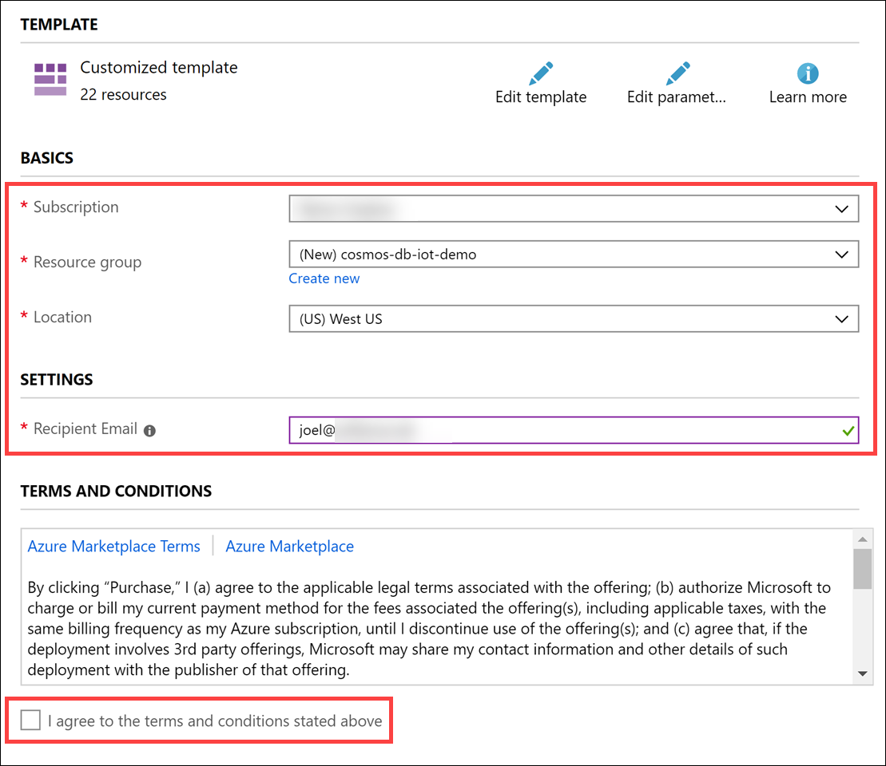
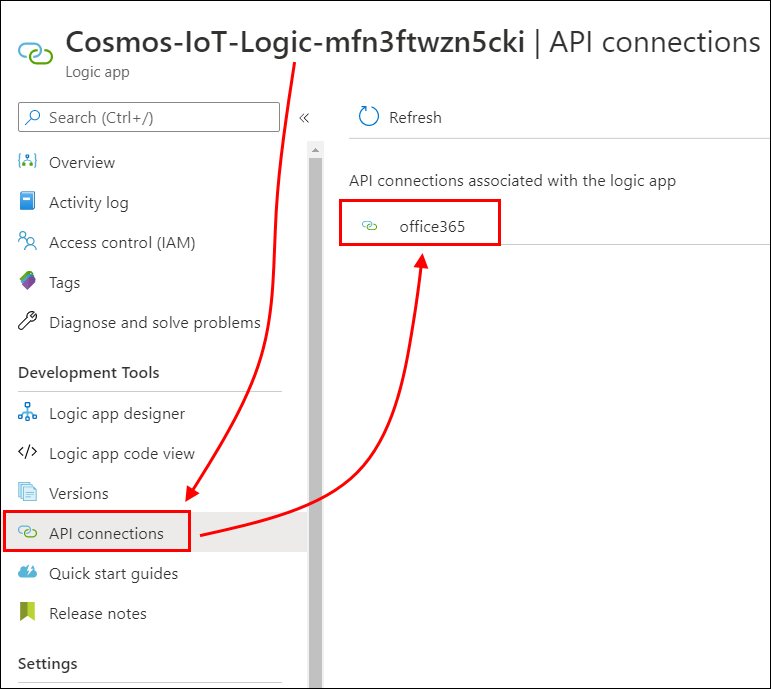

# Cosmos DB scenario-based labs - IoT Demo step-by-step

<details>
<summary><strong><em>Table of Contents</em></strong></summary>
<!-- TOC -->

- [Cosmos DB scenario-based labs - IoT Demo step-by-step](#cosmos-db-scenario-based-labs---iot-demo-step-by-step)
  - [Overview](#overview)
  - [Solution architecture](#solution-architecture)
  - [Requirements](#requirements)
  - [Exercise 1: Configure environment](#exercise-1-configure-environment)
    - [Task 0: Download the starter files](#task-0-download-the-starter-files)
    - [Task 1: Run deployment scripts](#task-1-run-deployment-scripts)
    - [Task 2: Authenticate the Office 365 API Connection for sending email alerts](#task-2-authenticate-the-office-365-api-connection-for-sending-email-alerts)
    - [Task 3: Add Stream Analytics Event Hubs input](#task-3-add-stream-analytics-event-hubs-input)
    - [Task 4: Add Stream Analytics outputs](#task-4-add-stream-analytics-outputs)
    - [Task 5: Create Stream Analytics query](#task-5-create-stream-analytics-query)
    - [Task 6: Run Stream Analytics job](#task-6-run-stream-analytics-job)
    - [Task 7: Deploy Cosmos DB Processing Function App](#task-7-deploy-cosmos-db-processing-function-app)
    - [Task 8: Deploy Stream Processing Function App](#task-8-deploy-stream-processing-function-app)
    - [Task 9: Deploy Web App](#task-9-deploy-web-app)
    - [Task 10: Create Azure Databricks cluster](#task-10-create-azure-databricks-cluster)
    - [Task 11: Configure Key Vault-backed Databricks secret store](#task-11-configure-key-vault-backed-databricks-secret-store)
    - [Task 12: Import lab notebooks into Azure Databricks](#task-12-import-lab-notebooks-into-azure-databricks)
    - [Task 13: View Cosmos DB processing Function App in the portal and copy the Health Check URL](#task-13-view-cosmos-db-processing-function-app-in-the-portal-and-copy-the-health-check-url)
    - [Task 14: View stream processing Function App in the portal and copy the Health Check URL](#task-14-view-stream-processing-function-app-in-the-portal-and-copy-the-health-check-url)
    - [Task 15: Open the data generator project](#task-15-open-the-data-generator-project)
    - [Task 16: Update application configuration](#task-16-update-application-configuration)
    - [Task 17: Run generator](#task-17-run-generator)
    - [Task 18: Log in to Power BI online and create real-time dashboard](#task-18-log-in-to-power-bi-online-and-create-real-time-dashboard)
    - [Task 19: Import report in Power BI Desktop and update report data sources](#task-19-import-report-in-power-bi-desktop-and-update-report-data-sources)
  - [Exercise 2: Observe Change Feed using Azure Functions and App Insights](#exercise-2-observe-change-feed-using-azure-functions-and-app-insights)
    - [Task 1: View devices in IoT Hub](#task-1-view-devices-in-iot-hub)
    - [Task 2: Open App Insights Live Metrics Stream](#task-2-open-app-insights-live-metrics-stream)
  - [Exercise 3: Observe data using Cosmos DB Data Explorer and Web App](#exercise-3-observe-data-using-cosmos-db-data-explorer-and-web-app)
    - [Task 1: View data in Cosmos DB Data Explorer](#task-1-view-data-in-cosmos-db-data-explorer)
    - [Task 2: Search and view data in Web App](#task-2-search-and-view-data-in-web-app)
  - [Exercise 4: Perform CRUD operations using the Web App](#exercise-4-perform-crud-operations-using-the-web-app)
    - [Task 1: Create a new vehicle](#task-1-create-a-new-vehicle)
    - [Task 2: View and edit the vehicle](#task-2-view-and-edit-the-vehicle)
    - [Task 3: Delete the vehicle](#task-3-delete-the-vehicle)
  - [Exercise 5: View the predictive maintenance batch scoring](#exercise-5-view-the-predictive-maintenance-batch-scoring)
    - [Task 1: View batch scoring notebook](#task-1-view-batch-scoring-notebook)
    - [Task 2: Model training highlights](#task-2-model-training-highlights)
    - [Task 2: Call the deployed scoring web service from the Web App](#task-2-call-the-deployed-scoring-web-service-from-the-web-app)
  - [Exercise 6: View the live dashboard, Predictive Maintenance, &amp; Trip/Consignment Status reports in Power BI](#exercise-6-view-the-live-dashboard-predictive-maintenance-amp-tripconsignment-status-reports-in-power-bi)
    - [Task 1: Open the live dashboard report in Power BI online](#task-1-open-the-live-dashboard-report-in-power-bi-online)
    - [Task 2: Explore report in Power BI Desktop](#task-2-explore-report-in-power-bi-desktop)
  - [After the demo](#after-the-demo)
    - [Task 1: Delete the resource group](#task-1-delete-the-resource-group)

<!-- /TOC -->
</details>

## Overview

Contoso Auto is a high value cargo logistics organization that is collecting vehicle and package telemetry data and wants to use Azure Cosmos DB to rapidly ingest and store this data in its raw form, do some processing in near real-time to generate insights to support several business objectives and surface these to the most appropriate user communities within the organization. It is a fast growing organization and wants to be able to scale and manage the associated cost of its chosen technology to enable it to cope with its explosive growth and the inherent seasonality of the logistics business. This scenario includes applicability to both the vehicle telemetry and logistics use cases by focusing on trucking and inclusion of cargo sensing data. This additionally allows for many representative customer analytics scenarios.

From a technology perspective Contoso would like to leverage Azure Cosmos DB as the core repository for its hot data path and leverage the Azure Cosmos DB Change Feed as a means to drive a solid and robust event sourcing architecture that would allowing Contoso developers to quickly enhance the solution. This achieved using a robust and agile serverless approach by leveraging events published by the Change Feed that reflect the state changes within the application (database).

Ultimately Contoso would surface the raw and derived insights data to its users in one of three roles:

- **Logistic Operations personnel** who are interested in the current state of the vehicles and cargo logistics and who would use a web app to quickly understand the status of any single vehicle or piece of cargo, be notified of alerts as well as load vehicle and cargo meta data into the system. What they would like to see on the dashboard are various visualizations of detected anomalies, like engines overheating, abnormal oil pressure, and aggressive driving.

- **Management and Customer Reporting personnel** who would like to be in a position to see the current state of the vehicle fleet and customer consignment level information presented in on a Power BI report that automatically updates with new data as it flows in after being processed. What they would like to see are reports on bad driving behavior by driver and using visual components such as a map to show anomalies related to cities or areas, as well as various charts and graphs depicting aggregate fleet and consignment information in a clear way.

In this experience, you will use Azure Cosmos DB to ingest streaming vehicle telemetry data as the entry point to a near real-time analytics pipeline built on Cosmos DB, Azure Functions, Event Hubs, Azure Databricks, Azure Storage, Azure Stream Analytics, Power BI, Azure Web Apps, and Logic Apps.

## Solution architecture

Below is a diagram of the solution architecture you will build in this lab. Please study this carefully, so you understand the whole of the solution as you are working on the various components.


- Data ingest, event processing, and storage:

  The solution for the IoT scenario centers around **Cosmos DB**, which acts as the globally-available, highly scalable data storage for streaming event data, fleet, consignment, package, and trip metadata, and aggregate data for reporting. Vehicle telemetry data flows in from the data generator, through registered IoT devices in **IoT Hub**, where an **Azure function** processes the event data and inserts it into a telemetry container in Cosmos DB.

- Trip processing with Azure Functions:

  The Cosmos DB change feed triggers three separate Azure functions, with each managing their own checkpoints so they can process the same incoming data without conflicting with one another. One function serializes the event data and stores it into time-sliced folders in **Azure Storage** for long-term cold storage of raw data. Another function processes the vehicle telemetry, aggregating the batch data and updating the trip and consignment status in the metadata container, based on odometer readings and whether the trip is running on schedule. This function also triggers a **Logic App** to send email alerts when trip milestones are reached. A third function sends the event data to **Event Hubs**, which in turn triggers **Stream Analytics** to execute time window aggregate queries.

- Stream processing, dashboards, and reports:

  The Stream Analytics queries output vehicle-specific aggregates to the Cosmos DB metadata container, and overall vehicle aggregates to **Power BI** to populate its real-time dashboard of vehicle status information. A Power BI Desktop report is used to display detailed vehicle, trip, and consignment information, pulled directly from the Cosmos DB metadata container. It also displays batch battery failure predictions, pulled from the maintenance container.

- Advanced analytics and ML model training:

  **Azure Databricks** is used to train a machine learning model to predict vehicle battery failure, based on historic information. It saves a trained model locally for batch predictions, and deploys a model and scoring web service to **Azure Kubernetes Service (AKS)** or **Azure Container Instances (ACI)** for real-time predictions. Azure Databricks also uses the **Spark Cosmos DB connector** to pull down each day's trip information to make batch predictions on battery failure and store the predictions in the maintenance container.

- Fleet management web app, security, and monitoring:

  A **Web App** allows Contoso Auto to manage vehicles and view consignment, package, and trip information that is stored in Cosmos DB. The Web App is also used to make real-time battery failure predictions while viewing vehicle information. **Azure Key Vault** is used to securely store centralized application secrets, such as connection strings and access keys, and is used by the Function Apps, Web App, and Azure Databricks. Finally, **Application Insights** provides real-time monitoring, metrics, and logging information for the Function Apps and Web App.

## Requirements

1. Microsoft Azure subscription must be pay-as-you-go or MSDN.
   - Trial subscriptions will not work.
   - **IMPORTANT**: To complete the OAuth 2.0 access components of this hands-on lab you must have permissions within your Azure subscription to create an App Registration and service principal within Azure Active Directory.
2. Install [Power BI Desktop](https://powerbi.microsoft.com/desktop/)
3. [Azure CLI](https://docs.microsoft.com/cli/azure/install-azure-cli?view=azure-cli-latest) - version 2.0.68 or later
4. Install [Visual Studio 2019 Community](https://visualstudio.microsoft.com/vs/) or greater
5. Install [.NET Core SDK 2.2](https://dotnet.microsoft.com/download/dotnet-core/2.2) or greater
   1. If you are running Visual Studio 2017, install SDK 2.2.109

## Exercise 1: Configure environment

**Duration**: 15 minutes

> **Complete this exercise before the demo!**

You must provision a few resources in Azure before you start developing the solution. Ensure all resources use the same resource group for easier cleanup.

In this exercise, you will configure your lab environment so you can start sending and processing generated vehicle, consignment, package, and trip data. You will begin by creating a Cosmos DB database and containers, then you will create a new Logic App and create a workflow for sending email notifications, create an Application Insights service for real-time monitoring of your solution, then retrieve secrets used in the solution's application settings (such as connection strings) and securely store them in Azure Key Vault, and finally configure your Azure Databricks environment.

### Task 0: Download the starter files

Download a starter project that includes a vehicle simulator, Azure Function App projects, a Web App project, Azure Databricks notebooks, and data files used in the lab.

1. From your lab computer, download the starter files by downloading a .zip copy of the Cosmos DB scenario-based labs GitHub repo.

2. In a web browser, navigate to the [Cosmos DB scenario-based labs repo](https://github.com/AzureCosmosDB/scenario-based-labs).

3. On the repo page, select **Clone or download**, then select **Download ZIP**.

   

4. Unzip the contents to your root hard drive (i.e. `C:\`). This will create a folder on your root drive named `scenario-based-labs-master`.

5. Navigate to the [.NET Core 2.2 download page](https://dotnet.microsoft.com/download/dotnet-core/2.2), then download the SDK for your environment, such as Windows .NET Core Installer x64.

   

### Task 1: Run deployment scripts

1. Select the **Deploy to Azure** button below to get started. When prompted, sign in to the Azure portal with your account.

   <a href="https://portal.azure.com/#create/Microsoft.Template/uri/https%3A%2F%2Fraw.githubusercontent.com%2FAzureCosmosDB%2Fscenario-based-labs%2Fmaster%2FIoT%2Fdeploy%2FdemoDeploy.json" target="_blank">
   
   </a>

2. Enter the following values:

   - **Subscription**: select the Azure subscription you are using for this lab.
   - **Resource group**: _if you are using a hosted environment, select the existing `iot` resource group provided for you_; Otherwise, create a new resource group like `cosmos-db-iot`.
   - **Location**: select the location closest to you. This value sets the Resource Group location.
   - **Recipient Email**: Enter an email address to receive notifications from the Logic App.
   - **Location**: select the location closest to you. This value sets the location for all deployed services. _The options in this list are limited to those locations commonly available to all services in this solution_.

3. Check the **I agree to the terms and conditions stated above** box.

    

4. Select **Purchase**

> The template deployment will take a few minutes to complete. Continue with the guide once it completes.

### Task 2: Authenticate the Office 365 API Connection for sending email alerts

In this task, you will open the deployed Logic App workflow and configure it to send email alerts through its HTTP trigger. This trigger will be called by one of your Azure functions that gets triggered by the Cosmos DB change feed, any time a notification event occurs, such as completing a trip. You will need to have an Office 365 or Outlook.com account to send the emails.

1. In the [Azure portal](https://portal.azure.com), navigate to your resource group for this demo and open the **Logic App**.

2. Select **API connections** in the left-hand menu, then select the **office365** API connection.

    

3. Select the **This connection is not authenticated** message.

    

4. Enter your email in the **Display Name** field, then select **Authorize** and authenticate your Office 365 account.

    

5. Select **Save**.

### Task 3: Add Stream Analytics Event Hubs input

1. In the [Azure portal](https://portal.azure.com), open your lab resource group, then open your **Stream Analytics job**.

   

2. Select **Inputs** in the left-hand menu. In the Inputs blade, select **+ Add stream input**, then select **Event Hub** from the list.

   

3. In the **New input** form, specify the following configuration options:

   1. **Input alias**: Enter **events**.
   2. Select the **Select Event Hub from your subscriptions** option beneath.
   3. **Subscription**: Choose your Azure subscription for this lab.
   4. **Event Hub namespace**: Find and select your Event Hub namespace (eg. `iot-namespace`).
   5. **Event Hub name**: Select **Use existing**, then **reporting**.
   6. **Event Hub policy name**: Choose the default `RootManageSharedAccessKey` policy.

   

4. Select **Save**.

You should now see your Event Hubs input listed.


### Task 4: Add Stream Analytics outputs

1. **If you have never signed in to Power BI with this account**, open a new browser tab and navigate to <https://powerbi.com> and sign in. Confirm any messages if they appear and continue to the next step after the home page appears. This will help the connection authorization step from Stream Analytics succeed and find the group workspace.

2. While remaining in the Outputs blade, select **+ Add** once again, then select **Power BI** from the list.

   

2. In the **New output** form, look toward the bottom to find the **Authorize connection** section, then select **Authorize** to sign in to your Power BI account. If you do not have a Power BI account, select the _Sign up_ option first.

   

4. After authorizing the connection to Power BI, specify the following configuration options in the form:
   1. **Output alias**: Enter **powerbi**.
   2. **Group workspace**: Select **My workspace**.
   3. **Dataset name**: Enter **Contoso Auto IoT Events**.
   4. **Table name**: Enter **FleetEvents**.

   

5. Select **Save**.

You should now have two outputs listed.


### Task 5: Create Stream Analytics query

The Query is Stream Analytics' work horse. This is where we process streaming inputs and write data to our outputs. The Stream Analytics query language is SQL-like, allowing you to use familiar syntax to explore and transform the streaming data, create aggregates, and create materialized views that can be used to help shape your data structure before writing to the output sinks. Stream Analytics jobs can only have one Query, but you can write to multiple outputs in a single Query, as you will do in the steps that follow.

Please take a moment to analyze the query below. Notice how we are using the `events` input name for the Event Hubs input you created, and the `powerbi` and `cosmosDB` outputs, respectively. Also see where we use the `TumblingWindow` in durations of 30 seconds for `VehicleData`, and 10 seconds for `VehicleDataAll`. The `TumblingWindow` helps us evaluate events that occurred during the past X seconds and, in our case, create averages over those time periods for reporting.

1. Select **Query** in the left-hand menu. Replace the contents of the query window with the script below:

    ```sql
    WITH
    VehicleData AS (
        select
            vin,
            AVG(engineTemperature) AS engineTemperature,
            AVG(speed) AS speed,
            AVG(refrigerationUnitKw) AS refrigerationUnitKw,
            AVG(refrigerationUnitTemp) AS refrigerationUnitTemp,
            (case when AVG(engineTemperature) >= 400 OR AVG(engineTemperature) <= 15 then 1 else 0 end) as engineTempAnomaly,
            (case when AVG(engineoil) <= 18 then 1 else 0 end) as oilAnomaly,
            (case when AVG(transmission_gear_position) <= 3.5 AND
                AVG(accelerator_pedal_position) >= 50 AND
                AVG(speed) >= 55 then 1 else 0 end) as aggressiveDriving,
            (case when AVG(refrigerationUnitTemp) >= 30 then 1 else 0 end) as refrigerationTempAnomaly,
            System.TimeStamp() as snapshot
        from events TIMESTAMP BY [timestamp]
        GROUP BY
            vin,
            TumblingWindow(Duration(second, 30))
    ),
    VehicleDataAll AS (
        select
            AVG(engineTemperature) AS engineTemperature,
            AVG(speed) AS speed,
            AVG(refrigerationUnitKw) AS refrigerationUnitKw,
            AVG(refrigerationUnitTemp) AS refrigerationUnitTemp,
            COUNT(*) AS eventCount,
            (case when AVG(engineTemperature) >= 318 OR AVG(engineTemperature) <= 15 then 1 else 0 end) as engineTempAnomaly,
            (case when AVG(engineoil) <= 20 then 1 else 0 end) as oilAnomaly,
            (case when AVG(transmission_gear_position) <= 4 AND
                AVG(accelerator_pedal_position) >= 50 AND
                AVG(speed) >= 55 then 1 else 0 end) as aggressiveDriving,
            (case when AVG(refrigerationUnitTemp) >= 22.5 then 1 else 0 end) as refrigerationTempAnomaly,
            System.TimeStamp() as snapshot
        from events t TIMESTAMP BY [timestamp]
        GROUP BY
            TumblingWindow(Duration(second, 10))
    )
    -- INSERT INTO POWER BI
    SELECT
        *
    INTO
        powerbi
    FROM
        VehicleDataAll
    -- INSERT INTO COSMOS DB
    SELECT
        *,
        entityType = 'VehicleAverage',
        partitionKey = vin
    INTO
        cosmosdb
    FROM
        VehicleData
    ```

   

2. Select **Save query**.

### Task 6: Run Stream Analytics job

If you examine the right-hand side of the solution architecture diagram, you will see a flow of event data that feeds into Event Hubs from a Cosmos DB change feed-triggered function. Stream Analytics uses the event hub as an input source for a set of time window queries that create aggregates for individual vehicle telemetry, and overall vehicle telemetry that flows through the architecture from the vehicle IoT devices. Stream Analytics has two output data sinks:

1. Cosmos DB: Individual vehicle telemetry (grouped by VIN) is aggregated over a 30-second `TumblingWindow` and saved to the `metadata` container. This information is used in a Power BI report you will create in Power BI Desktop in a later task to display individual vehicle and multiple vehicle statistics.
2. Power BI: All vehicle telemetry is aggregated over a 10-second `TumblingWindow` and output to a Power BI data set. This near real-time data is displayed in a live Power BI dashboard to show in 10 second snapshots how many events were processed, whether there are engine temperature, oil, or refrigeration unit warnings, whether aggressive driving was detected during the period, and the average speed, engine temperature, and refrigeration unit readings.


1. In the [Azure portal](https://portal.azure.com), open your lab resource group, then open your **Stream Analytics job**.

   

2. Select **Overview**.

3. In the Overview blade, select **Start** and select **Now** for the job output start time.

4. Select **Start** to beginning running the Stream Analytics job.

   

### Task 7: Deploy Cosmos DB Processing Function App

1. Open the Visual Studio solution file **CosmosDbIoTScenario.sln** within the `C:\scenario-based-labs-master\IoT\Solution` folder.

2. In the Visual Studio Solution Explorer, right-click on the **Functions.CosmosDB** project, then select **Publish...**.

    

3. In the publish dialog, select the **Azure Functions Consumption Plan** publish target. Next, select the **Select Existing** radio and make sure **Run from package file (recommended)** is checked. Select **Publish** on the bottom of the form.

    

4. In the App Service pane, select your Azure Subscription you are using for this lab, and make sure View is set to **Resource group**. Find and expand your Resource Group in the results below. The name should start with **cosmos-db-iot**. Select the Function App whose name starts with **IoT-CosmosDBProcessing**, then select **OK**.

    

5. Click **Publish** to begin.

    After the publish completes, you should see the following in the Output window: `========== Publish: 1 succeeded, 0 failed, 0 skipped ==========` to indicate a successful publish.

### Task 8: Deploy Stream Processing Function App

1. In the Visual Studio Solution Explorer, right-click on the **Functions.StreamProcessing** project, then select **Publish...**.

    

2. In the publish dialog, select the **Azure Functions Consumption Plan** publish target. Next, select the **Select Existing** radio and make sure **Run from package file (recommended)** is checked. Select **Publish** on the bottom of the form.

    

3. In the App Service pane, select your Azure Subscription you are using for this lab, and make sure View is set to **Resource group**. Find and expand your Resource Group in the results below. The name should start with **cosmos-db-iot**. Select the Function App whose name starts with **IoT-StreamProcessing**, then select **OK**.

    

4. Click **Publish** to begin.

    After the publish completes, you should see the following in the Output window: `========== Publish: 1 succeeded, 0 failed, 0 skipped ==========` to indicate a successful publish.

### Task 9: Deploy Web App

1. In the Visual Studio Solution Explorer, right-click on the **FleetManagementWebApp** project, then select **Publish...**.

    

2. In the publish dialog, select the **App Service** publish target. Next, select the **Select Existing** radio, then select **Publish** on the bottom of the form.

    

3. In the App Service pane, select your Azure Subscription you are using for this lab, and make sure View is set to **Resource group**. Find and expand your Resource Group in the results below. The name should start with **cosmos-db-iot**. Select the Web App whose name starts with **IoTWebApp**, then select **OK**.

    

4. Click **Publish** to begin.

    After the publish completes, you should see the following in the Output window: `========== Publish: 1 succeeded, 0 failed, 0 skipped ==========` to indicate a successful publish. Also, the web app should open in a new browser window. If you try to navigate through the site, you will notice there is no data. We will seed the Cosmos DB `metadata` container with data in the next exercise.

    

    If the web app does not automatically open, you can copy its URL on the publish dialog:

    

> **NOTE:** If the web application displays an error, then go into the Azure Portal for the **IoTWebApp** and click **Restart**. When the Azure Web App is created from the ARM Template and configured for .NET Core, it may need to be restarted for the .NET Core configuration to be fully installed and ready for the application to run. Once restarted, the web application will run as expected.
> 

> **Further troubleshooting:** If, after restarting the web application more than once, you still encounter a _500_ error, there may be a problem with the system identity for the web app. To check if this is the issue, open the web application's Configuration and view its Application Settings. Open the **CosmosDBConnection** setting and look at the **Key Vault Reference Details** underneath the setting. You should see an output similar to the following, which displays the secret details and indicates that it is using the _System assigned managed identity_:


> If you see an error in the Key Vault Reference Details, go to Key Vault and delete the access policy for the web app's system identity. Then go back to the web app, turn off the System Identity, turn it back on (which creates a new one), then re-add it to Key Vault's access policies.

### Task 10: Create Azure Databricks cluster

Contoso Auto wants to use the valuable data they are collecting from their vehicles to make predictions about the health of their fleet to reduce downtime due to maintenance-related issues. One of the predictions they would like to make is whether a vehicle's battery is likely to fail within the next 30 days, based on historical data. They would like to run a nightly batch process to identify vehicles that should be serviced, based on these predictions. They also want to have a way to make a prediction in real time when viewing a vehicle on their fleet management website.

To support this requirement, you will use Apache Spark on Azure Databricks, a fully managed Apache Spark platform optimized to run on Azure. Spark is a unified big data and advanced analytics platform that enables data scientists and data engineers to explore and prepare large amounts of structured and unstructured data, then use that data to train, use, and deploy machine learning models at scale. We will read and write to Cosmos DB, using the `azure-cosmosdb-spark` connector (<https://github.com/Azure/azure-cosmosdb-spark>).

In this task, you will create a new cluster on which data exploration and model deployment tasks will be executed in later exercises.

1. In the [Azure portal](https://portal.azure.com), open your lab resource group, then open your **Azure Databricks Service**. The name should start with `iot-databricks`.

   

2. Select **Launch Workspace**. Azure Databricks will automatically sign you in through its Azure Active Directory integration.

   

3. Once in the workspace, select **Clusters** in the left-hand menu, then select **+ Create Cluster**.

   

4. In the **New Cluster** form, specify the following configuration options:

   1. **Cluster Name**: Enter **lab**.
   2. **Cluster Mode**: Select **Standard**.
   3. **Pool**: Select **None**.
   4. **Databricks Runtime Version**: Select **Runtime 6.1 (Scala 2.11, Spark 2.4.4)**.
   5. **Autopilot Options**: Uncheck **Enable autoscaling** and **Terminate after...**, with a value of **120** minutes.
   6. **Worker Type**: Select **Standard_DS3_v2**.
   7. **Driver Type**: Select **Same as worker**.
   8. **Workers**: Enter **1**.

   

5. Select **Create Cluster**.

6. Before continuing to the next step, verify that your new cluster is running. Wait for the state to change from **Pending** to **Running**

7. Select the **lab** cluster, then select **Libraries**.

8. Select **Install New**.

    

9. In the Install Library dialog, select **Maven** for the Library Source.

10. In the Coordinates field type:

    ```text
    com.microsoft.azure:azure-cosmosdb-spark_2.4.0_2.11:1.4.1
    ```

11. Select **Install**

    

12. **Wait** until the library's status shows as **Installed** before continuing.

### Task 11: Configure Key Vault-backed Databricks secret store

In an earlier task, you added application secrets to Key Vault, such as the Cosmos DB connection string. In this task, you will configure the Key Vault-backed Databricks secret store to securely access these secrets.

Azure Databricks has two types of secret scopes: Key Vault-backed and Databricks-backed. These secret scopes allow you to store secrets, such as database connection strings, securely. If someone tries to output a secret to a notebook, it is replaced by `[REDACTED]`. This helps prevent someone from viewing the secret or accidentally leaking it when displaying or sharing the notebook.

1. Return to the [Azure portal](https://portal.azure.com), which should still be open in another browser tab, then navigate to your Key Vault account and select **Properties** on the left-hand menu.

2. Copy the **DNS Name** and **Resource ID** property values and paste them to Notepad or some other text application that you can reference in a moment.

   

3. Navigate back to the Azure Databricks workspace.

4. In your browser's URL bar, append **#secrets/createScope** to your Azure Databricks base URL (for example, <https://eastus.azuredatabricks.net#secrets/createScope>).

5. Enter `key-vault-secrets` for the name of the secret scope.

6. Select **Creator** within the Manage Principal drop-down to specify only the creator (which is you) of the secret scope has the MANAGE permission.

   > MANAGE permission allows users to read and write to this secret scope, and, in the case of accounts on the Azure Databricks Premium Plan, to change permissions for the scope.

   > Your account must have the Azure Databricks Premium Plan for you to be able to select Creator. This is the recommended approach: grant MANAGE permission to the Creator when you create the secret scope, and then assign more granular access permissions after you have tested the scope.

7. Enter the **DNS Name** (for example, <https://iot-vault.vault.azure.net/>) and **Resource ID** you copied earlier during the Key Vault creation step, for example: `/subscriptions/xxxxxxxx-xxxx-xxxx-xxxx-xxxxxxxxxxxx/resourcegroups/cosmos-db-iot/providers/Microsoft.KeyVault/vaults/iot-vault`.

   

8. Select **Create**.

After a moment, you will see a dialog verifying that the secret scope has been created.

### Task 12: Import lab notebooks into Azure Databricks

In this task, you will import the Databricks notebooks into your workspace.

1. In the [Azure portal](https://portal.azure.com), open your lab resource group, then open your **Azure Databricks Service**. The name should start with `iot-databricks`.

   

2. Select **Launch Workspace**. Azure Databricks will automatically sign you in through its Azure Active Directory integration.

   

3. Select **Workspace**, select **Users**, select the dropdown to the right of your username, then select **Import**.

   

4. Select **URL** next to **Import from**, paste the following into the text box: `https://github.com/AzureCosmosDB/scenario-based-labs/blob/master/IoT/Notebooks/01%20IoT.dbc`, then select **Import**.

   

5. After importing, select your username. You will see a new folder named `01 IoT`, which contains two notebooks, and a sub-folder named `Includes`, which contains one notebook.

    

6. Open the **Shared-Configuration** notebook located in the `Includes` sub-folder and provide values for your Machine Learning service workspace. You can find these values within the Overview blade of your Machine Learning service workspace that is located in your lab resource group.

    The values highlighted in the screenshot below are for the following variables in the notebooks:

    1. `subscription_id`
    2. `resource_group`
    3. `workspace_name`
    4. `workspace_region`

    

7. Complete the **Batch Scoring** notebook to download the trained model. **Note**: Since we've not loaded any data in Cosmos DB at this point, you can stop at **cell 17** (*Load the data from Cosmos DB to batch score it*).

8. Complete the **Model Deployment** notebook to deploy the model to ACI. **Note**: You can continue with the rest of the tasks below while the last cell runs (deploying the web service).

### Task 13: View Cosmos DB processing Function App in the portal and copy the Health Check URL

1. In the Azure portal (<https://portal.azure.com>), open the Azure Function App whose name begins with **IoT-CosmosDBProcessing**.

2. Expand the **Functions** list in the left-hand menu, then select **TripProcessor**.

    

3. View the **function.json** file to the right. This file was generated when you published the Function App in Visual Studio. The bindings are the same as you saw in the project code for the function. When new instances of the Function App are created, the generated `function.json` file and a ZIP file containing the compiled application are copied to these instances, and these instances run in parallel to share the load as data flows through the architecture. The `function.json` file instructs each instance how to bind attributes to the functions, where to find application settings, and information about the compiled application (`scriptFile` and `entryPoint`).

4. Select the **HealthCheck** function. This function has an Http trigger that enables users to verify that the Function App is up and running, and that each configuration setting exists and has a value. The data generator calls this function before running.

5. Select **Get function URL**.

    

6. **Copy the URL** and save it to Notepad or similar text editor for the exercise that follows.

    

### Task 14: View stream processing Function App in the portal and copy the Health Check URL

1. In the Azure portal (<https://portal.azure.com>), open the Azure Function App whose name begins with **IoT-StreamProcessing**.

2. Expand the **Functions** list in the left-hand menu, then select the **HealthCheck** function. Next, select **Get function URL**.

    

3. **Copy the URL** and save it to Notepad or similar text editor for the exercise that follows.

    

> **Hint**: You can paste the Health Check URLs into a web browser to check the status at any time. The data generator programmatically accesses these URLs each time it runs, then reports whether the Function Apps are in a failed state or missing important application settings.

### Task 15: Open the data generator project

1. If the Visual Studio solution is not already open, navigate to `C:\scenario-based-labs-master\IoT\Starter` and open the Visual Studio solution file: **CosmosDbIoTScenario.sln**.

2. Expand the **FleetDataGenerator** project and open **Program.cs** in the Solution Explore

   

### Task 16: Update application configuration

The data generator needs two connection strings before it can successfully run; the IoT Hub connection string, and the Cosmos DB connection string. The IoT Hub connection string can be found by selecting **Shared access policies** in IoT Hub, selecting the **iothubowner** policy, then copying the **Connection string--primary key** value. This is different from the Event Hub-compatible endpoint connection string you copied earlier.


1. Open **appsettings.json** within the **FleetDataGenerator** project.

2. Paste the IoT Hub connection string value in quotes next to the **IOT_HUB_CONNECTION_STRING** key. Paste the Cosmos DB connection string value in quotes next to the **COSMOS_DB_CONNECTION_STRING** key.

3. The data generator also requires the Health Check URLs you copied in the previous exercise for the `HealthCheck` functions located in both Function Apps. Paste the Cosmos DB Processing Function App's `HealthCheck` function's URL in quotes next to the **COSMOS_PROCESSING_FUNCTION_HEALTHCHECK_URL** key. Paste the Stream Processing Function App's `HealthCheck` function's URL in quotes next to the **STREAM_PROCESSING_FUNCTION_HEALTHCHECK_URL** key.

    

    The NUMBER_SIMULATED_TRUCKS value is used when you select option 5 when you run the generator. This gives you the flexibility to simulate between 1 and 1,000 trucks at a time. SECONDS_TO_LEAD specifies how many seconds to wait until the generator starts generating simulated data. The default value is 0. SECONDS_TO_RUN forces the simulated trucks to stop sending generated data to IoT Hub. The default value is 14400. Otherwise, the generator stops sending tasks when all the trips complete or you cancel by entering `Ctrl+C` or `Ctrl+Break` in the console window.

3. **Save** the `appsettings.json` file.

> As an alternative, you may save these settings as environment variables on your machine, or through the FleetDataGenerator properties. Doing this will remove the risk of accidentally saving your secrets to source control.

### Task 17: Run generator

In this exercise, we will explore the data generator project, **FleetDataGenerator**, update the application configuration, and run it in order to seed the metadata database with data and simulate a single vehicle.

There are several tasks that the data generator performs, depending on the state of your environment. The first task is that the generator will create the Cosmos DB database and containers with the optimal configuration for this lab if these elements do not exist in your Cosmos DB account. When you run the generator in a few moments, this step will be skipped because you already created them at the beginning of the lab. The second task the generator performs is to seed your Cosmos DB `metadata` container with data if no data exists. This includes vehicle, consignment, package, and trip data. Before seeding the container with data, the generator temporarily increases the requested RU/s for the container to 50,000 for optimal data ingestion speed. After the seeding process completes, the RU/s are scaled back down to 15,000.

After the generator ensures the metadata exists, it begins simulating the specified number of vehicles. You are prompted to enter a number between 1 and 5, simulating 1, 10, 50, 100, or the number of vehicles specified in your configuration settings, respectively. For each simulated vehicle, the following tasks take place:

1. An IoT device is registered for the vehicle, using the IoT Hub connection string and setting the device ID to the vehicle's VIN. This returns a generated device key.
2. A new simulated vehicle instance (`SimulatedVehicle`) is added to a collection of simulated vehicles, each acting as an AMQP device and assigned a Trip record to simulate the delivery of packages for a consignment. These vehicles are randomly selected to have their refrigeration units fail and, out of those, some will randomly fail immediately while the others fail gradually.
3. The simulated vehicle creates its own AMQP device instance, connecting to IoT Hub with its unique device ID (VIN) and generated device key.
4. The simulated vehicle asynchronously sends vehicle telemetry information through its connection to IoT Hub continuously until it either completes the trip by reaching the distance in miles established by the Trip record, or receiving a cancellation token.

In this task, you will run the generator and have it generate events for 50 trucks. The reason we are generating events for so many vehicles is two-fold:

- In the next exercise, we will observe the function triggers and event activities with Application Insights.
- We need to have completed trips prior to performing batch predictions in a later exercise.

In this task, you will run the generator and have it generate events for 50 trucks. The reason we are generating events for so many vehicles is two-fold:

   - In the next exercise, we will observe the function triggers and event activities with Application Insights.
   - We need to have completed trips prior to performing batch predictions in a later exercise.

> **Warning**: You will receive a lot of emails when the generator starts sending vehicle telemetry. If you do not wish to receive emails, simply disable the Logic App you created.

1. Within Visual Studio, right-click on the **FleetDataGenerator** project in the Solution Explorer and select **Set as Startup Project**. This will automatically run the data generator each time you debug.

    

2. Select the Debug button at the top of the Visual Studio window or hit **F5** to run the data generator.

    

3. When the console window appears, enter **3** to simulate 50 vehicles. The generator will perform the Function App health checks, resize the requested throughput for the `metadata` container, use the bulk importer to seed the container, and resize the throughput back to 15,000 RU/s.

    

4. After the seeding is completed the generator will retrieve 50 trips from the database, sorted by shortest trip distance first so we can have completed trip data appear faster. You will see a message output for every 50 events sent, per vehicle with their VIN, the message count, and the number of miles remaining for the trip. For example: `Vehicle 19: C1OVHZ8ILU8TGGPD8 Message count: 3650 -- 3.22 miles remaining`. **Let the generator run in the background and continue to the next exercise**.

    

5. As the vehicles complete their trips, you will see a message such as `Vehicle 37 has completed its trip`.

    

6. When the generator completes, you will see a message to this effect.

    

If the health checks fail for the Function Apps, the data generator will display a warning, oftentimes telling you which application settings are missing. The data generator will not run until the health checks pass.


### Task 18: Log in to Power BI online and create real-time dashboard

> **Important**: If the data generator is no longer running or sending new telemetry, be sure to start it before continuing. Simulating 50 vehicles should suffice for this exercise.

1. Browse to <https://powerbi.microsoft.com> and sign in with the same account you used when you created the Power BI output in Stream Analytics.

2. Select **My workspace**, then select the **Datasets** tab. You should see the **Contoso Auto IoT Events** dataset. This is the dataset you defined in the Stream Analytics Power BI output.

   

3. Select **+ Create** at the top of the page, then select **Dashboard**.

   

4. Provide a name for the dashboard, such as `Contoso Auto IoT Live Dashboard`, then select **Create**.

   

5. Above the new dashboard, select **+ Add tile**, then select **Custom Streaming Data** in the dialog, then select **Next**.

   

6. Select your **Contoso Auto IoT Events** dataset, then select **Next**.

   

   > **Important**: If the **Contoso Auto IoT Events** data set does not appear, it is because there is a lag time of several minutes between when you first configure the Stream Analytics Power BI output and when data first appears in the streaming data set. Please ensure the data generator is running and that you have started the Stream Analytics query. Also, you may try restarting the Function App as well.

7. Select the **Card** Visualization Type. Under fields, select **+ Add value**, then select **oilAnomaly** from the dropdown. Select **Next**.

   

8. Leave the values at their defaults for the tile details form, then select **Apply**.

   

9. Above the new dashboard, select **+ Add tile**, then select **Custom Streaming Data** in the dialog, then select **Next**.

10. Select your **Contoso Auto IoT Events** dataset, then select **Next**.

11. Select the **Card** Visualization Type. Under fields, select **+ Add value**, then select **engineTempAnomaly** from the dropdown. Select **Next**.

12. Leave the values at their defaults for the tile details form, then select **Apply**.

13. Above the new dashboard, select **+ Add tile**, then select **Custom Streaming Data** in the dialog, then select **Next**.

14. Select your **Contoso Auto IoT Events** dataset, then select **Next**.

15. Select the **Card** Visualization Type. Under fields, select **+ Add value**, then select **aggressiveDriving** from the dropdown. Select **Next**.

16. Leave the values at their defaults for the tile details form, then select **Apply**.

17. Above the new dashboard, select **+ Add tile**, then select **Custom Streaming Data** in the dialog, then select **Next**.

18. Select your **Contoso Auto IoT Events** dataset, then select **Next**.

19. Select the **Card** Visualization Type. Under fields, select **+ Add value**, then select **refrigerationTempAnomaly** from the dropdown. Select **Next**.

20. Leave the values at their defaults for the tile details form, then select **Apply**.

21. Above the new dashboard, select **+ Add tile**, then select **Custom Streaming Data** in the dialog, then select **Next**.

22. Select your **Contoso Auto IoT Events** dataset, then select **Next**.

23. Select the **Card** Visualization Type. Under fields, select **+ Add value**, then select **eventCount** from the dropdown. Select **Next**.

24. Leave the values at their defaults for the tile details form, then select **Apply**.

25. Above the new dashboard, select **+ Add tile**, then select **Custom Streaming Data** in the dialog, then select **Next**.

26. Select your **Contoso Auto IoT Events** dataset, then select **Next**.

27. Select the **Line chart** Visualization Type. Under Axis, select **+ Add value**, then select **snapshot** from the dropdown. Under Values, select **+Add value**, then select **engineTemperature**. Leave the time window to display at 1 minute. Select **Next**.

    

28. Leave the values at their defaults for the tile details form, then select **Apply**.

29. Above the new dashboard, select **+ Add tile**, then select **Custom Streaming Data** in the dialog, then select **Next**.

30. Select your **Contoso Auto IoT Events** dataset, then select **Next**.

31. Select the **Line chart** Visualization Type. Under Axis, select **+ Add value**, then select **snapshot** from the dropdown. Under Values, select **+Add value**, then select **refrigerationUnitTemp**. Leave the time window to display at 1 minute. Select **Next**.

32. Leave the values at their defaults for the tile details form, then select **Apply**.

33. Above the new dashboard, select **+ Add tile**, then select **Custom Streaming Data** in the dialog, then select **Next**.

34. Select your **Contoso Auto IoT Events** dataset, then select **Next**.

35. Select the **Line chart** Visualization Type. Under Axis, select **+ Add value**, then select **snapshot** from the dropdown. Under Values, select **+Add value**, then select **speed**. Leave the time window to display at 1 minute. Select **Next**.

36. Leave the values at their defaults for the tile details form, then select **Apply**.

37. When you are done, rearrange the tiles as shown:

    

### Task 19: Import report in Power BI Desktop and update report data sources

In this task, you will import a Power BI report that has been created for you. After opening it, you will update the data source to point to your Power BI instance.

1. Open **Power BI Desktop**, then select **Open other reports**.

   

2. In the Open report dialog, browse to `C:\scenario-based-labs-master\IoT\Reports`, then select **FleetReport.pbix**. Click **Open**.

   

3. After the report opens, click on **Edit Queries** in the ribbon bar within the Home tab.

   

4. Select **Trips** in the Queries list on the left, then select **Source** under Applied Steps. Click the gear icon next to Source.

   

5. In the source dialog, update the Cosmos DB **URL** value with your Cosmos DB URI you copied earlier in the lab, then click **OK**. If you need to find this value, navigate to your Cosmos DB account in the portal, select Keys in the left-hand menu, then copy the URI value.

   

   The Trips data source has a SQL statement defined that returns only the fields we need, and applies some aggregates:

   ```sql
   SELECT c.id, c.vin, c.consignmentId, c.plannedTripDistance,
   c.location, c.odometerBegin, c.odometerEnd, c.temperatureSetting,
   c.tripStarted, c.tripEnded, c.status,
   (
       SELECT VALUE Count(1)
       FROM n IN c.packages
   ) AS numPackages,
   (
       SELECT VALUE MIN(n.storageTemperature)
       FROM n IN c.packages
   ) AS packagesStorageTemp,
   (
       SELECT VALUE Count(1)
       FROM n IN c.packages
       WHERE n.highValue = true
   ) AS highValuePackages,
   c.consignment.customer,
   c.consignment.deliveryDueDate
   FROM c where c.entityType = 'Trip'
   and c.status in ('Active', 'Delayed', 'Completed')
   ```

6. When prompted, enter the Cosmos DB **Account key** value, then click **Connect**. If you need to find this value, navigate to your Cosmos DB account in the portal, select Keys in the left-hand menu, then copy the Primary Key value.

   

7. In a moment, you will see a table named **Document** that has several rows whose value is Record. This is because Power BI doesn't know how to display the JSON document. The document has to be expanded. After expanding the document, you want to change the data type of the numeric and date fields from the default string types, so you can perform aggregate functions in the report. These steps have already been applied for you. Select the **Changed Type** step under Applied Steps to see the columns and changed data types.

   

   The screenshot below shows the Trips document columns with the data types applied:

   

8. Select **VehicleAverages** in the Queries list on the left, then select **Source** under Applied Steps. Click the gear icon next to Source.

   

9. In the source dialog, update the Cosmos DB **URL** value with your Cosmos DB URI, then click **OK**.

   

   The VehicleAverages data source has the following SQL statement defined:

   ```sql
   SELECT c.vin, c.engineTemperature, c.speed,
   c.refrigerationUnitKw, c.refrigerationUnitTemp,
   c.engineTempAnomaly, c.oilAnomaly, c.aggressiveDriving,
   c.refrigerationTempAnomaly, c.snapshot
   FROM c WHERE c.entityType = 'VehicleAverage'
   ```

10. If prompted, enter the Cosmos DB **Account key** value, then click **Connect**. You may not be prompted since you entered the key in an earlier step.

    

11. Select **VehicleMaintenance** in the Queries list on the left, then select **Source** under Applied Steps. Click the gear icon next to Source.

    

12. In the source dialog, update the Cosmos DB **URL** value with your Cosmos DB URI, then click **OK**.

    

    The VehicleMaintenance data source has the following SQL statement defined, which is simpler than the other two since there are no other entity types in the `maintenance` container, and no aggregates are needed:

    ```sql
    SELECT c.vin, c.serviceRequired FROM c
    ```

13. If prompted, enter the Cosmos DB **Account key** value, then click **Connect**. You may not be prompted since you entered the key in an earlier step.

    

14. If you are prompted, click **Close & Apply**.

    

## Exercise 2: Observe Change Feed using Azure Functions and App Insights

**Duration**: 5 minutes

In this exercise, we use the Live Metrics Stream feature of Application Insights to view the incoming requests, outgoing requests, overall health, allocated server information, and sample telemetry in near-real time. This will help you observe how your functions scale under load and allow you to spot any potential bottlenecks or problematic components, through a single interactive interface.

### Task 1: View devices in IoT Hub

The data generator registered and activated each simulated vehicle in IoT Hub as a device. In this task, you will open IoT Hub and view these registered devices.

1. In the Azure portal (<https://portal.azure.com>), open the IoT Hub instance within your **cosmos-db-iot** resource group.

   

2. Select **IoT devices** in the left-hand menu. You will see all 50 IoT devices listed in the IoT devices pane to the right, with the VIN specified as the device ID. When we simulate more vehicles, we will see additional IoT devices registered here.

   

### Task 2: Open App Insights Live Metrics Stream

1. In the Azure portal (<https://portal.azure.com>), open the Application Insights instance within your **cosmos-db-iot** resource group.

   

2. Select **Live Metrics Stream** in the left-hand menu.

   

3. Observe the metrics within the Live Metrics Stream as data flows through the system.

   

   At the top of the page, you will see a server count. This shows how many instances of the Function Apps there are, and one server is allocated to the Web App. As the Function App server instances exceed computational, memory, or request duration thresholds, and as the IoT Hub and Change Feed queues grow and age, new instances are automatically allocated to scale out the Function Apps. You can view the server list at the bottom of the page. On the right-hand side you will see sample telemetry, including messages sent to the logger within the functions. Here we highlighted a message stating that the Cosmos DB Processing function is sending 100 Cosmos DB records to Event Hubs.

   You will notice many dependency call failures (404). These can be safely ignored. They are caused by the Azure Storage binding for the **ColdStorage** function within the Cosmos DB Processing Function App. This binding checks if the file exists before writing to the specified container. Since we are writing new files, you will see a `404` message for every file that is written since it does not exist. Currently, the binding engine does not know the difference between "good" 404 messages such as these, and "bad" ones.

## Exercise 3: Observe data using Cosmos DB Data Explorer and Web App

**Duration**: 5 minutes

### Task 1: View data in Cosmos DB Data Explorer

1. In the Azure portal (<https://portal.azure.com>), open the Cosmos DB instance within your **cosmos-db-iot** resource group.

2. Select **Data Explorer** in the left-hand menu.

3. Expand the **ContosoAuto** database, then expand the **metadata** container. Select **Items** to view a list of documents stored in the container. Select one of the items to view the data.

   

4. Select the ellipses (...) to the right of the **metadata** container name, then select **New SQL Query**.

   

5. Replace the query with the following:

   ```sql
   SELECT * FROM c WHERE c.entityType = 'Vehicle'
   ```

6. Execute the query to view the first 100 vehicle records.

   

7. Update the query to find trip records where the trip is completed.

   ```sql
   SELECT * FROM c WHERE c.entityType = 'Trip' AND c.status = 'Completed'
   ```

   

   Please note, you may not have any trips that have completed yet. Try querying where the `status` = **Active** instead. Active trips are those that are currently running.

   Here is an example completed trip record (several packages removed for brevity):

   ```json
   {
     "partitionKey": "DK6JW0RNF0G9PO2FJ",
     "id": "eb96c44e-4c1d-4f54-bdea-e7d2f927009c",
     "entityType": "Trip",
     "vin": "DK6JW0RNF0G9PO2FJ",
     "consignmentId": "e1da2e74-bf37-4773-a5bf-483fc08533ac",
     "plannedTripDistance": 18.33,
     "location": "AR",
     "odometerBegin": 106841,
     "odometerEnd": 106859.36,
     "temperatureSetting": 19,
     "tripStarted": "2019-09-20T14:39:24.1855725Z",
     "tripEnded": "2019-09-20T14:54:53.7558481Z",
     "status": "Completed",
     "timestamp": "0001-01-01T00:00:00",
     "packages": [
       {
         "packageId": "a5651f48-67d5-4c1b-b7d9-80d678aabe9b",
         "storageTemperature": 30,
         "highValue": false
       },
       {
         "packageId": "b2185628-eb0e-49b9-8b7d-685fcdcb5a36",
         "storageTemperature": 22,
         "highValue": false
       },
       {
         "packageId": "25ac4bd1-5aad-4030-91f7-9539cc15b441",
         "storageTemperature": 31,
         "highValue": true
       }
     ],
     "consignment": {
       "consignmentId": "e1da2e74-bf37-4773-a5bf-483fc08533ac",
       "customer": "Fabrikam, Inc.",
       "deliveryDueDate": "2019-09-20T17:50:40.3291024Z"
     },
     "_rid": "hM5HAOavCggb5QAAAAAAAA==",
     "_self": "dbs/hM5HAA==/colls/hM5HAOavCgg=/docs/hM5HAOavCggb5QAAAAAAAA==/",
     "_etag": "\"2d0364cc-0000-0700-0000-5d84e83d0000\"",
     "_attachments": "attachments/",
     "_ts": 1568991293
   }
   ```

   Portions of the package and consignment records are included since they are often used in trip queries and reports.

### Task 2: Search and view data in Web App

1. Navigate to your deployed Fleet Management web app. If you closed it earlier, you can find the deployment URL in the Overview blade of your Web App (**IoTWebApp**) in the portal.

   

2. Select **Vehicles**. Here you will see the paging capabilities at work.

   

3. Select one of the vehicles to view the details. On the right-hand side of the details page are the trips assigned to the vehicle. This view provides the customer name from the associated consignment record, aggregate information for the packages, and the trip details.

   

4. Go back to the vehicles list and enter a search term, such as **MT**. This will search both the state registered, and the VIN, including partial matches. Feel free to search for both states and VINs. In the screenshot below, we searched for `MT` and received results for Montana state registrations, and had a record where `MT` was included in the VIN.

   

5. Select **Consignments** in the left-hand menu, then enter **alpine ski** in the search box and execute. You should see several consignments for the `Alpine Ski House` customer. You can also search by Consignment ID. In our results, one of the consignments has a status of Completed.

   

6. Select a consignment to view the details. The record shows the customer, delivery due date, status, and package details. The package statistics contains aggregates to calculate the total number of packages, the required storage temperature, based on the package with the lowest storage temperature setting, the total cubic feet and combined gross weight of the packages, and whether any of the packages are considered high value.

   

7. Select **Trips** in the left-hand menu. Use the filter at the top of the page to filter trips by status, such as Pending, Active, Delayed, and Completed. Trips are delayed if the status is not Completed prior to the delivery due date. You may not see any delayed at this point, but you may have some that become delayed when you re-run the data generator later. You can view the Vehicle or related Consignment record from this page.

   

## Exercise 4: Perform CRUD operations using the Web App

**Duration**: 5 minutes

In this exercise, you will insert, update, and delete a vehicle record.

### Task 1: Create a new vehicle

1. In the web app, navigate to the **Vehicles** page, then select **Create New Vehicle**.

   

2. Complete the Create Vehicle form with the following VIN: **ISO4MF7SLBXYY9OZ3**. When finished filling out the form, select **Create**.

   

### Task 2: View and edit the vehicle

1. Search for your new vehicle in the Vehicles page by pasting the VIN in the search box: **ISO4MF7SLBXYY9OZ3**.

   

2. Select the vehicle in the search results. Select **Edit Vehicle** in the vehicle details page.

   

3. Update the record by changing the state registered and any other field, then select **Update**.

   

### Task 3: Delete the vehicle

1. Search for your new vehicle in the Vehicles page by pasting the VIN in the search box: **ISO4MF7SLBXYY9OZ3**. You should see the registered state any any other fields you updated have changed.

   

2. Select the vehicle in the search results. Select **Delete** in the vehicle details page.

   

3. In the Delete Vehicle confirmation page, select **Delete** to confirm.

   

4. Search for your new vehicle in the Vehicles page by pasting the VIN in the search box: **ISO4MF7SLBXYY9OZ3**. You should see that no vehicles are found.

   

## Exercise 5: View the predictive maintenance batch scoring

**Duration**: 5 minutes

### Task 1: View batch scoring notebook

In this task, you will view the `Batch Scoring` notebook, which uses a pre-trained machine learning (ML) model to determine if the battery needs to be replaced on several vehicles within the next 30 days. The notebook performs the following actions:

1. Installs required Python libraries.
2. Connects to Azure Machine Learning service (Azure ML).
3. Downloads a pre-trained ML model, saves it to Azure ML, then uses that model for batch scoring.
4. Uses the Cosmos DB Spark connector to retrieve completed Trips and Vehicle metadata from the `metadata` Cosmos DB container, prepares the data using SQL queries, then surfaces the data as temporary views.
5. Applies predictions against the data, using the pre-trained model.
6. Saves the prediction results in the Cosmos DB `maintenance` container for reporting purposes.

To run this notebook, perform the following steps:

1. In Azure Databricks, select **Workspace**, select **Users**, then select your username.

2. Select the `01 IoT` folder, then select the **Batch Scoring** notebook to open it.

   

3. Open and talk through batch scoring notebook. Notebook retrieves pre-trained model and has saved cell outputs so it does not need to be run to demo.

4. If you desire, you may continue running from cell 17 (*Load the data from Cosmos DB to batch score it*) where you left off in Exercise 1 **if** the cluster is still up and running. Otherwise, you'll have to run through the notebook from the beginning. After running, you can show that the notebook wrote new documents in the `maintenance` container. This data also appears in the Power BI Desktop report.

> If you wish to execute this notebook on a scheduled basis, such as every evening, you can use the Jobs feature in Azure Databricks to accomplish this.

### Task 2: Model training highlights

**Duration**: 20 minutes

In addition to batch scoring, Contoso Auto would like to predict battery failures on-demand in real time for any given vehicle. They want to be able to call the model from their Fleet Management website when looking at a vehicle to predict whether that vehicle's battery may fail in the next 30 days.

In the previous task, we reviewed a notebook that used a pre-trained ML model to predict battery failures for all vehicles with trip data in a batch process. But how do you take that same model and deploy it (in data science terms, this is called "operationalization") to a web service for this purpose?

In this task, you will view the `Model Deployment` notebook that deploys the pre-trained model to a web service hosted by Azure Container Instances (ACI), using your Azure ML workspace. While it is possible to deploy the model to a web service running in Azure Kubernetes Service (AKS), we are deploying to ACI instead since doing so saves 10-20 minutes. However, once deployed, the process used to call the web service is the same, as are most of the steps to do the deployment.

To view this notebook, perform the following steps:

1. In Azure Databricks, select **Workspace**, select **Users**, then select your username.

2. Select the `01 IoT (clean)` folder, then select the **Model Deployment** notebook to open it.

   

3. Open model training notebook and show last cell that deploys the web service with the trained model.

4. Navigate to the Azure portal, then open the Azure Container Instances service to show where the model deployed.

5. Open the Azure Machine Learning service workspace in the portal, then select **Models** in the left-hand menu to view the pre-trained model.

   

6. Select **Deployments** in the left-hand menu, then select the Azure Container Instances deployment that was created when you ran the notebook.

    

7. Copy the **Scoring URI** value. This will be used by the deployed web app to request predictions in real time.

    

### Task 2: Call the deployed scoring web service from the Web App

Now that the web service is deployed to ACI, we can call it to make predictions from the Fleet Management Web App. To enable this capability, we first need to update the Web App's application configuration settings with the scoring URI.

1. Make sure you have copied the Scoring URI of your deployed service, as instructed in the previous task.

2. Open the Web App (App Service) whose name begins with **IoTWebApp**.

3. Select **Configuration** in the left-hand menu.

4. Scroll to the **Application settings** section then select **+ New application setting**.

5. In the Add/Edit application setting form, enter `ScoringUrl` for the **Name**, and paste the web service URI you copied and paste it in the **Value** field. Select **OK** to add the setting.

   

6. Select **Save** to save your new application setting.

7. Restart the Web App (Overview blade).

8. Navigate to the deployed Fleet Management web app and open a random Vehicle record. Select **Predict battery failure**, which calls your deployed scoring web service and makes a prediction for the vehicle.

   

   This vehicle has a low number of **Lifetime cycles used**, compared to the battery's rated 200 cycle lifespan. The model predicted that the battery will not fail within the next 30 days.

9. Look through the list of vehicles to find one whose **Lifetime cycles used** value is closer to 200, then make the prediction for the vehicle.

   

   This vehicle has a high number of **Lifetime cycles used**, which is closer to the battery's rated 200 cycle lifespan. The model predicted that the battery will fail within the next 30 days.

## Exercise 6: View the live dashboard, Predictive Maintenance, & Trip/Consignment Status reports in Power BI

**Duration**: 5 minutes

### Task 1: Open the live dashboard report in Power BI online

1. Navigate to the live dashboard you created in the first exercise.

2. If the data generator is finished sending events, you may notice that tiles on the dashboard are empty. If so, start the data generator again, this time selecting option 1 for one vehicle. If you do this, the refrigeration temperature anomaly is guaranteed, and you will see the refrigeration unit temperature gradually climb above the 22.5 degree Fahrenheit alert threshold. Alternatively, you may opt to simulate more vehicles and observe the high event count numbers.

   

   After the generator starts sending vehicle telemetry, the dashboard should start working after a few seconds. In this screenshot, we are simulating 50 vehicles with 2,486 events in the last 10 seconds.

### Task 2: Explore report in Power BI Desktop

1. Open the report in Power BI Desktop. Explore the report, using the slicers (status filter, customer filter, and VIN list) to filter the data for the visualizations. Also be sure to select the different tabs at the bottom of the report, such as Maintenance for more report pages.

    

2. Select a customer from the Customer Filter, which acts as a slicer. This means when you select an item, it applies a filter to the other items on the page and linked pages. After selecting a customer, you should see the map and graphs change. You will also see a filtered list of VINs and Status. Select the **Details** tab.

    

3. The Details page shows related records, filtered on the selected customer and/or VIN. Now select the **Trips** tab.

    

4. The Trips page shows related trip information. Select **Maintenance**.

    

5. The Maintenance page shows results from the batch scoring notebook you executed in Databricks. If you do not see records here, then you need to run the entire batch scoring notebook after some trips have completed.

    

6. If at any time you have a number of filters set and you cannot see records, **Ctrl+Click** the **Clear Filters** button on the main report page (Trip/Consignments).

    

7. If your data generator is running while viewing the report, you can update the report with new data by clicking the **Refresh** button at any time.

    

## After the demo

**Duration**: 10 mins

In this exercise, you will delete any Azure resources that were created in support of the lab. You should follow all steps provided after attending the Hands-on lab to ensure your account does not continue to be charged for lab resources.

### Task 1: Delete the resource group

1. Using the [Azure portal](https://portal.azure.com), navigate to the Resource group you used throughout this hands-on lab by selecting Resource groups in the left menu.

2. Search for the name of your resource group, and select it from the list.

3. Select Delete in the command bar, and confirm the deletion by re-typing the Resource group name, and selecting Delete.

You should follow all steps provided _after_ attending the Hands-on lab.
