# Cosmos DB scenario-based labs - IoT hands-on lab step-by-step

<details>
<summary><strong><em>Table of Contents</em></strong></summary>
<!-- TOC -->

- [Cosmos DB scenario-based labs - IoT hands-on lab step-by-step](#cosmos-db-scenario-based-labs---iot-hands-on-lab-step-by-step)
  - [Overview](#overview)
  - [Solution architecture](#solution-architecture)
  - [Requirements](#requirements)
  - [Before the hands-on lab](#before-the-hands-on-lab)
  - [Exercise 1: Configure environment](#exercise-1-configure-environment)
    - [Task 1: Create Cosmos DB database and container](#task-1-create-cosmos-db-database-and-container)
      - [About Cosmos DB throughput](#about-cosmos-db-throughput)
      - [About Cosmos DB partitioning](#about-cosmos-db-partitioning)
    - [Task 2: Configure Cosmos DB container indexing and TTL](#task-2-configure-cosmos-db-container-indexing-and-ttl)
      - [About the Cosmos DB indexing policies](#about-the-cosmos-db-indexing-policies)
    - [Task 3: Create a Logic App workflow for email alerts](#task-3-create-a-logic-app-workflow-for-email-alerts)
    - [Task 4: Create system-assigned managed identities for your Function Apps and Web App to connect to Key Vault](#task-4-create-system-assigned-managed-identities-for-your-function-apps-and-web-app-to-connect-to-key-vault)
    - [Task 5: Add Function Apps and Web App to Key Vault access policy](#task-5-add-function-apps-and-web-app-to-key-vault-access-policy)
    - [Task 6: Add your user account to Key Vault access policy](#task-6-add-your-user-account-to-key-vault-access-policy)
    - [Task 7: Add Key Vault secrets](#task-7-add-key-vault-secrets)
    - [Task 8: Create Azure Databricks cluster](#task-8-create-azure-databricks-cluster)
    - [Task 9: Configure Key Vault-backed Databricks secret store](#task-9-configure-key-vault-backed-databricks-secret-store)
  - [Exercise 2: Configure windowed queries in Stream Analytics](#exercise-2-configure-windowed-queries-in-stream-analytics)
    - [Task 1: Add Stream Analytics Event Hubs input](#task-1-add-stream-analytics-event-hubs-input)
    - [Task 2: Add Stream Analytics outputs](#task-2-add-stream-analytics-outputs)
    - [Task 3: Create Stream Analytics query](#task-3-create-stream-analytics-query)
    - [Task 4: Run Stream Analytics job](#task-4-run-stream-analytics-job)
  - [Exercise 3: Deploy Azure functions and Web App](#exercise-3-deploy-azure-functions-and-web-app)
    - [Task 1: Retrieve the URI for each Key Vault secret](#task-1-retrieve-the-uri-for-each-key-vault-secret)
    - [Task 2: Configure application settings in Azure](#task-2-configure-application-settings-in-azure)
    - [Task 3: Open solution](#task-3-open-solution)
    - [Task 4: Code completion and walk-through](#task-4-code-completion-and-walk-through)
    - [Task 5: Deploy Cosmos DB Processing Function App](#task-5-deploy-cosmos-db-processing-function-app)
    - [Task 6: Deploy Stream Processing Function App](#task-6-deploy-stream-processing-function-app)
    - [Task 7: Deploy Web App](#task-7-deploy-web-app)
    - [Task 8: View Cosmos DB processing Function App in the portal and copy the Health Check URL](#task-8-view-cosmos-db-processing-function-app-in-the-portal-and-copy-the-health-check-url)
    - [Task 9: View stream processing Function App in the portal and copy the Health Check URL](#task-9-view-stream-processing-function-app-in-the-portal-and-copy-the-health-check-url)
  - [Exercise 4: Explore and execute data generator](#exercise-4-explore-and-execute-data-generator)
    - [Task 1: Open the data generator project](#task-1-open-the-data-generator-project)
    - [Task 2: Code walk-through](#task-2-code-walk-through)
    - [Task 3: Update application configuration](#task-3-update-application-configuration)
    - [Task 4: Run generator](#task-4-run-generator)
    - [Task 5: View devices in IoT Hub](#task-5-view-devices-in-iot-hub)
  - [Exercise 5: Observe Change Feed using Azure Functions and App Insights](#exercise-5-observe-change-feed-using-azure-functions-and-app-insights)
    - [Task 1: Open App Insights Live Metrics Stream](#task-1-open-app-insights-live-metrics-stream)
  - [Exercise 6: Observe data using Cosmos DB Data Explorer and Web App](#exercise-6-observe-data-using-cosmos-db-data-explorer-and-web-app)
    - [Task 1: View data in Cosmos DB Data Explorer](#task-1-view-data-in-cosmos-db-data-explorer)
    - [Task 2: Search and view data in Web App](#task-2-search-and-view-data-in-web-app)
  - [Exercise 7: Perform CRUD operations using the Web App](#exercise-7-perform-crud-operations-using-the-web-app)
    - [Task 1: Create a new vehicle](#task-1-create-a-new-vehicle)
    - [Task 2: View and edit the vehicle](#task-2-view-and-edit-the-vehicle)
    - [Task 3: Delete the vehicle](#task-3-delete-the-vehicle)
  - [Exercise 8: Create the Fleet status real-time dashboard in Power BI](#exercise-8-create-the-fleet-status-real-time-dashboard-in-power-bi)
    - [Task 1: Log in to Power BI online and create real-time dashboard](#task-1-log-in-to-power-bi-online-and-create-real-time-dashboard)
  - [Exercise 9: Run the predictive maintenance batch scoring](#exercise-9-run-the-predictive-maintenance-batch-scoring)
    - [Task 1: Import lab notebooks into Azure Databricks](#task-1-import-lab-notebooks-into-azure-databricks)
    - [Task 2: Run batch scoring notebook](#task-2-run-batch-scoring-notebook)
  - [Exercise 10: Deploy the predictive maintenance web service](#exercise-10-deploy-the-predictive-maintenance-web-service)
    - [Task 1: Run deployment notebook](#task-1-run-deployment-notebook)
    - [Task 2: Call the deployed scoring web service from the Web App](#task-2-call-the-deployed-scoring-web-service-from-the-web-app)
  - [Exercise 11: Create the Predictive Maintenance & Trip/Consignment Status reports in Power BI](#exercise-11-create-the-predictive-maintenance--tripconsignment-status-reports-in-power-bi)
    - [Task 1: Import report in Power BI Desktop](#task-1-import-report-in-power-bi-desktop)
    - [Task 2: Update report data sources](#task-2-update-report-data-sources)
    - [Task 3: Explore report](#task-3-explore-report)
  - [After the hands-on lab](#after-the-hands-on-lab)
    - [Task 1: Delete the resource group](#task-1-delete-the-resource-group)

<!-- /TOC -->
</details>

## Overview

Contoso Auto は、車両と小包のテレメトリ データを収集し、Azure Cosmos DB を使用してこのデータを迅速に取り込んで未加工の形式で保存し、ほぼリアルタイムで処理を行い、サポートする洞察を生成する価値の高い貨物ロジスティクス組織です。いくつかのビジネス目標を達成し、組織内で最も適切なユーザー コミュニティに表示します。急成長を遂げている組織であり、選択したテクノロジーの関連コストを拡張および管理し、その爆発的な成長と物流ビジネスの固有の季節性に対応できるようにしたいと考えています。このシナリオには、トラック輸送と貨物センシング データの包含に重点を置いて、車両テレメトリとロジスティクスのユース ケースの両方に適用可能が含まれます。これにより、多くの代表的な顧客分析シナリオが可能になります。

技術の観点から、Contoso は、ホット データ パスのコア リポジトリとして Azure Cosmos DB を活用し、Azure Cosmos DB Change Feedを活用して、Contoso を可能にする堅牢なイベント ソーシング アーキテクチャを推進したいと考えています。開発者は、ソリューションを迅速に強化します。これは、アプリケーション (データベース) 内の状態の変更を反映するChange Feedによって公開されたイベントを活用することで、堅牢でアジャイルなサーバーレスアプローチを使用して実現しました。

最終的に Contoso は、3 つのロールのいずれかで、生のインサイト データと派生したインサイト データをユーザーに表示します。:

- **物流業務担当者** 車両や貨物ロジスティクスの現状に興味があり、Web App を使用して単一の車両や貨物の状態を迅速に把握する人は、アラートの通知だけでなく、車両や貨物のメタデータをシステムにロードします。ダッシュボードで見たいのは、エンジンの過熱、異常な油圧、乱暴な運転など、検出された異常のさまざまな視覚化です。

- **管理および顧客報告担当者** 処理後に流れ込む新しいデータで自動的に更新される Power BI レポートに表示される車両の現在の状態と顧客の委託レベル情報を確認する立場に配置する必要があるユーザー。彼らが見たいのは、ドライバーによる悪い運転行動に関するレポートと、都市や地域に関連する異常を表示するマップなどの視覚コンポーネントを使用するほか、総フリートと委託情報を明確に示すさまざまなチャートやグラフです。

このエクスペリエンスでは、Cosmos DB、Azure Functions、Event Hub、Azure Databricks、Azure Storage、Azure Stream Analytics、Power BI、Azure Web App、Logic Apps 上に構築されたほぼリアルタイムな分析パイプラインへのエントリーポイントとなる、車両のストリーミングテレメトリーデータを取り込むために Azure Cosmos DB を利用します。

## Solution architecture

この演習で構築するソリューション アーキテクチャの図を次に示します。さまざまなコンポーネントに取り組んでいる場合は、ソリューション全体を理解できるように、慎重に検討してください。


- データの取り込み、イベント処理、およびストレージ::

  IoT シナリオのソリューションは、イベントデータ、フリート、委託、小包、およびトリップ メタデータ、およびレポート用の集計データをストリーミングするための、グローバルに利用可能でスケーラブルなデータ ストレージとして機能する **Cosmos DB** を中心にデプロイします。車両テレメトリ データは、**IoT Hub** に登録された IoT デバイスを介してデータ ジェネレーターから流れ込み、**Azure Functions** がイベント データを処理し、Cosmos DB のテレメトリ コンテナーに挿入します。

- Azure Functions を使用したトリップ処理:

  Cosmos DB の Change Feedは、3 つの別々の Azure Functions をトリガーし、それぞれが独自のチェックポイントを管理し、互いに競合することなく同じ着信データを処理できるようにします。1 つのFunctionは、イベント データをシリアル化し、**Azure Storage** のタイム スライスされたフォルダーに格納して、生データを長期保存します。別のFunctionは、車両テレメトリを処理し、バッチ データを集約し、走行距離計の読み取り値とトリップがスケジュール通りに実行されているかどうかに基づいて、メタデータ コンテナー内のトリップおよび委託ステータスを更新します。この機能は、トリップのマイルストーンに達したときに電子メールアラートを送信する **Logic App** をトリガーします。3 番目のFunctionはイベント データを **Event Hubs** に送信し、**Stream Analytics** をトリガーしてタイム ウィンドウの集約クエリーを実行します。

- ストリーム処理、ダッシュボード、およびレポート:

  Stream Analytics は、Cosmos DB メタデータ コンテナーに車両固有の集計を出力し、車両全体の集約を **Power BI** に出力して、車両のステータス情報のリアルタイム ダッシュボードに入力します。Power BI Desktop レポートは、Cosmos DB メタデータ コンテナーから直接プルされた詳細な車両、トリップ、および委託情報を表示するために使用されます。また、メンテナンスコンテナから引き出されたバッチバッテリー故障予測も表示されます。

- 高度な分析と ML モデルのトレーニング:

  **Azure Databricks** は、過去の情報に基づいて、車両のバッテリーの故障を予測する機械学習モデルをトレーニングするために使用されます。バッチ予測用にトレーニングされたモデルをローカルに保存し、リアルタイム予測のために **Azure Kubernetes Service (AKS)** または **Azure Container Instances (ACI)** にモデルとスコアリング Web サービスをデプロイします。また、Azure Databricks は **Spark Cosmos DB connector** を使用して、毎日のトリップ情報をプルダウンして、バッテリー障害のバッチ予測を行い、予測をメンテナンス コンテナーに格納します。

- フリート管理 Web App、セキュリティ、および監視:

  **Web App** を使用すると、Contoso Auto は車両を管理し、Cosmos DB に保存されている委託、小包、およびトリップ情報を表示できます。Web Appは、車両情報を表示しながら、リアルタイムのバッテリー故障予測を行うためにも使用されます。**Azure Key Vault** は、接続文字列やアクセス キーなどの一元化されたアプリケーション シークレットを安全に格納するために使用され、Function App、Web App、Azure Databricksで使用されます。最後に、**Application Insights** は、Function Appと Web Appのリアルタイムの監視、メトリック、およびログ情報を提供します。

## Requirements

1. Microsoft Azure subscription must be pay-as-you-go or MSDN.
   - Trial subscriptions will not work.
   - **IMPORTANT**: To complete the OAuth 2.0 access components of this hands-on lab you must have permissions within your Azure subscription to create an App Registration and service principal within Azure Active Directory.
2. Install [Power BI Desktop](https://powerbi.microsoft.com/desktop/)
3. [Azure CLI](https://docs.microsoft.com/cli/azure/install-azure-cli?view=azure-cli-latest) - version 2.0.68 or later
4. Install [Visual Studio 2019 Community](https://visualstudio.microsoft.com/vs/) or greater
5. Install [.NET Core SDK 2.2](https://dotnet.microsoft.com/download/dotnet-core/2.2) or greater
   - If you are running Visual Studio 2017, install SDK 2.2.109

## Before the hands-on lab

Refer to the [Before the hands-on lab setup guide](./Before%20the%20HOL%20-%20Cosmos%20DB%20scenario-based%20labs%20-%20IoT.md) manual before continuing to the lab exercises.

## Exercise 1: Configure environment

**Duration**: 45 minutes

ソリューションの開発を始める前に、Azure でいくつかのリソースをプロビジョニングする必要があります。クリーンアップを容易にするために、すべてのリソースが同じリソース グループを使用していることを確認します。

この演習では、生成された車両、委託、小包、およびトリップデータの送信と処理を開始できるように、演習環境を構成します。まず、Cosmos DB データベースとコンテナーを作成し、新しい Logic App を作成し、電子メール通知を送信するワークフローを作成し、ソリューションをリアルタイム監視するための Application Insights サービスを作成してから、ソリューションのアプリケーション設定 (接続文字列など)で使用されるシークレットを取得し、それらを Azure Key Vault に安全に保存し、最終的に Azure Databricks 環境を構成します。

### Task 1: Create Cosmos DB database and container

このタスクでは、Cosmos DB データベースと 3 つの SQL ベースのコンテナーを作成します:

- **telemetry**: 90 日間の存続時間 (TTL) を持つホット 車両テレメトリ データの取り込みに使用されます。
- **metadata**: 車両、委託、小包、トリップ、および集計イベント データを格納します。
- **maintenance**: バッチ バッテリー障害予測は、レポートの目的でここに格納されます。

1. ブラウザの新しいタブまたはインスタンスを使用して、Azure ポータル <https://portal.azure.com>に移動します。

2. 左側のメニューから **Resource Groups** を選択し、`cosmos-db-iot`と入力してリソースグループを検索します。この演習で使用しているリソース グループを選択します。

   

3. Azure Cosmos DB アカウントを選択します。名前は `cosmos-db-iot` で始まります。

   

4. 左側のメニューで **Data Explorer** を選択し、**New Container** を選択します。

   

5. **Add Container** ブレードで、次の構成オプションを指定します:

   a. **Database id** に **ContosoAuto** を入力します。

   b. **Provision database throughput** はチェックしないままにしておきます。

   c. **Container id** に **metadata** を入力します。

   d. Partition key: **/partitionKey**

   e. Throughput: **50000**

   

   > **注**: データ ジェネレーターは初回実行時にメタデータの一括挿入を実行するため、最初にこのコンテナーのスループットを `50000 RU/s` に設定します。データを挿入した後、プログラム的にスループットを `15000` に減らします。

6. **OK** を選択してコンテナーを作成します。

7. **New Container** をデータエクスプローラーで再度選択します。

8. **Add Container** ブレードで、次の構成オプションを指定します:

   a. **Database id**: **Use existing** を選択しリストから **ContosoAuto** を選択します。

   c. **Container id** に **telemetry** を入力します。

   d. Partition key: **/partitionKey**

   e. Throughput: **15000**

   

9. **OK** を選択してコンテナーを作成します。

10. **New Container** をデータエクスプローラーで再度選択します。

11. **Add Container** ブレードで、次の構成オプションを指定します:

    a. **Database id**: **Use existing** を選択しリストから **ContosoAuto** を選択します。

    c. **Container id** に **maintenance** を入力します。

    d. Partition key: **/vin**

    e. Throughput: **400**

    

12. **OK** を選択してコンテナーを作成します。

13. これでデータエクスプローラーで3つのコンテナーがリストされているはずです。

    

#### About Cosmos DB throughput

予想されるイベント処理およびレポートワークロードに基づいて、各コンテナーの RU/s に **throughput** を意図的に設定していることに気付くでしょう。Azure Cosmos DB では、プロビジョニングされたスループットは要求単位/秒 (RUs) として表されます。RUs は、Cosmos DB コンテナーに対する読み取り操作と書き込み操作の両方のコストを測定します。Cosmos DB は透過的な水平方向のスケーリング (スケール アウトなど) とマルチマスター レプリケーションを使用して設計されているため、単一の API 呼び出しを使用して取得できる、1 秒あたり数千から数億の要求を処理するRUsの数を非常に迅速かつ簡単に増減できます。

Cosmos DB を使用すると、データベース レベルまたはコンテナー レベルで 100 ずつの小さな単位で RUs を増分/減衰できます。スループットは、SLA に裏付けされたコンテナーのパフォーマンスを常に保証するために、コンテナーの粒度で構成することをお勧めします。Cosmos DB が提供するその他の保証は、世界中で 99.999% の読み取りと書き込みの可用性であり、読み取りと書き込みは 99 パーセンタイルで 10 ミリ秒未満で提供されます。

コンテナーに多数の RUs を設定すると、Cosmos DB は、それらの RUs が Cosmos DB アカウントに関連付けられているすべてのリージョンで使用できることを確認します。新しいリージョンを追加してリージョンの数をスケールアウトすると、Cosmosは新しく追加されたリージョンに同じ量の RUs を自動的にプロビジョニングします。特定のリージョンに異なる RUs を選択的に割り当てることはできません。これらの RUs は、関連するすべてのリージョンのコンテナー (またはデータベース) 用にプロビジョニングされます。

#### About Cosmos DB partitioning

各コンテナーを作成するときは、**パーティションキー** を定義する必要がありました。ソリューションのソースコードを確認するときに、後で説明するように、コレクション内に格納されている各ドキュメントには `partitionKey` プロパティが含まれています。新しいコンテナーを作成する際に行う必要がある最も重要な決定の 1 つは、データに適したパーティション キーを選択することです。パーティション キーは、ストレージとパフォーマンスのボトルネックを回避するために、任意の時点でストレージとスループットの均等な分散 (1 秒あたりの要求で測定) を提供する必要があります。たとえば、車両メタデータは、各車両の一意の値である VIN を `partitionKey` フィールドに格納します。トリップ メタデータは、ほとんどの場合 VIN によって照会され、トリップ ドキュメントは車両メタデータと同じ論理区画に格納されるため、トリップ メタデータは一緒にクエリーされ、ファンアウトならびにパーティション間クエリーを防ぐため、`partitionKey` フィールドにも VIN を使用します。一方、小包 メタデータは、同じ目的で `partitionKey` フィールドに Consignment ID 値を使用します。パーティション キーは、多数のパーティション間で過剰なファンアウトを避けるために、読み取りが多いシナリオのクエリーの大部分に存在する必要があります。これは、特定のパーティション キー値を持つ各ドキュメントが同じ論理区画に属し、同じ物理パーティションに格納され、同じ物理パーティションからの処理も行われるためです。各物理パーティションは地理的リージョン間でレプリケートされるため、グローバルな分散が実現します。

Cosmos DB に適切なパーティション キーを選択することは、バランスの取れた読み取りと書き込み、スケーリング、およびこのソリューションの場合は、パーティションごとの順序による Change Feed 処理を確実に行うための重要な手順です。論理区画の数に制限はありませんが、1 つの論理区画に対して 10 GB のストレージの上限が許可されます。論理区画を物理パーティション間で分割することはできません。同じ理由で、選択したパーティション キーのカーディナリティ（基数）が悪い場合は、ストレージの分散が歪んでいる可能性があります。たとえば、1 つの論理区画が他のパーティションよりも高速になり、最大 10 GB の上限に達した場合、他の論理パーティションがほぼ空になる場合、最大論理区画を収容する物理パーティションは分割できず、アプリケーションのダウンタイムが発生する可能性があります。

### Task 2: Configure Cosmos DB container indexing and TTL

このタスクでは、新しいコンテナーの既定のインデックス セットを確認し、書き込み負荷の高いワークロードに最適化するように `telemetry` コンテナーのインデックス作成を構成します。次に、`telemetry` コンテナーで存続時間 (TTL) を有効にし、コンテナーに格納されている個々のドキュメントに TTL 値を秒単位で設定できるようにします。この値は、ドキュメントの有効期限が切れるか、削除するか、または自動的に削除するタイミングを Cosmos DB に指示します。この設定は、不要になったものを削除することで、ストレージコストを節約するのに役立ちます。通常、これはホット データ、または規制要件により一定期間後に期限切れにする必要があるデータで使用されます。

1. Cosmos DBのデータエクスプローラーで **telemetry** コンテナーを開き、**Scale & Settings** を選択します。

2. Scale & Settings ブレードで、Settings を開き、**Time to Live** にある **On (no default)** を選択します。

   

   存続時間設定を既定値以外でオンにすると、ドキュメントごとに個別に TTL を定義できるため、一定期間後に期限切れになるドキュメントをより柔軟に決定できます。これを行うには、このコンテナーに保存される `ttl` フィールドがあるので、TTL を秒単位で指定します。

3. Scale & Settings ブレードを下にスクロールして、**Indexing Policy** を表示します。既定のポリシーでは、コレクションに格納されている各ドキュメントのすべてのフィールドに自動的にインデックスを作成します。これは、すべてのパスが含まれている (JSON ドキュメントを格納しているので、ドキュメント内の子コレクション内にプロパティが存在できるため、パスを使用してプロパティを識別していることを思い出してください)、つまり `includedPaths` の値が `"path": "/*"` に設定されており、除外される唯一のパスはドキュメントのバージョン管理に使用される内部的な `_etag` プロパティであるからです。既定のインデックス ポリシーは次のようになります:

   ```json
   {
     "indexingMode": "consistent",
     "automatic": true,
     "includedPaths": [
       {
         "path": "/*"
       }
     ],
     "excludedPaths": [
       {
         "path": "/\"_etag\"/?"
       }
     ]
   }
   ```

4. **Indexing Policy** を次のように置き換えると、すべてのパスを除外し、コンテナーを照会するときに使用されるパスのみが含まれます (`vin`, `state`, および `partitionKey`):

   ```json
   {
     "indexingMode": "consistent",
     "automatic": true,
     "includedPaths": [
       {
         "path": "/vin/?"
       },
       {
         "path": "/state/?"
       },
       {
         "path": "/partitionKey/?"
       }
     ],
     "excludedPaths": [
       {
         "path": "/*"
       },
       {
         "path": "/\"_etag\"/?"
       }
     ]
   }
   ```

   

5. **Save** を選択し変更を適用します。

#### About the Cosmos DB indexing policies

このタスクでは、`telemetry` コンテナーのインデックス作成ポリシーを更新しましたが、他の 2 つのコンテナーは既定のポリシーのままにしておきました。新しく作成されたコンテナーの既定のインデックス 作成ポリシーは、すべての項目のすべてのプロパティにインデックスを付け、任意の文字列または数値の範囲インデックスを適用し、Point 型の GeoJSON オブジェクトに空間インデックスを適用します。これにより、インデックス作成とインデックス管理を事前に考えることなく、高いクエリー パフォーマンスを得ることができます。`metadata` コンテナーと `maintenance` コンテナーには `telemetry` よりも読み取り負荷の高いワークロードがあるため、クエリーのパフォーマンスが最適化される既定のインデックス 作成ポリシーを使用するのが理にかなっています。`telemetry` の高速な書き込みが必要なため、未使用のパスは除外します。インデックス作成パスを使用すると、インデックス作成コストはインデックス付けされた一意のパスの数と直接相関するため、クエリーパターンが事前にわかっているシナリオでは、書き込みパフォーマンスが向上し、インデックスのストレージ容量が低下する可能性があります。

3 つのコンテナーすべてに対するインデックス作成モードは **Consistent** に設定されます。つまり、アイテムの追加、更新、または削除に伴ってインデックスが同期的に更新され、読み取りクエリー用にアカウントに構成された整合性レベルが適用されます。もう 1 つのインデックス作成モードは None で、コンテナーのインデックス作成を無効にします。通常、このモードは、コンテナーが純粋な Kye / Value ストアとして機能し、他のプロパティのインデックスを必要としない場合に使用されます。一括操作を実行する前に整合性モードを動的に変更し、その後モードを Consistent に戻すことができます。

### Task 3: Create a Logic App workflow for email alerts

このタスクでは、新しい Logic App ワークフローを作成し、HTTP トリガーを介して電子メール アラートを送信するように構成します。このトリガーは、Cosmos DB Change Feed によってトリガーされる Azure Functions の 1 つ (トリップの完了などの通知イベントが発生するたびに呼び出されます) によって呼び出されます。電子メールを送信するには、Office 365 または Outlook.com アカウントが必要です。

1. [Azure portal](https://portal.azure.com)で, **+ Create a resource** を選択し、上部にある検索ボックスに **logic app** と入力します。結果から **Logic App** を選択します。

   

2. **Logic App overview** ブレード上で、**Create** ボタンを選択します。

3. **Create Logic App** ブレードで以下の設定オプションを指定します:

   1. **Name**: `Cosmos-IoT-Logic` のようなユニークな名前 (緑色のチェックマークが表示されていることを確認してください)。
   2. **Subscription**: この演習で利用しているサブスクリプション
   3. **Resource group**: 演習のリソースグループを選択します。名前が `cosmos-db-iot` で始まります。
   4. **Location**: リソースグループと同じロケーション
   5. **Log Analytics**: **Off** を選択します。

   

4. **Create** を選択します。

5. Logic App が作成されたら、リソースグループを開いて新しい Logic App を選択して Logic App に移動します。

6. Logic App デザイナーで、Start with a common trigger セクションまでページをスクロールし、**When a HTTP request is received** トリガーを選択します。

   

7. **Request Body JSON Schema** フィールドに以下の JSON をペーストします。アラートが送信される必要がある時に、Azure Functions が送信するHTTP リクエストのボディのデータの形式を定義します:

   ```json
   {
        "properties": {
           "consignmentId": {
             "type": "string"
           },
           "customer": {
             "type": "string"
           },
           "deliveryDueDate": {
             "type": "string"
           },
           "distanceDriven": {
             "type": "number"
           },
           "hasHighValuePackages": {
             "type": "boolean"
           },
           "id": {
             "type": "string"
           },
           "lastRefrigerationUnitTemperatureReading": {
             "type": "integer"
           },
           "location": {
             "type": "string"
           },
           "lowestPackageStorageTemperature": {
             "type": "integer"
           },
           "odometerBegin": {
             "type": "integer"
           },
           "odometerEnd": {
             "type": "number"
           },
           "plannedTripDistance": {
             "type": "number"
           },
           "recipientEmail": {
             "type": "string"
           },
           "status": {
             "type": "string"
           },
           "temperatureSetting": {
             "type": "integer"
           },
           "tripEnded": {
             "type": "string"
           },
           "tripStarted": {
             "type": "string"
           },
           "vin": {
             "type": "string"
           }
        },
        "type": "object"
   }
   ```

   

8. HTTP トリガーの付近にある **+ New step** を選択します。

   

9. 新しいアクションの中の検索ボックスに、`send email` をタイプして、下にあるアクションのリストの中から **Send an email - Office 365 Outlook** を選択します。**注**: Office 365 Outlook アカウントが無い場合、他のメールサービスのオプションを試してください。

   

10. **Sign in** ボタンを選択します。表示されたウインドウで、アカウントにサインインします。

    

11. サインインしたら、アクションボックスが **Send an email** アクションフォームとして表示されます。**To** フィールドを選択します。To を選択すると、**Dynamic content** ボックスが表示されます。HTTP リクエストトリガーからの動的な値の完全なリストを見るには、"When a HTTP request is received" の次の **See more** を選択します。

    

12. 動的なコンテンツのリストから **recipientEmail** を選択します。**To** フィールドに動的な値が追加されます。

    

13. **Subject** フィールドに以下を入力します: `Contoso Auto trip status update:`。最後にスペースが入力されていることを確認してください。 **status** 動的コンテンツが件名の最後にトリップのステータスを追加することを確認してください。

    

14. **Body** フィールドに以下をペーストします。動的なコンテンツが自動的に追加されます:

    ```text
    Here are the details of the trip and consignment:

    CONSIGNMENT INFORMATION:

    Customer: @{triggerBody()?['customer']}
    Delivery Due Date: @{triggerBody()?['deliveryDueDate']}
    Location: @{triggerBody()?['location']}
    Status: @{triggerBody()?['status']}

    TRIP INFORMATION:

    Trip Start Time: @{triggerBody()?['tripStarted']}
    Trip End Time: @{triggerBody()?['tripEnded']}
    Vehicle (VIN): @{triggerBody()?['vin']}
    Planned Trip Distance: @{triggerBody()?['plannedTripDistance']}
    Distance Driven: @{triggerBody()?['distanceDriven']}
    Start Odometer Reading: @{triggerBody()?['odometerBegin']}
    End Odometer Reading: @{triggerBody()?['odometerEnd']}

    PACKAGE INFORMATION:

    Has High Value Packages: @{triggerBody()?['hasHighValuePackages']}
    Lowest Package Storage Temp (F): @{triggerBody()?['lowestPackageStorageTemperature']}
    Trip Temp Setting (F): @{triggerBody()?['temperatureSetting']}
    Last Refrigeration Unit Temp Reading (F): @{triggerBody()?['lastRefrigerationUnitTemperatureReading']}

    REFERENCE INFORMATION:

    Trip ID: @{triggerBody()?['id']}
    Consignment ID: @{triggerBody()?['consignmentId']}
    Vehicle VIN: @{triggerBody()?['vin']}

    Regards,
    Contoso Auto Bot
    ```

15. ここまでで Logic App のワークフローは以下のようになっているはずです:

    

16. デザイナーの上部にある **Save** を選択してワークフローを保存します。

17. 保存後、HTTP トリガーの URL が生成されます。ワークフローの HTTP トリガーを開き、**HTTP POST URL** の値をコピーし Notepad か同様のテキストアプリケーションに、あとの手順で使うためにペーストしておきます。

    

### Task 4: Create system-assigned managed identities for your Function Apps and Web App to connect to Key Vault

Function App と Web App が Key Vault にアクセスしてシークレットを読み取ることができるようにするには、[システム割り当てIDの追加](https://docs.microsoft.com/azure/app-service/overview-managed-identity#adding-a-system-assigned-identity)する必要があり、および [Key Vault でアクセス ポリシーを作成](https://docs.microsoft.com/ja-jp/azure/key-vault/key-vault-secure-your-key-vault#key-vault-access-policies)する必要があります。

1. 名前が **IoT-CosmosDBProcessing** で始まる Azure Functions アプリケーションを開いて、 **Platform features** を表示します。

2. **Identity** を選択します。

   

3. **System assigned** タブで、**Status** を **On** に変更し、 **Save** を選択します。

   

4. 名前が **IoT-StreamProcessing** で始まる Azure Functions アプリケーションを開いて、 **Platform features** を表示します。

5. **Identity** を選択します。

   

6. **System assigned** タブで、**Status** を **On** に変更し、 **Save** を選択します。

   

7. **IoTWebApp** という名前のWeb App (App Service) を開きます。

8. 左のメニューの **Identity** を選択します。

9. **System assigned** タブで、**Status** を **On** に変更し、 **Save** を選択します。

   

### Task 5: Add Function Apps and Web App to Key Vault access policy

> この手順と次の Key Vault タスク用に、ブラウザのタブを2つ開いたままにしておくことをお勧めします。1 つのタブを使用して各 Azure サービスのシークレットをコピーし、もう 1 つで Key Vault にシークレットを追加します。

次の手順を実行して、"Get" シークレットアクセス許可を有効にするアクセス ポリシーを作成します:

1. ブラウザの新しいタブまたはインスタンスを使用して、Azure ポータル <https://portal.azure.com>に移動します。

2. 左側のメニューから **Resource Group** を選択し、`cosmos-db-iot`と入力してリソースグループを検索します。この演習で使用しているリソース グループを選択します。

3. **Key Vault** を開きます。名前は`iot-vault`で始まるはずです。

   

4. 左側の **Access policies** を選択します。

5. **+ Add Access Policy** を選択します。

   

6. Add access policy フォームの **Select principal** セクションを選択します。

   

7. Principal ブレードで、`IoT-CosmosDBProcessing` Function App のサービスプリンシパルを検索し、それを選択後、 **Select** ボタンを押します。

   

   > **注**: 前の手順でマネージ ID を追加した後、マネージ ID が表示されるまでにしばらく時間がかかる場合があります。この ID やその他の ID が見つからない場合は、ページを更新するか、1 ~ 2 分待ちます。

8. **Secret permissions** を開き、Secret Management Operations にある **Get** をチェックします。

   

9. **Add** を選択して、新しいアクセスポリシーを追加します。

10. 完了すると、Function App のマネージド ID 用のアクセスポリシーがあるはずです。**+ Add Access Policy** を選択し、別のアクセスポリシーを追加します。

    

11. Add access policy フォームの **Select principal** セクションを選択します。

    

12. Principal ブレードで、`IoT-StreamProcessing` Function App のサービスプリンシパルを検索し、それを選択後、 **Select** ボタンを押します。

    

13. **Secret permissions** を開き、Secret Management Operations にある **Get** をチェックします。

    

14. **Add** を選択して、新しいアクセスポリシーを追加します。

15. 完了すると、Function App のマネージド ID 用のアクセスポリシーがあるはずです。**+ Add Access Policy** を選択し、別のアクセスポリシーを追加します。

    

16. Add access policy フォームの **Select principal** セクションを選択します。

    

17. Principal ブレードで、`IoTWebApp` Web App のサービスプリンシパルを検索し、それを選択後、 **Select** ボタンを押します。

    

18. **Secret permissions** を開き、Secret Management Operations にある **Get** をチェックします。

    

19. **Add** を選択して、新しいアクセスポリシーを追加します。

20. 完了すると、Web App のマネージド ID 用のアクセスポリシーがあるはずです。**Save** を選択し、新しいアクセスポリシーを保存します。

    

### Task 6: Add your user account to Key Vault access policy

次の手順を実行して、シークレットを管理できるように、ユーザー アカウントのアクセス ポリシーを作成します。テンプレートを使用して Key Vault を作成したので、アカウントがアクセス ポリシーに自動的に追加されるわけではありません。

1. Key Vault で、左側のメニューから **Access policies** を選択します。

2. **+ Add Access Policy** を選択します。

   

3. Add access policy フォームの **Select principal** セクションを選択します。

   

4. Principal ブレードで、この演習で利用しているAzureアカウントを検索し、それを選択後、 **Select** ボタンを押します。

   

5. **Secret permissions** を開き、Secret Management Operations にある **Select all** をチェックします。全てで8つが選択されるはずです。

   

6. **Add** を選択して新しいアクセスポリシーを追加します。完了後、ユーザアカウント用のアクセスポリシーがあるはずです。**Save** を選択して新しいアクセスポリシーを保存します。

    

### Task 7: Add Key Vault secrets

Azure Key Vault は、トークン、パスワード、証明書、API キー、およびその他のシークレットへのアクセスを安全に保存し、厳密に制御するために使用されます。さらに、Azure Key Vault に格納されているシークレットは一元化されるため、セキュリティ目的でキーをリサイクルした後のアプリケーション キー値など、シークレットを 1 か所で更新するだけで済むという利点が追加されます。このタスクでは、アプリケーション シークレットを Azure Key Vault に格納し、次の手順を実行して Azure Key Vault に安全に接続するように Function App と Web App を構成します。

- プロビジョニング済みの Key Vault にシークレットを追加する。
- Azure Functions アプリケーションと Web App が vault から読み出せるようにシステム割り当て済みのマネージIDを作成する。
- これらのアプリケーションの ID に割り当てられる、"Get" シークレットパーミッション付きで Key Vault でアクセスポリシーを作成する。

1. Key Vault で、左側のメニューから **Secrets** を選択し、**+ Generate/Import** を選択して新しいシークレットを作成します。

   

2. 以下の表を使って、Name / Value のペアでシークレットを作成します。各シークレットで必要なのは **Name** と **Value** フィールドのみで、他のフィールドは規定値のままにしておきます。

   | **Name**            |                                                                          **Value**                                                                          |
   | ------------------- | :---------------------------------------------------------------------------------------------------------------------------------------------------------: |
   | CosmosDBConnection  |                            Your Cosmos DB connection string found here: **Cosmos DB account > Keys > Primary Connection String**                            |
   | CosmosDBEndpoint    |                                           Your Cosmos DB endpoint found here: **Cosmos DB account > Keys > URI**                                            |
   | CosmosDBPrimaryKey  |                                      Your Cosmos DB primary key found here: **Cosmos DB account > Keys > Primary Key**                                      |
   | IoTHubConnection    |                         Your IoT Hub connection string found here: **IoT Hub > Built-in endpoints > Event Hub-compatible endpoint**                         |
   | ColdStorageAccount  |  Connection string to the Azure Storage account whose name starts with `iotstore`, found here: **Storage account > Access keys > key1 Connection string**   |
   | EventHubsConnection | Your Event Hubs connection string found here: **Event Hubs namespace > Shared access policies > RootManageSharedAccessKey > Connection string-primary key** |
   | LogicAppUrl         |                         Your Logic App's HTTP Post URL found here: **Logic App Designer > Select the HTTP trigger > HTTP POST URL**                         |

3. デプロイメントの出力を表示することで、ほとんどのシークレットを見つけることができます。これを行うには、リソースグループを開き、左側のメニューで **Deployments** を選択します。**Microsoft.Template** デプロイメントを選択します。

    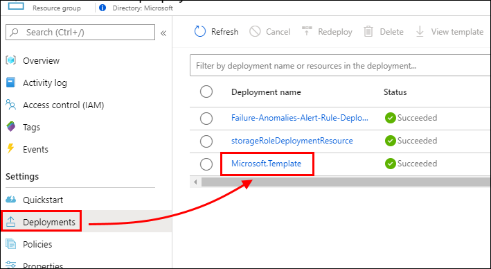

4. 左側のメニューから **Outputs** を選択します。上の値がほとんど全て見つけられるので、単にそれらをコピーします。

    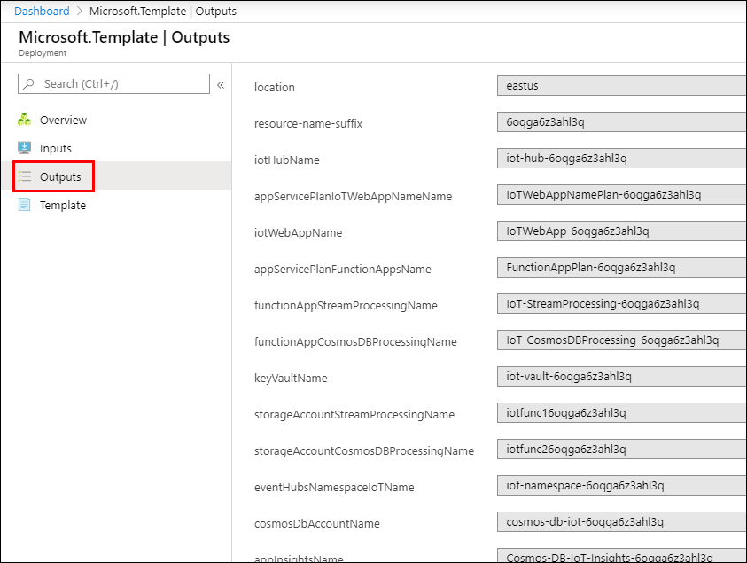

5. シークレットの作成が完了したら、リストは以下のようになるはずです:

   

### Task 8: Create Azure Databricks cluster

Contoso Auto は、車両から収集した貴重なデータを使用して、メンテナンス関連の問題によるダウンタイムを短縮するために、車両の正常性を予測したいと考えています。彼らが行いたい予測の1つは、過去のデータに基づいて、車両のバッテリーが今後30日以内に故障する可能性があるかどうかです。彼らは、これらの予測に基づいて、サービスを提供する必要がある車両を識別するために、毎晩バッチプロセスを実行したいと考えています。また、車両をフリート管理 Web サイトで表示する際に、リアルタイムで予測を行う方法も望んでいます。

この要件をサポートするには、Azure 上で実行するように最適化された完全に管理された Apache Spark プラットフォームである Azure Databricks で Apache Spark を使用します。Spark は、データ サイエンティストとデータ エンジニアが大量の構造化データと非構造化データを探索して準備し、そのデータを使用して機械学習モデルを大規模にトレーニング、使用、およびデプロイできるようにする、統合されたビッグ データと高度な分析プラットフォームです。`azure-cosmosdb-spark` コネクタ (<https://github.com/Azure/azure-cosmosdb-spark>)を使用して、Cosmos DB に読み書きをします。

このタスクでは、後の演習でデータ探索タスクとモデルデプロイタスクを実行する新しいクラスターを作成します。

1. [Azure portal](https://portal.azure.com)で、この演習のリソースグループを開き、**Azure Databricks Service** を開きます。名前は `iot-databricks` で始まるはずです。

   

2. **Launch Workspace** を選択します。Azure Databricks には Azure Active Directory が統合されているので、自動的にサインインできます。

   

3. ワークスペースで、左側のメニューから **Clusters** を選択し、**+ Create Cluster** を選択します。

   

4. **New Cluster** フォームで以下の設定オプションを指定します:

   1. **Cluster Name**: Enter **lab**.
   2. **Cluster Mode**: Select **Standard**.
   3. **Pool**: Select **None**.
   4. **Databricks Runtime Version**: Select **Runtime 5.5 LTS (Scala 2.11, Spark 2.4.3)**.
   5. **Python Version**: Enter **3**.
   6. **Autopilot Options**: Uncheck **Enable autoscaling** and check **Terminate after...**, with a value of **120** minutes.
   7. **Worker Type**: Select **Standard_DS3_v2**.
   8. **Driver Type**: Select **Same as worker**.
   9. **Workers**: Enter **1**.

   
   **注** もしクラスターの作成に失敗した場合は、Worker TypeをStandard_DS3_v2から他のVMサイズに変更してみてください。

5. **Create Cluster** を選択します。

6. 次の手順に進む前に、クラスターが動作していることを確認します。ステータスが **Pending** から **Running** に変わるのを待ちます。

7. **lab** クラスターを選択し、**Libraries** を選択します。

8. **Install New** を選択します。

    

9. Install Library ダイアログで Library Source として **Maven** を選択します。

10. Coordinates フィールドで以下を入力します:

    ```text
    com.microsoft.azure:azure-cosmosdb-spark_2.4.0_2.11:1.4.1
    ```

11. **Install** を選択します。

    

12. ライブラリのステータスが **Installed** になるまで **待ってから** 次の手順に進みます。

### Task 9: Configure Key Vault-backed Databricks secret store

以前のタスクでは、Cosmos DB 接続文字列など、Key Vault にアプリケーション シークレットを追加しました。このタスクでは、これらのシークレットに安全にアクセスするように、Key Vault がバックアップした Databricks シークレット ストアを構成します。

Azure Databricks には、Key Vault バックアップと Databricks バックアップの 2 種類のシークレット スコープがあります。これらのシークレット スコープを使用すると、データベース接続文字列などのシークレットを安全に格納できます。誰かがノートブックにシークレットを出力しようとすると、それは `[REDACTED]` に置き換えられます。これにより、ノートブックの表示や共有時に、シークレットを表示したり、誤って漏洩したりするのを防ぐことができます。

1. 別のブラウザタブに表示されたままになっているはずの、[Azure portal](https://portal.azure.com) に戻り、Key Vault のアカウントに移動し、左側のメニューから **Properties** を選択します。

2. **DNS Name** と **Resource ID** プロパティの値をコピーし、Notepad や他のテキストアプリケーションに、すぐあとで参照するためにペーストしておきます。

   

3. Azure Databricks のワークスペースに戻ります。

4. ブラウザの URL バーで、Azure Databricks のベース URL (例、<https://eastus.azuredatabricks.net#secrets/createScope>)に **#secrets/createScope** を追加します。

5. シークレットスコープの名前に `key-vault-secrets` を入力します。

6. Manage Principal ドロップダウンにある **Creator** を選択し、MANAGEパーミッションを持つシークレットスコープの作成者（あなた）のみを指定します。

   > MANAGE パーミッションがあると、このシークレットスコープを読み書きでき、Azure Databricks Premium Plan の場合、スコープのパーミッションを変更することが出来ます。

   > 作成者を選択できるようにするには、アカウントが Azure Databricks Premium Plan に紐付けされている必要があります。
   これは推奨される方法です: シークレットスコープの作成時に作成者に MANAGE パーミッションを付与し、スコープをテストした後、より細かなアクセスパーミッションを割り当てます。

7. Key Vault の作成手順で以前にコピーした **DNS Name** (例、<https://iot-vault.vault.azure.net/>) と **Resource ID** 例:`/subscriptions/xxxxxxxx-xxxx-xxxx-xxxx-xxxxxxxxxxxx/resourcegroups/cosmos-db-iot/providers/Microsoft.KeyVault/vaults/iot-vault` を入力します。

   

8. **Create** を選択します。

しばらくすると、シークレットスコープが変更されたことを確認するダイアログが表示されます。

## Exercise 2: Configure windowed queries in Stream Analytics

**Duration**: 15 minutes

ソリューション アーキテクチャ図の右側を調べると、Cosmos DB のフィードトリガー関数から Event Hubs にフィードされるイベント データのフローが表示されます。Stream Analytics は、個々の車両テレメトリの集計を作成する一連のタイム ウィンドウ クエリーの入力ソースとして Event Hubs を使用し、車両 IoT デバイスからアーキテクチャを通過する車両テレメトリ全体を作成します。Stream Analytics には、次の 2 つの出力データ シンクがあります:

1. Cosmos DB: 個々の車両テレメトリ (VIN でグループ化) は、30 秒間の `TumblingWindow` で集計され、`metadata` コンテナーに保存されます。この情報は、後のタスクで Power BI Desktop で作成する Power BI レポートで使用され、個々の車両と複数の車両統計情報が表示されます。
2. Power BI: すべての車両テレメトリは、10 秒間の `TumblingWindow` で集計され、Power BI データ・セットに出力されます。このほぼリアルタイムなデータは、ライブ Power BI ダッシュボードに表示され、10 秒間に処理されたイベントの数、エンジン温度、オイル、または冷凍ユニットの警告があるかどうか、期間中に乱暴な運転が検出されたかどうか、平均速度、エンジン温度、冷凍ユニットの測定値、が表示されます。。


この演習では、Stream Analytics を設定して、上述したようなストリーム処理を行います。

### Task 1: Add Stream Analytics Event Hubs input

1. [Azure portal](https://portal.azure.com) で演習のリソースグループを開き、**Stream Analytics job** を開きます。

   

2. 左側のメニューから **Inputs** を選択します。Inputs ブレードで、**+ Add stream input** を選択し、リストから **Event Hub** を選択します。

   

3. **New input** フォームで、以下の設定オプションを指定します:

   1. **Input alias**: Enter **events**.
   2. Select the **Select Event Hub from your subscriptions** option beneath.
   3. **Subscription**: Choose your Azure subscription for this lab.
   4. **Event Hub namespace**: Find and select your Event Hub namespace (eg. `iot-namespace`).
   5. **Event Hub name**: Select **Use existing**, then **reporting**.
   6. **Event Hub policy name**: Choose the default `RootManageSharedAccessKey` policy.

   

4. **Save** を選択します。

Event Hubs の入力がリストされているのが見えるはずです。


### Task 2: Add Stream Analytics outputs

1. 左側のメニューから **Outputs** を選択します。Outputs ブレードで、 **+ Add** を選択し、リストから **Cosmos DB** を選択します。

   

2. **New output** フォームで、以下の設定オプションを指定します:

   1. **Output alias**: Enter **cosmosdb**.
   2. Select the **Select Cosmos DB from your subscriptions** option beneath.
   3. **Subscription**: Choose your Azure subscription for this lab.
   4. **Account id**: Find and select your Cosmos DB account (eg. `cosmos-db-iot`).
   5. **Database**: Select **Use existing**, then **ContosoAuto**.
   6. **Container name**: Enter **metadata**.

   

3. **Save** を選択します。

4. **このアカウントでまだPower BIにサインインしたことが無い場合**、新しいブラウザのタブを開き、<https://powerbi.com> に移動しサインインします。表示されるメッセージを確認し、ホームページが表示された後、次の手順に進みます。Stream Analytics からの接続認証手順が成功することや、グループワークスペースを探すのに役立ちます。

5. Outputs ブレードがまだ表示されているので、**+ Add** を再度選択し、リストから **Power BI** を選択します。

   

6. **New output** フォームで下の方を探して、**Authorize connection** セクションを見つけ、**Authorize** を選択して Power BI アカウントにサインインします。もし Power BI アカウントが無い場合、まず _Sign up_ オプションを選択します。

   

7. Power BI への接続が認証されたら、以下の設定オプションを指定します:

   1. **Output alias**: Enter **powerbi**.
   2. **Group workspace**: Select **My workspace**.
   3. **Dataset name**: Enter **Contoso Auto IoT Events**.
   4. **Table name**: Enter **FleetEvents**.

   

8. **Save** を選択します。

これで 2 つの出力がリストされているはずです。


### Task 3: Create Stream Analytics query

クエリーは Stream Analyticsの主力の機能です。ここでストリーミング入力を処理し、出力にデータを書き込みます。Stream Analytics クエリー言語は SQL に似ており、使い慣れた構文を使用して、ストリーミング データの探索と変換、集計の作成、および出力シンクに書き込む前にデータ構造を形成するために使用できる具体化されたビューを作成できます。Stream Analytics ジョブは 1 つのクエリーしか持ち込めませんが、次の手順で行うように、1 つのクエリーで複数の出力に書き込むことができます。

以下のクエリーを分析してください。作成した Event Hubs 入力に対して `events` 入力名と `powerbi` と `cosmosDB` 出力をそれぞれ使用していることに注目してください。また、`VehicleData` では 3 0秒、`VehicleDataAll` では 10 秒の持続時間で `TumblingWindow` を使用する場所も確認できます。`TumblingWindow` は、過去 X 秒中に発生したイベントを評価し、この場合、レポートの期間にわたって平均を作成するのに役立ちます。

1. 左側のメニューから **Query** を選択します。以下のスクリプトでクエリーウインドウの中身を置き換えます:

   ```sql
   WITH
   VehicleData AS (
       select
           vin,
           AVG(engineTemperature) AS engineTemperature,
           AVG(speed) AS speed,
           AVG(refrigerationUnitKw) AS refrigerationUnitKw,
           AVG(refrigerationUnitTemp) AS refrigerationUnitTemp,
           (case when AVG(engineTemperature) >= 400 OR AVG(engineTemperature) <= 15 then 1 else 0 end) as engineTempAnomaly,
           (case when AVG(engineoil) <= 18 then 1 else 0 end) as oilAnomaly,
           (case when AVG(transmission_gear_position) <= 3.5 AND
               AVG(accelerator_pedal_position) >= 50 AND
               AVG(speed) >= 55 then 1 else 0 end) as aggressiveDriving,
           (case when AVG(refrigerationUnitTemp) >= 30 then 1 else 0 end) as refrigerationTempAnomaly,
           System.TimeStamp() as snapshot
       from events TIMESTAMP BY [timestamp]
       GROUP BY
           vin,
           TumblingWindow(Duration(second, 30))
   ),
   VehicleDataAll AS (
       select
           AVG(engineTemperature) AS engineTemperature,
           AVG(speed) AS speed,
           AVG(refrigerationUnitKw) AS refrigerationUnitKw,
           AVG(refrigerationUnitTemp) AS refrigerationUnitTemp,
           COUNT(*) AS eventCount,
           (case when AVG(engineTemperature) >= 318 OR AVG(engineTemperature) <= 15 then 1 else 0 end) as engineTempAnomaly,
           (case when AVG(engineoil) <= 20 then 1 else 0 end) as oilAnomaly,
           (case when AVG(transmission_gear_position) <= 4 AND
               AVG(accelerator_pedal_position) >= 50 AND
               AVG(speed) >= 55 then 1 else 0 end) as aggressiveDriving,
           (case when AVG(refrigerationUnitTemp) >= 22.5 then 1 else 0 end) as refrigerationTempAnomaly,
           System.TimeStamp() as snapshot
       from events t TIMESTAMP BY [timestamp]
       GROUP BY
           TumblingWindow(Duration(second, 10))
   )
   -- INSERT INTO POWER BI
   SELECT
       *
   INTO
       powerbi
   FROM
       VehicleDataAll
   -- INSERT INTO COSMOS DB
   SELECT
       *,
       entityType = 'VehicleAverage',
       partitionKey = vin
   INTO
       cosmosdb
   FROM
       VehicleData
   ```

   

2. **Save query** を選択します。

### Task 4: Run Stream Analytics job

次に、サービスのフローを開始したイベント データの処理を開始できるように、Stream Analytics ジョブを開始します。

1. **Overview** を選択します。

2. Overview ブレードで、**Start** を選択し、ジョブの出力開始時刻として **Now** を選択します。

3. **Start** を選択し、Stream Analytics ジョブの実行を開始します。

   

## Exercise 3: Deploy Azure functions and Web App

**Duration**: 30 minutes

このシナリオのアーキテクチャでは、Azure Functions がイベント処理で大きな役割を果たします。これらの関数は、クラウド内の小さなコード(関数)を簡単に実行するための Microsoft のサーバーレス ソリューションである Azure Functions アプリケーション内で実行されます。アプリケーション全体やインフラストラクチャを実行する必要なく、問題に必要なコードだけを記述できます。Functions は開発の生産性をさらに高め、C#、F#、Node.js、Java、PHP などの開発言語を使用できます。

この演習に進む前に、Functions と Web App がアーキテクチャにどのように適合するかを見ていきましょう。

ソリューションには 3 つの Function App と 1 つの Web App があります。Function App は、データ パイプラインの 2 段階以内でイベントを処理し、Web App を使用して Cosmos DB に格納されているデータに対して CRUD 操作を実行します。


Function App に複数の関数が含まれている場合、_なぜ 1 つではなく 2 つの Function App が必要なのか?_ と疑問に思うかもしれません。2 つのFunction App を使用する主な理由は、関数が需要を満たすためにどのように拡張されるかによるものです。Azure Functions の消費プランを使用する場合は、コードの実行時間に対してのみ支払います。さらに重要なのは、Azure は需要に応える機能のスケーリングを自動的に処理することです。関数が使用しているトリガーの種類を評価する内部スケール コントローラを使用してスケールし、ヒューリスティックを適用して複数のインスタンスにスケール アウトするタイミングを決定します。知っておくべき重要なことは、Function App レベルで関数がスケーリングすることです。つまり、1 つの非常にビジーな関数があり、残りがほとんどアイドル状態の場合、1 つのビジーな関数によって Function App 全体がスケーリングされます。ソリューションを設計する際には、このことを考えてください。**非常に高負荷の関数を別々の Function App** に分割することは良い考えです。

次に、Function App と Web App とそのアーキテクチャへの貢献方法を紹介します。

- **IoT-StreamProcessing Function App**: これはストリーム処理の Function App であり、2つの関数が含まれています。

- **IoTHubTrigger**: この関数は、車両テレメトリがデータ ジェネレーターによって送信されるにつれて、IoT Hub の Event Hub エンドポイントによって自動的にトリガーされます。この関数は、パーティションキー値、ドキュメントの TTL、を定義してデータに対して軽い処理を実行し、タイムスタンプ値を追加し、情報を Cosmos DB に保存します。
  - **HealthCheck**: この関数には HTTP トリガーがあり、ユーザーは Function App が起動して実行中であり、各構成設定が存在し、値を持っていることを確認できます。より徹底的なチェックでは、各値が予期される形式に対して、または必要に応じて各サービスに接続することによって検証されます。すべての値にゼロ以外の文字列が含まれている場合、関数は HTTP ステータス `200` (OK) を返します。null または空の値がある場合、関数はエラー (`400`) を返し、どの値が欠落していることを示します。データ ジェネレーターは、実行する前にこの関数を呼び出します。

  

- **IoT-CosmosDBProcessing Function App** :これはトリップ処理のFunction App です。これは、`telemetry` コンテナー上の Cosmos DB Change Feed によってトリガーされる 3 つの関数が含まれています。Cosmos DB Change Feed は複数のコンシューマーをサポートしているため、これら 3 つの機能を並行して実行し、互いに競合することなく同じ情報を同時に処理できます。これらの各関数に対して `CosmosDBTrigger` を定義する際に、処理した Change Feed イベントを追跡するために、`leases` という名前の Cosmos DB コレクションに接続するトリガー設定を設定します。また、一つの関数が別の関数のリース情報を取得または更新しようとしないように、一意のプレフィックスを持つ各関数の `LeaseCollectionPrefix` 値も設定します。この Function App には、次の関数があります。

- **TripProcessor**: この関数は、VIN によって車両テレメトリデータをグループ化し、`metadata` コンテナーから関連するトリップレコードを取得し、トリップ開始タイムスタンプ、完了した場合は終了タイムスタンプ、およびトリップの有無を示すステータス、トリップが開始された、遅れている、または完了したのいずれか、を更新します。また、関連する委託レコードをステータスで更新し、Function App のアプリ設定で定義された受信者にアラートを電子メールで送信する必要がある場合は、トリップ情報を含む Logic App をトリガーします (`RecipientEmail`)。
  - **ColdStorage**: この関数は Azure Storage アカウント (`ColdStorageAccount`) に接続し、次のタイム スライスパス形式でコールド ストレージ用の生の車両テレメトリ データを書き込みます: `telemetry/custom/scenario1/yyyy/MM/dd/HH/mm/ss-fffffff.json`。
  - ** SendToEventHubsForReporting** : この関数は、車両テレメトリ データを Event Hubs に直接送信するだけで、Stream Analytics はウィンドウ化された集計を適用し、それらの集計を Power BI および Cosmos DB のメタデータ コンテナーにバッチで保存できます。
  - **HealthCheck**: ストリーム処理 Function App 内の同じ名前の関数と同様に、この関数には HTTP トリガーがあり、Function App が稼働中であり、各構成設定が存在し、値を持っていることをユーザーが確認できます。データ ジェネレーターは、実行する前にこの関数を呼び出します。

  

- **IoTWebApp**: Web App はフリート管理ポータルを提供し、ユーザーが車両データに対して CRUD 操作を実行し、デプロイされた機械学習モデルに対して車両のリアルタイムバッテリー故障予測を行い、委託、小包、およびトリップを表示できるようにします。[.NET SDK for Cosmos DB v3](https://github.com/Azure/azure-cosmos-dotnet-v3/)を使用して、Cosmos DBの `metadata` コンテナーに接続します。

  

### Task 1: Retrieve the URI for each Key Vault secret

次のタスクで Function App と Web App のアプリ設定を設定する場合は、バージョン番号を含む Key Vault のシークレットの URI を参照する必要があります。これを行うには、シークレットごとに次の手順を実行し、**値** を Notepad または同様のテキスト アプリケーションにコピーします。

1. ポータルで Key Vault のインスタンスを開きます。

2. 左側のメニューの Settings 以下にある **Secrets** を選択します。

3. 取得したい URI 値のシークレットを選択します。

4. **Current Version** のシークレットを選択します。

   

5. **Secret Identifier** をコピーします。

   

   Function App のアプリ設定でこのシークレットへの Key Vault 参照を追加すると、`@Microsoft.KeyVault(SecretUri={referenceString})` という形式を利用することになり、`{referenceString}` は上記のシークレット識別子 (URI) の値によって置き換えられます。**中かっこ(`{}`)** を削除してください。

   例えば、完全な参照は以下のようになります:

   `@Microsoft.KeyVault(SecretUri=https://iot-vault-501993860.vault.azure.net/secrets/CosmosDBConnection/794f93084861483d823d37233569561d)`

### Task 2: Configure application settings in Azure

> これらの手順では、2 つのブラウザ タブを開いたままにすることをお勧めします。1 つは各 Azure サービスからシークレットをコピーし、もう 1 つは Key Vault にシークレットを追加します。

1. ブラウザの新しいタブか画面で、Azure portal, <https://portal.azure.com> に移動します。

2. 左側のメニューから **Resource groups** を選択し、`cosmos-db-iot` を入力してリソースグループを探します。この演習で利用しているリソースグループを選択します。

3. **Key Vault** を開きます。名前は `iot-keyvault` で始まるはずです。

   

4. 別のブラウザのタブで、名前が **IoT-CosmosDBProcessing** で始まる Azure Functions アプリケーションを選択します。

5. Overview ペインで **Configuration** を選択します。

    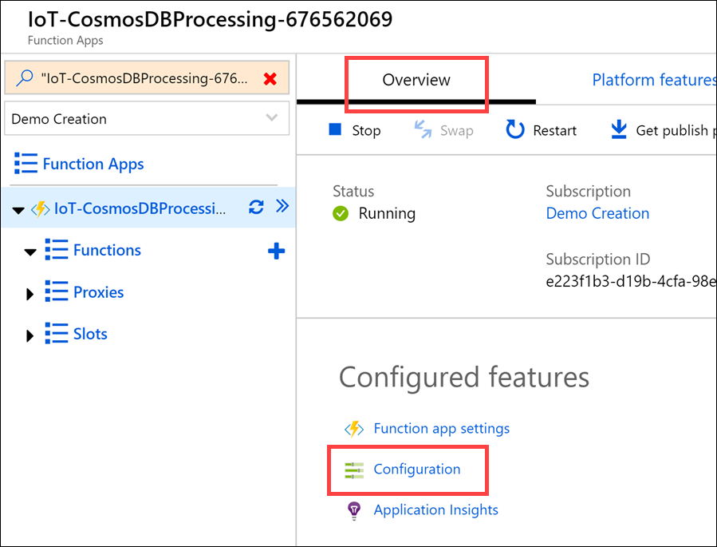

6. **Application settings** セクションへスクロールします。**+ New application setting** リンクを使って、以下の追加の Key/Value ペアを作成します (キーの名前は以下の表にあるものと完全に一致していなければいけません):

    | **Application Key**      |                                                                          **Value**                                                                          |
    | ------------------------ | :---------------------------------------------------------------------------------------------------------------------------------------------------------: |
    | CosmosDBConnection     | Enter `@Microsoft.KeyVault(SecretUri={referenceString})`, where `{referenceString}` is the URI for the **CosmosDBConnection** Key Vault secret |
    | ColdStorageAccount     | Enter `@Microsoft.KeyVault(SecretUri={referenceString})`, where `{referenceString}` is the URI for the **ColdStorageAccount** Key Vault secret                                                                   |
    | EventHubsConnection   | Enter `@Microsoft.KeyVault(SecretUri={referenceString})`, where `{referenceString}` is the URI for the **EventHubsConnection** Key Vault secret |
    | LogicAppUrl        | Enter `@Microsoft.KeyVault(SecretUri={referenceString})`, where `{referenceString}` is the URI for the **LogicAppUrl** Key Vault secret |
    | RecipientEmail      | Enter a **valid email address** you want to receive notification emails from the Logic App. |

    

7. **Save** を選択し、変更を適用します。

8. 名前が **IoT-StreamProcessing** で始まる Azure Functions アプリケーションを開きます。

9. Overview ペインで **Configuration** を選択します。

10. **Application settings** セクションへスクロールします。**+ New application setting** リンクを使って、以下の追加の Key/Value ペアを作成します (キーの名前は以下の表にあるものと完全に一致していなければいけません):

    | **Application Key**      |                                                                          **Value**                                                                          |
    | ------------------------ | :---------------------------------------------------------------------------------------------------------------------------------------------------------: |
    | CosmosDBConnection     | Enter `@Microsoft.KeyVault(SecretUri={referenceString})`, where `{referenceString}` is the URI for the **CosmosDBConnection** Key Vault secret |
    | IoTHubConnection     | Enter `@Microsoft.KeyVault(SecretUri={referenceString})`, where `{referenceString}` is the URI for the **IoTHubConnection** Key Vault secret |

    

11. **Save** を選択し、変更を適用します。

12. 名前が **IoTWebApp** で始まる Web App (App Service) を開きます。

13. 左側のメニューから **Configuration** を選択します。

14. **Application settings** セクションへスクロールします。**+ New application setting** リンクを使って、以下の追加の Key/Value ペアを作成します (キーの名前は以下の表にあるものと完全に一致していなければいけません):

    | **Application Key**      |                                                                          **Value**                                                                          |
    | ------------------------ | :---------------------------------------------------------------------------------------------------------------------------------------------------------: |
    | CosmosDBConnection     | Enter `@Microsoft.KeyVault(SecretUri={referenceString})`, where `{referenceString}` is the URI for the **CosmosDBConnection** Key Vault secret |
    | DatabaseName     | Enter `ContosoAuto` |
    | ContainerName     | Enter `metadata` |

    

15. **Save** を選択し、変更を適用します。

> Function Appと Web App の両方のシステム管理 ID が正しく動作し、Key Vault にアクセスできることを確認します。これを行うには、各 Function App と Web App 内で **CosmosDBConnection** 設定を開き、設定の下にある **Key Vault Reference Details** を見てください。次のような出力が表示され、シークレットの詳細が表示され、_システムで割り当てられたマネージ ID_ を使用していることを示します:

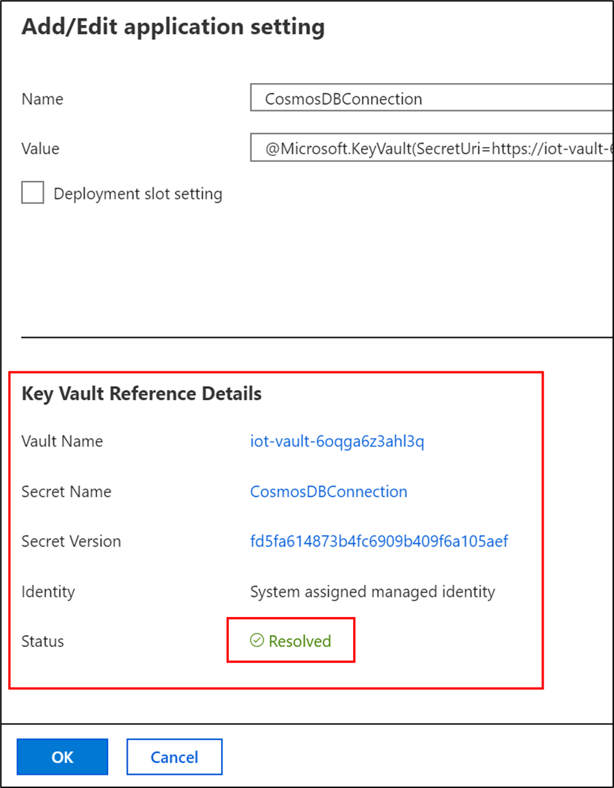

> Key Vault Reference Details にエラーが表示された場合は、Key Vault に移動し、関連するシステム ID のアクセス ポリシーを削除します。次に、Function App または  Web App に戻り、システム ID をオフにし、再びオンにして (新しいアプリを作成する)、Key Vault のアクセス ポリシーに再度追加します。

### Task 3: Open solution

このタスクでは、この演習の Visual Studio ソリューションを開きます。これには、Function App、Web App、およびデータ ジェネレーターの両方のプロジェクトが含まれています。

1. Windows エクスプローラーを開いて _Before the HOL_ ガイド内でソリューションの ZIP ファイルが展開された場所に移動します。もし`C:\`に直接 ZIP ファイルを展開した場合、以下のフォルダを開く必要があります:`C:\cosmos-db-scenario-based-labs-master\IoT\Starter` Visual Studio のソリューションファイルを開きます: **CosmosDbIoTScenario.sln**

    > Visual Studio が最初の起動時にサインインを求めるメッセージが表示された場合は、この演習 (該当する場合) または既存の Microsoft アカウントに提供されたアカウントを使用します。

2. ソリューションを開いた後、**Solution Explorer** で含まれるプロジェクトを見てみます:

    1. **Functions.CosmosDB**: Project for the **IoT-CosmosDBProcessing** Function App.
    2. **Functions.StreamProcessing**: Project for the **IoT-StreamProcessing** Function App.
    3. **CosmosDbIoTScenario.Common**: Contains entity models, extensions, and helpers used by the other projects.
    4. **FleetDataGenerator**: The data generator seeds the Cosmos DB `metadata` container with data and simulates vehicles, connects them to IoT Hub, then sends generated telemetry data.
    5. **FleetManagementWebApp**: Project for the **IoTWebApp** Web App.

    

3. Solution Explorerで `CosmosDbIoTScenario` ソリューションを右クリックし、**Restore NuGet Packages** を選択します。パッケージはソリューションを開いた時に既にリストアされているかもしれません。

### Task 4: Code completion and walk-through

Function App と Web App プロジェクトには、デプロイする前に完了する必要があるコード ブロックが含まれています。この理由は、ソリューションをガイドし、小さなフラグメントを完了してコードをより深く理解するのに役立ちます。

1. Visual Studioで **View** を選択し、**Task List** を選択します。**TODO** 項目のリストを表示し、それらのいずれかに移動しやすいようになっています。

    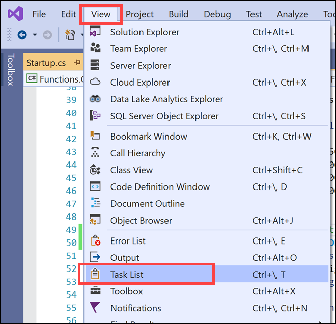

    タスクリストはウインドウの一番下に表示されます:

    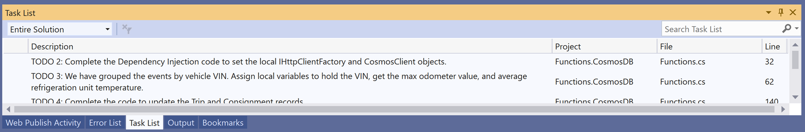

2. **Functions.CosmosDB** プロジェクトの中の **Startup.cs** を開き、**TODO 1** 内に以下をペーストしてコードを完成させます:

    ```csharp
    builder.Services.AddSingleton((s) => {
        var connectionString = configuration["CosmosDBConnection"];
        var cosmosDbConnectionString = new CosmosDbConnectionString(connectionString);

        if (string.IsNullOrEmpty(connectionString))
        {
            throw new ArgumentNullException("Please specify a value for CosmosDBConnection in the local.settings.json file or your Azure Functions Settings.");
        }

        CosmosClientBuilder configurationBuilder = new CosmosClientBuilder(cosmosDbConnectionString.ServiceEndpoint.OriginalString, cosmosDbConnectionString.AuthKey);
        return configurationBuilder
            .Build();
    });
    ```

    完全なコードは以下のようになります:

    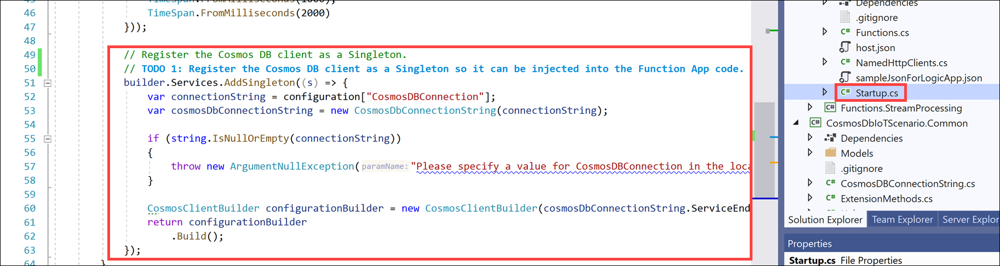

    [.NET SDK for Cosmos DB v3](https://github.com/Azure/azure-cosmos-dotnet-v3/)を使用しており、Function App v2 以降で依存関係の注入がサポートされているので、[singleton Azure Cosmos DB client for the lifetime of the application](https://docs.microsoft.com/azure/cosmos-db/performance-tips#sdk-usage) を利用します。これは、次の TODO ブロックで見るように、コンストラクタを通じて `Functions` クラスに挿入されます。

3. **Save** で **Startup.cs** ファイルを保存します。

4. **Functions.CosmosDB** プロジェクトの中の **Functions.cs** を開き、**TODO 2** 内に以下をペーストしてコードを完成させます:

    ```csharp
    public Functions(IHttpClientFactory httpClientFactory, CosmosClient cosmosClient)
    {
        _httpClientFactory = httpClientFactory;
        _cosmosClient = cosmosClient;
    }
    ```

    上記のコードを追加すると、関数コードに `HttpClientFactory` と `CosmosClient` を挿入できるため、これらのサービスは独自の接続とライフサイクルを管理してパフォーマンスを向上させ、スレッドの枯渇やその他の問題、高価なオブジェクトのインスタンスが誤って作成され過ぎて起こされる、を防ぐことができます。`HttpClientFactory` は、以前のコード変更を行った `Startup.cs` で既に構成されています。Logic App エンドポイントにアラートを送信するために使用され、[Polly](https://github.com/App-vNext/Polly) を使用して、Logic App が過負荷になっている場合や、HTTP エンドポイントへの呼び出しが失敗する原因となるその他の問題がある場合に備えて、段階的なバックオフ待機ポリシーと再試行ポリシーを使用します。

5. 今完了したばかりのコンストラクタコードの下にある最初の関数コードを見てみます:

    ```csharp
    [FunctionName("TripProcessor")]
    public async Task TripProcessor([CosmosDBTrigger(
        databaseName: "ContosoAuto",
        collectionName: "telemetry",
        ConnectionStringSetting = "CosmosDBConnection",
        LeaseCollectionName = "leases",
        LeaseCollectionPrefix = "trips",
        CreateLeaseCollectionIfNotExists = true,
        StartFromBeginning = true)]IReadOnlyList<Document> vehicleEvents,
        ILogger log)
    {
    ```

    `FunctionName` 属性は、Function App 内での関数名の表示方法を定義し、C# メソッド名とは異なる場合があります。この `TripProcessor` 関数は、`CosmosDBTrigger` を使用して、すべての Cosmos DB Change Feed イベントで起動します。イベントはバッチで到着し、そのサイズは、コンテナーの Insert、Update、または Delete イベントの数などの要因によって異なります。`databaseName` と `collectionName` プロパティは、どのコンテナーのChange Feed が関数をトリガーするかを定義します。`ConnectionStringSetting` は、Cosmos DB 接続文字列をプルする Function App のアプリケーション設定の名前を示します。この例では、作成した Key Vault シークレットから接続文字列の値が生成されます。`LeaseCollection` プロパティは、リース コンテナーの名前と、この関数のリース データに適用されるプレフィックス、およびリース コンテナーが存在しない場合にリース コンテナーを作成するかどうかを定義します。`StartFromBeginning` は `true` に設定され、関数の最後の実行以降のすべてのイベントが処理されるようにします。この関数は、Change Feed ドキュメントを `IReadOnlyList` コレクションに出力します。

6. 関数内を少しだけ下にスクロールして、**TODO 3** 内に以下をペーストしてコードを完成させます:

    ```csharp
    var vin = group.Key;
    var odometerHigh = group.Max(item => item.GetPropertyValue<double>("odometer"));
    var averageRefrigerationUnitTemp =
        group.Average(item => item.GetPropertyValue<double>("refrigerationUnitTemp"));
    ```

    車両 VIN でイベントをグループ化したので、グループ キー (VIN) を保持するローカル `vin` 変数を割り当てます。次に、`group.Max` 集計関数を使用して最大走行距離計の値を計算し、平均冷凍ユニット温度を計算する関数である `group.Average` を使用します。`odometerHigh` の値を使用して、トリップ距離を計算し、Cosmos DB `metadata` コンテナーの `Trip` レコードからの計画された移動距離に基づいて、トリップが完了したかどうかを判断します。必要に応じて、Logic App に送信されるアラートに `averageRefrigerationUnitTemp` が追加されます。

7. 新たに追加したコードで以下のようになっていることを確認します:

    ```csharp
    // First, retrieve the metadata Cosmos DB container reference:
    var container = _cosmosClient.GetContainer(database, metadataContainer);

    // Create a query, defining the partition key so we don't execute a fan-out query (saving RUs), where the entity type is a Trip and the status is not Completed, Canceled, or Inactive.
    var query = container.GetItemLinqQueryable<Trip>(requestOptions: new QueryRequestOptions { PartitionKey = new Microsoft.Azure.Cosmos.PartitionKey(vin) })
        .Where(p => p.status != WellKnown.Status.Completed
                    && p.status != WellKnown.Status.Canceled
                    && p.status != WellKnown.Status.Inactive
                    && p.entityType == WellKnown.EntityTypes.Trip)
        .ToFeedIterator();

    if (query.HasMoreResults)
    {
        // Only retrieve the first result.
        var trip = (await query.ReadNextAsync()).FirstOrDefault();
        
        if (trip != null)
        {
            // Retrieve the Consignment record.
            var document = await container.ReadItemAsync<Consignment>(trip.consignmentId,
                new Microsoft.Azure.Cosmos.PartitionKey(trip.consignmentId));
            var consignment = document.Resource;
    ```

    ここでは、クラスに追加された CosmosClient (`_cosmosClient`) を使用して Cosmos DB コンテナー参照を取得することにより、[.NET SDK for Cosmos DB v3](https://github.com/Azure/azure-cosmos-dotnet-v3/) を使用しています。LINQ 構文を使用してコンテナーをクエリーし、結果を `Trip` クラス型の新しいコレクションにバインドするには、コンテナーの `GetItemLinqQueryable` を使用します。**partition key** (この場合はVIN)を渡して、クロス・パーティションやファンアウトするクエリーを実行しないで RU/s を節約する方法に注意してください。また、他のエンティティタイプは車両タイプなど、同じパーティションキーを持つことができるため、クエリーで `entityType` ドキュメント プロパティをトリップに設定して取得するドキュメントの種類も定義します。

    委託 ID を持っているので、`ReadItemAsync` メソッドを使用して単一の委託レコードを取得できます。ここでは、ファンアウトを最小限に抑えるためにパーティションキーを渡します。Cosmos DB コンテナー内では、ドキュメントの一意の ID は `id` フィールドとパーティション キー値の組み合わせです。

8. 関数内を少しだけ下にスクロールして、**TODO 4** 内に以下をペーストしてコードを完成させます:

    ```csharp
    if (updateTrip)
    {
        await container.ReplaceItemAsync(trip, trip.id, new Microsoft.Azure.Cosmos.PartitionKey(trip.partitionKey));
    }

    if (updateConsignment)
    {
        await container.ReplaceItemAsync(consignment, consignment.id, new Microsoft.Azure.Cosmos.PartitionKey(consignment.partitionKey));
    }
    ```

    `ReplaceItemAsync` メソッドは `id` とパーティションキーの値によって関連付けられたオブジェクト内に渡された Cosmos DB のドキュメントを更新します。

9. 関数内を少しだけ下にスクロールして、**TODO 5** 内に以下をペーストしてコードを完成させます:

    ```csharp
    await httpClient.PostAsync(Environment.GetEnvironmentVariable("LogicAppUrl"), new StringContent(postBody, Encoding.UTF8, "application/json"));
    ```

    ここでは、挿入された `HttpClientFactory` によって作成された `HttpClient` を使用して、シリアル化された `LogicAppAlert` オブジェクトを Logic App に投稿します。`Environment.GetEnvironmentVariable("LogicAppUrl")`メソッドは、Function App のアプリケーション設定から Logic App の URL を抽出し、アプリ設定に追加した特別な Key Vault アクセス文字列を使用して、Key Vault シークレットから暗号化された値を抽出します。

10. 関数内を少しだけ下にスクロールして、**TODO 6** 内に以下をペーストしてコードを完成させます:

    ```csharp
    // Convert to a VehicleEvent class.
    var vehicleEventOut = await vehicleEvent.ReadAsAsync<VehicleEvent>();
    // Add to the Event Hub output collection.
    await vehicleEventsOut.AddAsync(new EventData(
        Encoding.UTF8.GetBytes(JsonConvert.SerializeObject(vehicleEventOut))));
    ```

    `ReadAsAsync` メソッドは、Cosmos DB ドキュメントをクラスに変換する `CosmosDbIoTScenario.Common.ExtensionMethods` にある拡張メソッドです。この場合は、`VehicleEvent` クラスです。現在、関数の `CosmosDBTrigger` は `Document` の `IReadOnlyList` の返却しかサポートしていません。この拡張メソッドは、プロセスを自動化します。

    `AddAsync` メソッドは、関数属性で定義された `IAsyncCollector<EventData>` コレクションに非同期的に追加され、定義された Event Hub エンドポイントへのコレクション項目の送信を処理します。

11. **Save** で **Functions.cs** ファイルを保存します。

12. **Functions.StreamProcessing** プロジェクトで **Functions.cs** を開きます。まず関数のパラメータを見てみましょう:

    ```csharp
    [FunctionName("IoTHubTrigger")]
    public static async Task IoTHubTrigger([IoTHubTrigger("messages/events", Connection = "IoTHubConnection")] EventData[] vehicleEventData,
        [CosmosDB(
            databaseName: "ContosoAuto",
            collectionName: "telemetry",
            ConnectionStringSetting = "CosmosDBConnection")]
        IAsyncCollector<VehicleEvent> vehicleTelemetryOut,
        ILogger log)
    {
    ```

    この関数は `IoTHubTrigger` で定義されます。IoT デバイスが IoT Hub にデータを送信するたびに、この関数がトリガーされ、イベント データがバッチで送信されます (`EventData[] vehicleEventData`)。`CosmosDB` 属性は出力属性であり、定義されたデータベースとコンテナーへの Cosmos DB ドキュメントの書き込みを簡略化します。この場合、それぞれ `ContosoAuto` データベースと `telemetry` コンテナーがあります。

13. 関数のコード内を下にスクロールして、**TODO 7** を見つけて以下のコードで完成させます:

    ```csharp
    vehicleEvent.partitionKey = $"{vehicleEvent.vin}-{DateTime.UtcNow:yyyy-MM}";
    // Set the TTL to expire the document after 60 days.
    vehicleEvent.ttl = 60 * 60 * 24 * 60;
    vehicleEvent.timestamp = DateTime.UtcNow;

    await vehicleTelemetryOut.AddAsync(vehicleEvent);
    ```

    `partitionKey` プロパティは、VIN + 現在の年/月で構成される Cosmos DB コンテナーの合成複合パーティション キーを表します。単に VIN の代わりに複合キーを使用すると、次の利点が得られます。

    1. パーティション キーのカーディナリティ（基数）が高い上に、任意の時点での書き込みワークロードを分散します。
    2. 特定の VIN 上のクエリーに対する効率的なルーティングを確保する - これらを時間で分散することができます。例 `SELECT * FROM c WHERE c.partitionKey IN ("VIN123-2019-01", "VIN123-2019-02", …)`
    3. 単一のパーティション キー値の 10 GB クォータを超えてスケーリングします。

    `ttl` プロパティはドキュメントの存続時間を 60 日に設定し、その後 Cosmos DB はドキュメントを削除します。

    クラスを `vehicleTelemetryOut` コレクションに非同期的に追加すると、関数の Cosmos DB 出力バインディングは、定義された Cosmos DB データベースとコンテナーへのデータの書き込みを自動的に処理し、実装の詳細を管理します。

14. **Functions.cs** ファイルを **Save** します。

15. **FleetManagementWebApp** プロジェクトの **Startup.cs** を開きます。ファイルの一番下までスクロールして、**TODO 8** を見つけ、以下のコードで完成させます:

    ```csharp
    CosmosClientBuilder clientBuilder = new CosmosClientBuilder(cosmosDbConnectionString.ServiceEndpoint.OriginalString, cosmosDbConnectionString.AuthKey);
    CosmosClient client = clientBuilder
        .WithConnectionModeDirect()
        .Build();
    CosmosDbService cosmosDbService = new CosmosDbService(client, databaseName, containerName);
    ```

    このコードでは、[.NET SDK for Cosmos DB v3](https://github.com/Azure/azure-cosmos-dotnet-v3/)を使用して、依存関係のインジェクションとオブジェクトの有効期間管理のためのシングルトンとして `IServiceCollection` に追加される `CosmosClient` インスタンスを初期化します。

16. **Startup.cs** ファイルを **Save** します。

17. **FleetManagementWebApp** プロジェクトの **Services** フォルダにある **CosmosDBService.cs** を開いて、**TODO 9** を見つけ、以下のコードで完成させます:

    ```csharp
    var setIterator = query.Where(predicate).Skip(itemIndex).Take(pageSize).ToFeedIterator();
    ```

    ここでは、要求されたページのレコードだけを取得するために、`IOrderedQueryable` オブジェクト (`query`) に新しく追加された `Skip` メソッドと `Take` メソッドを使用しています。`predicate` は、フィルタリングを適用する `GetItemsWithPagingAsync` メソッドに渡される LINQ 式を表します。

18. 少し多めに下にスクロールして、**TODO 10** を見つけ、以下のコードで完成させます:

    ```csharp
    var count = this._container.GetItemLinqQueryable<T>(allowSynchronousQueryExecution: true, requestOptions: !string.IsNullOrWhiteSpace(partitionKey) ? new QueryRequestOptions { PartitionKey = new PartitionKey(partitionKey) } : null)
        .Where(predicate).Count();
    ```

    ナビゲートする必要があるページ数を知るには、現在のフィルタを適用したアイテムの合計数を知る必要があります。これを行うには、`Container`から新しい `IOrderedQueryable` 結果を取得し、フィルタ述語を `Where` メソッドに渡し、`count` 変数に `Count` を返します。これを機能させるには、`allowSynchronousQueryExecution` を true に設定する必要があります。

19. **CosmosDBService.cs** ファイルを **Save** します。

20. **FleetManagementWebApp** プロジェクトの **Controllers** フォルダにある **VehiclesController.cs** を開き、以下のコードを確認します:

    ```csharp
    private readonly ICosmosDbService _cosmosDbService;
    private readonly IHttpClientFactory _clientFactory;
    private readonly IConfiguration _configuration;
    private readonly Random _random = new Random();

    public VehiclesController(ICosmosDbService cosmosDbService, IHttpClientFactory clientFactory, IConfiguration configuration)
    {
        _cosmosDbService = cosmosDbService;
        _clientFactory = clientFactory;
        _configuration = configuration;
    }

    public async Task<IActionResult> Index(int page = 1, string search = "")
    {
        if (search == null) search = "";
        //var query = new QueryDefinition("SELECT TOP @limit * FROM c WHERE c.entityType = @entityType")
        //    .WithParameter("@limit", 100)
        //    .WithParameter("@entityType", WellKnown.EntityTypes.Vehicle);
        // await _cosmosDbService.GetItemsAsync<Vehicle>(query);

        var vm = new VehicleIndexViewModel
        {
            Search = search,
            Vehicles = await _cosmosDbService.GetItemsWithPagingAsync<Vehicle>(
                x => x.entityType == WellKnown.EntityTypes.Vehicle &&
                      (string.IsNullOrWhiteSpace(search) ||
                      (x.vin.ToLower().Contains(search.ToLower()) || x.stateVehicleRegistered.ToLower() == search.ToLower())), page, 10)
        };

        return View(vm);
    }
    ```

    以前の Function App と同様に、このコントローラーで依存関係の注入を使用しています。`ICosmosDbService`、`IHttpClientFactory`、および `IConfiguration` サービスは、コントローラのコンストラクターを介してコントローラに注入されます。`CosmosDbService` は、前の手順でコードを更新したクラスです。`CosmosClient` はコンストラクターを介して注入されます。

    `Index` コントローラーアクションメソッドは、前の手順で更新した `ICosmosDbService.GetItemsWithPagingAsync` メソッドを呼び出すことによって実装されるページングを使用します。コントローラーでこのサービスを使用すると、アクション メソッドのコードから Cosmos DB クエリーの実装の詳細とビジネス ルールを抽象化し、コントローラを軽量に保ち、サービス内のコードをすべてのコントローラ間で再利用可能にすることができます。

    ページング クエリーにはパーティション キーが含まれていないため、Cosmos DB クエリーはパーティション間でクエリーを実行できる必要があります。このクエリーが `search` 値で渡され、実行あたりのコンテナーでの RU 使用量が必要以上に高くなる場合は、`vin` と `stateVehicleRegistered ` の組み合わせなど、パーティション キーの代替戦略を検討する必要があります。ただし、このコンテナー内の車両のアクセス パターンのほとんどは VIN を使用するため、現在はパーティション キーとして使用しています。パーティション キー値を明示的に渡すメソッドには、さらに下にコードが表示されます。

21. **VehiclesController.cs** を下にスクロールして、**TODO 11** を見つけ、以下のコードで完成させます:

    ```csharp
    await _cosmosDbService.DeleteItemAsync<Vehicle>(item.id, item.partitionKey);
    ```

    ここでは、項目を完全に削除してハード削除を行っています。実際のシナリオでは、ほとんどの場合、ソフト削除を実行します。さらに、トリップなどの関連レコードをソフト削除します。ソフト削除を使用すると、将来必要に応じて削除されたアイテムを簡単に回復できます。

22. **VehiclesController.cs** ファイルを **Save** します。

### Task 5: Deploy Cosmos DB Processing Function App

1. Visual Studio Solution Explorer で、**Functions.CosmosDB** プロジェクトを右クリックし、**Publish...** を選択します。

    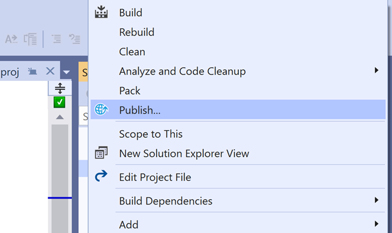

2. Publish ダイアログで、**Azure Functions Consumption Plan** publish target を選択します。次に、**Select Existing** ラジオボタンを選択し、**Run from package file (recommended)** がチェックされていることを確認します。フォームの一番下の **Publish** を選択します。

    

3. App Serviceペインで、この演習で利用している Azure サブスクリプションを選択し、View が **Resource Group** になっていることを確認します。下にある結果内にあるリソースグループを見つけて開きます。名前が **IoT-CosmosDBProcessing** で始まる Function App を選択し、**OK** を選択します。

    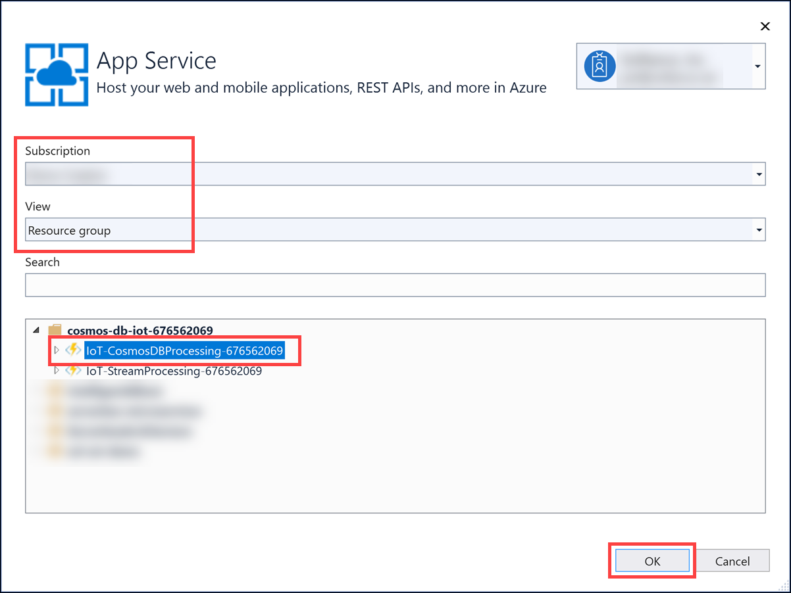

4. **Publish** をクリックして開始します。

    公開が完了した後、出力ウインドウに以下が表示されるはずです: 公開が成功したことを表示する `========== Publish: 1 succeeded, 0 failed, 0 skipped ==========`

    > もし出力ウインドウが表示されない場合、Visual Studio で **View** を選択し、それから **Output** を選択します。

### Task 6: Deploy Stream Processing Function App

1. Visual Studio Solution Explorer　で、**Functions.StreamProcessing** プロジェクトを右クリックし、**Publish...** を選択します。

    

2. Publish ダイアログで、**Azure Functions Consumption Plan** publish target を選択します。次に、**Select Existing** ラジオボタンを選択し、**Run from package file (recommended)** がチェックされていることを確認します。フォームの一番下の **Publish** を選択します。

    

3. App Service ペインで、この演習で利用している Azure サブスクリプションを選択し、View が **Resource Group** になっていることを確認します。下にある結果内にあるリソースグループを見つけて開きます。名前が **IoT-StreamProcessing** で始まる Function App を選択し、**OK** を選択します。

    

4. **Publish** をクリックして開始します。

    公開が完了した後、出力ウインドウに以下が表示されるはずです: 公開が成功したことを表示する `========== Publish: 1 succeeded, 0 failed, 0 skipped ==========`

### Task 7: Deploy Web App

1. Visual Studio Solution Explorer で、**FleetManagementWebApp** プロジェクトを右クリックし、**Publish...** を選択します。

    

2. Publish ダイアログで、**App Service** publish target を選択します。次に、**Select Existing** ラジオボタンを選択し、フォームの一番下の **Publish** を選択します。

    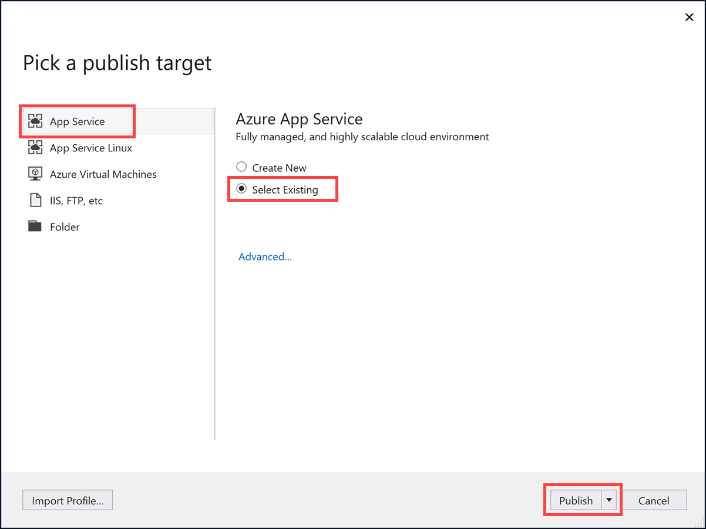

3. App Serviceペインで、この演習用に利用しているAzureサブスクリプションを選択し、Viewが **Resource Group** になっていることを確認します。下にある結果内にあるリソースグループを見つけて開きます。名前が **IoTWebApp** で始まる Web App を選択し、**OK** を選択します。

    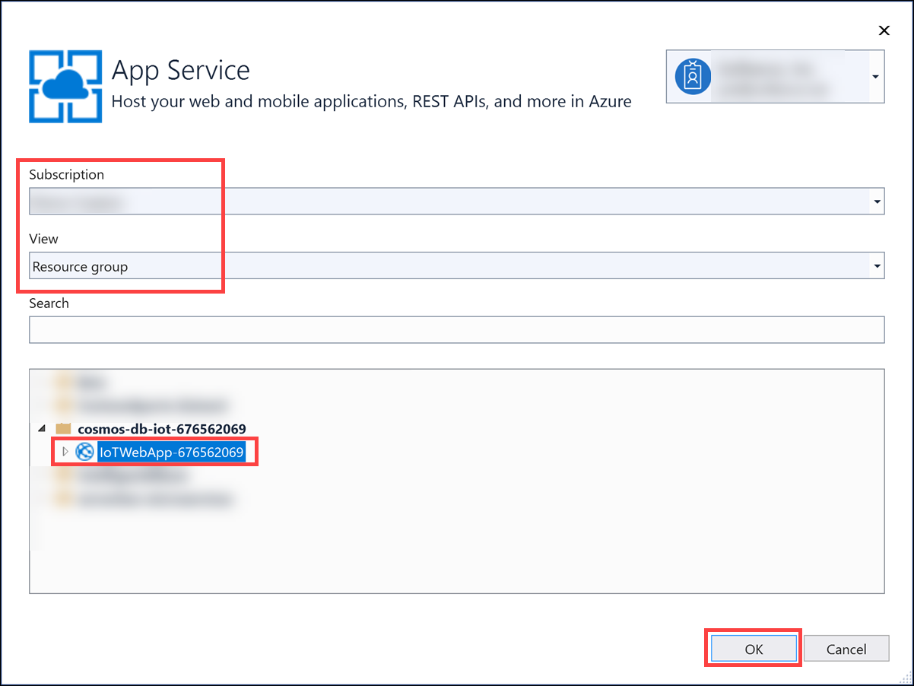

4. **Publish** をクリックして開始します。

    公開が完了した後、出力ウインドウに以下が表示されるはずです: 公開が成功したことを表示する `========== Publish: 1 succeeded, 0 failed, 0 skipped ==========`。さらに、Web App は新しいブラウザ ウィンドウで開く必要があります。サイト内を移動しようとすると、データがないことがわかります。次の演習では、データを含む Cosmos DB の `metadata` コンテナーをシードします。

    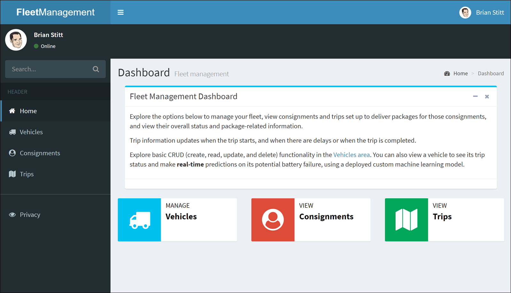

    Web App が自動で開かない場合は、Publish ダイアログで URL をコピーします:

    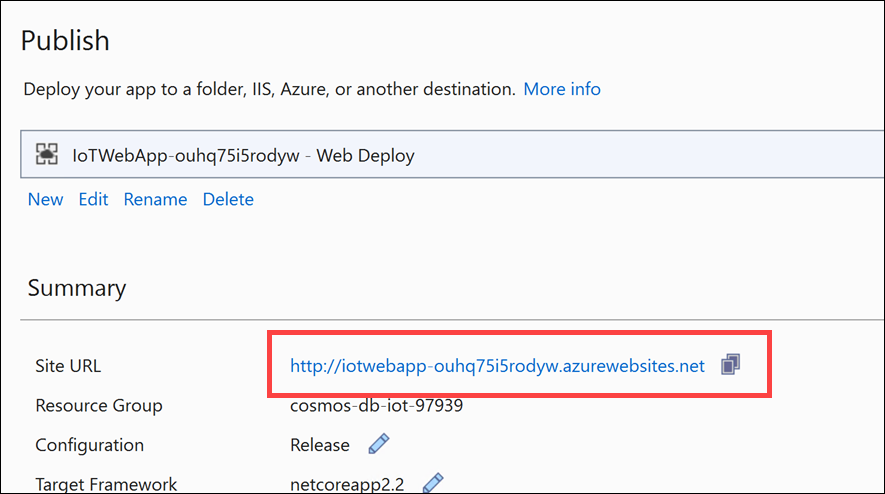

> **注:** Web アプリケーションにエラーが表示された場合は、**IoTWebApp** の Azure ポータルに移動し、**Restart** をクリックします。ARM テンプレートから Azure Web App を作成し、.NET Core 用に構成する場合、.NET Core 構成を完全にインストールしてアプリケーションを実行する準備が整うために、Azure Web App を再起動する必要がある場合があります。再起動すると、Web アプリケーションは期待どおりに実行されます。

> 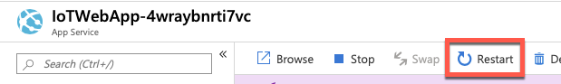

> **追加のトラブルシューティング:** Web アプリケーションを複数回再起動しても _500_ エラーが発生した場合は、Web App のシステム ID に問題がある可能性があります。これが問題であるかどうかを確認するには、Web アプリケーションの構成を開き、そのアプリケーション設定を表示します。**CosmosDBConnection** 設定を開き、設定の下にある **Key Vault Reference Details** を見てください。次のような出力が表示され、シークレットの詳細が表示され、_システムが割り当てられたマネージ ID_ を使用していることを示します:


> Key Vault Reference Details にエラーが表示された場合は、Key Vault に移動し、Web App のシステム ID のアクセス ポリシーを削除します。次に、Web App に戻り、システム ID をオフにし、再びオンにして (新しいアプリを作成する)、Key Vault のアクセス ポリシーに再度追加します。

### Task 8: View Cosmos DB processing Function App in the portal and copy the Health Check URL

1. Azure portal (<https://portal.azure.com>) で、名前が **IoT-CosmosDBProcessing** で始まる Azure Functions アプリケーションを開きます。

2. 左側のメニューから **Functions** リストを開き、**TripProcessor** を選択します。

    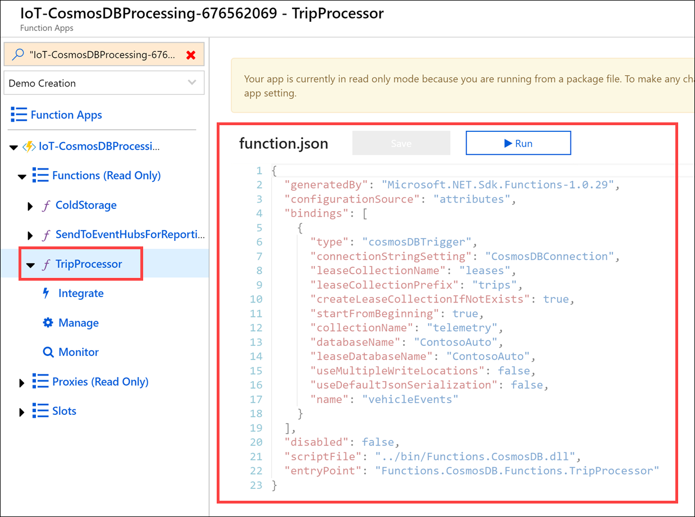

3. **function.json** ファイルを右側に表示します。このファイルは、Visual Studio で Function App を公開したときに生成されました。バインディングは、関数のプロジェクト コードで見たのと同じです。Function App の新しいインスタンスが作成されると、生成された `function.json` ファイルとコンパイル済みアプリケーションを含む ZIP ファイルがこれらのインスタンスにコピーされ、これらのインスタンスは並列に実行され、アーキテクチャを流れるデータフローとして負荷を共有します。`function.json` ファイルは、各インスタンスに属性を関数にバインドする方法、アプリケーション設定を検索する場所、およびコンパイルされたアプリケーション (`scriptFile` と `entryPoint`) に関する情報を指示します。

4. **HealthCheck** 関数を選択します。この関数には HTTP トリガーがあり、ユーザーは Function App が起動して実行中であり、各構成設定が存在し、値を持っていることを確認できます。データ ジェネレーターは、実行する前にこの関数を呼び出します。

5. **Get function URL** を選択します。

    

6. **URL をコピーして**、後の演習用に Notepad か同等のテキストエディタに保存します。

    

### Task 9: View stream processing Function App in the portal and copy the Health Check URL

1. Azure portal (<https://portal.azure.com>) で、名前が **IoT-StreamProcessing** で始まる Azure Functions アプリケーションを開きます。

2. 左側のメニューから **Functions** リストを開き、**HealthCheck** 関数を選択します。次に、**Get function URL** を選択します。

    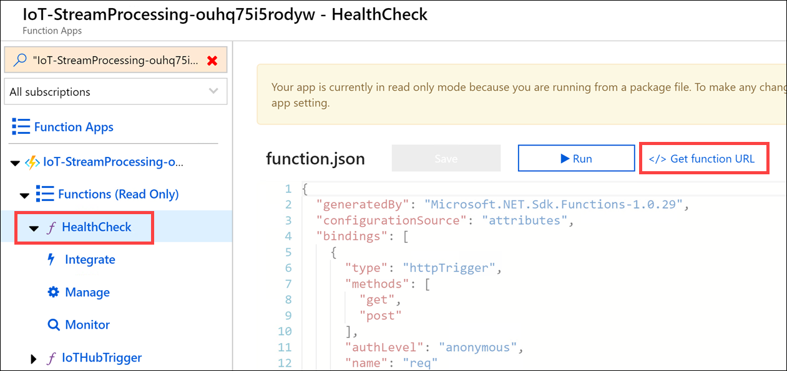

3. **URL をコピーして**、続く演習用に Notepad か同等のテキストエディタに保存します。

    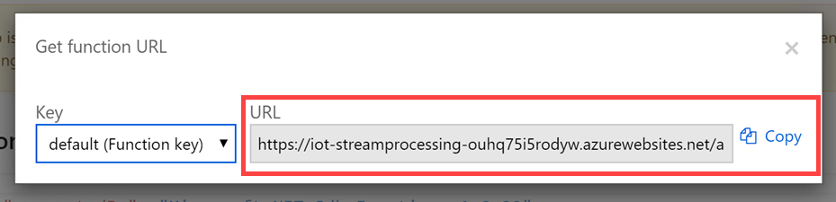

> **ヒント**: ヘルスチェック URL を Web ブラウザに貼り付け、いつでも状態を確認できます。データ ジェネレーターは、実行するたびにこれらの URL にプログラムでアクセスし、Function App が失敗した状態にあるか、重要なアプリケーション設定が欠落しているかどうかを報告します。

## Exercise 4: Explore and execute data generator

**Duration**: 10 minutes

この演習では、データ ジェネレーター プロジェクト **FleetDataGenerator** を探索し、アプリケーション構成を更新し、メタデータ データベースをデータでシードし、単一の車両をシミュレートするために実行します。

環境の状態に応じて、データ ジェネレーターが実行するタスクがいくつかあります。最初のタスクは、これらの要素が Cosmos DB アカウントに存在しない場合、ジェネレーターがこの演習に最適な構成の Cosmos DB データベースとコンテナーを作成することです。しばらくすると、演習の開始時にジェネレーターを既に作成しているため、この手順はスキップされます。ジェネレーターが実行する 2 番目のタスクは、データが存在しない場合に Cosmos DB のメタデータ コンテナーをデータでシードすることです。これには、車両、委託、小包、およびトリップデータが含まれます。データを使用してコンテナーをシードする前に、ジェネレーターは、最適なデータ取り込み速度のために、コンテナーに対して要求された RU/s を一時的に 50,000 に増やします。シード処理が完了すると、RU/s は 15,000 にスケールダウンされます。

ジェネレーターはメタデータの存在を確認した後、指定された数の車両のシミュレートを開始します。それぞれ、1、10、50、100、または構成設定で指定された車両数をシミュレートして、1 から 5 の間の番号を入力するように求められます。シミュレートされた車両ごとに、次のタスクが実行されます。

1. IoT デバイスは、IoT Hub 接続文字列を使用して車両に登録され、デバイス ID を車両の VIN に設定します。これにより、生成されたデバイス キーが返されます。
2. 新しいシミュレートされた車両インスタンス(`SimulatedVehicle`)がシミュレートされた車両のコレクションに追加され、それぞれが AMQP デバイスとして機能し、委託の荷物の配送をシミュレートするトリップ レコードが割り当てられます。これらの車両は、冷凍ユニットが故障するようにランダムに選択され、そのうちのいくつかは、他の車両が徐々に失敗しながら、ランダムにすぐに失敗します。
3. シミュレートされた車両は、独自の AMQP デバイス インスタンスを作成し、独自のデバイス ID (VIN) と生成されたデバイス キーを使用して IoT Hub に接続します。
4. シミュレートされた車両は、トリップレコードによって確立されたマイル数に達するか、キャンセルトークンを受け取ることによってトリップを完了するまで、IoT Hub への接続を介して車両テレメトリ情報を継続的に送信します。

### Task 1: Open the data generator project

1. Visual Studio ソリューションが開いていなければ、`C:\cosmos-db-scenario-based-labs-master\IoT\Starter` に移動し、Visual Studio ソリューションファイルを開きます: **CosmosDbIoTScenario.sln**

2. **FleetDataGenerator** プロジェクトを開き、Solution Expolorer で **Program.cs** を開きます。

    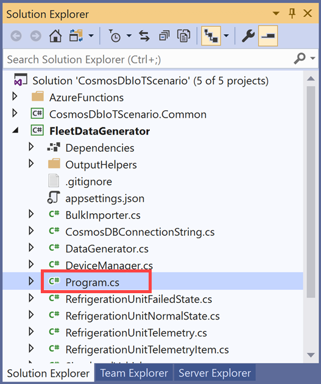

### Task 2: Code walk-through

データ ジェネレーター プロジェクトには多くのコードがあるので、ハイライトについて触れます。私たちがカバーしていないコードはコメントされており、あなたがそう望むなら追うのは簡単なはずです。

1. **Program.cs** の **Main** メソッド内で、データ ジェネレーターの中心であるワークフローは以下のコードブロックによって実行されます:

    ```csharp
    // Instantiate Cosmos DB client and start sending messages:
    using (_cosmosDbClient = new CosmosClient(cosmosDbConnectionString.ServiceEndpoint.OriginalString,
        cosmosDbConnectionString.AuthKey, connectionPolicy))
    {
        await InitializeCosmosDb();

        // Find and output the container details, including # of RU/s.
        var container = _database.GetContainer(MetadataContainerName);

        var offer = await container.ReadThroughputAsync(cancellationToken);

        if (offer != null)
        {
            var currentCollectionThroughput = offer ?? 0;
            WriteLineInColor(
                $"Found collection `{MetadataContainerName}` with {currentCollectionThroughput} RU/s.",
                ConsoleColor.Green);
        }

        // Initially seed the Cosmos DB database with metadata if empty.
        await SeedDatabase(cosmosDbConnectionString, cancellationToken);
        trips = await GetTripsFromDatabase(numberSimulatedTrucks, container);
    }

    try
    {
        // Start sending telemetry from simulated vehicles to Event Hubs:
        _runningVehicleTasks = await SetupVehicleTelemetryRunTasks(numberSimulatedTrucks,
            trips, arguments.IoTHubConnectionString);
        var tasks = _runningVehicleTasks.Select(t => t.Value).ToList();
        while (tasks.Count > 0)
        {
            try
            {
                Task.WhenAll(tasks).Wait(cancellationToken);
            }
            catch (TaskCanceledException)
            {
                //expected
            }

            tasks = _runningVehicleTasks.Where(t => !t.Value.IsCompleted).Select(t => t.Value).ToList();

        }
    }
    catch (OperationCanceledException)
    {
        Console.WriteLine("The vehicle telemetry operation was canceled.");
        // No need to throw, as this was expected.
    }
    ```

    コードの上部セクションでは、`appsettings.json` または環境変数で定義されている接続文字列を使用して、新しい `CosmosClient` をインスタンス化します。ブロック内の最初の呼び出しは `InitializeCosmosDb()` です。この方法については後で説明しますが、Cosmos DB アカウントに存在しない場合は、Cosmos DB データベースとコンテナーを作成する必要があります。次に、.NET Cosmos DB SDK の v3 バージョンが、CRUD やメンテナンス情報などのコンテナーに対する操作に使用する新しい `Container` インスタンスを作成します。たとえば、コンテナーで `ReadThroughputAsync` を呼び出して現在のスループット (RU/s) を取得し、シミュレートしている車両の数に基づいて、コンテナーからトリップ ドキュメントを読み取るために `GetTripsFromDatabase` に渡します。このメソッドでは、データが現在存在するかどうかをチェックする `SeedDatabase` メソッドを呼び出し、そうでない場合は `DataGenerator` クラス (`DataGenerator.cs` ファイル) のメソッドを呼び出して、車両、委託、小包、およびトリップを生成し、`BulkImporter` クラス (`BulkImporter.cs` ファイル) を使用して一括使用します。この `SeedDatabase` メソッドは、一括インポートの前にスループット (RU/s) を 50,000 に調整し、データ シードが完了した後に 15,000 に戻す `Container` インスタンスで次を実行します: `await container.ReplaceThroughputAsync(desiredThroughput);`

    `try/catch` ブロックは `SetupVehicleTelemetryRunTasks` を呼び出し、シミュレートされた車両ごとに IoT デバイスインスタンスを登録し、作成した各 `SimulateVehicle` インスタンスからタスクをロードします。`Task.WhenAll` を使用して、保留中のすべてのタスク(シミュレートされた車両トリップ)が完了していることを確認し、完了したタスクを `_runningvehiclevehicleTasks` リストから削除します。取り消しトークンは、コンソールでキャンセル コマンド (`Ctrl+C` または `Ctrl キー+Break`) を発行した場合に、実行中のすべてのタスクを取り消すために使用されます。

2. `InitializeCosmosDb()` メソッドが見つかるまで `Program.cs` ファイルを下にスクロールします。ここで以下のコードを参照します:

    ```csharp
    private static async Task InitializeCosmosDb()
    {
        _database = await _cosmosDbClient.CreateDatabaseIfNotExistsAsync(DatabaseName);

        #region Telemetry container
        // Define a new container.
        var telemetryContainerDefinition =
            new ContainerProperties(id: TelemetryContainerName, partitionKeyPath: $"/{PartitionKey}")
            {
                IndexingPolicy = { IndexingMode = IndexingMode.Consistent }
            };

        // Tune the indexing policy for write-heavy workloads by only including regularly queried paths.
        // Be careful when using an opt-in policy as we are below. Excluding all and only including certain paths removes
        // Cosmos DB's ability to proactively add new properties to the index.
        telemetryContainerDefinition.IndexingPolicy.ExcludedPaths.Clear();
        telemetryContainerDefinition.IndexingPolicy.ExcludedPaths.Add(new ExcludedPath { Path = "/*" }); // Exclude all paths.
        telemetryContainerDefinition.IndexingPolicy.IncludedPaths.Clear();
        telemetryContainerDefinition.IndexingPolicy.IncludedPaths.Add(new IncludedPath { Path = "/vin/?" });
        telemetryContainerDefinition.IndexingPolicy.IncludedPaths.Add(new IncludedPath { Path = "/state/?" });
        telemetryContainerDefinition.IndexingPolicy.IncludedPaths.Add(new IncludedPath { Path = "/partitionKey/?" });

        // Create the container with a throughput of 15000 RU/s.
        await _database.CreateContainerIfNotExistsAsync(telemetryContainerDefinition, throughput: 15000);
        #endregion

        #region Metadata container
        // Define a new container (collection).
        var metadataContainerDefinition =
            new ContainerProperties(id: MetadataContainerName, partitionKeyPath: $"/{PartitionKey}")
            {
                // Set the indexing policy to consistent and use the default settings because we expect read-heavy workloads in this container (includes all paths (/*) with all range indexes).
                // Indexing all paths when you have write-heavy workloads may impact performance and cost more RU/s than desired.
                IndexingPolicy = { IndexingMode = IndexingMode.Consistent }
            };

        // Set initial performance to 50,000 RU/s for bulk import performance.
        await _database.CreateContainerIfNotExistsAsync(metadataContainerDefinition, throughput: 50000);
        #endregion

        #region Maintenance container
        // Define a new container (collection).
        var maintenanceContainerDefinition =
            new ContainerProperties(id: MaintenanceContainerName, partitionKeyPath: $"/vin")
            {
                IndexingPolicy = { IndexingMode = IndexingMode.Consistent }
            };

        // Set initial performance to 400 RU/s due to light workloads.
        await _database.CreateContainerIfNotExistsAsync(maintenanceContainerDefinition, throughput: 400);
        #endregion
    }
    ```

    このメソッドは、まだ存在しない場合は Cosmos DB データベースを作成し、それ以外の場合は、そのデータベースへの参照を取得します (`await _cosmosDbClient.CreateDatabaseIfNotExistAsync(DatabaseName);`)。次に、`telemetry`、`metadata`、および `maintenance` コンテナーの `ContainerProperty` を作成します。`ContainerProperties` オブジェクトでは、コンテナーのインデックス作成ポリシーを指定できます。コンテナーの読み出し負荷の高いワークロードであり、より大きな数のパスによる恩恵があるので `metadata` と `maintenance` にはデフォルトのインデックスポリシーが使用されますが、`telemetry` のインデックスポリシーでは全てのパスが除外され、クエリーするのに必要なだけのパスが追加されます。これはコンテナーの書き込み負荷が高いワークロードだからです。`telemetry` コンテナーには 15,000 RU/s が割り当てられ、`metadata` には 50,000 RU/s が最初の一括インポート用に割り当てられた後 15,000 にスケールダウンされ、`maintenance` は 400 にスケールダウンされます。

### Task 3: Update application configuration

データ ジェネレーターを正常に実行する前に、2 つの接続文字列が必要です; IoT Hub 接続文字列と Cosmos DB 接続文字列。IoT Hub 接続文字列は、IoT Hub で **Shared access policies** を選択し、**iothubowner** ポリシーを選択し、**Connection string--primary key** 値をコピーすることで見つけることができます。これは、前にコピーした Event Hub 互換のエンドポイント接続文字列とは異なります。


1. **FleetDataGenerator** プロジェクトの **appsettings.json** を開きます。

2. **IOT_HUB_CONNECTION_STRING** キーの次に、引用符で囲まれた IoT Hub 接続文字列をペーストします。**COSMOS_DB_CONNECTION_STRING** キーの次に、引用符で囲まれた CosmosDB 接続文字列をペーストします。

3. データ ジェネレーターには、両方の Function App にある `HealthCheck` 関数の前の演習でコピーしたヘルスチェック URL も必要です。**COSMOS_PROCESSING_FUNCTION_HEALTHCHECK_URL** キーの次に、引用符で囲まれた CosmosDB 処理 Function App の `HealthCheck` 関数の URL をペーストします。**STREAM_PROCESSING_FUNCTION_HEALTHCHECK_URL** キーの次に、引用符で囲まれたストリーム処理 Function App の `HealthCheck` 関数の URL をペーストします。

    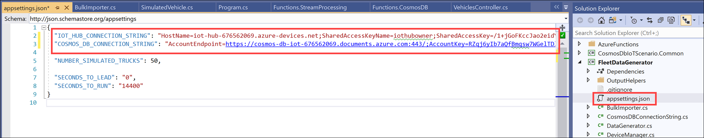

    NUMBER_SIMULATED_TRUCKS 値は、ジェネレーターの実行時にオプション 5 を選択するときに使用されます。これにより、一度に 1 ~ 1,000 台のトラックを柔軟にシミュレートできました。SECONDS_TO_LEAD は、ジェネレーターがシミュレートされたデータの生成を開始するまで待機する秒数を指定します。デフォルト値は 0 です。SECONDS_TO_RUN は、シミュレートされたトラックに生成されたデータの送信を強制的に停止します。デフォルト値は 14400 です。それ以外の場合、ジェネレーターは、すべてのトリップが完了したときにタスクの送信を停止するか、コンソール ウィンドウに `Ctrl+C` または `Ctrl +Break` と入力してキャンセルします。

3. **appsettings.json** ファイルを **Save** します。

> 別の方法として、これらの設定をマシン上の環境変数として保存するか、FleetDataGenerator プロパティを使用して保存することもできます。これを行うと、誤ってソース管理にシークレットを保存するリスクが取り除かされます。

### Task 4: Run generator

このタスクでは、ジェネレーターを実行し、50 台のトラックのイベントを生成します。非常に多くの車両のイベントを生成する理由は、2 つあります:

   - 次の演習で、Application Insights で関数トリガーとイベントアクティビティを観察します。
   - 後段の演習で、バッチ処理の予測を実行する前に、トリップを完了させておく必要があります。

> **警告**: ジェネレーターが車両テレメトリの送信を開始すると、大量の電子メールが送信されます。メールを受信したくない場合は、作成した Logic App を無効にします。

1. Visual Studio の Solution Explorer で **FleetDataGenerator** プロジェクトを右クリックし、**Set as Startup Project** を選択します。デバッグを実行するたびにデータジェネレーターが自動的に実行されるようになります。

    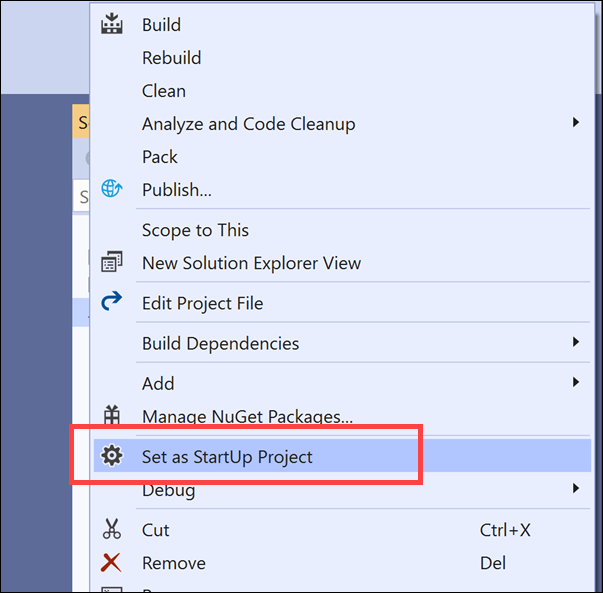

2. Visual Studio のウインドウの最上部にあるデバッグ ボタンを選択するか、**F5** を押してデータジェネレーターを実行します。

    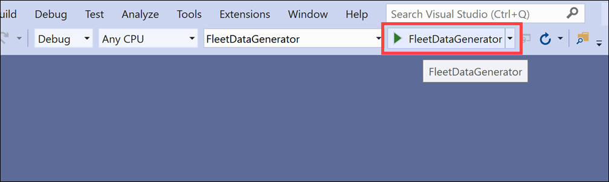

3. コンソールウィンドウが表示されたら、**3** と入力して 50 台の車両をシミュレートします。ジェネレーターは、Function App の正常性チェックを実行し、`metadata` コンテナーの要求されたスループットのサイズを変更し、バルク インポーターを使用してコンテナーをシードし、スループットのサイズを 15,000 RU/s に戻します。

    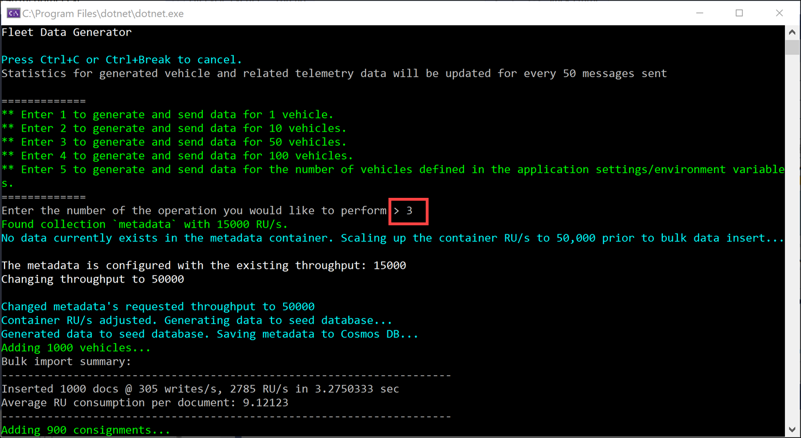

4. シードが完了すると、ジェネレーターはデータベースから 50 回のトリップを取得し、最初に最短の移動距離で並べ替えられ、完了したトリップ データがより速く表示されるようにします。VIN、メッセージ数、およびトリップの残りのマイル数を持つ車両ごとに、送信された 50 イベントごとにメッセージ出力が表示されます。例: `Vehicle 19: C1OVHZ8ILU8TGGPD8 Message count: 3650 -- 3.22 miles remaining`。**ジェネレーターをバックグラウンドで実行し、次の演習**に進みます。

    

5. 車両がトリップを完了するにしたがい、`Vehicle 37 has completed its trip` のようなメッセージが表示されます。

    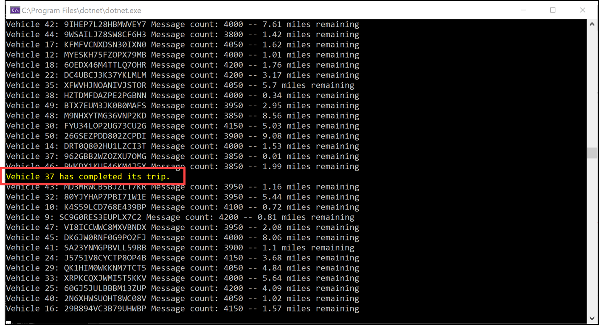

6. ジェネレーターが完了すると、この効果へのメッセージが表示されます。

    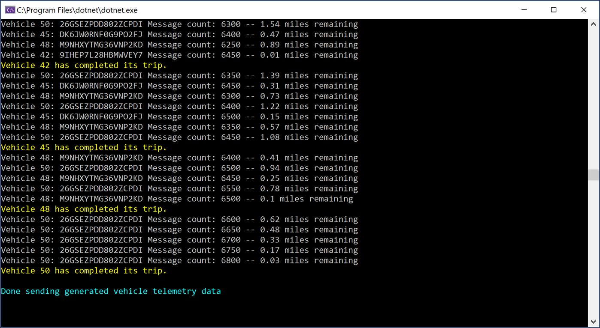

Function App のヘルスチェックが失敗した場合、データ ジェネレーターには警告が表示され、多くの場合、どのアプリケーション設定が欠落しているかを示します。データ ジェネレーターは、ヘルスチェックに合格するまで実行されません。アプリケーション設定のトラブルシューティングに関するヒントについては、上記の演習 3、タスク 2 を参照してください。

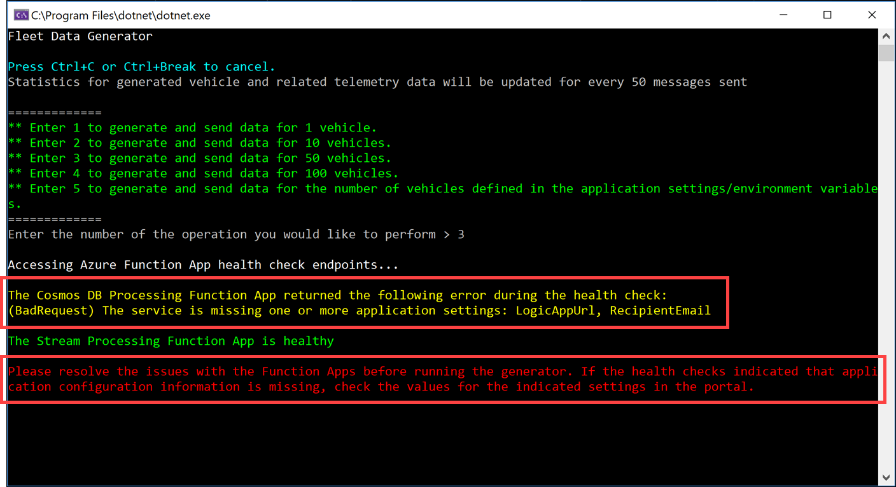

### Task 5: View devices in IoT Hub

データジェネレーターは、IoT Hub に各シミュレート車両をデバイスとして登録し、アクティブ化しました。このタスクでは、IoT Hub を開き、これらの登録済みデバイスを表示します。

1. Azure portal (<https://portal.azure.com>) で、**cosmos-db-iot** リソースグループにある IoT Hub のインスタンスを開きます。

    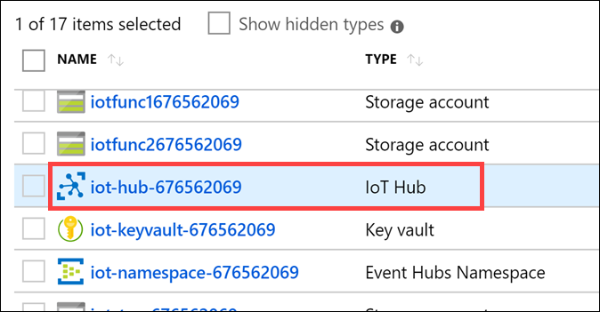

2. 左側のメニューから **IoT devices** を選択します。右側の IoT デバイスのペインに 50 台の IoT デバイスがすべて表示され、VIN がデバイス ID として指定されています。より多くの車両をシミュレートすると、ここに登録された追加の IoT デバイスが表示されます。

    

## Exercise 5: Observe Change Feed using Azure Functions and App Insights

**Duration**: 10 minutes

この演習では、Application Insights のライブ メトリック ストリーム機能を使用して、受信要求、送信要求、全体的な正常性、割り当てられたサーバー情報、およびサンプルテレメトリをほぼリアルタイムで表示します。これにより、関数が負荷の下でどのように拡張されるかを確認し、単一の対話型インターフェイスを通じて潜在的なボトルネックや問題のあるコンポーネントを特定できます。

### Task 1: Open App Insights Live Metrics Stream

1. Azure portal (<https://portal.azure.com>) で、**cosmos-db-iot** リソースグループにある Application Insights のインスタンスを開きます。

    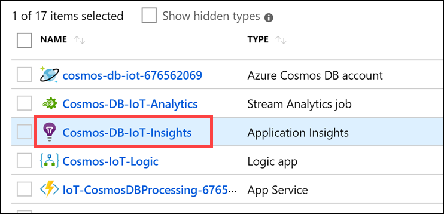

2. 左側のメニューから **Live Metrics Stream** を開きます。

    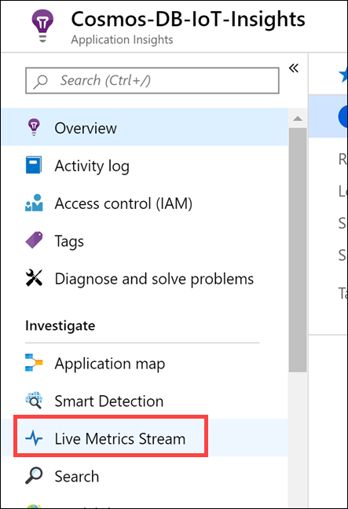

3. データがシステムを流れる際に、ライブメトリックストリーム内のメトリックを観察します。

    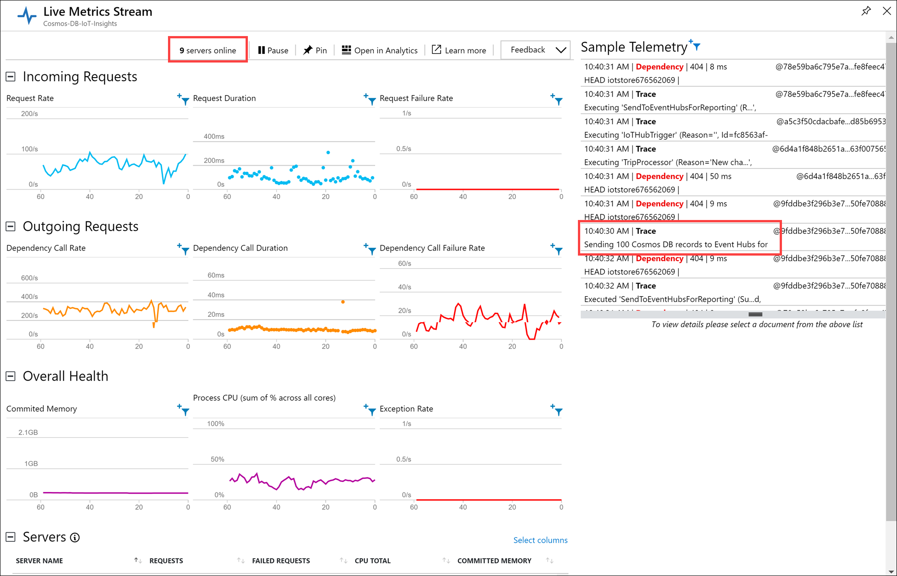

    ページの上部にサーバー数が表示されます。これは、Function App のインスタンス数を示し、1 台のサーバーが Web App に割り当てられます。Function App サーバー インスタンスが計算、メモリ、または要求期間のしきい値を超え、IoT Hub キューと Change Feed キューが増え、経過時間が伸びるにつれて、Function App をスケール アウトするために新しいインスタンスが自動的に割り当てられます。ページの下部にサーバー リストを表示できます。右側には、関数内のロガーに送信されるメッセージを含むサンプルテレメトリが表示されます。ここでは、Cosmos DB 処理関数が 100 件の Cosmos DB レコードを Event Hub に送信していることを示すメッセージを強調しました。

    多くの依存関係の呼び出しエラー (404) に気付くでしょう。これらは無視しても問題ありません。これらは、Cosmos DB 処理 Function App 内の **ColdStorage** 関数の Azure ストレージ バインディングによって引き起こされます。このバインディングは、指定されたコンテナーに書き込む前にファイルが存在するかどうかをチェックします。新しいファイルを書き込んでいるため、書き込み中のすべてのファイルに対して `404` メッセージが表示されます。現在、バインディング エンジンは、このような "良い" 404 メッセージと "悪い" メッセージの違いが判断出来ません。

## Exercise 6: Observe data using Cosmos DB Data Explorer and Web App

**Duration**: 10 minutes

### Task 1: View data in Cosmos DB Data Explorer

1. Azure portal (<https://portal.azure.com>) で、**cosmos-db-iot** リソースグループにある CosmosDB のインスタンスを開きます。

2. 左側のメニューから **Data Explorer** を選択します。

3. **ContosoAuto** データベースを開き、**metadata** を開きます。**Items** を選択して、コンテナーに保存されたドキュメントを表示します。そのうちのいずれかを開いて、データを表示します。

    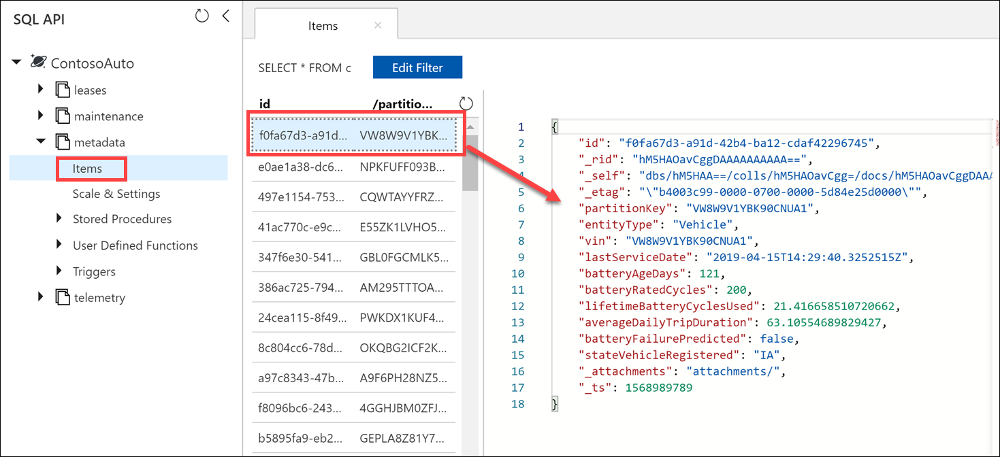

4. **metadata** コンテナー名の右にある省略記号 (...)を選択し、**New SQL Query** を選択します。

    

5. クエリーを以下で置換します:

    ```sql
    SELECT * FROM c WHERE c.entityType = 'Vehicle'
    ```

6. 最初の 100 台の車両の記録を表示するクエリーを実行します。

    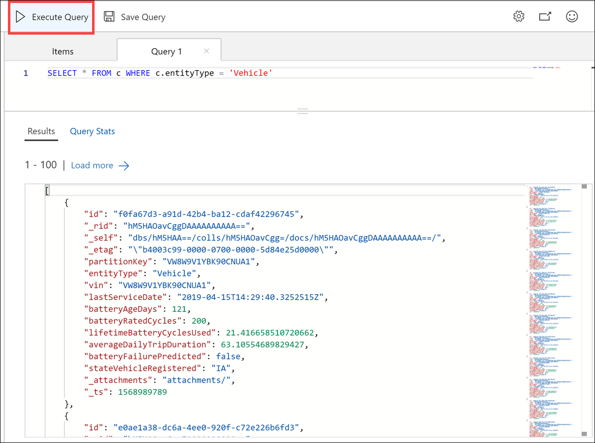

7. クエリーを更新して、トリップが完了した場所のトリップレコードを検索します。

    ```sql
    SELECT * FROM c WHERE c.entityType = 'Trip' AND c.status = 'Completed'
    ```

    

    まだ完了したトリップがない場合がありますのでご注意ください。代わりに `status` = **Active** の場所を照会してみてください。アクティブなトリップは、現在実行中のトリップです。

    完了したトリップ レコードの例を次に示します (簡潔にするためにいくつかの小包が削除されました):

    ```json
    {
        "partitionKey": "DK6JW0RNF0G9PO2FJ",
        "id": "eb96c44e-4c1d-4f54-bdea-e7d2f927009c",
        "entityType": "Trip",
        "vin": "DK6JW0RNF0G9PO2FJ",
        "consignmentId": "e1da2e74-bf37-4773-a5bf-483fc08533ac",
        "plannedTripDistance": 18.33,
        "location": "AR",
        "odometerBegin": 106841,
        "odometerEnd": 106859.36,
        "temperatureSetting": 19,
        "tripStarted": "2019-09-20T14:39:24.1855725Z",
        "tripEnded": "2019-09-20T14:54:53.7558481Z",
        "status": "Completed",
        "timestamp": "0001-01-01T00:00:00",
        "packages": [
            {
                "packageId": "a5651f48-67d5-4c1b-b7d9-80d678aabe9b",
                "storageTemperature": 30,
                "highValue": false
            },
            {
                "packageId": "b2185628-eb0e-49b9-8b7d-685fcdcb5a36",
                "storageTemperature": 22,
                "highValue": false
            },
            {
                "packageId": "25ac4bd1-5aad-4030-91f7-9539cc15b441",
                "storageTemperature": 31,
                "highValue": true
            }
        ],
        "consignment": {
            "consignmentId": "e1da2e74-bf37-4773-a5bf-483fc08533ac",
            "customer": "Fabrikam, Inc.",
            "deliveryDueDate": "2019-09-20T17:50:40.3291024Z"
        },
        "_rid": "hM5HAOavCggb5QAAAAAAAA==",
        "_self": "dbs/hM5HAA==/colls/hM5HAOavCgg=/docs/hM5HAOavCggb5QAAAAAAAA==/",
        "_etag": "\"2d0364cc-0000-0700-0000-5d84e83d0000\"",
        "_attachments": "attachments/",
        "_ts": 1568991293
    }
    ```

    小包および委託レコードの一部は、トリップクエリーやレポートでよく使用されるので、ここに含まれます。

### Task 2: Search and view data in Web App

1. デプロイされたフリート管理 Web App に移動します。以前に閉じた場合は、ポータルの Web App の概要ブレード (**IoTWebApp**) でデプロイ URL を確認できます。

    

2. **Vehicles** を選択します。これで動作中のページング機能が見られます。

    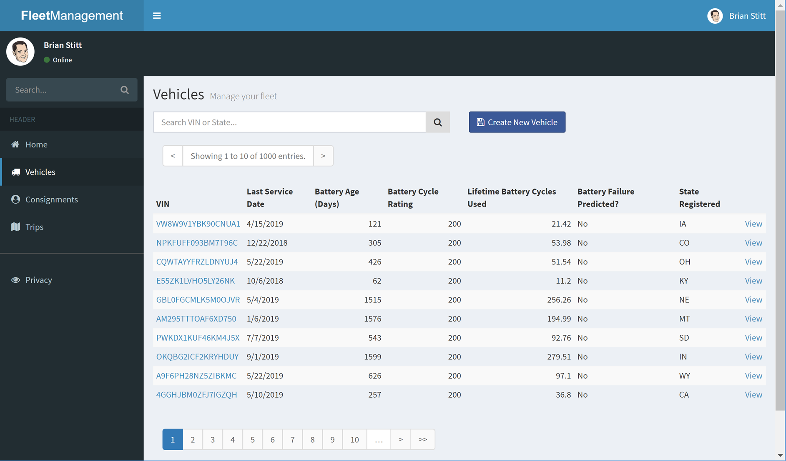

3. 詳細を表示するには、車両の 1 つを選択します。詳細ページの右側には、車両に割り当てられたトリップがあります。このビューには、関連付けられた委託レコードの顧客名、小包の集計情報、およびトリップの詳細が表示されます。

    

4. 車両リストに戻り、**MT** などの検索語句を入力します。これにより、登録された状態と、部分的な一致を含む VIN の両方が検索されます。州と VIN の両方を自由に検索できます。下のスクリーンショットでは、`MT` を検索し、モンタナ州の登録結果を受け取り、VIN に `MT` が含まれている記録がありました。

    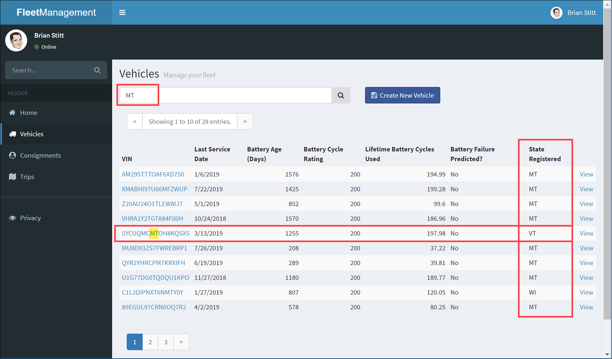

5. 左側のメニューで **Consignments** を選択し、検索ボックスに **alpine ski** を入力して実行します。`Alpine Ski House` の顧客のためのいくつかの委託が表示されます。委託 ID で検索することもできます。結果では、委託品の 1 つに Completed のステータスがあります。

    

6. 詳細を表示するには、委託を選択します。レコードには、顧客、出荷期日、ステータス、および小包の詳細が表示されます。小包統計には、小包の総数、必要な保管温度、最小の保管温度設定の小包、小包の合計立方フィートと小包の合計総重量、および小包の合計総重量を計算する集計が含まれています。小包のいずれも高い値と見なされます。

    

7. 左側のメニューで **トリップ** を選択します。ページ上部のフィルタを使用して、Pending、Active、Delayed、Completed などのステータスでトリップをフィルター処理します。納期より前にステータスが完了していない場合、トリップは遅れます。この時点では遅延は発生しない場合がありますが、後でデータ ジェネレーターを再実行すると遅延する場合があります。このページから車両または関連する委託レコードを表示できます。

    

## Exercise 7: Perform CRUD operations using the Web App

**Duration**: 10 minutes

この演習では、車両レコードに挿入、更新、削除を行います。

### Task 1: Create a new vehicle

1. Web App で **Vehicles** ページに移動し、**Create New Vehicle** を選択します。

    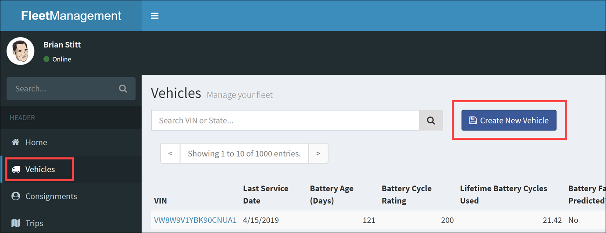

2. 車両の作成を完了するためにフォームに以下の VIN を入力します: **ISO4MF7SLBXYY9OZ3** 。フォームの入力が終わったら、**Create** を選択します。

    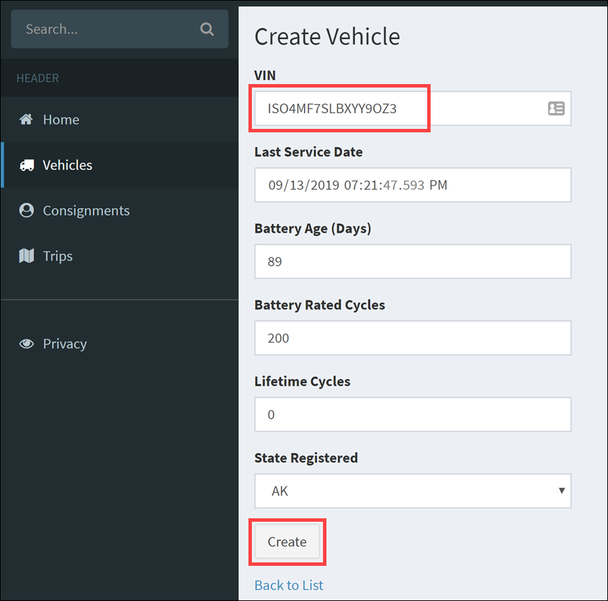

### Task 2: View and edit the vehicle

1. 新しい車両を検索するために、車両のページの検索ボックスに以下の VIN をペーストします: **ISO4MF7SLBXYY9OZ3**

    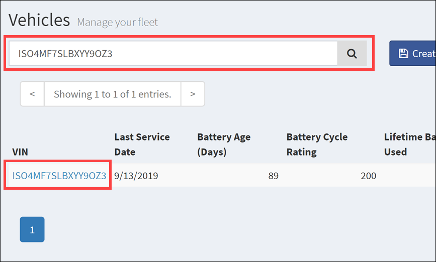

2. 検索結果から車両を選択します。車両の詳細ページで **Edit Vehicle** を選択します。

    

3. 登録された状態や他のフィールドを変更してレコードを更新し、**Update** を選択します。

    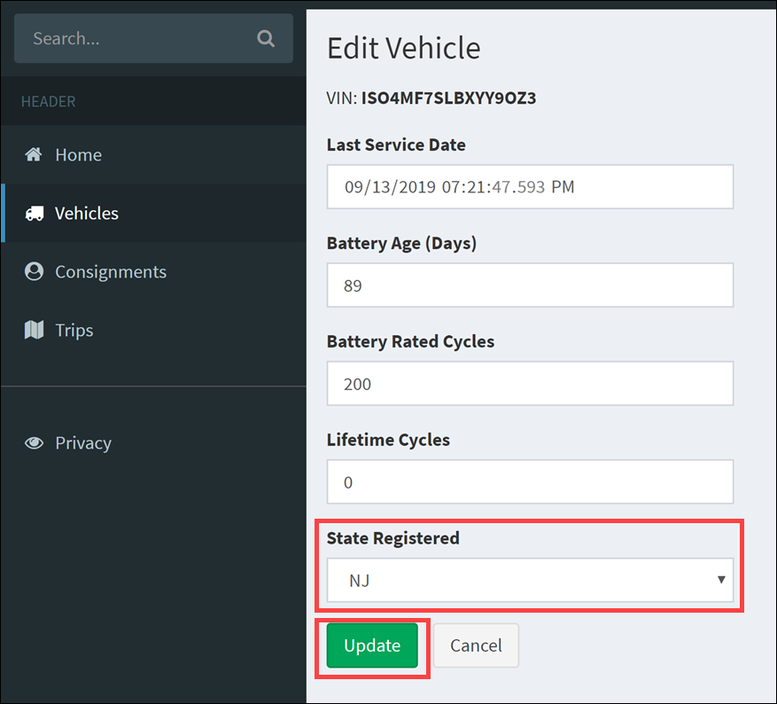

### Task 3: Delete the vehicle

1. 新しい車両を検索するために、車両のページの検索ボックスに以下の VIN をペーストします: **ISO4MF7SLBXYY9OZ3**。登録された状態や他のフィールドを変更が反映された状態が表示されるはずです。

    

2. 検索結果から車両を選択します。車両の詳細ページで **Delete** を選択します。

    

3. 車両の削除の確認ページで、**Delete** を選択します。

    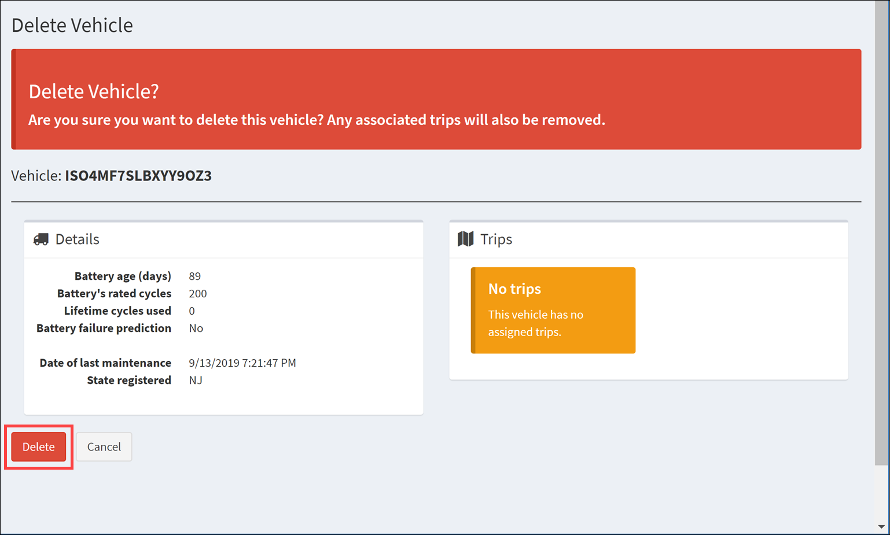

4. 新しい車両を検索するために、車両のページの検索ボックスに以下の VIN をペーストします: **ISO4MF7SLBXYY9OZ3**。車両は表示されないはずです。

    

## Exercise 8: Create the Fleet status real-time dashboard in Power BI

**Duration**: 15 minutes

### Task 1: Log in to Power BI online and create real-time dashboard

1. <https://powerbi.microsoft.com> を表示し、Stream Analytics で Power BI 出力を作成した時に使ったアカウントでサインインします。

2. **My workspace** を選択し、**Datasets** タブを選択します。**Contoso Auto IoT Events** データセットが表示されるはずです。これは、Stream Analytics の Power BI 出力で定義したものです。

    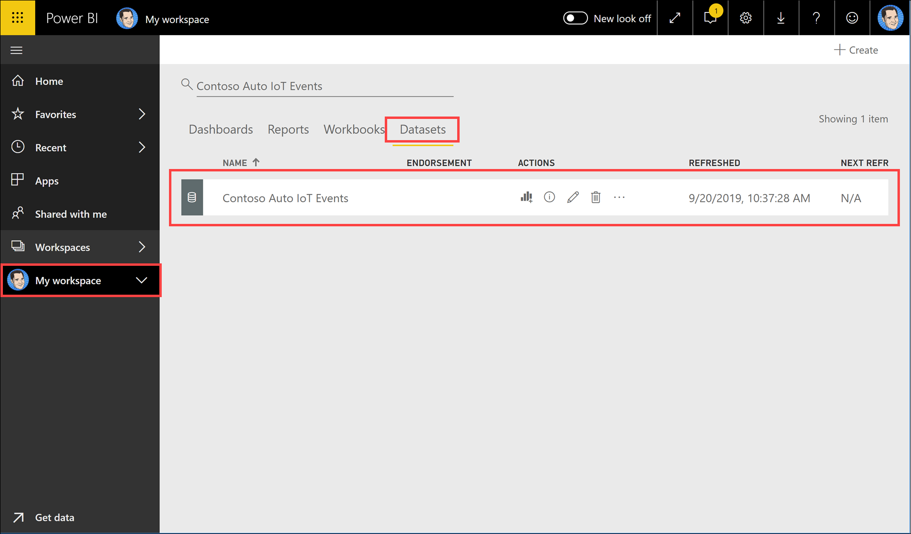

3. ページの最上部で **+ Create** を選択し、**Dashboard** を選択します。

    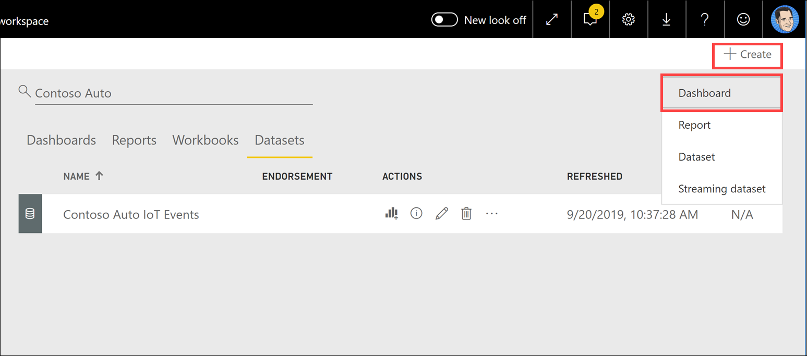

4. `Contoso Auto IoT Live Dashboard` のようなダッシュボードの名前を入力し、**Create** を選択します。

    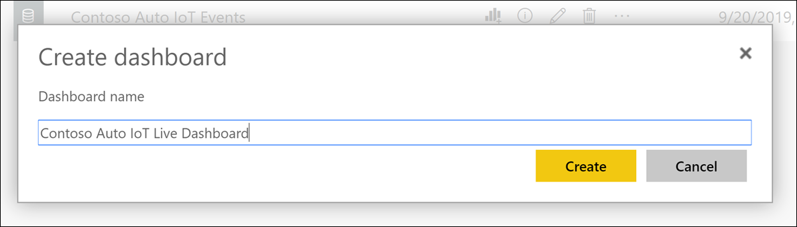

5. 新しいダッシュボードの上部で、**+ Add tile** を選択し、ダイアログで **Custom Streaming Data** を選択した後、**Next** を選択します。

    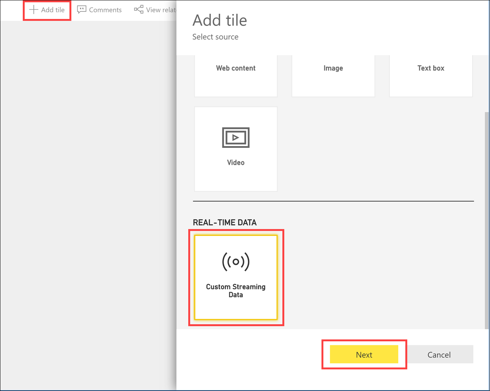

6. **Contoso Auto IoT Events** データセットを選択し、**Next** を選択します。

    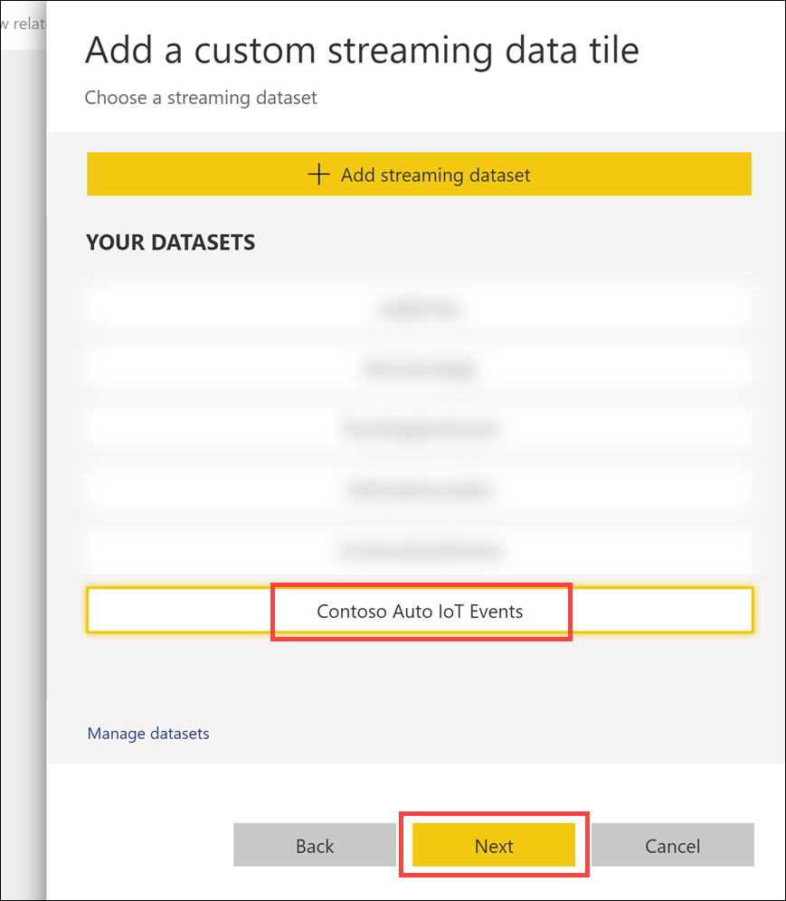

7. **Card** ビジュアル化タイプを選択します。フィールドの下で **+ Add value** を選択後、ドロップダウンから**oilAnomaly** を選択します。**Next** を選択します。

    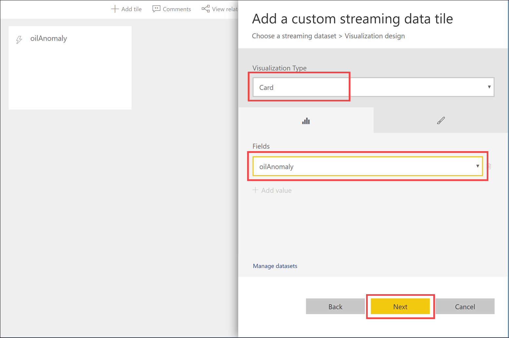

8. タイルの詳細フォームは規定値のままにして、**Apply** を選択します。

    

9. 新しいダッシュボードの上部で、**+ Add tile** を選択し、ダイアログで **Custom Streaming Data** を選択した後、**Next** を選択します。

    

10. **Contoso Auto IoT Events** データセットを選択し、**Next** を選択します。

    

11. **Card** ビジュアル化タイプを選択します。フィールドの下で **+ Add value** を選択後、ドロップダウンから**engineTempAnomaly** を選択します。**Next** を選択します。

    

12. タイルの詳細フォームは規定値のままにして、**Apply** を選択します。

    

13. 新しいダッシュボードの上部で、**+ Add tile** を選択し、ダイアログで **Custom Streaming Data** を選択した後、**Next** を選択します。

    

14. **Contoso Auto IoT Events** データセットを選択し、**Next** を選択します。

    

15. **Card** ビジュアル化タイプを選択します。フィールドの下で **+ Add value** を選択後、ドロップダウンから**aggressiveDriving** を選択します。**Next** を選択します。

    

16. タイルの詳細フォームは規定値のままにして、**Apply** を選択します。

    

17. 新しいダッシュボードの上部で、**+ Add tile** を選択し、ダイアログで **Custom Streaming Data** を選択した後、**Next** を選択します。

    

18. **Contoso Auto IoT Events** データセットを選択し、**Next** を選択します。

    

19. **Card** ビジュアル化タイプを選択します。フィールドの下で **+ Add value** を選択後、ドロップダウンから**refrigerationTempAnomaly** を選択します。**Next** を選択します。

    

20. タイルの詳細フォームは規定値のままにして、**Apply** を選択します。

    

21. 新しいダッシュボードの上部で、**+ Add tile** を選択し、ダイアログで **Custom Streaming Data** を選択した後、**Next** を選択します。

    

22. **Contoso Auto IoT Events** データセットを選択し、**Next** を選択します。

    

23. **Card** ビジュアル化タイプを選択します。フィールドの下で **+ Add value** を選択後、ドロップダウンから**eventCount** を選択します。**Next** を選択します。

    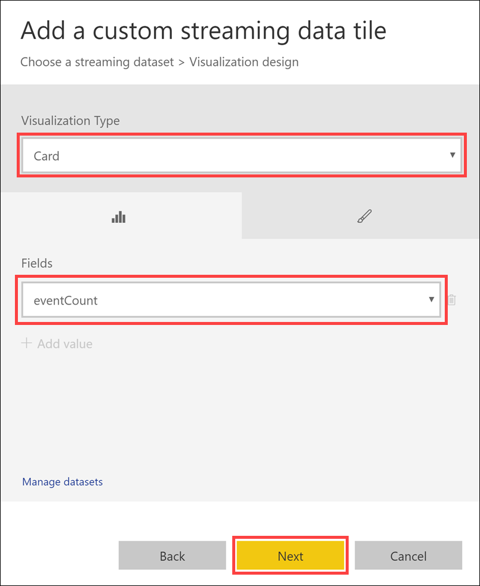

24. タイルの詳細フォームは規定値のままにして、**Apply** を選択します。

    

25. 新しいダッシュボードの上部で、**+ Add tile** を選択し、ダイアログで **Custom Streaming Data** を選択した後、**Next** を選択します。

    

26. **Contoso Auto IoT Events** データセットを選択し、**Next** を選択します。

    

27. **Line chart** ビジュアル化タイプを選択します。Axis の下で **+ Add value** を選択後、ドロップダウンから**snapshot** を選択します。Values の下で **+ Add value** を選択後、**engineTemperature** を選択します。Time window to display は 1 分のままにします。**Next** を選択します。

    

28. タイルの詳細フォームは規定値のままにして、**Apply** を選択します。

    

29. 新しいダッシュボードの上部で、**+ Add tile** を選択し、ダイアログで **Custom Streaming Data** を選択した後、**Next** を選択します。

    

30. **Contoso Auto IoT Events** データセットを選択し、**Next** を選択します。

    

31. **Line chart** ビジュアル化タイプを選択します。Axis の下で **+ Add value** を選択後、ドロップダウンから**snapshot** を選択します。Values の下で **+ Add value** を選択後、**refrigerationUnitTemp** を選択します。Time window to display は 1 分のままにします。**Next** を選択します。

    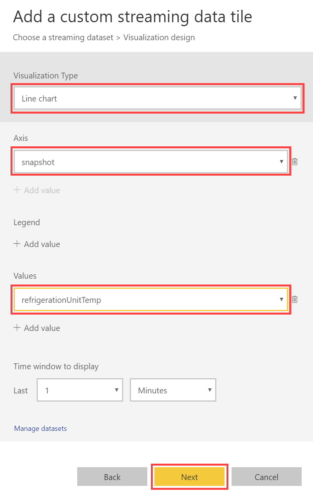

32. タイルの詳細フォームは規定値のままにして、**Apply** を選択します。

    

33. 新しいダッシュボードの上部で、**+ Add tile** を選択し、ダイアログで **Custom Streaming Data** を選択した後、**Next** を選択します。

    

34. **Contoso Auto IoT Events** データセットを選択し、**Next** を選択します。

    

35. **Line chart** ビジュアル化タイプを選択します。Axis の下で **+ Add value** を選択後、ドロップダウンから**snapshot** を選択します。Values の下で **+ Add value** を選択後、**speed** を選択します。Time window to display は 1 分のままにします。**Next** を選択します。

    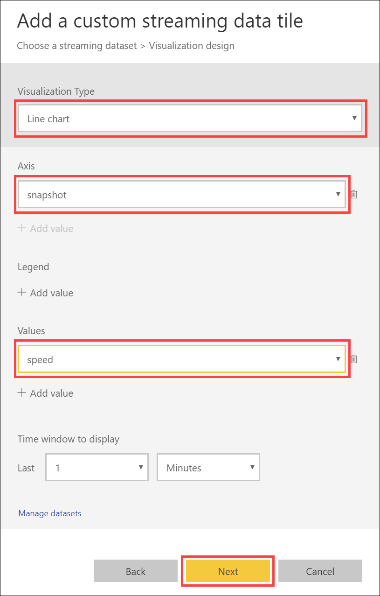

36. タイルの詳細フォームは規定値のままにして、**Apply** を選択します。

    

37. 完了したら、タイルを以下のように置き直します:

    

38. データ ジェネレーターがイベントの送信を完了すると、ダッシュボード上のタイルが空であることがわかります。その場合は、データジェネレーターをもう一度起動し、今回は 1 台の車両に対して **option 1** を選択します。これを行う場合、冷凍温度異常が必ず発生し、冷凍ユニットの温度が華氏22.5度の警報閾値を徐々に上回ることがわかります。または、より多くの車両をシミュレートし、高いイベント数を観察することもできます。

    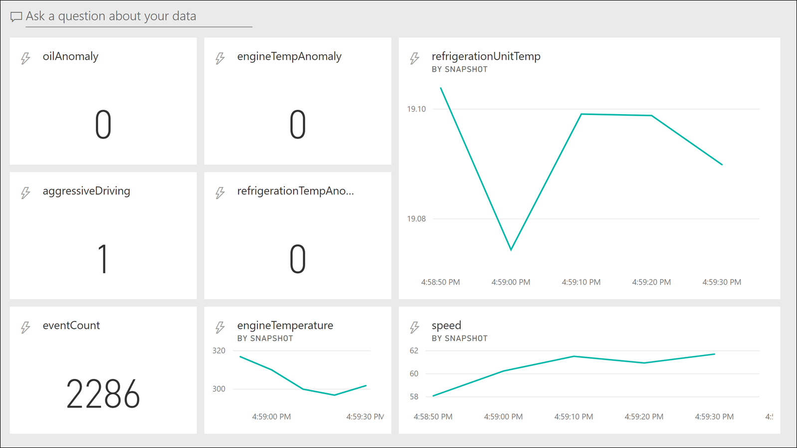

    ジェネレーターが車両テレメトリの送信を開始すると、ダッシュボードは数秒後に動作を開始します。このスクリーンショットでは、過去 10 秒間に 2,486 件のイベントを含む 50 台の車両をシミュレートしています。ジェネレーターを実行しているコンピュータの速度、ネットワークの速度と待機時間、およびその他の要因によっては、`eventCount` の値が高くなったり低くなったりすることがあります。

## Exercise 9: Run the predictive maintenance batch scoring

**Duration**: 20 minutes

この演習では、Databricks ノートブックを Azure Databricks ワークスペースにインポートします。ノートブックは対話型で、任意の Web ブラウザで実行され、マークアップ (書式設定されたテキストと命令)、実行可能なコード、およびコードの実行による出力が混在します。

次に、バッチ スコアリング ノートブックを実行して、Cosmos DB に格納されている車両とトリップ データを使用して、車両のバッテリー故障予測を行います。

### Task 1: Import lab notebooks into Azure Databricks

このタスクでは、Databricks ノートブックをワークスペースにインポートします。

1. [Azure portal](https://portal.azure.com) で、演習のリソースグループを開き、**Azure Databricks Service** を開きます。名前は `iot-databricks` で始まるはずです。

   

2. **Launch Workspace** を選択します。Azure Databricks は Azure Active Directory が統合されているので自動的にサインインします。

   

3. **Workspace** を選択し **Users** を選択し、正しいユーザ名をドロップダウンから選択後、**Import** を選択します。

   

4. **Import from** の隣にある **URL** を選択し、テキストボックスに以下をペーストします: `https://github.com/AzureCosmosDB/scenario-based-labs/blob/master/IoT/Notebooks/01%20IoT.dbc` 。その後、**Import** を選択します。

   

5. インポート後、ユーザ名を選択します。`01 IoT` という名前の新しいフォルダが表示され、2つのノートブックが含まれています。

   

### Task 2: Run batch scoring notebook

このタスクでは、事前にトレーニングされた機械学習 (ML) モデルを使用して、次の 30 日以内に複数の車両でバッテリーを交換する必要があるかどうかを判断する `Batch Scoring` ノートブックを実行します。ノートブックは、次のアクションを実行します。

1. 必要な Python ライブラリをインストールします。
2. Azure Machine Learning service (Azure ML) に接続します。
3. 事前にトレーニングされた ML モデルをダウンロードし、Azure ML に保存後、バッチ スコアリングにそのモデルを利用します。
4. Cosmos DB Spark コネクタを使用して、完了したトリップと車両のメタデータを `metadata` Cosmos DB コンテナーから取得し、SQL クエリーを使用してデータを準備し、データを一時ビューとして表示します。
5. 事前にトレーニングされたモデルを使って、データに対する予測を適用します。
6. レポートのために、Cosmos DB の `maintenance` コンテナーに予測結果を保存します。

このノートブックを実行するには、以下の手順を実行します:

1. Azure Databricks で **Workspace** を選択し、**Users** を選択後、ユーザ名を選択します。

2. `01 IoT` フォルダを選択し、**Batch Scoring** ノートブックを選択し開きます。

   

3. この演習のこのノートブックまたはその他のノートブックでセルを実行する前に、まず Databricks クラスターをアタッチする必要があります。**Detached** が表示されるノートブックの上部にあるドロップダウンを展開します。lab クラスターを選択してノートブックにアタッチします。現在実行中でない場合は、クラスターを開始するオプションが表示されます。

   

4. キーボード ショートカットを使用して、**Ctrl+Enter** で単一のセルを実行したり、**Shift+ Enter** を使用してセルを実行して次のセルに移動したりできます。

どちらのノートブックでも、Machine Learning サービスワークスペースの値を提供する必要があります。これらの値は、演習のリソース グループにある Machine Learning サービス ワークスペースの概要ブレードに表示されます。

次のスクリーンショットで強調表示されている値は、ノートブック内の次の変数に対するものです。

1. `subscription_id`
2. `resource_group`
3. `workspace_name`
4. `workspace_region`


> このノートブックを「毎晩」のように定期的に実行する場合は、Azure Databricks のジョブ機能を使用してこれを実現できます。

## Exercise 10: Deploy the predictive maintenance web service

**Duration**: 20 minutes

バッチスコアリングに加えて、Contoso Auto は特定の車両のバッテリー故障をリアルタイムで予測したいと考えています。車両を見て、その車両のバッテリーが今後 30 日以内に故障するかどうかを予測する際に、フリート管理のウェブサイトからモデルを呼び出すことができるようにしたいと考えています。

前のタスクでは、事前にトレーニングされた ML モデルを使用して、バッチ プロセスでトリップ データを持つすべての車両のバッテリー障害を予測するノートブックを実行しました。しかし、同じモデルを使用して、この目的のために(データ サイエンス用語では "operationalization" と呼ばれます) を Web サービスに展開するにはどうすればよいでしょうか。

このタスクでは、Azure ML ワークスペースを使用して、事前トレーニング済みのモデルを Azure Container Instances (ACI) がホストする Web サービスにデプロイする `Model Deployment` ノートブックを実行します。Azure Kubernetes Service (AKS) で実行されている Web サービスにモデルをデプロイすることは可能ですが、10 ~ 20 分を節約できるため、代わりに ACI にデプロイしています。ただし、展開後は、Web サービスの呼び出しに使用されるプロセスは同じであり、展開を実行する手順のほとんどと同じです。

### Task 1: Run deployment notebook

このノートブックを実行するには、以下の手順を実行します:

1. Azure Databricks で **Workspace** を選択し、**Users** を選択後、ユーザ名を選択します。

2. `01 IoT` フォルダを選択し、**Model Deployment** ノートブックを選択し開きます。

   

3. Batch Scoring ノートブックと同様に、セルを実行する前に lab クラスターがアタッチされていることを確認してください。

4. **ノートブックの実行が完了したら**、ポータルで Azure Machine Learning service のワークスペースを開き、左側のメニューから **Models** を選択し、事前にトレーニングされたモデルを表示します。

   

5. 左側のメニューから **Deployments** を選択し、ノートブックを実行した時に作成された Azure Container Instances のデプロイを選択します。

    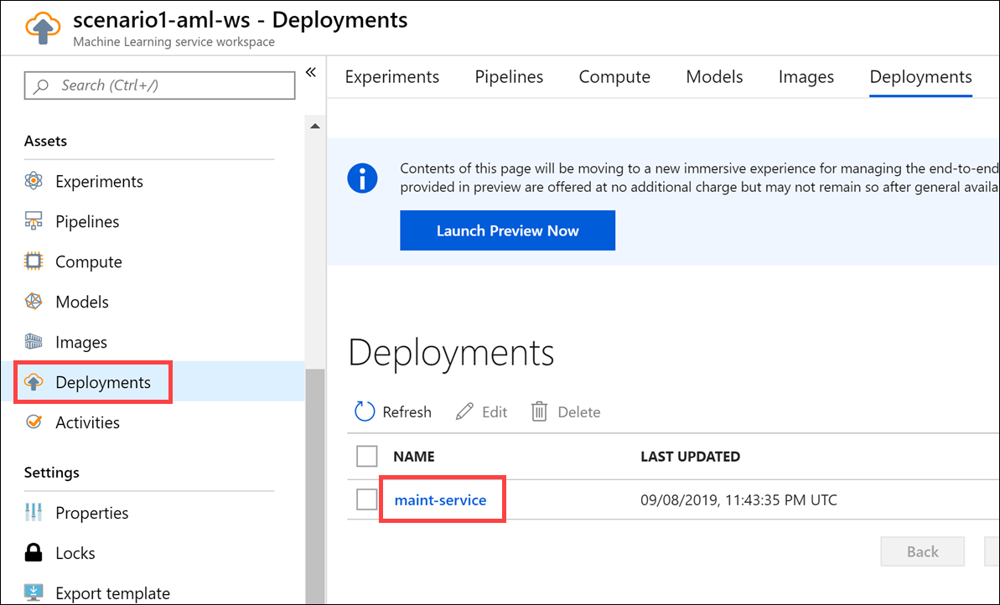

6. **Scoring URI** の値をコピーします。これはデプロイされた Web App が利用し、リアルタイムの予測をリクエストするのに使います。

    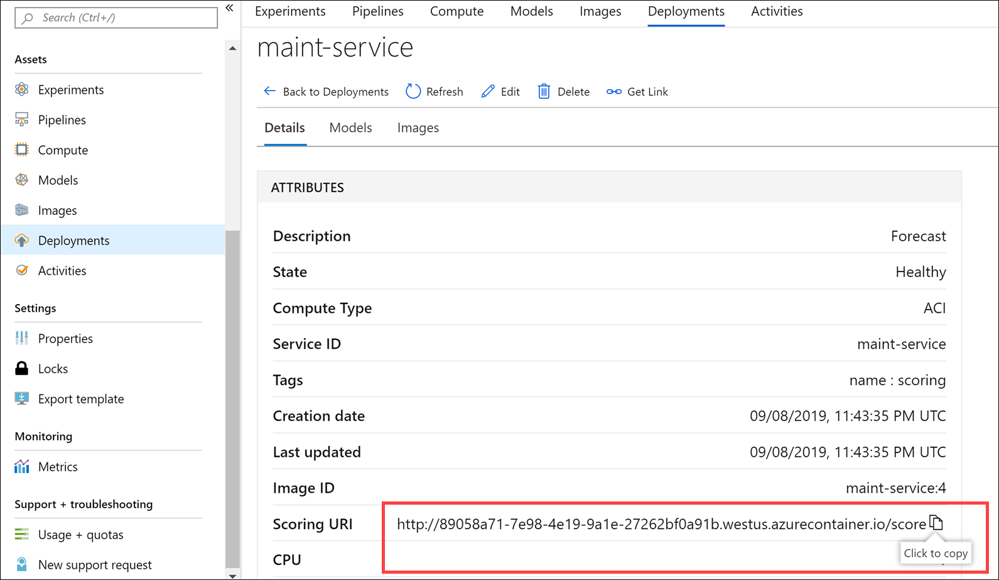

### Task 2: Call the deployed scoring web service from the Web App

Web サービスが ACI にデプロイされたので、フリート管理 Web App から予測を行うために Web サービスを呼び出すことができます。この機能を有効にするには、まずスコア付け URI を使用して Web App のアプリケーション構成設定を更新する必要があります。

1. 前のタスクで指示のあったら、デプロイされたサービスからスコア付け URI をコピーしたことを確認します。

2. 名前が **IoTWebApp** で始まる Web App (App Service) を開きます。

3. 左側のメニューから **Configuration** を選択します。

4. **Application settings** セクションをスクロールして、**+ New application setting** を選択します。

5. Add/Edit application setting フォームで、**Name** に `ScoringUrl` と入力し、コピーした Web サービス URI を貼り付けて **Value** フィールドに貼り付けます。設定を追加するには、**OK** を選択します。

    

6. **Save** を選択し、新しいアプリケーション設定を保存します。

7. Web App の **Overview** ブレードに戻り、**Restart** を選択します。

8. デプロイされたフリート管理 Web App に移動し、適当な車両レコードを開きます。**Predict battery failure** を選択すると、展開されたスコアリング Web サービスを呼び出し、車両の予測を行います。

    

    この車両は、バッテリーの定格 200 サイクルの寿命と比較して、**Lifetime cycles used** の値が低いです。モデルは、バッテリーが次の 30 日以内に故障しないと予測しました。

9. 車両のリストを調べ、**Lifetime cycles used** 値が 200 に近い車両を見つけ、車両の予測を行います。

    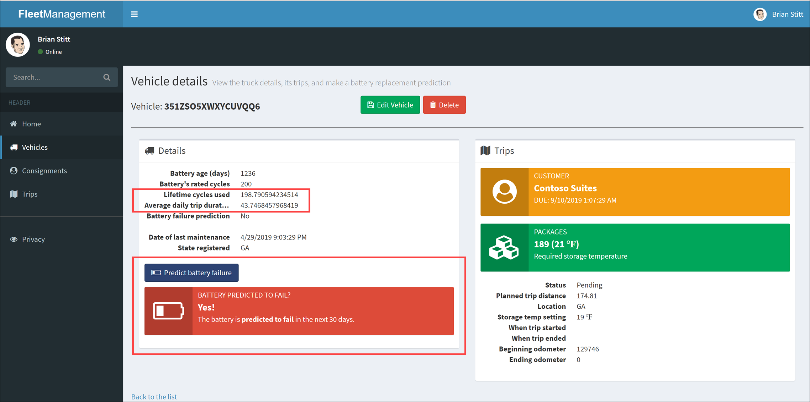

    この車両は、**Lifetime cycles used** の値が大きく、バッテリーの定格 200 サイクル寿命に近いです。モデルは、バッテリーが次の 30 日以内に故障すると予測しました。

## Exercise 11: Create the Predictive Maintenance & Trip/Consignment Status reports in Power BI

**Duration**: 15 minutes

この演習では、作成済みの Power BI レポートをインポートします。それを開いた後、Power BI インスタンスを指すデータ ソースを更新します。

### Task 1: Import report in Power BI Desktop

1. **Power BI Desktop** を開き、**Open other reports** を選択します。

    

2. レポートを開くダイアログで、`C:\cosmos-db-scenario-based-labs-master\IoT\Reports` を表示し、**FleetReport.pbix** を選択します。**Open** をクリックします。

    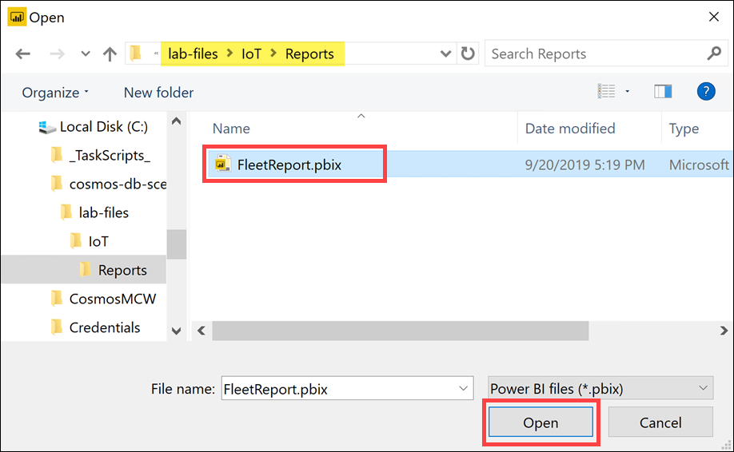

### Task 2: Update report data sources

1. レポートを開いたら、ホームタブのリボンバーにある **Edit Queries** をクリックします。

    

2. 左にあるクエリーのリストから **Trips** を選択し、Applied Stepsの下にある **Source** を選択します。Source の隣にある歯車のアイコンをクリックします。

    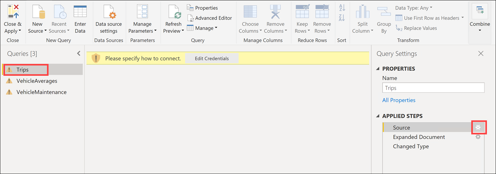

3. ソースダイアログで、演習で先にコピーした Cosmos DB URI で Cosmos DB **URL** 値を更新し、**OK** をクリックします。この値を見つける必要がある場合は、ポータルの Cosmos DB アカウントに移動し、左側のメニューで キー を選択し、URI 値をコピーします。

    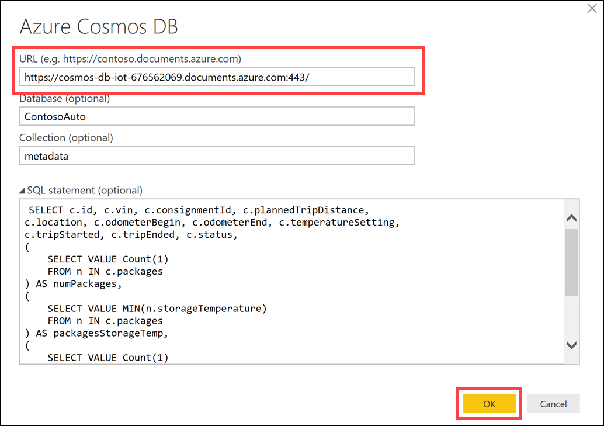

    トリップのデータ ソースには、必要なフィールドのみを返す SQL ステートメントが定義されており、一部の集計が適用されます:

    ```sql
    SELECT c.id, c.vin, c.consignmentId, c.plannedTripDistance,
    c.location, c.odometerBegin, c.odometerEnd, c.temperatureSetting,
    c.tripStarted, c.tripEnded, c.status,
    (
        SELECT VALUE Count(1) 
        FROM n IN c.packages
    ) AS numPackages,
    (
        SELECT VALUE MIN(n.storageTemperature) 
        FROM n IN c.packages
    ) AS packagesStorageTemp,
    (
        SELECT VALUE Count(1)
        FROM n IN c.packages
        WHERE n.highValue = true
    ) AS highValuePackages,
    c.consignment.customer,
    c.consignment.deliveryDueDate
    FROM c where c.entityType = 'Trip'
    and c.status in ('Active', 'Delayed', 'Completed')
    ```

4. プロンプトが表示されたら、Cosmos DB **Account key** 値を入力し、**Connect** をクリックします。この値を見つける必要がある場合は、ポータルの Cosmos DB アカウントに移動し、左側のメニューでキーを選択し、主キー値をコピーします。

    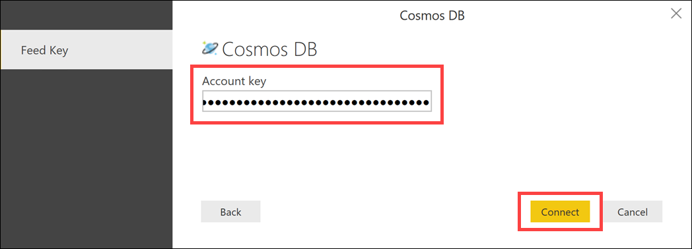

5. しばらくすると、**Document** という名前のテーブルが表示され、その値が Record である複数の行が表示されます。これは、Power BI が JSON ドキュメントの表示方法を知らないためです。ドキュメントを展開する必要があります。ドキュメントを展開した後、数値フィールドと日付フィールドのデータ型を既定の文字列型から変更して、レポートで集計関数を実行できるようにします。これらの手順は既に適用されています。Applied Steps の下にある **Changed Type** ステップを選択して、列と変更されたデータ型を表示します。

    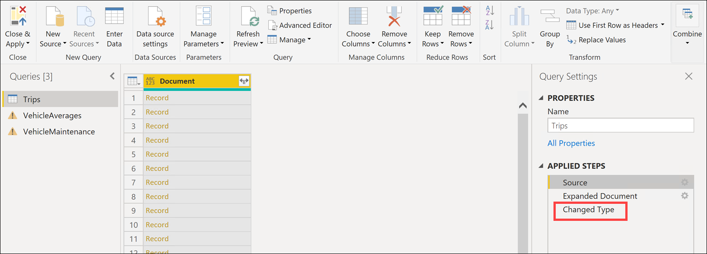

    次のスクリーン ショットは、データ型が適用されたトリップのドキュメント列を示しています:

    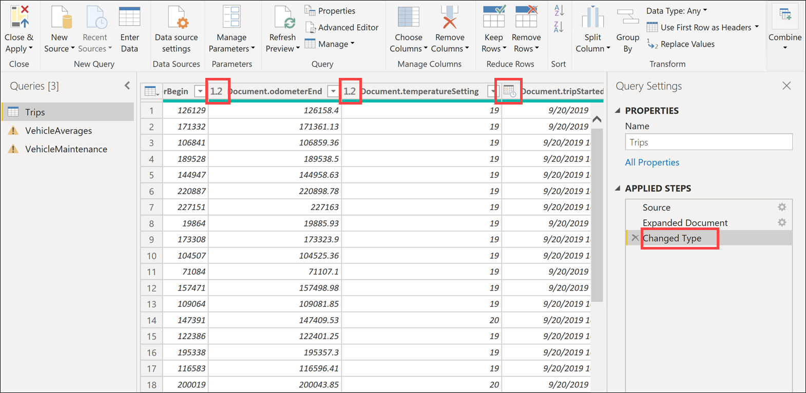

6. 左側のクエリーリストで **VehicleAverages** を選択し、Applied Steps の下の **Source** を選択します。Source の横にある歯車アイコンをクリックします。

    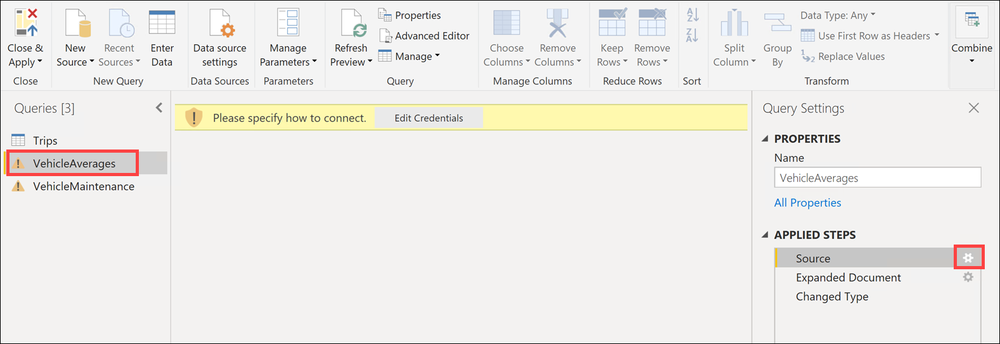

7. ソースダイアログで、Cosmos DB URI でCosmos DB **URL** 値を更新し、**OK** をクリックします。

    

    VehicleAverages データソースには以下の定義済みSQLステートメントがあります:

    ```sql
    SELECT c.vin, c.engineTemperature, c.speed,
    c.refrigerationUnitKw, c.refrigerationUnitTemp,
    c.engineTempAnomaly, c.oilAnomaly, c.aggressiveDriving,
    c.refrigerationTempAnomaly, c.snapshot
    FROM c WHERE c.entityType = 'VehicleAverage'
    ```

8. プロンプトが表示されたら、Cosmos DB **Account key** 値を入力し、**Connect** をクリックします。前の手順でキーを入力したため、プロンプトが表示されない場合があります。

    

9. 左側のクエリーリストで **VehicleMaintenance** を選択し、Applied Steps の下の **Source** を選択します。Source の横にある歯車アイコンをクリックします。

    

10. ソースダイアログで、Cosmos DB URI でCosmos DB **URL** 値を更新し、**OK** をクリックします。

    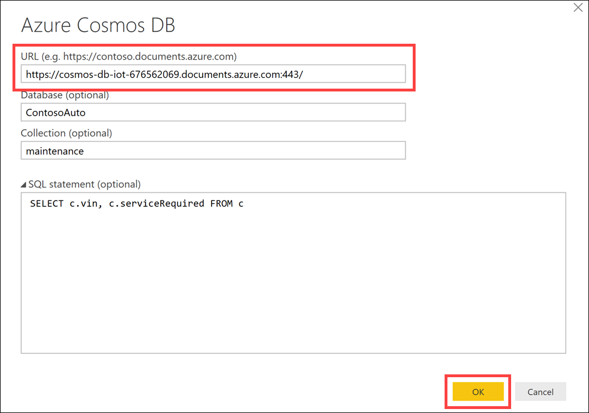

    VehicleMaintenance データ ソースには次の SQL ステートメントが定義されており、`maintenance` コンテナーには他のエンティティ型がなく、集計は必要ないため、他の 2 つよりも単純です:

    ```sql
    SELECT c.vin, c.serviceRequired FROM c
    ```

11. プロンプトが表示されたら、Cosmos DB **Account key** 値を入力し、**Connect** をクリックします。前の手順でキーを入力したため、プロンプトが表示されない場合があります。

    

12. プロンプトが表示されたら、**Close & Apply** をクリックします。

    

### Task 3: Explore report

1. レポートはデータ ソースに変更を適用し、キャッシュされたデータ セットは後で更新されます。スライサー (ステータス フィルター、顧客フィルター、および VIN リスト) を使用して、ビジュアライゼーションのデータをフィルター処理するレポートを探索します。また、レポートの下部にあるさまざまなタブ (Maintenance for more report pages など) も必ず選択してください。

    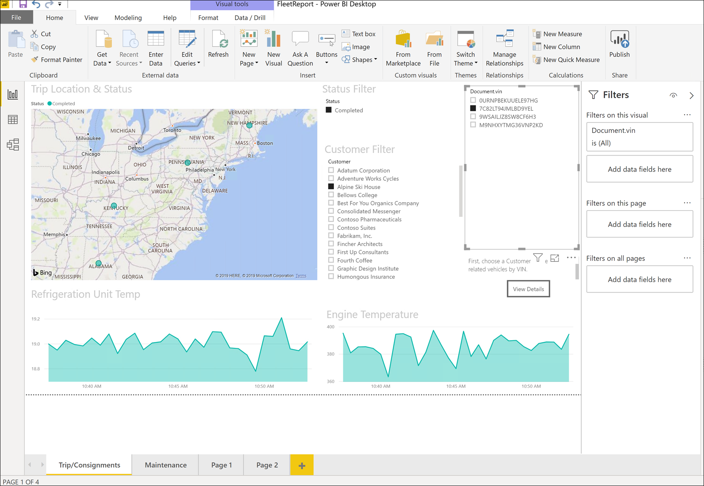

2. スライサーとして機能する顧客フィルタから顧客を選択します。つまり、アイテムを選択すると、ページ上の他のアイテムとリンクされたページにフィルターが適用されます。顧客を選択すると、マップとグラフの変更が表示されます。また、VIN とステータスのフィルター処理された一覧も表示されます。** Details** タブを選択します。

    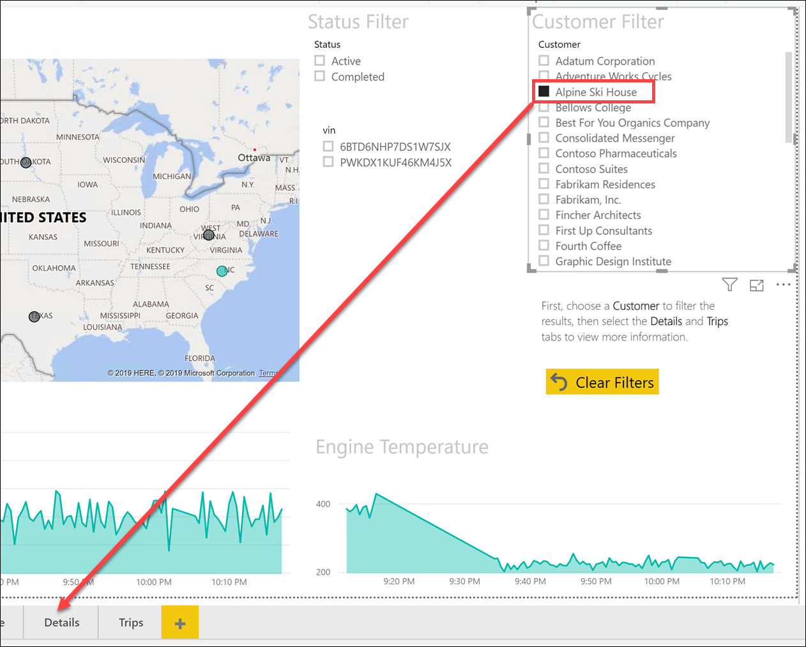

3. 詳細ページには、選択した顧客または VIN でフィルター処理された関連レコードが表示されます。次に、** Trips** タブを選択します。

    

4. トリップページには、関連するトリップ情報が表示されます。** Maintenance** を選択します。

    

5. メンテナンスページには、Databricks で実行したバッチ スコアリング ノートブックの結果が表示されます。ここにレコードが表示されない場合は、一部のトリップが完了した後にバッチ スコアリング ノートブック全体を実行する必要があります。

    

6. フィルタがいくつも設定されており、レコードが表示できない場合は、メインレポートページ (Trip / Consignments) の **Clear Filters** ボタンを **Ctrl+Click** してください。

    

7. レポートの表示中にデータ ジェネレーターが実行されている場合は、**Refresh** ボタンをクリックして、いつでも新しいデータでレポートを更新できます。

    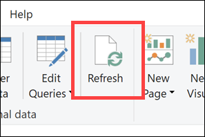

## After the hands-on lab

**Duration**: 10 mins

この演習では、演習のサポートとして作成された Azure リソースを削除します。ハンズオン ラボに参加した後に提供されるすべての手順に従って、アカウントが演習リソースに対して引き続き課金されないようにする必要があります。

### Task 1: Delete the resource group

1. [Azure portal](https://portal.azure.com) を使い、左側のメニューからリソースグループを選択して、このハンズオンで使ったリソースグループに移動します。

2. リソースグループの名前を検索し、一覧から選択します。

3. コマンド バーで Delete を選択し、リソース グループ名を再入力して削除を確認し、Delete を選択します。

_after_ attending the Hands-on lab で提供される全ての手順に従ってください。
