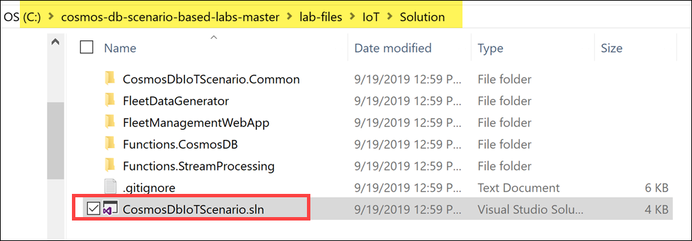

<div class="MCWHeader1">
Cosmos DB scenario-based labs - IoT
</div>

<div class="MCWHeader2">
Hands-on lab step-by-step
</div>

<div class="MCWHeader3">
September 2019
</div>

Information in this document, including URL and other Internet Web site references, is subject to change without notice. Unless otherwise noted, the example companies, organizations, products, domain names, e-mail addresses, logos, people, places, and events depicted herein are fictitious, and no association with any real company, organization, product, domain name, e-mail address, logo, person, place or event is intended or should be inferred. Complying with all applicable copyright laws is the responsibility of the user. Without limiting the rights under copyright, no part of this document may be reproduced, stored in or introduced into a retrieval system, or transmitted in any form or by any means (electronic, mechanical, photocopying, recording, or otherwise), or for any purpose, without the express written permission of Microsoft Corporation.

Microsoft may have patents, patent applications, trademarks, copyrights, or other intellectual property rights covering subject matter in this document. Except as expressly provided in any written license agreement from Microsoft, the furnishing of this document does not give you any license to these patents, trademarks, copyrights, or other intellectual property.

The names of manufacturers, products, or URLs are provided for informational purposes only and Microsoft makes no representations and warranties, either expressed, implied, or statutory, regarding these manufacturers or the use of the products with any Microsoft technologies. The inclusion of a manufacturer or product does not imply endorsement of Microsoft of the manufacturer or product. Links may be provided to third party sites. Such sites are not under the control of Microsoft and Microsoft is not responsible for the contents of any linked site or any link contained in a linked site, or any changes or updates to such sites. Microsoft is not responsible for webcasting or any other form of transmission received from any linked site. Microsoft is providing these links to you only as a convenience, and the inclusion of any link does not imply endorsement of Microsoft of the site or the products contained therein.

© 2019 Microsoft Corporation. All rights reserved.

Microsoft and the trademarks listed at <https://www.microsoft.com/en-us/legal/intellectualproperty/Trademarks/Usage/General.aspx> are trademarks of the Microsoft group of companies. All other trademarks are property of their respective owners.

**Contents**

<!-- TOC -->

- [Cosmos DB scenario-based labs - IoT hands-on lab step-by-step](#cosmos-db-scenario-based-labs---iot-hands-on-lab-step-by-step)
  - [Overview](#overview)
  - [Solution architecture](#solution-architecture)
  - [Requirements](#requirements)
  - [Before the hands-on lab](#before-the-hands-on-lab)
  - [Exercise 1: Configure environment](#exercise-1-configure-environment)
    - [Task 1: Create Cosmos DB database and container](#task-1-create-cosmos-db-database-and-container)
      - [About Cosmos DB throughput](#about-cosmos-db-throughput)
      - [About Cosmos DB partitioning](#about-cosmos-db-partitioning)
    - [Task 2: Configure Cosmos DB container indexing and TTL](#task-2-configure-cosmos-db-container-indexing-and-ttl)
      - [About the Cosmos DB indexing policies](#about-the-cosmos-db-indexing-policies)
    - [Task 3: Create a Logic App workflow for email alerts](#task-3-create-a-logic-app-workflow-for-email-alerts)
    - [Task 4: Add Key Vault secrets](#task-4-add-key-vault-secrets)
    - [Task 5: Create system-assigned managed identities for your Function Apps and Web App to connect to Key Vault](#task-5-create-system-assigned-managed-identities-for-your-function-apps-and-web-app-to-connect-to-key-vault)
    - [Task 6: Add Function Apps and Web App to Key Vault access policy](#task-6-add-function-apps-and-web-app-to-key-vault-access-policy)
    - [Task 7: Create Azure Databricks cluster](#task-7-create-azure-databricks-cluster)
    - [Task 8: Configure Key Vault-backed Databricks secret store](#task-8-configure-key-vault-backed-databricks-secret-store)
  - [Exercise 2: Configure windowed queries in Stream Analytics](#exercise-2-configure-windowed-queries-in-stream-analytics)
    - [Task 1: Add Stream Analytics Event Hubs input](#task-1-add-stream-analytics-event-hubs-input)
    - [Task 2: Add Stream Analytics outputs](#task-2-add-stream-analytics-outputs)
    - [Task 3: Create Stream Analytics query](#task-3-create-stream-analytics-query)
    - [Task 4: Run Stream Analytics job](#task-4-run-stream-analytics-job)
  - [Exercise 3: Deploy Azure functions and Web App](#exercise-3-deploy-azure-functions-and-web-app)
    - [Task 1: Retrieve the URI for each Key Vault secret](#task-1-retrieve-the-uri-for-each-key-vault-secret)
    - [Task 2: Configure application settings in Azure](#task-2-configure-application-settings-in-azure)
    - [Task 3: Open solution](#task-3-open-solution)
    - [Task 4: Code completion and walk-through](#task-4-code-completion-and-walk-through)
    - [Task 5: Deploy Cosmos DB Processing Function App](#task-5-deploy-cosmos-db-processing-function-app)
    - [Task 6: Deploy Stream Processing Function App](#task-6-deploy-stream-processing-function-app)
    - [Task 7: Deploy Web App](#task-7-deploy-web-app)
  - [Exercise 4: Explore and execute data generator](#exercise-4-explore-and-execute-data-generator)
    - [Task 1: Open the data generator project](#task-1-open-the-data-generator-project)
    - [Task 2: Code walk-through](#task-2-code-walk-through)
    - [Task 3: Update application configuration](#task-3-update-application-configuration)
    - [Task 4: Run generator](#task-4-run-generator)
  - [Exercise 5: Observe data using Cosmos DB Data Explorer and Web App](#exercise-5-observe-data-using-cosmos-db-data-explorer-and-web-app)
    - [Task 1: View data in Cosmos DB Data Explorer](#task-1-view-data-in-cosmos-db-data-explorer)
    - [Task 2: Search and view data in Web App](#task-2-search-and-view-data-in-web-app)
  - [Exercise 6: Performing CRUD operations using the Web App](#exercise-6-performing-crud-operations-using-the-web-app)
    - [Task 1: Update vehicle metadata](#task-1-update-vehicle-metadata)
    - [Task 2: View consignment, package, and trip data](#task-2-view-consignment-package-and-trip-data)
  - [Exercise 7: Creating the Fleet status real-time dashboard in Power BI](#exercise-7-creating-the-fleet-status-real-time-dashboard-in-power-bi)
    - [Task 1: Log in to Power BI online](#task-1-log-in-to-power-bi-online)
    - [Task 2: Create real-time dashboard](#task-2-create-real-time-dashboard)
  - [Exercise 8: Observe Change Feed using Azure Functions and App Insights](#exercise-8-observe-change-feed-using-azure-functions-and-app-insights)
    - [Task 1: Open App Insights Live View](#task-1-open-app-insights-live-view)
  - [Exercise 9: Running the predictive maintenance batch scoring](#exercise-9-running-the-predictive-maintenance-batch-scoring)
    - [Task 1: Import lab notebooks into Azure Databricks](#task-1-import-lab-notebooks-into-azure-databricks)
    - [Task 2: Run batch scoring notebook](#task-2-run-batch-scoring-notebook)
  - [Exercise 10: Deploying the predictive maintenance web service](#exercise-10-deploying-the-predictive-maintenance-web-service)
    - [Task 1: Run deployment notebook](#task-1-run-deployment-notebook)
    - [Task 2: Call the deployed scoring web service from the Web App](#task-2-call-the-deployed-scoring-web-service-from-the-web-app)
  - [Exercise 11: Creating the Predictive Maintenance & Trip/Consignment Status reports in Power BI](#exercise-11-creating-the-predictive-maintenance--tripconsignment-status-reports-in-power-bi)
    - [Task 1: Add Cosmos DB data sources to Power BI Desktop](#task-1-add-cosmos-db-data-sources-to-power-bi-desktop)
    - [Task 2: Create new report in Power BI Desktop](#task-2-create-new-report-in-power-bi-desktop)
  - [After the hands-on lab](#after-the-hands-on-lab)
    - [Task 1: Delete the resource group](#task-1-delete-the-resource-group)

<!-- /TOC -->

# Cosmos DB scenario-based labs - IoT hands-on lab step-by-step

## Overview


Contoso Auto is a high value cargo logistics organization that is collecting vehicle and package telemetry data and wants to use Azure Cosmos DB to rapidly ingest and store this data in its raw form, do some processing in near real-time to generate insights to support several business objectives and surface these to the most appropriate user communities within the organization. It is a fast growing organization and wants to be able to scale and manage the associated cost of its chosen technology to enable it to cope with its explosive growth and the inherent seasonality of the logistics business. This scenario includes applicability to both the vehicle telemetry and logistics use cases by focusing on trucking and inclusion of cargo sensing data. This additionally allows for many representative customer analytics scenarios.

From a technology perspective Contoso would like to leverage Azure Cosmos DB as the core repository for its hot data path and leverage the Azure Cosmos DB Change Feed as a means to drive a solid and robust event sourcing architecture that would allowing Contoso developers to quickly enhance the solution. This achieved using a robust and agile serverless approach by leveraging events published by the Change Feed that reflect the state changes within the application (database).

Ultimately Contoso would surface the raw and derived insights data to its users in one of three roles:

- **Logistic Operations personnel** who are interested in the current state of the vehicles and cargo logistics and who would use a web app to quickly understand the status of any single vehicle or piece of cargo, be notified of alerts as well as load vehicle and cargo meta data into the system. What they would like to see on the dashboard are various visualizations of detected anomalies, like engines overheating, abnormal oil pressure, and aggressive driving.

- **Management and Customer Reporting personnel** who would like to be in a position to see the current state of the vehicle fleet and customer consignment level information presented in on a Power BI report that automatically updates with new data as it flows in after being processed. What they would like to see are reports on bad driving behavior by driver and using visual components such as a map to show anomalies related to cities or areas, as well as various charts and graphs depicting aggregate fleet and consignment information in a clear way.

In this experience, you will use Azure Cosmos DB to ingest streaming vehicle telemetry data as the entry point to a near real-time analytics pipeline built on Cosmos DB, Azure Functions, Event Hubs, Azure Databricks, Azure Storage, Azure Stream Analytics, Power BI, Azure Web Apps, and Logic Apps.

## Solution architecture

Below is a diagram of the solution architecture you will build in this lab. Please study this carefully, so you understand the whole of the solution as you are working on the various components.


- Data ingest, event processing, and storage:

  The solution for the IoT scenario centers around **Cosmos DB**, which acts as the globally-available, highly scalable data storage for streaming event data, fleet, consignment, package, and trip metadata, and aggregate data for reporting. Vehicle telemetry data flows in from the data generator, through registered IoT devices in **IoT Hub**, where an **Azure function** processes the event data and inserts it into a telemetry container in Cosmos DB.

- Trip processing with Azure Functions:

  The Cosmos DB change feed triggers three separate Azure functions, with each managing their own checkpoints so they can process the same incoming data without conflicting with one another. One function serializes the event data and stores it into time-sliced folders in **Azure Storage** for long-term cold storage of raw data. Another function processes the vehicle telemetry, aggregating the batch data and updating the trip and consignment status in the metadata container, based on odometer readings and whether the trip is running on schedule. This function also triggers a **Logic App** to send email alerts when trip milestones are reached. A third function sends the event data to **Event Hubs**, which in turn triggers **Stream Analytics** to execute time window aggregate queries.

- Stream processing, dashboards, and reports:

  The Stream Analytics queries output vehicle-specific aggregates to the Cosmos DB metadata container, and overall vehicle aggregates to **Power BI** to populate its real-time dashboard of vehicle status information. A Power BI Desktop report is used to display detailed vehicle, trip, and consignment information, pulled directly from the Cosmos DB metadata container. It also displays batch battery failure predictions, pulled from the maintenance container.

- Advanced analytics and ML model training:

  **Azure Databricks** is used to train a machine learning model to predict vehicle battery failure, based on historic information. It saves a trained model locally for batch predictions, and deploys a model and scoring web service to **Azure Kubernetes Service (AKS)** or **Azure Container Instances (ACI)** for real-time predictions. Azure Databricks also uses the **Spark Cosmos DB connector** to pull down each day's trip information to make batch predictions on battery failure and store the predictions in the maintenance container.

- Fleet management web app, security, and monitoring:

  A **Web App** allows Contoso Auto to manage vehicles and view consignment, package, and trip information that is stored in Cosmos DB. The Web App is also used to make real-time battery failure predictions while viewing vehicle information. **Azure Key Vault** is used to securely store centralized application secrets, such as connection strings and access keys, and is used by the Function Apps, Web App, and Azure Databricks. Finally, **Application Insights** provides real-time monitoring, metrics, and logging information for the Function Apps and Web App.

## Requirements

1. Microsoft Azure subscription must be pay-as-you-go or MSDN.
   - Trial subscriptions will not work.
   - **IMPORTANT**: To complete the OAuth 2.0 access components of this hands-on lab you must have permissions within your Azure subscription to create an App Registration and service principal within Azure Active Directory.
2. Install [Power BI Desktop](https://powerbi.microsoft.com/desktop/)
3. Install [Visual Studio 2019 Community](https://visualstudio.microsoft.com/vs/) or greater

## Before the hands-on lab

Refer to the [Before the hands-on lab setup guide](./Before%20the%20HOL%20-%20Cosmos%20DB%20scenario-based%20labs%20-%20IoT.md) manual before continuing to the lab exercises.

## Exercise 1: Configure environment

**Duration**: 45 minutes

You must provision a few resources in Azure before you start developing the solution. Ensure all resources use the same resource group for easier cleanup.

In this exercise, you will configure your lab environment so you can start sending and processing generated vehicle, consignment, package, and trip data. You will begin by creating a Cosmos DB database and containers, then you will create a new Logic App and create a workflow for sending email notifications, create an Application Insights service for real-time monitoring of your solution, then retrieve secrets used in the solution's application settings (such as connection strings) and securely store them in Azure Key Vault, and finally configure your Azure Databricks environment.

### Task 1: Create Cosmos DB database and container

In this task, you will create a Cosmos DB database and three SQL-based containers:

- **telemetry**: Used for ingesting hot vehicle telemetry data with a 90-day lifespan (TTL).
- **metadata**: Stores vehicle, consignment, package, trip, and aggregate event data.
- **maintenance**: The batch battery failure predictions are stored here for reporting purposes.

1. Using a new tab or instance of your browser, navigate to the Azure portal, <https://portal.azure.com>.

2. Select **Resource groups** from the left-hand menu, then search for your resource group by typing in `cosmos-db-iot`. Select your resource group that you are using for this lab.

   

3. Select your Azure Cosmos DB account. The name starts with `cosmos-db-iot`.

   

4. Select **Data Explorer** in the left-hand menu, then select **New Container**.

   

5. On the **Add Container** blade, specify the following configuration options:

   a. Enter **ContosoAuto** for the **Database id**.

   b. Leave **Provision database throughput** unchecked.

   c. Enter **metadata** for the **Container id**.

   d. Partition key: **/partitionKey**

   e. Throughput: **15000**

   

6. Select **OK** to create the container.

7. Select **New Container** once again in the Data Explorer.

8. On the **Add Container** blade, specify the following configuration options:

   a. **Database id**: Select **Use existing**, then select **ContosoAuto** from the list.

   c. Enter **telemetry** for the **Container id**.

   d. Partition key: **/partitionKey**

   e. Throughput: **15000**

   

9. Select **OK** to create the container.

10. Select **New Container** once again in the Data Explorer.

11. On the **Add Container** blade, specify the following configuration options:

    a. **Database id**: Select **Use existing**, then select **ContosoAuto** from the list.

    c. Enter **maintenance** for the **Container id**.

    d. Partition key: **/vin**

    e. Throughput: **400**

    

12. Select **OK** to create the container.

13. You should now have three containers listed in the Data Explorer.

    

#### About Cosmos DB throughput

You will notice that we have intentionally set the **throughput** in RU/s for each container, based on our anticipated event processing and reporting workloads. In Azure Cosmos DB, provisioned throughput is represented as request units/second (RUs). RUs measure the cost of both read and write operations against your Cosmos DB container. Because Cosmos DB is designed with transparent horizontal scaling (e.g., scale out) and multi-master replication, you can very quickly and easily increase or decrease the number of RUs to handle thousands to hundreds of millions of requests per second around the globe with a single API call.

Cosmos DB allows you to increment/decrement the RUs in small increments of 100 at the database level, or at the container level. It is recommended that you configure throughput at the container granularity for guaranteed performance for the container all the time, backed by SLAs. Other guarantees that Cosmos DB delivers are 99.999% read and write availability all around the world, with those reads and writes being served in less than 10 milliseconds at the 99th percentile.

When you set a number of RUs for a container, Cosmos DB ensures that those RUs are available in all regions associated with your Cosmos DB account. When you scale out the number of regions by adding a new one, Cosmos will automatically provision the same quantity of RUs in the newly added region. You cannot selectively assign different RUs to a specific region. These RUs are provisioned for a container (or database) for all associated regions.

#### About Cosmos DB partitioning

When you created each container, you were required to define a **partition key**. As you will see later in the lab when you review the solution source code, each document stored within a collection contains a `partitionKey` property. One of the most important decisions one must make when creating a new container is to select an appropriate partition key for the data. A partition key should provide even distribution of storage and throughput (measured in requests per second) at any given time to avoid storage and performance bottlenecks. For instance, vehicle metadata stores the VIN, which is a unique value for each vehicle, in the `partitionKey` field. Trip metadata also uses the VIN for the `partitionKey` field, since trips are most often queried by VIN, and trip documents are stored in the same logical partition as vehicle metadata since they are likely to be queried together, preventing fan-out, or cross-partition queries. Package metadata, on the other hand, use the Consignment ID value for the `partitionKey` field for the same purposes. The partition key should be present in the bulk of queries for read-heavy scenarios to avoid excessive fan-out across numerous partitions. This is because each document with a specific partition key value belongs to the same logical partition, and is also stored in and served from the same physical partition. Each physical partition is replicated across geographical regions, resulting in global distribution.

Choosing an appropriate partition key for Cosmos DB is a critical step for ensuring balanced reads and writes, scaling, and, in the case of this solution, in-order change feed processing per partition. While there are no limits, per se, on the number of logical partitions, a single logical partition is allowed an upper limit of 10 GB of storage. Logical partitions cannot be split across physical partitions. For the same reason, if the partition key chosen is of bad cardinality, you could potentially have skewed storage distribution. For instance, if one logical partition becomes larger faster than the others and hits the maximum limit of 10 GB, while the others are nearly empty, the physical partition housing the maxed out logical partition cannot split and could cause an application downtime.

### Task 2: Configure Cosmos DB container indexing and TTL

In this task, you will review the default indexing set on your new containers, and configure the indexing for your `telemetry` container so it is optimized for write-heavy workloads. Next, you will enable time-to-live (TTL) on the `telemetry` container, allowing you to set the TTL value, in seconds, on individual documents stored in the container. This value tells Cosmos DB when to expire, or delete, the document(s) automatically. This setting can help save in storage costs by removing what you no longer need. Typically, this is used on hot data, or data that must be expired after a period of time due to regulatory requirements.

1. Expand the **telemetry** container in the Cosmos DB Data Explorer, then select **Scale & Settings**.

2. Within the Scale & Settings blade, expand the Settings section and select **On (no default)** under **Time to Live**.

   

   Turning the Time to Live setting on with no default allows us to define the TTL individually for each document, giving us more flexibilty in deciding which documents should expire after a set period of time. To do this, we have a `ttl` field on the document that is saved to this container that specifies the TTL in seconds.

3. Scroll down in the Scale & Settings blade to view the **Indexing Policy**. The default policy is to automatically index all fields for each document stored in the collection. This is because all paths are included (remember, since we are storing JSON documents, we use paths to identify the property since they can exist within child collections in the document) by setting the value of `includedPaths` to `"path": "/*"`, and the only excluded path is the internal `_etag` property, which is used for versioning the documents. Here is what the default Indexing Policy looks like:

   ```json
   {
     "indexingMode": "consistent",
     "automatic": true,
     "includedPaths": [
       {
         "path": "/*"
       }
     ],
     "excludedPaths": [
       {
         "path": "/\"_etag\"/?"
       }
     ]
   }
   ```

4. Replace the **Indexing Policy** with the following, which excludes all paths, and only includes the paths used when we query the container (`vin`, `state`, and `partitionKey`):

   ```json
   {
     "indexingMode": "consistent",
     "automatic": true,
     "includedPaths": [
       {
         "path": "/vin/?"
       },
       {
         "path": "/state/?"
       },
       {
         "path": "/partitionKey/?"
       }
     ],
     "excludedPaths": [
       {
         "path": "/*"
       },
       {
         "path": "/\"_etag\"/?"
       }
     ]
   }
   ```

   

5. Select **Save** to apply your changes.

#### About the Cosmos DB indexing policies

In this task, we updated the indexing policy for the `telemetry` container, but left the other two containers with the default policy. The default indexing policy for newly created containers indexes every property of every item, enforcing range indexes for any string or number, and spatial indexes for any GeoJSON object of type Point. This allows you to get high query performance without having to think about indexing and index management upfront. Since the `metadata` and `maintenance` containers have more read-heavy workloads than `telemetry`, it makes sense to use the default indexing policy where query performance is optimized. Since we need faster writes for `telemetry`, we exclude unused paths. The use of indexing paths can offer improved write performance and lower index storage for scenarios in which the query patterns are known beforehand, as indexing costs are directly correlated to the number of unique paths indexed.

The indexing mode for all three containers is set to **Consistent**. This means the index is updated synchronously as items are added, updated, or deleted, enforcing the consistency level configured for the account for read queries. The other indexing mode one could choose is None, which disables indexing on the container. Usually this mode is used when your container acts as a pure key-value store, and you do not need indexes for any of the other properties. It is possible to dynamically change the consistency mode prior to executing bulk operations, then changing the mode back to Consistent afterwards, if the potential performance increase warrants the temporary change.

### Task 3: Create a Logic App workflow for email alerts

In this task, you will create a new Logic App workflow and configure it to send email alerts through its HTTP trigger. This trigger will be called by one of your Azure functions that gets triggered by the Cosmos DB change feed, any time a notification event occurs, such as completing a trip. You will need to have an Office 365 or Outlook.com account to send the emails.

1. In the [Azure portal](https://portal.azure.com), select **+ Create a resource**, then enter **logic app** into the search box on top. Select **Logic App** from the results.

   

2. Select the **Create** button on the **Logic App overview** blade.

3. On the **Create Logic App** blade, specify the following configuration options:

   1. **Name**: Unique value for the name, such as `Cosmos-IoT-Logic` (ensure the green check mark appears).
   2. **Subscription**: Select the Azure subscription you are using for this lab.
   3. **Resource group**: Select your lab resource group. The name should start with `cosmos-db-iot`.
   4. **Location**: Select the same location as your resource group.
   5. **Log Analytics**: Select **Off**.

   

4. Select **Create**.

5. After the Logic App is created, navigate to it by opening your resource group and selecting the new Logic App.

6. In the Logic App Designer, scroll through the page until you locate the Start with a common trigger section. Select the **When a HTTP request is received** trigger.

   

7. Paste the following JSON into the **Request Body JSON Schema** field. This defines the shape of the data the Azure function will send in the body of the HTTP request when an alert needs to be sent:

   ```json
   {
     "properties": {
       "consignmentId": {
         "type": "string"
       },
       "customer": {
         "type": "string"
       },
       "deliveryDueDate": {
         "type": "string"
       },
       "distanceDriven": {
         "type": "number"
       },
       "hasHighValuePackages": {
         "type": "boolean"
       },
       "id": {
         "type": "string"
       },
       "lastRefrigerationUnitTemperatureReading": {
         "type": "integer"
       },
       "location": {
         "type": "string"
       },
       "lowestPackageStorageTemperature": {
         "type": "integer"
       },
       "odometerBegin": {
         "type": "integer"
       },
       "odometerEnd": {
         "type": "number"
       },
       "plannedTripDistance": {
         "type": "number"
       },
       "recipientEmail": {
         "type": "string"
       },
       "status": {
         "type": "string"
       },
       "temperatureSetting": {
         "type": "integer"
       },
       "tripEnded": {
         "type": "string"
       },
       "tripStarted": {
         "type": "string"
       },
       "vin": {
         "type": "string"
       }
     },
     "type": "object"
   }
   ```

   

8. Select **+ New step** underneath the HTTP trigger.

   

9. Within the new action box, type `send email` in the search box, then select **Send an email - Office 365 Outlook** from the list of actions below. **Note**: If you do not have an Office 365 Outlook account, you may try one of the other email service options.

   

10. Select the **Sign in** button. Sign in to your account in the window that appears.

    

11. After signing in, the action box will display as the **Send an email** action form. Select the **To** field. The **Dynamic content** box will display after selecting To. To see the full list of dynamic values from the HTTP request trigger, select **See more** next to "When a HTTP request is received".

    

12. In the list of dynamic content, select **recipientEmail**. This will add the dynamic value to the **To** field.

    

13. In the **Subject** field, enter the following: `Contoso Auto trip status update:`, making sure you add a space at the end. Select the **status** dynamic content to append the trip status to the end of the subject.

    

14. Paste the following into the **Body** field. The dynamic content will automatically be added:

    ```text
    Here are the details of the trip and consignment:

    CONSIGNMENT INFORMATION:

    Customer: @{triggerBody()?['customer']}
    Delivery Due Date: @{triggerBody()?['deliveryDueDate']}
    Location: @{triggerBody()?['location']}
    Status: @{triggerBody()?['status']}

    TRIP INFORMATION:

    Trip Start Time: @{triggerBody()?['tripStarted']}
    Trip End Time: @{triggerBody()?['tripEnded']}
    Vehicle (VIN): @{triggerBody()?['vin']}
    Planned Trip Distance: @{triggerBody()?['plannedTripDistance']}
    Distance Driven: @{triggerBody()?['distanceDriven']}
    Start Odometer Reading: @{triggerBody()?['odometerBegin']}
    End Odometer Reading: @{triggerBody()?['odometerEnd']}

    PACKAGE INFORMATION:

    Has High Value Packages: @{triggerBody()?['hasHighValuePackages']}
    Lowest Package Storage Temp (F): @{triggerBody()?['lowestPackageStorageTemperature']}
    Trip Temp Setting (F): @{triggerBody()?['temperatureSetting']}
    Last Refrigeration Unit Temp Reading (F): @{triggerBody()?['lastRefrigerationUnitTemperatureReading']}

    REFERENCE INFORMATION:

    Trip ID: @{triggerBody()?['id']}
    Consignment ID: @{triggerBody()?['consignmentId']}
    Vehicle VIN: @{triggerBody()?['vin']}

    Regards,
    Contoso Auto Bot
    ```

15. Your Logic App workflow should now look like the following:

    

16. Select **Save** at the top of the designer to save your workflow.

17. After saving, the URL for the HTTP trigger will generate. Expand the HTTP trigger in the workflow, then copy the **HTTP POST URL** value and save it to Notepad or similar text application for a later step.

    

### Task 4: Add Key Vault secrets

Azure Key Vault is used to Securely store and tightly control access to tokens, passwords, certificates, API keys, and other secrets. In addition, secrets that are stored in Azure Key Vault are centralized, giving the added benefits of only needing to update secrets in one place, such as an application key value after recycling the key for security purposes. In this task, we will store application secrets in Azure Key Vault, then configure the Function Apps and Web App to securely connect to Azure Key Vault by performing the following steps:

- Add secrets to the provisioned Key Vault.
- Create a system-assigned managed identity for each Azure Function App and the Web App to read from the vault.
- Create an access policy in Key Vault with the "Get" secret permission, assigned to each of these application identities.

> We recommend that you open two browser tabs for these steps. One to copy secrets from each Azure service, and the other to add the secrets to Key Vault.

1. Using a new tab or instance of your browser, navigate to the Azure portal, <https://portal.azure.com>.

2. Select **Resource groups** from the left-hand menu, then search for your resource group by typing in `cosmos-db-iot`. Select your resource group that you are using for this lab.

3. Open the your **Key Vault**. The name should begin with `iot-keyvault`.

   

4. Select **Secrets** in the left-hand menu, then select **+ Generate/Import** to create a new secret.

   

5. Use the table below for the Name / Value pairs to use when creating the secrets. You only need to populate the **Name** and **Value** fields for each secret, and can leave the other fields at their default values.

   | **Name**            |                                                                          **Value**                                                                          |
   | ------------------- | :---------------------------------------------------------------------------------------------------------------------------------------------------------: |
   | CosmosDBConnection  |                            Your Cosmos DB connection string found here: **Cosmos DB account > Keys > Primary Connection String**                            |
   | CosmosDBEndpoint    |                                           Your Cosmos DB endpoint found here: **Cosmos DB account > Keys > URI**                                            |
   | CosmosDBPrimaryKey  |                                      Your Cosmos DB primary key found here: **Cosmos DB account > Keys > Primary Key**                                      |
   | IoTHubConnection    |                         Your IoT Hub connection string found here: **IoT Hub > Built-in endpoints > Event Hub-compatible endpoint**                         |
   | ColdStorageAccount  |  Connection string to the Azure Storage account whose name starts with `iotstore`, found here: **Storage account > Access keys > key1 Connection string**   |
   | EventHubsConnection | Your Event Hubs connection string found here: **Event Hubs namespace > Shared access policies > RootManageSharedAccessKey > Connection string-primary key** |
   | LogicAppUrl         |                         Your Logic App's HTTP Post URL found here: **Logic App Designer > Select the HTTP trigger > HTTP POST URL**                         |

   When you are finished creating the secrets, your list should look similar to the following:

   

### Task 5: Create system-assigned managed identities for your Function Apps and Web App to connect to Key Vault

In order for your Function Apps and Web App to be able to access Key Vault to read the secrets, you must [create a system-assigned managed identity](https://docs.microsoft.com/azure/app-service/overview-managed-identity#adding-a-system-assigned-identity) for each, and [create an access policy in Key Vault](https://docs.microsoft.com/azure/key-vault/key-vault-secure-your-key-vault#key-vault-access-policies) for the application identities.

1. Open the Azure Function App whose name begins with **IoT-CosmosDBProcessing** and navigate to **Platform features**.

2. Select **Identity**.

   

3. Within the **System assigned** tab, switch **Status** to **On**. Select **Save**.

   

4. Open the Azure Function App whose name begins with **IoT-StreamProcessing** and navigate to **Platform features**.

5. Select **Identity**.

   

6. Within the **System assigned** tab, switch **Status** to **On**. Select **Save**.

   

7. Open the Web App (App Service) whose name begins with **IoTWebApp**.

8. Select **Identity** in the left-hand menu.

9. Within the **System assigned** tab, switch **Status** to **On**. Select **Save**.

   

### Task 6: Add Function Apps and Web App to Key Vault access policy

Perform these steps to create an access policy that enables the "Get" secret permission:

1. Open your Key Vault service.

2. Select **Access policies** in the left-hand menu.

3. Select **+ Add Access Policy**.

   

4. Select the **Select principal** section on the Add access policy form.

   

5. In the Principal blade, search for your `IoT-CosmosDBProcessing` Function App's service principal, select it, then select the **Select** button.

   

6. Expand the **Secret permissions** and check **Get** under Secret Management Operations.

   

7. Select **Add** to add the new access policy.

8. When you are done, you should have an access policy for the Function App's managed identity. Select **+ Add Access Policy** to add another access policy.

   

9. Select the **Select principal** section on the Add access policy form.

   

10. In the Principal blade, search for your `IoT-StreamProcessing` Function App's service principal, select it, then select the **Select** button.

    

11. Expand the **Secret permissions** and check **Get** under Secret Management Operations.

    

12. Select **Add** to add the new access policy.

13. When you are done, you should have an access policy for the Function App's managed identity. Select **+ Add Access Policy** to add another access policy.

    

14. Select the **Select principal** section on the Add access policy form.

    

15. In the Principal blade, search for your `IoTWebApp` Web App's service principal, select it, then select the **Select** button.

    

16. Expand the **Secret permissions** and check **Get** under Secret Management Operations.

    

17. Select **Add** to add the new access policy.

18. When you are done, you should have an access policy for the Web App's managed identity. Select **Save** to save your new access policies.

    

### Task 7: Create Azure Databricks cluster

Contoso Auto wants to use the valuable data they are collecting from their vehicles to make predictions about the health of their fleet to reduce downtime due to maintenance-related issues. One of the predictions they would like to make is whether a vehicle's battery is likely to fail within the next 30 days, based on historical data. They would like to run a nightly batch process to identify vehicles that should be serviced, based on these predictions. They also want to have a way to make a prediction in real time when viewing a vehicle on their fleet management website.

To support this requirement, you will use Apache Spark on Azure Databricks, a fully managed Apache Spark platform optimized to run on Azure. Spark is a unified big data and advanced analytics platform that enables data scientists and data engineers to explore and prepare large amounts of structured and unstructured data, then use that data to train, use, and deploy machine learning models at scale. We will read and write to Cosmos DB, using the `azure-cosmosdb-spark` connector (<https://github.com/Azure/azure-cosmosdb-spark>).

In this task, you will create a new cluster on which data exploration and model deployment tasks will be executed in later exercises.

1. In the [Azure portal](https://portal.azure.com), open your lab resource group, then open your **Azure Databricks Service**. The name should start with `iot-databricks`.

   

2. Select **Launch Workspace**. Azure Databricks will automatically sign you in through its Azure Active Directory integration.

   

3. Once in the workspace, select **Clusters** in the left-hand menu, then select **+ Create Cluster**.

   

4. In the **New Cluster** form, specify the following configuration options:

   1. **Cluster Name**: Enter **lab**.
   2. **Cluster Mode**: Select **Standard**.
   3. **Pool**: Select **None**.
   4. **Databricks Runtime Version**: Select **Runtime 5.5 LTS (Scala 2.11, Spark 2.4.3)**.
   5. **Python Version**: Enter **3**.
   6. **Autopilot Options**: Check **Enable autoscaling** and **Terminate after...**, with a value of **120** minutes.
   7. **Worker Type**: Select **Standard_DS3_v2**.
   8. **Driver Type**: Select **Same as worker**.
   9. Enter **2** and **8** into **Min Workers** and **Max Workers**, respectively.

   

5. Select **Create Cluster**.

### Task 8: Configure Key Vault-backed Databricks secret store

In an earlier task, you added application secrets to Key Vault, such as the Cosmos DB connection string. In this task, you will configure the Key Vault-backed Databricks secret store to securely access these secrets.

Azure Databricks has two types of secret scopes: Key Vault-backed and Databricks-backed. These secret scopes allow you to store secrets, such as database connection strings, securely. If someone tries to output a secret to a notebook, it is replaced by `[REDACTED]`. This helps prevent someone from viewing the secret or accidentally leaking it when displaying or sharing the notebook.

1. Return to the [Azure portal](https://portal.azure.com), which should still be open in another browser tab, then navigate to your Key Vault account and select **Properties** on the left-hand menu.

2. Copy the **DNS Name** and **Resource ID** property values and paste them to Notepad or some other text application that you can reference in a moment.

   

3. Navigate back to the Azure Databricks workspace.

4. In your browser's URL bar, append **#secrets/createScope** to your Azure Databricks base URL (for example, <https://eastus.azuredatabricks.net#secrets/createScope>).

5. Enter `key-vault-secrets` for the name of the secret scope.

6. Select **Creator** within the Manage Principal drop-down to specify only the creator (which is you) of the secret scope has the MANAGE permission.

   > MANAGE permission allows users to read and write to this secret scope, and, in the case of accounts on the Azure Databricks Premium Plan, to change permissions for the scope.

   > Your account must have the Azure Databricks Premium Plan for you to be able to select Creator. This is the recommended approach: grant MANAGE permission to the Creator when you create the secret scope, and then assign more granular access permissions after you have tested the scope.

7. Enter the **DNS Name** (for example, <https://iot-keyvault.vault.azure.net/>) and **Resource ID** you copied earlier during the Key Vault creation step, for example: `/subscriptions/xxxxxxxx-xxxx-xxxx-xxxx-xxxxxxxxxxxx/resourcegroups/cosmos-db-iot/providers/Microsoft.KeyVault/vaults/iot-keyvault`.

   

8. Select **Create**.

After a moment, you will see a dialog verifying that the secret scope has been created.

## Exercise 2: Configure windowed queries in Stream Analytics

**Duration**: 15 minutes

If you examine the right-hand side of the solution architecture diagram, you will see a flow of event data that feeds into Event Hubs from a Cosmos DB change feed-triggered function. Stream Analytics uses the event hub as an input source for a set of time window queries that create aggregates for individual vehicle telemetry, and overall vehicle telemetry that flows through the architecture from the vehicle IoT devices. Stream Analytics has two output data sinks:

1. Cosmos DB: Individual vehicle telemetry (grouped by VIN) is aggregated over a 30-second `TumblingWindow` and saved to the `metadata` container. This information is used in a Power BI report you will create in Power BI Desktop in a later task to display individual vehicle and multiple vehicle statistics.
2. Power BI: All vehicle telemetry is aggregated over a 10-second `TumblingWindow` and output to a Power BI data set. This near real-time data is displayed in a live Power BI dashboard to show in 10 second snapshots how many events were processed, whether there are engine temperature, oil, or refrigeration unit warnings, whether aggressive driving was detected during the period, and the average speed, engine temperature, and refrigeration unit readings.


In this exercise, you will configure Stream Analytics for stream processing as described above.

### Task 1: Add Stream Analytics Event Hubs input

1. In the [Azure portal](https://portal.azure.com), open your lab resource group, then open your **Stream Analytics job**.

   

2. Select **Inputs** in the left-hand menu. In the Inputs blade, select **+ Add stream input**, then select **Event Hub** from the list.

   

3. In the **New input** form, specify the following configuration options:

   1. **Input alias**: Enter **events**.
   2. Select the **Select Event Hub from your subscriptions** option beneath.
   3. **Subscription**: Choose your Azure subscription for this lab.
   4. **Event Hub namespace**: Find and select your Event Hub namespace (eg. `iot-namespace`).
   5. **Event Hub name**: Select **Use existing**, then **reporting**.
   6. **Event Hub policy name**: Choose the default `RootManageSharedAccessKey` policy.

   

4. Select **Save**.

You should now see your Event Hubs input listed.


### Task 2: Add Stream Analytics outputs

1. Select **Outputs** in the left-hand menu. In the Outputs blade, select **+ Add**, then select **Cosmos DB** from the list.

   

2. In the **New output** form, specify the following configuration options:

   1. **Output alias**: Enter **cosmosdb**.
   2. Select the **Select Cosmos DB from your subscriptions** option beneath.
   3. **Subscription**: Choose your Azure subscription for this lab.
   4. **Account id**: Find and select your Cosmos DB account (eg. `cosmos-db-iot`).
   5. **Database**: Select **Use existing**, then **ContosoAuto**.
   6. **Container name**: Enter **metadata**.

   

3. Select **Save**.

4. While remaining in the Outputs blade, select **+ Add** once again, then select **Power BI** from the list.

   

5. In the **New output** form, look toward the bottom to find the **Authorize connection** section, then select **Authorize** to sign in to your Power BI account. If you do not have a Power BI account, select the _Sign up_ option first.

   

6. After authorizing the connection to Power BI, specify the following configuration options in the form:

   1. **Output alias**: Enter **powerbi**.
   2. **Group workspace**: Select **My workspace**.
   3. **Dataset name**: Enter **Contoso Auto IoT Events**.
   4. **Table name**: Enter **FleetEvents**.

   

7. Select **Save**.

You should now have two outputs listed.


### Task 3: Create Stream Analytics query

The Query is Stream Analytics' work horse. This is where we process streaming inputs and write data to our outputs. The Stream Analytics query language is SQL-like, allowing you to use familiar syntax to explore and transform the streaming data, create aggregates, and create materialized views that can be used to help shape your data structure before writing to the output sinks. Stream Analytics jobs can only have one Query, but you can write to multiple outputs in a single Query, as you will do in the steps that follow.

Please take a moment to analyze the query below. Notice how we are using the `events` input name for the Event Hubs input you created, and the `powerbi` and `cosmosDB` outputs, respectively. Also see where we use the `TumblingWindow` in durations of 30 seconds for `VehicleData`, and 10 seconds for `VehicleDataAll`. The `TumblingWindow` helps us evaluate events that occurred during the past X seconds and, in our case, create averages over those time periods for reporting.

1. Select **Query** in the left-hand menu. Replace the contents of the query window with the script below:

   ```sql
   WITH
   VehicleData AS (
       select
           vin,
           AVG(engineTemperature) AS engineTemperature,
           AVG(speed) AS speed,
           AVG(refrigerationUnitKw) AS refrigerationUnitKw,
           AVG(refrigerationUnitTemp) AS refrigerationUnitTemp,
           (case when AVG(engineTemperature) >= 400 OR AVG(engineTemperature) <= 15 then 1 else 0 end) as engineTempAnomaly,
           (case when AVG(engineoil) <= 18 then 1 else 0 end) as oilAnomaly,
           (case when AVG(transmission_gear_position) <= 3.5 AND
               AVG(accelerator_pedal_position) >= 50 AND
               AVG(speed) >= 55 then 1 else 0 end) as aggressiveDriving,
           (case when AVG(refrigerationUnitTemp) >= 30 then 1 else 0 end) as refrigerationTempAnomaly,
           System.TimeStamp() as snapshot
       from events TIMESTAMP BY [timestamp]
       GROUP BY
           vin,
           TumblingWindow(Duration(second, 30))
   ),
   VehicleDataAll AS (
       select
           AVG(engineTemperature) AS engineTemperature,
           AVG(speed) AS speed,
           AVG(refrigerationUnitKw) AS refrigerationUnitKw,
           AVG(refrigerationUnitTemp) AS refrigerationUnitTemp,
           COUNT(*) AS eventCount,
           (case when AVG(engineTemperature) >= 318 OR AVG(engineTemperature) <= 15 then 1 else 0 end) as engineTempAnomaly,
           (case when AVG(engineoil) <= 20 then 1 else 0 end) as oilAnomaly,
           (case when AVG(transmission_gear_position) <= 4 AND
               AVG(accelerator_pedal_position) >= 50 AND
               AVG(speed) >= 55 then 1 else 0 end) as aggressiveDriving,
           (case when AVG(refrigerationUnitTemp) >= 22.5 then 1 else 0 end) as refrigerationTempAnomaly,
           System.TimeStamp() as snapshot
       from events t TIMESTAMP BY [timestamp]
       GROUP BY
           TumblingWindow(Duration(second, 10))
   )
   -- INSERT INTO POWER BI
   SELECT
       *
   INTO
       powerbi
   FROM
       VehicleDataAll
   -- INSERT INTO COSMOS DB
   SELECT
       *,
       entityType = 'VehicleAverage',
       partitionKey = vin
   INTO
       cosmosdb
   FROM
       VehicleData
   ```

   

2. Select **Save query**.

### Task 4: Run Stream Analytics job

Next, we will start the Stream Analytics job so we can begin processing event data once it starts to flow through the services.

1. Select **Overview**.

2. In the Overview blade, select **Start** and select **Now** for the job output start time.

3. Select **Start** to beginning running the Stream Analytics job.

   

## Exercise 3: Deploy Azure functions and Web App

**Duration**: 30 minutes

In the architecture for this scenario, Azure functions play a major role in event processing. These functions execute within an Azure Function App, Microsoft's serverless solution for easily running small pieces of code, or "functions," in the cloud. You can write just the code you need for the problem at hand, without worrying about a whole application or the infrastructure to run it. Functions can make development even more productive, and you can use your development language of choice, such as C#, F#, Node.js, Java, or PHP.

Before we dive into this exercise, let's go over how the functions and Web App fit into our architecture.

There are three Function Apps and one Web App in the solution. The Function Apps handle event processing within two stages of the data pipeline, and the Web App is used to perform CRUD operations against data stored in Cosmos DB.


You may wonder, if a Function App contains several functions within, _why do we need two Function Apps instead of one_? The primary reason for using two Function Apps is due to how functions scale to meet demand. When you use the Azure Functions consumption plan, you only pay for the time your code runs. More importantly, Azure automatically handles scaling your functions to meet demand. It scales using an internal scale controller that evaluates the type of trigger the functions are using, and applies heuristics to determine when to scale out to multiple instances. The important thing to know is that functions scale at the Function App level. Meaning, if you have one very busy function and the rest are mostly idle, that one busy function causes the entire Function App to scale. Think about this when designing your solution. It is a good idea to **divide extremely high-load functions into separate Function Apps**.

Now let's introduce the Function Apps and Web App and how they contribute to the architecture.

- **IoT-StreamProcessing Function App**: This is the Stream Processing Function App. It contains a single function, named `IoTHubTrigger`, which is automatically triggered by the IoT Hub's Event Hub endpoint as vehicle telemetry is sent by the data generator. The function performs some light processing to the data by defining the partition key value, the document's TTL, adds a timestamp value, then saves the information to Cosmos DB.

  

- **IoT-CosmosDBProcessing Function App**: This is the Trip Processing Function App. It contains three functions, each triggered by the Cosmos DB Change Feed on the `telemetry` container. Because the Cosmos DB Change Feed supports multiple consumers, these three functions can run in parallel, processing the same information simultaneously without conflicting with one another. When we define the `CosmosDBTrigger` for each of these functions, we configure the trigger settings to connect to a Cosmos DB collection named `leases` to keep track of which change feed events they have processed. We also set the `LeaseCollectionPrefix` value for each function with a unique prefix so one function does not attempt to retrieve or update the lease information for another. The following functions are in this Function App:

  - **TripProcessor**: This function groups vehicle telemetry data by VIN, retrieves the associated Trip record from the `metadata` container, updates the Trip record with a trip start timestamp, an end timestamp if completed, and a status showing whether the trip has started, is delayed, or has completed. It also updates the associated Consignment record with the status, and triggers the Logic App with the trip information if an alert needs to be emailed to the recipient defined in the Function App's app settings (`RecipientEmail`).
  - **ColdStorage**: This function connects to the Azure Storage account (`ColdStorageAccount`) and writes the raw vehicle telemetry data for cold storage in the following time-sliced path format: `telemetry/custom/scenario1/yyyy/MM/dd/HH/mm/ss-fffffff.json`.
  - **SendToEventHubsForReporting**: This function simply sends the vehicle telemetry data straight to Event Hubs, allowing Stream Analytics to apply windowed aggregates and save those aggregates in batches to Power BI and to the Cosmos DB `metadata` container.

  

- **IoTWebApp**: The Web App provides a Fleet Management portal, allowing users to perform CRUD operations on vehicle data, make real-time battery failure predictions for a vehicle against the deployed machine learning model, and view consignments, packages, and trips. It connects to the Cosmos DB `metadata` container, using the [.NET SDK for Cosmos DB v3](https://github.com/Azure/azure-cosmos-dotnet-v3/).

  

### Task 1: Retrieve the URI for each Key Vault secret

When you set the App Settings for the Function Apps and Web App in the next task, you will need to reference the URI of a secret in Key Vault, including the version number. To do this, perform the following steps for each secret and **copy the values** to Notepad or similar text application.

1. Open your Key Vault instance in the portal.

2. Select **Secrets** under Settings in the left-hand menu.

3. Select the secret whose URI value you wish to obtain.

4. Select the **Current Version** of the secret.

   

5. Copy the **Secret Identifier**.

   

   When you add the Key Vault reference to this secret within a Function App's App Settings, you will use the following format: `@Microsoft.KeyVault(SecretUri={referenceString})`, where `{referenceString}` is replaced by the Secret Identifier (URI) value above.

   For example, a complete reference would look like the following:

   `@Microsoft.KeyVault(SecretUri=https://iot-keyvault-501993860.vault.azure.net/secrets/CosmosDBConnection/794f93084861483d823d37233569561d)`

### Task 2: Configure application settings in Azure

> We recommend that you open two browser tabs for these steps. One to copy secrets from each Azure service, and the other to add the secrets to Key Vault.

1. Using a new tab or instance of your browser, navigate to the Azure portal, <https://portal.azure.com>.

2. Select **Resource groups** from the left-hand menu, then search for your resource group by typing in `cosmos-db-iot`. Select your resource group that you are using for this lab.

3. Open the your **Key Vault**. The name should begin with `iot-keyvault`.

   

4. In another browser tab, open the Azure Function App whose name begins with **IoT-CosmosDBProcessing**.

5. Select **Configuration** on the Overview pane.

    

6. Scroll to the **Application settings** section. Use the **+ New application setting** link to create the following additional Key/Value pairs (the key names must exactly match those found in the table below):

    | **Application Key**      |                                                                          **Value**                                                                          |
    | ------------------------ | :---------------------------------------------------------------------------------------------------------------------------------------------------------: |
    | CosmosDBConnection     | Enter `@Microsoft.KeyVault(SecretUri={referenceString})`, where `{referenceString}` is the URI for the **CosmosDBConnection** Key Vault secret |
    | ColdStorageAccount     | Enter `@Microsoft.KeyVault(SecretUri={referenceString})`, where `{referenceString}` is the URI for the **ColdStorageAccount** Key Vault secret                                                                   |
    | EventHubsConnection   | Enter `@Microsoft.KeyVault(SecretUri={referenceString})`, where `{referenceString}` is the URI for the **EventHubsConnection** Key Vault secret |
    | LogicAppUrl        | Enter `@Microsoft.KeyVault(SecretUri={referenceString})`, where `{referenceString}` is the URI for the **LogicAppUrl** Key Vault secret |
    | RecipientEmail      | Enter a **valid email address** you want to receive notification emails from the Logic App. |

    

7. Select **Save** to apply your changes.

8. Open the Azure Function App whose name begins with **IoT-StreamProcessing**.

9. Select **Configuration** on the Overview pane.

10. Scroll to the **Application settings** section. Use the **+ New application setting** link to create the following additional Key/Value pairs (the key names must exactly match those found in the table below):

    | **Application Key**      |                                                                          **Value**                                                                          |
    | ------------------------ | :---------------------------------------------------------------------------------------------------------------------------------------------------------: |
    | CosmosDBConnection     | Enter `@Microsoft.KeyVault(SecretUri={referenceString})`, where `{referenceString}` is the URI for the **CosmosDBConnection** Key Vault secret |
    | IoTHubConnection     | Enter `@Microsoft.KeyVault(SecretUri={referenceString})`, where `{referenceString}` is the URI for the **IoTHubConnection** Key Vault secret |

    

11. Select **Save** to apply your changes.

12. Open the Web App (App Service) whose name begins with **IoTWebApp**.

13. Select **Configuration** in the left-hand menu.

14. Scroll to the **Application settings** section. Use the **+ New application setting** link to create the following additional Key/Value pairs (the key names must exactly match those found in the table below):

    | **Application Key**      |                                                                          **Value**                                                                          |
    | ------------------------ | :---------------------------------------------------------------------------------------------------------------------------------------------------------: |
    | CosmosDBConnection     | Enter `@Microsoft.KeyVault(SecretUri={referenceString})`, where `{referenceString}` is the URI for the **CosmosDBConnection** Key Vault secret |
    | DatabaseName     | Enter `ContosoAuto` |
    | ContainerName     | Enter `metadata` |

    

15. Select **Save** to apply your changes.

### Task 3: Open solution

In this task, you will open the Visual Studio solution for this lab. It contains projects for both Function Apps, the Web App, and the data generator.

1. Open Windows Explorer and navigate to the location you extracted the solution ZIP file in the _Before the HOL_ guide. If you extracted the ZIP file directly to `C:\`, you need to open the following folder: `C:\cosmos-db-scenario-based-labs-master\lab-files\IoT\Solution`. Open the Visual Studio solution file: **CosmosDbIoTScenario.sln**.

    

2. After opening the solution, observe the included projects in the **Solution Explorer**:

    1. **Functions.CosmosDB**: Project for the **IoT-CosmosDBProcessing** Function App.
    2. **Functions.StreamProcessing**: Project for the **IoT-StreamProcessing** Function App.
    3. **CosmosDbIoTScenario.Common**: Contains entity models, extensions, and helpers used by the other projects.
    4. **FleetDataGenerator**: The data generator seeds the Cosmos DB `metadata` container with data and simulates vehicles, connects them to IoT Hub, then sends generated telemetry data.
    5. **FleetManagementWebApp**: Project for the **IoTWebApp** Web App.

    

3. Right-click on the `CosmosDbIoTScenario` solution in Solution Explorer, then select **Restore NuGet Packages**. The packages may have already been restored upon opening the solution.

### Task 4: Code completion and walk-through

The Function App and Web App projects contain blocks of code that need to be completed before you can deploy them. The reason for this is to help guide you through the solution, and to better understand the code by completing small fragments.

1. In Visual Studio, select **View**, then select **Task List**. This will display the list of **TODO** items, helping you navigate to each one.

    

    The Task List appears at the bottom of the window:

    

2. Open **Startup.cs** within the **Functions.CosmosDB** project and complete the code beneath **TODO 1** by pasting the following:

    ```csharp
    builder.Services.AddSingleton((s) => {
        var connectionString = configuration["CosmosDBConnection"];
        var cosmosDbConnectionString = new CosmosDbConnectionString(connectionString);

        if (string.IsNullOrEmpty(connectionString))
        {
            throw new ArgumentNullException("Please specify a value for CosmosDBConnection in the local.settings.json file or your Azure Functions Settings.");
        }

        CosmosClientBuilder configurationBuilder = new CosmosClientBuilder(cosmosDbConnectionString.ServiceEndpoint.OriginalString, cosmosDbConnectionString.AuthKey);
        return configurationBuilder
            .Build();
    });
    ```

    Your completed code should look as follows:

    

    Since we are using the [.NET SDK for Cosmos DB v3](https://github.com/Azure/azure-cosmos-dotnet-v3/), and dependency injection is supported starting with Function Apps v2, we are using a [singleton Azure Cosmos DB client for the lifetime of the application](https://docs.microsoft.com/azure/cosmos-db/performance-tips#sdk-usage). This is injected into the `Functions` class through its constructor, as you will see in the next TODO block.

3. **Save** the **Startup.cs** file.

4. Open **Functions.cs** within the **Functions.CosmosDB** project and complete the code beneath **TODO 2** by pasting the following:

    ```csharp
    public Functions(IHttpClientFactory httpClientFactory, CosmosClient cosmosClient)
    {
        _httpClientFactory = httpClientFactory;
        _cosmosClient = cosmosClient;
    }
    ```

    Adding the code above allows the `HttpClientFactory` and the `CosmosClient` to be injected into the function code, which allows these services to manage their own connections and lifecycle to improve performance and prevent thread starvation and other issues caused by incorrectly creating too many instances of expensive objects. The `HttpClientFactory` was already configured in `Startup.cs` where you made your previous code change. It is used to send alerts to the Logic App endpoint, and uses [Polly](https://github.com/App-vNext/Polly) to employ a gradual back-off wait and retry policy in case the Logic App is overloaded or has other issues causing calls to the HTTP endpoint to fail.

5. Look at the first function code below the constructor code you just completed:

    ```csharp
    [FunctionName("TripProcessor")]
    public async Task TripProcessor([CosmosDBTrigger(
        databaseName: "ContosoAuto",
        collectionName: "telemetry",
        ConnectionStringSetting = "CosmosDBConnection",
        LeaseCollectionName = "leases",
        LeaseCollectionPrefix = "trips",
        CreateLeaseCollectionIfNotExists = true,
        StartFromBeginning = true)]IReadOnlyList<Document> vehicleEvents,
        ILogger log)
    {
    ```

    The `FunctionName` attribute defines how the function name appears within the Function App, and can be different from the C# method name. This `TripProcessor` function uses the `CosmosDBTrigger` to fire on every Cosmos DB change feed event. The events arrive in batches, whose size depends on factors such as how many Insert, Update, or Delete events there are for the container. The `databaseName` and `collectionName` properties define which container's change feed triggers the function. The `ConnectionStringSetting` indicates the name of the Function App's application setting from which to pull the Cosmos DB connection string. In our case, the connection string value will draw from the Key Vault secret you created. The `LeaseCollection` properties define the name of the lease container and the prefix applied to lease data for this function, and whether to create the lease container if it does not exist. `StartFromBeginning` is set to `true`, ensuring that all events since the function last run are processed. The function outputs the change feed documents into an `IReadOnlyList` collection.

6. Scroll down a little further in the function and complete the code beneath **TODO 3** by pasting the following:

    ```csharp
    var vin = group.Key;
    var odometerHigh = group.Max(item => item.GetPropertyValue<double>("odometer"));
    var averageRefrigerationUnitTemp =
        group.Average(item => item.GetPropertyValue<double>("refrigerationUnitTemp"));
    ```

    We have grouped the events by vehicle VIN, so we assign a local `vin` variable to hold the group key (VIN). Next, we use the `group.Max` aggregate function to calculate the max odometer value, and use the `group.Average` function to calculate the average refrigeration unit temperature. We will use the `odometerHigh` value to calculate the trip distance and determine whether the trip is completed, based on the planned trip distance from the `Trip` record in the Cosmos DB `metadata` container. The `averageRefrigerationUnitTemp` is added in the alert that gets sent to the Logic App, if needed.

7. Review the code that is just below the new code you added:

    ```csharp
    // First, retrieve the metadata Cosmos DB container reference:
    var container = _cosmosClient.GetContainer(database, metadataContainer);

    // Create a query, defining the partition key so we don't execute a fan-out query (saving RUs), where the entity type is a Trip and the status is not Completed, Canceled, or Inactive.
    var query = container.GetItemLinqQueryable<Trip>(requestOptions: new QueryRequestOptions { PartitionKey = new Microsoft.Azure.Cosmos.PartitionKey(vin) })
        .Where(p => p.status != WellKnown.Status.Completed
                    && p.status != WellKnown.Status.Canceled
                    && p.status != WellKnown.Status.Inactive
                    && p.entityType == WellKnown.EntityTypes.Trip)
        .ToFeedIterator();

    if (query.HasMoreResults)
    {
        // Only retrieve the first result.
        var trip = (await query.ReadNextAsync()).FirstOrDefault();
        
        if (trip != null)
        {
            // Retrieve the Consignment record.
            var document = await container.ReadItemAsync<Consignment>(trip.consignmentId,
                new Microsoft.Azure.Cosmos.PartitionKey(trip.consignmentId));
            var consignment = document.Resource;
    ```

    Here we are using the [.NET SDK for Cosmos DB v3](https://github.com/Azure/azure-cosmos-dotnet-v3/) by retrieving a Cosmos DB container reference with the CosmosClient (`_cosmosClient`) that was injected into the class. We use the container's `GetItemLinqQueryable` with the `Trip` class type to query the container using LINQ syntax and binding the results to a new collection of type `Trip`. Note how we are passing the **partition key**, in this case the VIN, to prevent executing a cross-partion, fan-out query, saving RU/s. We also define the type of document we want to retrieve by setting the `entityType` document property in the query to Trip, since other entity types can also have the same partition key, such as the Vehicle type.

    Since we have the Consignment ID, we can use the `ReadItemAsync` method to retrieve a single Consignment record. Here we also pass the partition key to minimize fan-out. Within a Cosmos DB container, a document's unique ID is a combination of the `id` field and the partition key value.

8. Scroll down a little further in the function and complete the code beneath **TODO 4** by pasting the following:

    ```csharp
    if (updateTrip)
    {
        await container.ReplaceItemAsync(trip, trip.id, new Microsoft.Azure.Cosmos.PartitionKey(trip.partitionKey));
    }

    if (updateConsignment)
    {
        await container.ReplaceItemAsync(consignment, consignment.id, new Microsoft.Azure.Cosmos.PartitionKey(consignment.partitionKey));
    }
    ```

    The `ReplaceItemAsync` method updates the Cosmos DB document with the passed in object with the associated `id` and partition key value.

9. Scroll down and complete the code beneath **TODO 5** by pasting the following:

    ```csharp
    await httpClient.PostAsync(Environment.GetEnvironmentVariable("LogicAppUrl"), new StringContent(postBody, Encoding.UTF8, "application/json"));
    ```

    Here we are using the `HttpClient` created by the injected `HttpClientFactory` to post the serialized `LogicAppAlert` object to the Logic App. The `Environment.GetEnvironmentVariable("LogicAppUrl")` method extracts the Logic App URL from the Function App's application settings and, using the special Key Vault access string you added to the app setting, extracts the encrypted value from the Key Vault secret.

10. Scroll to the bottom of the file to find and complete **TODO 6** with the following code:

    ```csharp
    // Convert to a VehicleEvent class.
    var vehicleEventOut = await vehicleEvent.ReadAsAsync<VehicleEvent>();
    // Add to the Event Hub output collection.
    await vehicleEventsOut.AddAsync(new EventData(
        Encoding.UTF8.GetBytes(JsonConvert.SerializeObject(vehicleEventOut))));
    ```

    The `ReadAsAsync` method is an extension method located in `CosmosDbIoTScenario.Common.ExtensionMethods` that converts a Cosmos DB Document to a class; in this case, a `VehicleEvent` class. Currently, the `CosmosDBTrigger` on a function only supports returning an `IReadOnlyList` of `Documents`, requiring a conversion to another class if you want to work with your customer classes instead of a Document for now. This extension method automates the process.

    The `AddAsync` method asynchronously adds to the `IAsyncCollector<EventData>` collection defined in the function attributes, which takes care of sending the collection items to the defined Event Hub endpoint.

11. **Save** the **Functions.cs** file.

12. Open **Functions.cs** within the **Functions.StreamProcessing** project. Let us first review the function parameters:

    ```csharp
    [FunctionName("IoTHubTrigger")]
    public static async Task IoTHubTrigger([IoTHubTrigger("messages/events", Connection = "IoTHubConnection")] EventData[] vehicleEventData,
        [CosmosDB(
            databaseName: "ContosoAuto",
            collectionName: "telemetry",
            ConnectionStringSetting = "CosmosDBConnection")]
        IAsyncCollector<VehicleEvent> vehicleTelemetryOut,
        ILogger log)
    {
    ```

    This function is defined with the `IoTHubTrigger`. Each time the IoT devices send data to IoT Hub, this function gets triggered and sent the event data in batches (`EventData[] vehicleEventData`). The `CosmosDB` attribute is an output attribute, simplifying writing Cosmos DB documents to the defined database and container; in our case, the `ContosoAuto` database and `telemetry` container, respectively.

13. Scroll down in the function code to find and complete **TODO 7** with the following code:

    ```csharp
    vehicleEvent.partitionKey = $"{vehicleEvent.vin}-{DateTime.UtcNow:yyyy-MM}";
    // Set the TTL to expire the document after 60 days.
    vehicleEvent.ttl = 60 * 60 * 24 * 60;
    vehicleEvent.timestamp = DateTime.UtcNow;

    await vehicleTelemetryOut.AddAsync(vehicleEvent);
    ```

    The `partitionKey` property represents a synthetic composite partition key for the Cosmos DB container, consisting of the VIN + current year/month. Using a composite key instead of simply the VIN provides us with the following benefits:
    
    1. Distributing the write workload at any given point in time over a high cardinality of partition keys.
    2. Ensuring efficient routing on queries on a given VIN - you can spread these across time, e.g. `SELECT * FROM c WHERE c.partitionKey IN ("VIN123-2019-01", "VIN123-2019-02", …)`
    3. Scale beyond the 10GB quota for a single partition key value.

    The `ttl` property sets the time-to-live for the document to 60 days, after which Cosmos DB will delete the document, since the `telemetry` container is our hot path storage.

    When we asynchronously add the class to the `vehicleTelemetryOut` collection, the Cosmos DB output binding on the function automatically handles writing the data to the defined Cosmos DB database and container, managing the implementation details for us.

14. **Save** the **Functions.cs** file.

15. Open **Startup.cs** within the **FleetManagementWebApp** project. Scroll down to the bottom of the file to find and complete **TODO 8** with the following code:

    ```csharp
    CosmosClientBuilder clientBuilder = new CosmosClientBuilder(cosmosDbConnectionString.ServiceEndpoint.OriginalString, cosmosDbConnectionString.AuthKey);
    CosmosClient client = clientBuilder
        .WithConnectionModeDirect()
        .Build();
    CosmosDbService cosmosDbService = new CosmosDbService(client, databaseName, containerName);
    ```

    This code uses the [.NET SDK for Cosmos DB v3](https://github.com/Azure/azure-cosmos-dotnet-v3/) to initialize the `CosmosClient` instance that is added to the `IServiceCollection` as a singleton for dependency injection and object lifetime management.

16. **Save** the **Startup.cs** file.

17. Open **CosmosDBService.cs** under the **Services** folder of the **FleetManagementWebApp** project to find and complete **TODO 9** with the following code:

    ```csharp
    var setIterator = query.Where(predicate).Skip(itemIndex).Take(pageSize).ToFeedIterator();
    ```

    Here we are using the newly added `Skip` and `Take` methods on the `IOrderedQueryable` object (`query`) to retrieve just the records for the requested page. The `predicate` represents the LINQ expression passed in to the `GetItemsWithPagingAsync` method to apply filtering.

18. Scroll down a little further to find and complete **TODO 10** with the following code:

    ```csharp
    var count = this._container.GetItemLinqQueryable<T>(allowSynchronousQueryExecution: true, requestOptions: !string.IsNullOrWhiteSpace(partitionKey) ? new QueryRequestOptions { PartitionKey = new PartitionKey(partitionKey) } : null)
        .Where(predicate).Count();
    ```

    In order to know how many pages we need to navigate, we must know the total item count with the current filter applied. To do this, we retrieve a new `IOrderedQueryable` results from the `Container`, pass the filter predicate to the `Where` method, and return the `Count` to the `count` variable. For this to work, you must set `allowSynchronousQueryExecution` to true, which we do with our first parameter to the `GetItemLinqQueryable` method.

19. **Save** the **CosmosDBService.cs** file.

20. Open **VehiclesController.cs** under the **Controllers** folder of the **FleetManagementWebApp** project to review the following code:

    ```csharp
    private readonly ICosmosDbService _cosmosDbService;
    private readonly IHttpClientFactory _clientFactory;
    private readonly IConfiguration _configuration;
    private readonly Random _random = new Random();

    public VehiclesController(ICosmosDbService cosmosDbService, IHttpClientFactory clientFactory, IConfiguration configuration)
    {
        _cosmosDbService = cosmosDbService;
        _clientFactory = clientFactory;
        _configuration = configuration;
    }

    public async Task<IActionResult> Index(int page = 1, string search = "")
    {
        if (search == null) search = "";
        //var query = new QueryDefinition("SELECT TOP @limit * FROM c WHERE c.entityType = @entityType")
        //    .WithParameter("@limit", 100)
        //    .WithParameter("@entityType", WellKnown.EntityTypes.Vehicle);
        // await _cosmosDbService.GetItemsAsync<Vehicle>(query);

        var vm = new VehicleIndexViewModel
        {
            Search = search,
            Vehicles = await _cosmosDbService.GetItemsWithPagingAsync<Vehicle>(
                x => x.entityType == WellKnown.EntityTypes.Vehicle &&
                      (string.IsNullOrWhiteSpace(search) ||
                      (x.vin.ToLower().Contains(search.ToLower()) || x.stateVehicleRegistered.ToLower() == search.ToLower())), page, 10)
        };

        return View(vm);
    }
    ```

    We are using dependency injection with this controller, just as we did with onr of our Function Apps earlier. The `ICosmosDbService`, `IHttpClientFactory`, and `IConfiguration` services are injected into the controller through the controller's constructor. The `CosmosDbService` is the class whose code you updated in the previous step. The `CosmosClient` is injected into it through its constructor.

    The `Index` controller action method uses paging, which it implements by calling the `ICosmosDbService.GetItemsWithPagingAsync` method you updated in the previous step. Using this service in the controller helps abstract the Cosmos DB query implementation details and business rules from the code in the action methods, keeping the controller lightweight and the code in the service reusable across all the controllers.

    Notice that the paging query does not include a partition key, making the Cosmos DB query cross-partition, which is needed to be able to query across all the documents. If this query ends up being used a lot with the passed in `search` value, causing a higher than desired RU usage on the container per execution, then you might want to consider alternate strategies for the partition key, such as a combination of `vin` and `stateVehicleRegistered`. However, since most of our access patterns for vehicles in this container use the VIN, we are using it as the partition key right now. You will see code further down in the method that explicitly pass the partition key value.

21. Scroll down in the `VehiclesController.cs` file to find and complete **TODO 11** with the following code:

    ```csharp
    await _cosmosDbService.DeleteItemAsync<Vehicle>(item.id, item.partitionKey);
    ```

    Here we are doing a hard delete by completely removing the item. In a real-world scenario, we would most likely perform a soft delete, which means updating the document with a `deleted` property and ensuring all filters exclude items with this property. Plus, we'd soft delete related records, such as trips. Soft deletions make it much easier to recover a deleted item if needed in the future.

22. **Save** the **VehiclesController.cs** file.

### Task 5: Deploy Cosmos DB Processing Function App

1. In the Visual Studio Solution Explorer, right-click on the **Functions.CosmosDB** project, then select **Publish...**.

    

2. In the publish dialog, select the **Azure Functions Consumption Plan** publish target. Next, select the **Select Existing** radio and make sure **Run from package file (recommended)** is checked. Select **Publish** on the bottom of the form.

    

3. In the App Service pane, select your Azure Subscription you are using for this lab, and make sure View is set to **Resource group**. Find and expand your Resource Group in the results below. The name should start with **cosmos-db-iot**. Select the Function App whose name starts with **IoT-CosmosDBProcessing**, then select **OK**.

    

    After the publish completes, you should see the following in the Output window: `========== Publish: 1 succeeded, 0 failed, 0 skipped ==========` to indicate a successful publish.

### Task 6: Deploy Stream Processing Function App

1. In the Visual Studio Solution Explorer, right-click on the **Functions.StreamProcessing** project, then select **Publish...**.

    

2. In the publish dialog, select the **Azure Functions Consumption Plan** publish target. Next, select the **Select Existing** radio and make sure **Run from package file (recommended)** is checked. Select **Publish** on the bottom of the form.

    

3. In the App Service pane, select your Azure Subscription you are using for this lab, and make sure View is set to **Resource group**. Find and expand your Resource Group in the results below. The name should start with **cosmos-db-iot**. Select the Function App whose name starts with **IoT-StreamProcessing**, then select **OK**.

    

    After the publish completes, you should see the following in the Output window: `========== Publish: 1 succeeded, 0 failed, 0 skipped ==========` to indicate a successful publish.

### Task 7: Deploy Web App

1. In the Visual Studio Solution Explorer, right-click on the **FleetManagementWebApp** project, then select **Publish...**.

    

2. In the publish dialog, select the **App Service** publish target. Next, select the **Select Existing** radio, then select **Publish** on the bottom of the form.

    

3. In the App Service pane, select your Azure Subscription you are using for this lab, and make sure View is set to **Resource group**. Find and expand your Resource Group in the results below. The name should start with **cosmos-db-iot**. Select the Function App whose name starts with **IoT-StreamProcessing**, then select **OK**.

    

    After the publish completes, you should see the following in the Output window: `========== Publish: 1 succeeded, 0 failed, 0 skipped ==========` to indicate a successful publish. Also, the web app should open in a new browser window. If you try to navigate through the site, you will notice there is no data. We will seed the Cosmos DB `metadata` container with data in the next exeercise.

    

## Exercise 4: Explore and execute data generator

### Task 1: Open the data generator project

### Task 2: Code walk-through

### Task 3: Update application configuration

### Task 4: Run generator

## Exercise 5: Observe data using Cosmos DB Data Explorer and Web App

### Task 1: View data in Cosmos DB Data Explorer

### Task 2: Search and view data in Web App

## Exercise 6: Performing CRUD operations using the Web App

### Task 1: Update vehicle metadata

### Task 2: View consignment, package, and trip data

## Exercise 7: Creating the Fleet status real-time dashboard in Power BI

### Task 1: Log in to Power BI online

### Task 2: Create real-time dashboard

## Exercise 8: Observe Change Feed using Azure Functions and App Insights

### Task 1: Open App Insights Live View

## Exercise 9: Running the predictive maintenance batch scoring

**Duration**: 20 minutes

In this exercise, you will import Databricks notebooks into your Azure Databricks workspace. A notebook is interactive and runs in any web browser, mixing markup (formatted text with instructions), executable code, and outputs from running the code.

Next, you will run the Batch Scoring notebook to make battery failure predictions on vehicles, using vehicle and trip data stored in Cosmos DB.

### Task 1: Import lab notebooks into Azure Databricks

In this task, you will import the Databricks notebooks into your workspace.

1. In the [Azure portal](https://portal.azure.com), open your lab resource group, then open your **Azure Databricks Service**. The name should start with `iot-databricks`.

   

2. Select **Launch Workspace**. Azure Databricks will automatically sign you in through its Azure Active Directory integration.

   

3. Select **Workspace**, select **Users**, select the dropdown to the right of your username, then select **Import**.

   

4. Select **URL** next to **Import from**, paste the following into the text box: `https://github.com/solliancenet/cosmos-db-scenario-based-labs/blob/master/lab-files/IoT/Notebooks/01%20IoT.dbc`, then select **Import**.

   

5. After importing, select your username. You will see a new folder named `01 IoT (clean)`, which contains two notebooks.

   

### Task 2: Run batch scoring notebook

In this task, you will run the `Batch Scoring` notebook, using a pre-trained machine learning (ML) model to determine if the battery needs to be replaced on several vehicles within the next 30 days. The notebook performs the following actions:

1. Installs required Python libraries.
2. Connects to Azure Machine Learning service (Azure ML).
3. Downloads a pre-trained ML model, saves it to Azure ML, then uses that model for batch scoring.
4. Uses the Cosmos DB Spark connector to retrieve completed Trips and Vehicle metadata from the `metadata` Cosmos DB container, prepares the data using SQL queries, then surfaces the data as temporary views.
5. Applies predictions against the data, using the pre-trained model.
6. Saves the prediction results in the Cosmos DB `maintenance` container for reporting purposes.

To run this notebook, perform the following steps:

1. In Azure Databricks, select **Workspace**, select **Users**, then select your username.

2. Select the `01 IoT (clean)` folder, then select the **Batch Scoring** notebook to open it.

   

3. Before you can execute the cells in this or the other notebooks for this lab, you must first attach your Databricks cluster. Expand the dropdown at the top of the notebook where you see **Detached**. Select your lab cluster to attach it to the notebook. If it is not currently running, you will see an option to start the cluster.

   

4. You may use keyboard shortcuts to execute the cells, such as **Ctrl+Enter** to execute a single cell, or **Shift+Enter** to execute a cell and move to the next one below.

> If you wish to execute this notebook on a scheduled basis, such as every evening, you can use the Jobs feature in Azure Databricks to accomplish this.

## Exercise 10: Deploying the predictive maintenance web service

**Duration**: 20 minutes

In addition to batch scoring, Contoso Auto would like to predict battery failures on-demand in real time for any given vehicle. They want to be able to call the model from their Fleet Management website when looking at a vehicle to predict whether that vehicle's battery may fail in the next 30 days.

In the previous task, you executed a notebook that used a pre-trained ML model to predict battery failures for all vehicles with trip data in a batch process. But how do you take that same model and deploy it (in data science terms, this is called "operationalization") to a web service for this purpose?

In this task, you will run the `Model Deployment` notebook to deploy the pre-trained model to a web service hosted by Azure Container Instances (ACI), using your Azure ML workspace. While it is possible to deploy the model to a web service running in Azure Kubernetes Service (AKS), we are deploying to ACI instead since doing so saves 10-20 minutes. However, once deployed, the process used to call the web service is the same, as are most of the steps to do the deployment.

### Task 1: Run deployment notebook

To run this notebook, perform the following steps:

1. In Azure Databricks, select **Workspace**, select **Users**, then select your username.

2. Select the `01 IoT (clean)` folder, then select the **Model Deployment** notebook to open it.

   

3. As with the Batch Scoring notebook, be sure to attach your lab cluster before executing cells.

### Task 2: Call the deployed scoring web service from the Web App

Now that the web service is deployed to ACI, we can call it to make predictions from the Fleet Management Web App. To enable this capability, we first need to update the Web App's application configuration settings with the scoring URI.

1. In the last cell you executed within the `Model Deployment` notebook in Azure Databricks, you should see a scoring URI for the deployed service similar to `http://89058a71-7e98-4e19-9a1e-27262bf0a91b.westus.azurecontainer.io/score`. **Copy this value**.

2. Open the Web App (App Service) whose name begins with **IoTWebApp**.

3. Select **Configuration** in the left-hand menu.

4. Scroll to the **Application settings** section then select **+ New application setting**.

5. In the Add/Edit application setting form, enter `ScoringUrl` for the **Name**, and paste the web service URI you copied and paste it in the **Value** field. Select **OK** to add the setting.

    

6. Select **Save** to save your new application setting.

7. Navigate to the deployed Fleet Management web app and open a random Vehicle record. Select **Predict battery failure**, which calls your deployed scoring web service and makes a prediction for the vehicle.

    

    This vehicle has a low number of **Lifetime cycles used**, compared to the battery's rated 200 cycle lifespan. The model predicted that the battery will not fail within the next 30 days.

8. Look through the list of vehicles to find one whose **Lifetime cycles used** value is closer to 200, then make the prediction for the vehicle.

    

    This vehicle has a high number of **Lifetime cycles used**, which is closer to the battery's rated 200 cycle lifespan. The model predicted that the battery will fail within the next 30 days.

## Exercise 11: Creating the Predictive Maintenance & Trip/Consignment Status reports in Power BI

### Task 1: Add Cosmos DB data sources to Power BI Desktop

### Task 2: Create new report in Power BI Desktop

## After the hands-on lab

Duration: 10 mins

In this exercise, you will delete any Azure resources that were created in support of the lab. You should follow all steps provided after attending the Hands-on lab to ensure your account does not continue to be charged for lab resources.

### Task 1: Delete the resource group

1. Using the [Azure portal](https://portal.azure.com), navigate to the Resource group you used throughout this hands-on lab by selecting Resource groups in the left menu.

2. Search for the name of your resource group, and select it from the list.

3. Select Delete in the command bar, and confirm the deletion by re-typing the Resource group name, and selecting Delete.

You should follow all steps provided _after_ attending the Hands-on lab.
