# Exercise 1: Configure environment

**Duration**: 45 minutes

## Table of Contents

<!-- TOC -->
- [Task 1: Create Cosmos DB database and container](#task-1-create-cosmos-db-database-and-container)
  - [About Cosmos DB throughput](#about-cosmos-db-throughput)
  - [About Cosmos DB partitioning](#about-cosmos-db-partitioning)
- [Task 2: Configure Cosmos DB container indexing and TTL](#task-2-configure-cosmos-db-container-indexing-and-ttl)
  - [About Cosmos DB indexing policies](#about-the-cosmos-db-indexing-policies)
- [Task 3: Create a Logic App workflow for email alerts](#task-3-create-a-logic-app-workflow-for-email-alerts)
- [Task 4: Create system-assigned managed identities for your Function Apps and Web App to connect to Key Vault](#task-4-create-system-assigned-managed-identities-for-your-function-apps-and-web-app-to-connect-to-key-vault)
- [Task 5: Add Key Vault Access Policies for Managed Identities](#task-5-add-key-vault-access-policies-for-managed-identitie)
- [Task 6: Add your user account to Key Vault access policy](#task-6-add-your-user-account-to-key-vault-access-policy)
- [Task 7: Add Key Vault secrets](#task-7-add-key-vault-secrets)
- [Task 8: Configure Synapse Workspace](#task-8-configure-synapse-workspace)
<!-- /TOC -->

You must configure several of the deployed Azure resources before you start developing the solution.

In this exercise, you will configure your lab environment so you can start sending and processing generated vehicle, consignment, package, and trip data. You will begin by creating a Cosmos DB database and containers, then you will create a new Logic App and create a workflow for sending email notifications, configure resources with system managed identities, configure Azure Key Vault access, then store secrets used in the solution's application settings (such as connection strings) securely in Azure Key Vault.

### Task 1: Create Cosmos DB database and container

In this task, you will create a Cosmos DB database and three containers:

- **telemetry**: Used for ingesting hot vehicle telemetry data with a 90-day lifespan (TTL).
- **metadata**: Stores vehicle, consignment, package, trip, and aggregate event data.
- **maintenance**: The batch battery failure predictions are stored here for reporting purposes.

1. Navigate to the Azure portal, <https://portal.azure.com>.

2. Select **Resource groups** from the left-hand menu, then search for your resource group by typing in the Resource Group name you specified in the previous exercise when you deployed the lab resources. Select your Resource Group.

   

3. Select your Azure Cosmos DB account. Its name starts with `cosmos-db-iot`.

   

4. Select **Data Explorer** in the left-hand menu, then select **New Container**.

   

5. On the **Add Container** blade, specify the following configuration options:

   a. **Database id**: select **Create new** and enter **ContosoAuto**

   b. **Provision database throughput**: uncheck this

   c. **Container id**: enter **metadata**

   d. **Partition key**: **/partitionKey**

   e. **Throughput**: select **Autoscale**

   f. **Max RU/s**: enter **50000**

   g. **Analytical store**: select **On**

   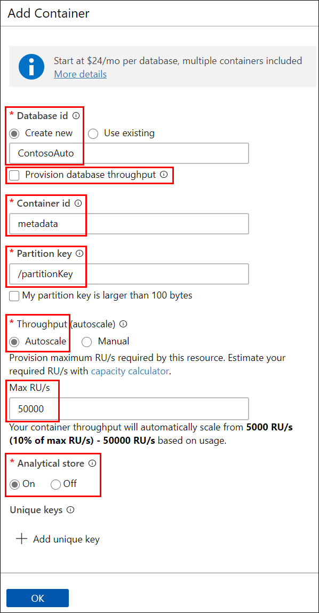

   > **Note**: We are setting the throughput on this container to Autoscale with a maximum of `50000` RU/s because the data generator will perform a bulk insert of metadata the first time it runs. This Autoscale setting will enable Cosmos DB to automatically scale up to accommodate this workload, then automatically scale back down when the bulk insert workload has completed.

6. Select **OK** to create the container.

7. Select **New Container** once again in the Data Explorer.

8. On the **Add Container** blade, specify the following configuration options:

   a. **Database id**: Select **Use existing**, then select **ContosoAuto** from the list.

   b. **Container id**: enter **telemetry**

   c. **Partition key**: **/partitionKey**

   d. **Throughput**: select **Autoscale**

   e. **Max RU/s**: enter **15000**

   f. **Analytical store**: select **On**

   

9. Select **OK** to create the container.

10. Select **New Container** once again in the Data Explorer.

11. On the **Add Container** blade, specify the following configuration options:

   a. **Database id**: Select **Use existing**, then select **ContosoAuto** from the list.

   b. **Container id**: enter **maintenance**

   c. **Partition key**: **/vin**

   d. **Throughput**: select **Manual** and enter **400**

   e. **Analytical store**: select **On**

   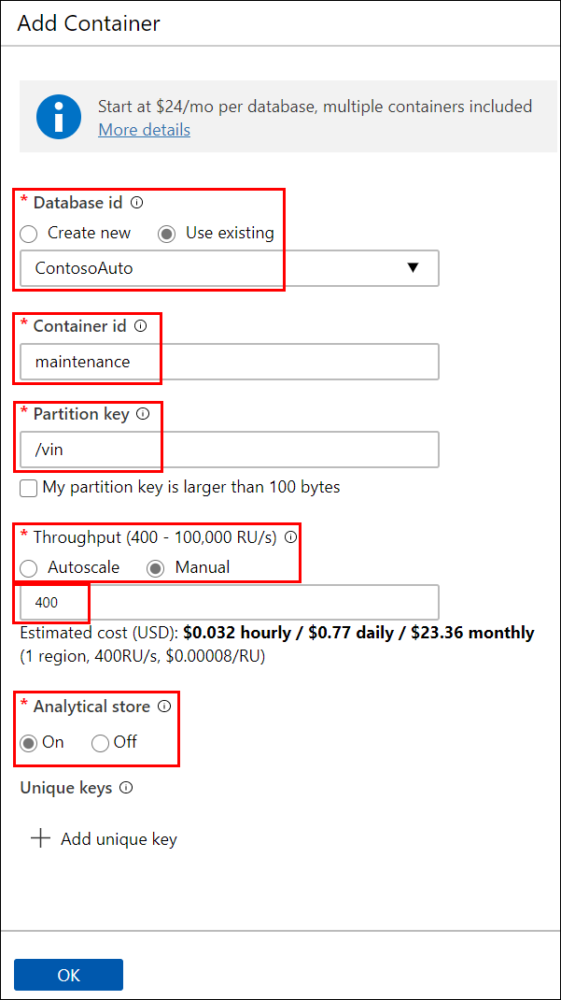

12. Select **OK** to create the container.

13. You should now have three containers listed in the Data Explorer.

    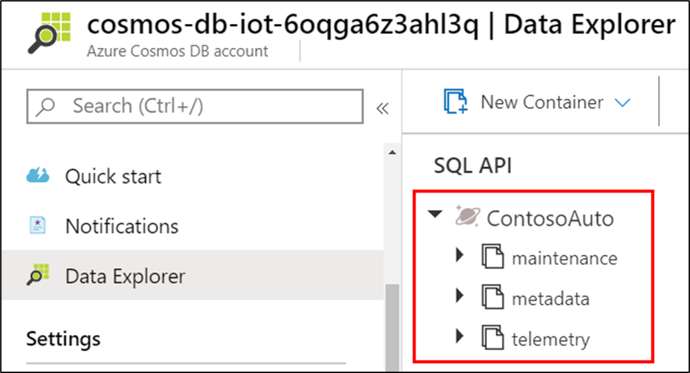

#### About Cosmos DB throughput

You will notice that we have intentionally set the **throughput** in RU/s for each container, based on our anticipated event processing and reporting workloads. In Azure Cosmos DB, provisioned throughput is represented as request units/second (RUs). RUs measure the cost of both read and write operations against your Cosmos DB container. Because Cosmos DB is designed with transparent horizontal scaling (i.e. scale out) and multi-master replication, you can very quickly and easily increase or decrease the number of RUs to handle thousands to hundreds of millions of requests per second around the globe with a single API call.

Cosmos DB allows you to increment/decrement the RUs in small increments of 100 at the database level, or at the container level. It is recommended that you configure throughput at the container granularity for guaranteed performance for the container all the time, backed by SLAs. Other guarantees that Cosmos DB delivers are 99.999% read and write availability all around the world, with those reads and writes being served in less than 10 milliseconds at the 99th percentile.

When you set a number of RUs for a container, Cosmos DB ensures that those RUs are available in all regions associated with your Cosmos DB account. When you scale out the number of regions by adding a new one, Cosmos will automatically provision the same quantity of RUs in the newly added region. You cannot selectively assign different RUs to a specific region. These RUs are provisioned for a container (or database) for all associated regions.

Note that we set two containers, metadata and telemetry, to **Autoscale** throughput, and one container, maintenance, to **Manual** throughput. [Autoscale](https://docs.microsoft.com/azure/cosmos-db/provision-throughput-autoscale) enables Azure Cosmos DB to automatically scale a container up and down, within the configured min and max limits, to accommodate variable workloads.

In this lab, the data generator will perform a one-time bulk ingest of data. While this process runs, more throughput will be needed than after the bulk ingest process is complete. A variable-throughput workload like this is a good scenario for **Autoscale**, so that Cosmos DB can automatically adjust to the changing needs of the workload without requiring manual adjustment of throughput.

The maintenance container is set to **Manual** as it is expected to be a steady workload with low throughput variability.

#### About Cosmos DB partitioning

When you created each container, you were required to define a **partition key**. As you will see later in the lab when you review the solution source code, each document stored within a collection contains a `partitionKey` property. One of the most important decisions one must make when creating a new container is to select an appropriate partition key for the data. A partition key should provide even distribution of storage and throughput (measured in requests per second) at any given time to avoid storage and performance bottlenecks.

For instance, vehicle metadata stores the VIN, which is a unique value for each vehicle, in the `partitionKey` field. Trip metadata also uses the VIN for the `partitionKey` field, since trips are most often queried by VIN, and trip documents are stored in the same logical partition as vehicle metadata since they are likely to be queried together, preventing fan-out, or cross-partition queries.  Package metadata, on the other hand, uses the Consignment ID value for the `partitionKey` field for the same purposes.

The partition key should be present in the bulk of queries for read-heavy scenarios to avoid excessive fan-out across numerous partitions. This is because each document with a specific partition key value belongs to the same logical partition, and is also stored in and served from the same physical partition. Each physical partition is replicated across geographical regions, resulting in global distribution.

Choosing an appropriate partition key for Cosmos DB is a critical step for ensuring balanced reads and writes, scaling, and, in the case of this solution, in-order change feed processing per partition. While there are no limits, per se, on the number of logical partitions, a single logical partition is allowed an upper limit of 20 GB of storage. Logical partitions cannot be split across physical partitions.

For the same reason, if the partition key chosen is of bad cardinality, you could potentially have skewed storage distribution. For instance, if one logical partition becomes larger faster than the others and hits the maximum limit of 20 GB, while the others are nearly empty, the physical partition housing the maxed out logical partition cannot split and could cause application downtime.

### Task 2: Configure Cosmos DB container indexing and TTL

In this task, you will review the default indexing set on your new containers, and configure the indexing for your `telemetry` container so it is optimized for write-heavy workloads. Next, you will enable time-to-live (TTL) on the `telemetry` container, allowing you to set the TTL value, in seconds, on individual documents stored in the container. This value tells Cosmos DB when to expire, or delete, the document(s) automatically. This setting can help save in storage costs by removing what you no longer need. Typically, this is used on hot data, or data that must be expired after a period of time due to regulatory requirements.

1. Expand the **telemetry** container in the Cosmos DB Data Explorer, then select **Scale & Settings**.

2. Within the Scale & Settings blade, expand the Settings section and select **On (no default)** under **Time to Live**.

   

   Turning the Time to Live setting on with no default allows us to define the TTL individually for each document, giving us more flexibility in deciding which documents should expire after a set period of time. To do this, we have a `ttl` field on the document that is saved to this container that specifies the TTL in seconds.

3. Scroll down in the Scale & Settings blade to view the **Indexing Policy**. The default policy is to automatically index all fields for each document stored in the collection. This is because all paths are included (remember, since we are storing JSON documents, we use paths to identify the property since they can exist within child collections in the document) by setting the value of `includedPaths` to `"path": "/*"`, and the only excluded path is the internal `_etag` property, which is used for versioning the documents. Here is what the default Indexing Policy looks like:

   ```json
   {
     "indexingMode": "consistent",
     "automatic": true,
     "includedPaths": [
       {
         "path": "/*"
       }
     ],
     "excludedPaths": [
       {
         "path": "/\"_etag\"/?"
       }
     ]
   }
   ```

4. Replace the **Indexing Policy** with the following, which excludes all paths, and only includes the paths used when we query the container (`vin`, `state`, and `partitionKey`):

   ```json
   {
     "indexingMode": "consistent",
     "automatic": true,
     "includedPaths": [
       {
         "path": "/vin/?"
       },
       {
         "path": "/state/?"
       },
       {
         "path": "/partitionKey/?"
       }
     ],
     "excludedPaths": [
       {
         "path": "/*"
       },
       {
         "path": "/\"_etag\"/?"
       }
     ]
   }
   ```

   

5. Select **Save** to apply your changes.

#### About Cosmos DB indexing policies

In this task, we updated the indexing policy for the `telemetry` container, but left the other two containers with the default policy. The default indexing policy for newly created containers indexes every property of every item, enforcing range indexes for any string or number, and spatial indexes for any GeoJSON object of type Point. This allows you to get high query performance without having to think about indexing and index management upfront.

Since the `metadata` and `maintenance` containers have more read-heavy workloads than `telemetry`, it makes sense to use the default indexing policy where query performance is optimized. Since we need faster writes for `telemetry`, we exclude unused paths. The use of indexing paths can offer improved write performance and lower index storage for scenarios in which the query patterns are known beforehand, as indexing costs are directly correlated to the number of unique paths indexed.

The indexing mode for all three containers is set to **Consistent**. This means the index is updated synchronously as items are added, updated, or deleted, enforcing the consistency level configured for the account for read queries. The other indexing mode one could choose is None, which disables indexing on the container. Usually this mode is used when your container acts as a pure key-value store, and you do not need indexes for any of the other properties. It is possible to dynamically change the consistency mode prior to executing bulk operations, then changing the mode back to Consistent afterwards, if the potential performance increase warrants the temporary change.

### Task 3: Create a Logic App workflow for email alerts

In this task, you will create a new Logic App workflow and configure it to send email alerts through its HTTP trigger. This trigger will be called by one of your Azure functions that gets triggered by the Cosmos DB change feed, any time a notification event occurs, such as completing a trip. You will need to have an Office 365 or Outlook.com account to send the emails.

1. In the [Azure portal](https://portal.azure.com), select **+ Create a resource**, then enter **logic app** into the search box on top. Select **Logic App** from the results.

   

2. Select the **Create** button on the **Logic App overview** blade.

3. On the **Create Logic App** blade, specify the following configuration options:

   1. **Name**: Unique value for the name, such as `Cosmos-IoT-Logic` (ensure the green check mark appears).
   2. **Subscription**: Select the Azure subscription you are using for this lab.
   3. **Resource group**: Select your lab resource group. The name should start with `cosmos-db-iot`.
   4. **Location**: Select the same location as your resource group.
   5. **Log Analytics**: Select **Off**.

   

4. Select **Create**.

5. After the Logic App is created, navigate to it by opening your resource group and selecting the new Logic App.

6. In the Logic App Designer, scroll through the page until you locate the Start with a common trigger section. Select the **When a HTTP request is received** trigger.

   

7. Paste the following JSON into the **Request Body JSON Schema** field. This defines the shape of the data the Azure function will send in the body of the HTTP request when an alert needs to be sent:

   ```json
   {
        "properties": {
           "consignmentId": {
             "type": "string"
           },
           "customer": {
             "type": "string"
           },
           "deliveryDueDate": {
             "type": "string"
           },
           "distanceDriven": {
             "type": "number"
           },
           "hasHighValuePackages": {
             "type": "boolean"
           },
           "id": {
             "type": "string"
           },
           "lastRefrigerationUnitTemperatureReading": {
             "type": "integer"
           },
           "location": {
             "type": "string"
           },
           "lowestPackageStorageTemperature": {
             "type": "integer"
           },
           "odometerBegin": {
             "type": "integer"
           },
           "odometerEnd": {
             "type": "number"
           },
           "plannedTripDistance": {
             "type": "number"
           },
           "recipientEmail": {
             "type": "string"
           },
           "status": {
             "type": "string"
           },
           "temperatureSetting": {
             "type": "integer"
           },
           "tripEnded": {
             "type": "string"
           },
           "tripStarted": {
             "type": "string"
           },
           "vin": {
             "type": "string"
           }
        },
        "type": "object"
   }
   ```

   

8. Select **+ New step** underneath the HTTP trigger.

   

9. Within the new action box, type `send email` in the search box, then select **Send an email - Office 365 Outlook** from the list of actions below. **Note**: If you do not have an Office 365 Outlook account, you may try one of the other email service options.

   

10. Select the **Sign in** button. Sign in to your account in the window that appears.

    

11. After signing in, the action box will display as the **Send an email** action form. Select the **To** field. The **Dynamic content** box will display after selecting To. To see the full list of dynamic values from the HTTP request trigger, select **See more** next to "When a HTTP request is received".

    

12. In the list of dynamic content, select **recipientEmail**. This will add the dynamic value to the **To** field.

    

13. In the **Subject** field, enter the following: `Contoso Auto trip status update:`, making sure you add a space at the end. Select the **status** dynamic content to append the trip status to the end of the subject.

    

14. Paste the following into the **Body** field. The dynamic content will automatically be added:

    ```text
    Here are the details of the trip and consignment:

    CONSIGNMENT INFORMATION:

    Customer: @{triggerBody()?['customer']}
    Delivery Due Date: @{triggerBody()?['deliveryDueDate']}
    Location: @{triggerBody()?['location']}
    Status: @{triggerBody()?['status']}

    TRIP INFORMATION:

    Trip Start Time: @{triggerBody()?['tripStarted']}
    Trip End Time: @{triggerBody()?['tripEnded']}
    Vehicle (VIN): @{triggerBody()?['vin']}
    Planned Trip Distance: @{triggerBody()?['plannedTripDistance']}
    Distance Driven: @{triggerBody()?['distanceDriven']}
    Start Odometer Reading: @{triggerBody()?['odometerBegin']}
    End Odometer Reading: @{triggerBody()?['odometerEnd']}

    PACKAGE INFORMATION:

    Has High Value Packages: @{triggerBody()?['hasHighValuePackages']}
    Lowest Package Storage Temp (F): @{triggerBody()?['lowestPackageStorageTemperature']}
    Trip Temp Setting (F): @{triggerBody()?['temperatureSetting']}
    Last Refrigeration Unit Temp Reading (F): @{triggerBody()?['lastRefrigerationUnitTemperatureReading']}

    REFERENCE INFORMATION:

    Trip ID: @{triggerBody()?['id']}
    Consignment ID: @{triggerBody()?['consignmentId']}
    Vehicle VIN: @{triggerBody()?['vin']}

    Regards,
    Contoso Auto Bot
    ```

15. Your Logic App workflow should now look like the following:

    

16. Select **Save** at the top of the designer to save your workflow.

17. After saving, the URL for the HTTP trigger will generate. Expand the HTTP trigger in the workflow, then copy the **HTTP POST URL** value and save it to Notepad or similar text application for a later step.

    

### Task 4: Create system-assigned managed identities for your Function Apps and Web App to connect to Key Vault

In order for your Function Apps and Web App to be able to access Key Vault to read the secrets, you must [create a system-assigned managed identity](https://docs.microsoft.com/azure/app-service/overview-managed-identity#adding-a-system-assigned-identity) for each, and [create an access policy in Key Vault](https://docs.microsoft.com/azure/key-vault/key-vault-secure-your-key-vault#key-vault-access-policies) for the application identities.

1. Open the Azure Function App whose name begins with **IoT-CosmosDBProcessing** and navigate to **Platform features**.

2. Select **Identity**.

   

3. Within the **System assigned** tab, switch **Status** to **On**. Select **Save**.

   

4. Open the Azure Function App whose name begins with **IoT-StreamProcessing** and navigate to **Platform features**.

5. Select **Identity**.

   

6. Within the **System assigned** tab, switch **Status** to **On**. Select **Save**.

   

7. Open the Web App (App Service) whose name begins with **IoTWebApp**.

8. Select **Identity** in the left-hand menu.

9. Within the **System assigned** tab, switch **Status** to **On**. Select **Save**.

   

### Task 5: Add Key Vault Access Policies for Managed Identities

Each of the following resources was deployed with its own system-assigned managed identity: two Function Apps, one Web App, and the Synapse Workspace.

In this task, you will enable each of these managed identities to retrieve secrets from the Azure Key Vault. The same steps are needed for each identity. The steps are shown below for one identity, but you must repeat the steps for all four.

> NOTE You MUST go through the following steps four times, once for each of the four managed identities: two Function Apps, one Web App, and the Synapse Workspace. If you do not do all these steps for EACH of these managed identities, later lab steps WILL FAIL.

1. Start in the Resource Group you are using for this lab.

2. Open the **Key Vault**. The name should begin with `iot-vault-`.

   

3. Select **Access policies** in the left-hand menu.

4. Select **+ Add Access Policy**.

   

5. Select the **Select principal** section on the Add access policy form.

   

6. In the Principal blade, paste the resource name into the `Select` field. Select the matching result, then select the **Select** button.

    > **Tip:** open two browser tabs, one showing your Resource Group with all your deployed resources, and the other tab showing Key Vault Access Policies for the following steps. Copy each resource's name from the Resource Group browser tab, and paste it into the `Select` field in the browser tab where you are working with Key Vault Access Policies.

    > **Note:** Remember that you have to add Access Policies for four managed identities! The following four screenshots show this for each of the managed identities (two Function Apps, one Web App, and the Synapse Workspace).

    > **Note:** It may take a few minutes before your managed identities appear after adding them in the previous step. If you cannot find this or the other identities, please wait another minute or two.

   

   

   

   

7. Expand the **Secret permissions** and check **Get** under Secret Management Operations.

   

8. Select **Add** to add the new access policy.

   

> **IMPORTANT** **Repeat steps 4-8** for each of the four managed identities (two Azure Functions, one Web App, and the Synapse Workspace).

9. You should now have four new Access Policies, one for each of the managed identities. Each should show "Get" under **Secret Permissions**. When you have verified this, click **Save**, then click **OK** to confirm.

   

### Task 6: Add your user account to Key Vault access policy

Perform these steps to create an access policy for your user account so you can manage secrets. Since we created Key Vault with a template, your account was not automatically added to the access policies.

1. Within Key Vault, select **Access policies** in the left-hand menu.

2. Select **+ Add Access Policy**.

   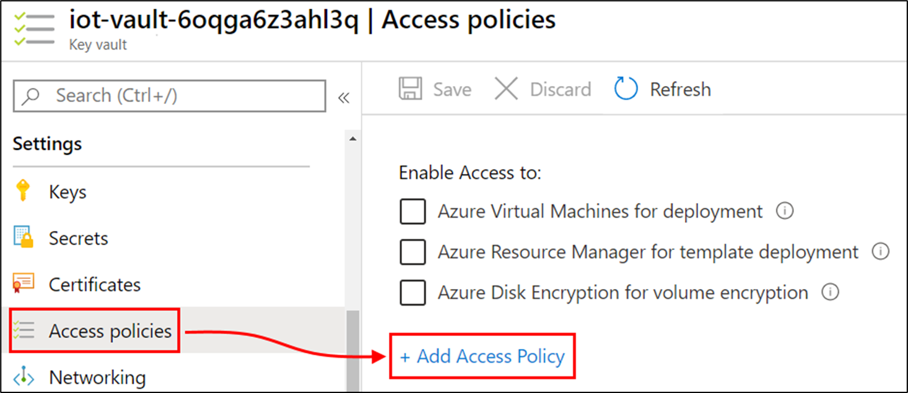

3. Select the **Select principal** section on the Add access policy form.

   

4. In the Principal blade, search for the Azure account you are using for this lab, select it, then select the **Select** button.

   

5. Expand the **Secret permissions** and check **Select all** under Secret Management Operations. All 8 should be selected.

   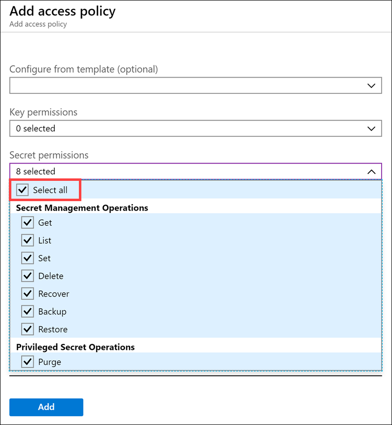

6. Select **Add** to add the new access policy.. When you are done, you should have an access policy for your user account. Select **Save** to save your new access policy.

    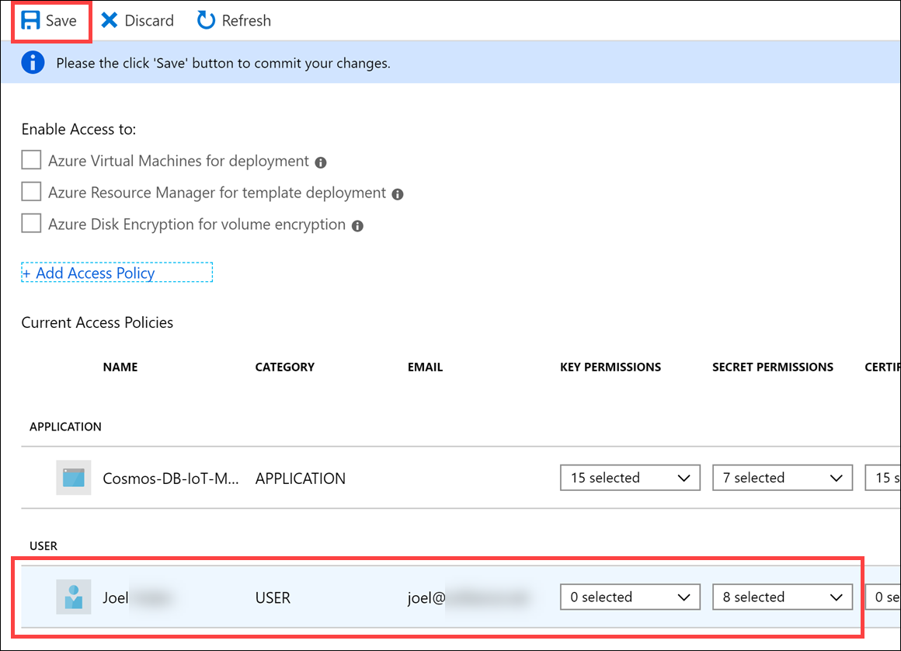

### Task 7: Add Key Vault secrets

Azure Key Vault is used to securely store and control access to tokens, passwords, certificates, API keys, and other secrets. Secrets that are stored in Azure Key Vault are centralized, giving the added benefit of only needing to update secrets in one place, such as an application key value after recycling the key for security purposes. In this task, we will store application secrets in Azure Key Vault, then configure the Function Apps and Web App to securely connect to Azure Key Vault by performing the following steps:

- Add secrets to the provisioned Key Vault.
- Create a system-assigned managed identity for each Azure Function App and the Web App to read from the vault.
- Create an access policy in Key Vault with the "Get" secret permission, assigned to each of these application identities.

1. Within Key Vault, select **Secrets** in the left-hand menu, then select **+ Generate/Import** to create a new secret.

   

2. Use the table below for the Name / Value pairs to use when creating the secrets. You only need to populate the **Name** and **Value** fields for each secret, and can leave the other fields at their default values.

   | **Name**            |                                                                          **Value**                                                                          |
   | ------------------- | :---------------------------------------------------------------------------------------------------------------------------------------------------------: |
   | CosmosDBConnection  |                            Your Cosmos DB connection string found here: **Cosmos DB account > Keys > Primary Connection String**                            |
   | CosmosDBEndpoint    |                                           Your Cosmos DB endpoint found here: **Cosmos DB account > Keys > URI**                                            |
   | CosmosDBPrimaryKey  |                                      Your Cosmos DB primary key found here: **Cosmos DB account > Keys > Primary Key**                                      |
   | IoTHubConnection    |                         Your IoT Hub connection string found here: **IoT Hub > Built-in endpoints > Event Hub-compatible endpoint**                         |
   | EventHubsConnection | Your Event Hubs connection string found here: **Event Hubs namespace > Shared access policies > RootManageSharedAccessKey > Connection string-primary key** |
   | LogicAppUrl         |                         Your Logic App's HTTP Post URL found here: **Logic App Designer > Select the HTTP trigger > HTTP POST URL**                         |

3. You can locate most of your secrets by viewing the outputs of your deployment. To do this, open your resource group then select **Deployments** in the left-hand menu. Select the **Microsoft.Template** deployment.

    

4. Select **Outputs** in the left-hand menu. You can find most of the values above and simply copy them.

    

5. When you are finished creating the secrets, your list should look similar to the following:

   

### Task 8: Configure Synapse Workspace

1. Enable Data Lake Storage Access for Synapse Workspace Managed Identity

   The Synapse Workspace and its Storage Account were created with an ARM template. The Synapse Workspace was configured with a System Managed Identity. We need to grant that Managed Identity access to the Storage Account.

   Start in your Resource Group. Similarly to Task 5, copy your deployed Synapse Workspace name.

   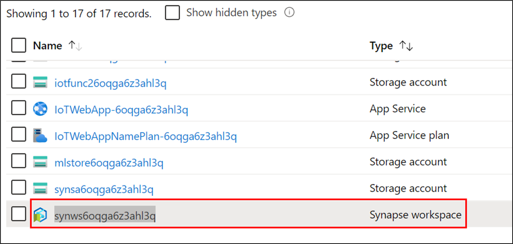

   Now select the Storage Account that was deployed for the Synapse Workspace. Its name will begin with "synsa". Be careful to select the correct Storage Account!

   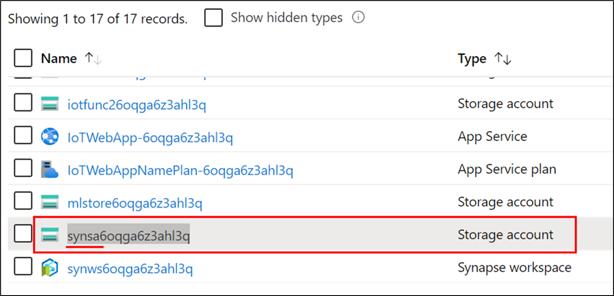

   In the Storage Account, navigate to the **Access control (IAM)** blade. Then select **Role Assignments**. Then click **+ Add**.

   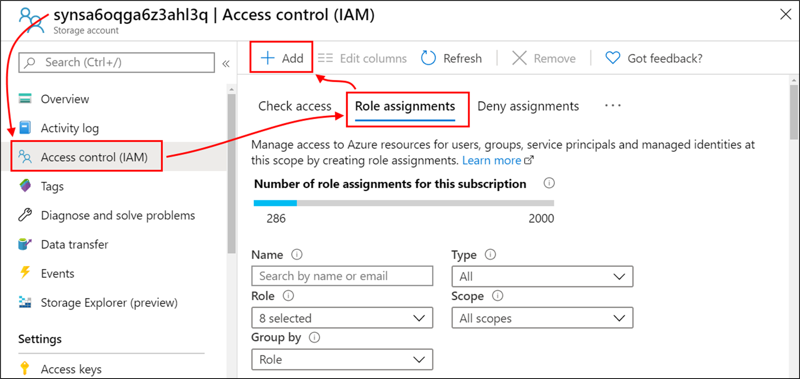

   On the **+ Add** dropdown, select **Add role assignment**.

   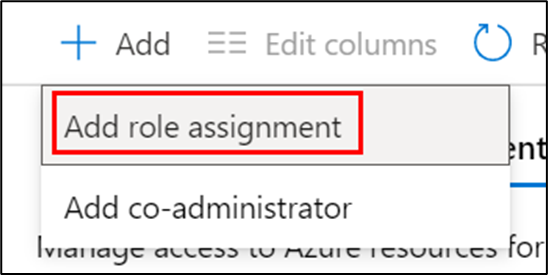

   On the **Add role assignment** blade, set **Role** to **Storage Blob Data Contributor**. Then paste your Synapse Workspace's name into the **Select** field. Select it from the results area, then select **Save**.

   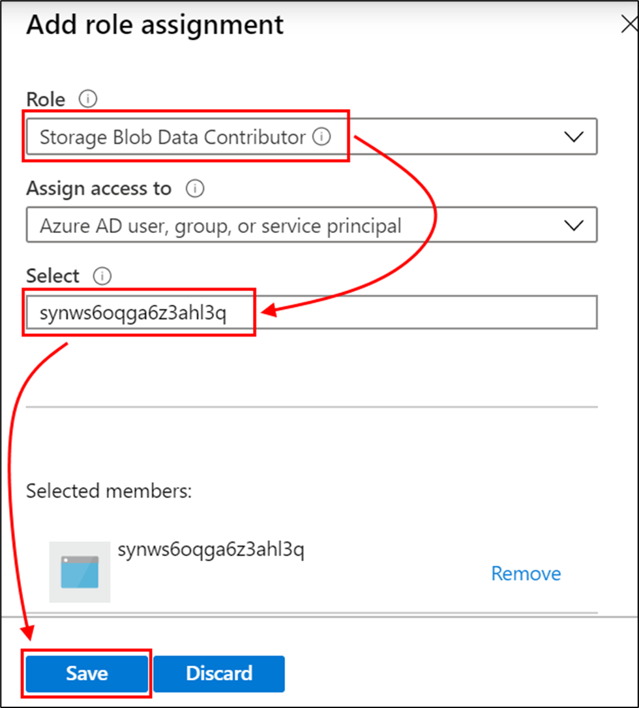

   After the Role Assignment is successfully saved, return to your Resource Group.

2. Deploy a Spark pool in Azure Synapse Workspace

   In your Resource Group, select the Azure Synapse Workspace.

   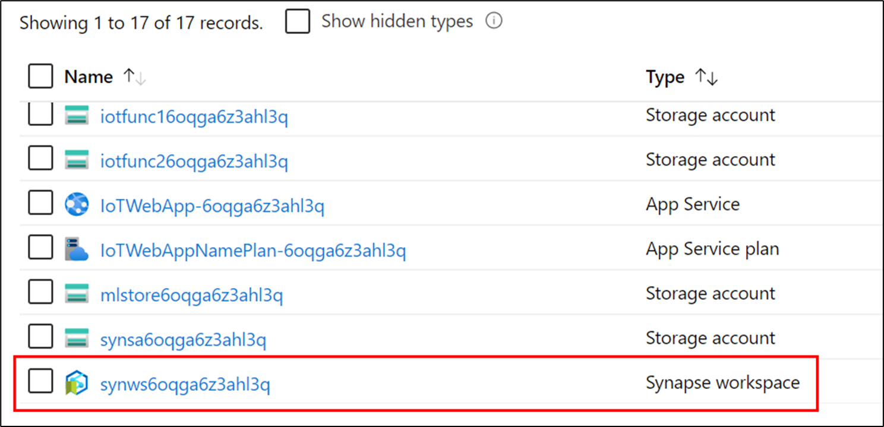

   In the Azure Synapse Workspace Overview blade, select **Launch Synapse Studio**.

   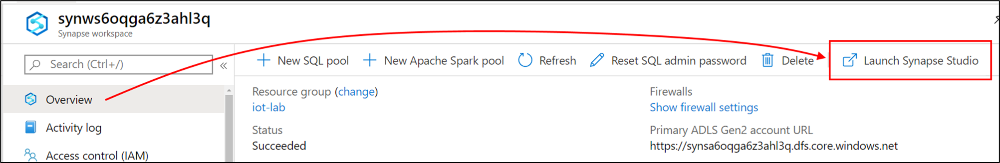

   From Azure Synapse Studio Home, select **Manage**. (You can expand the left nav bar to see names.)

   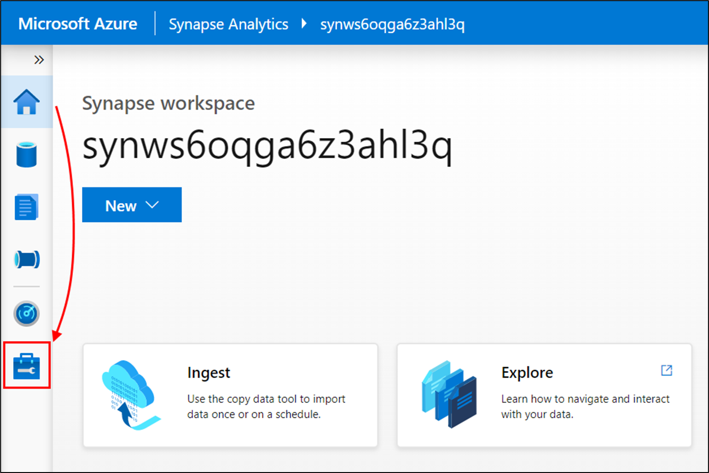

   From Manage, select **Apache Spark pools**, then select **+ New**.

   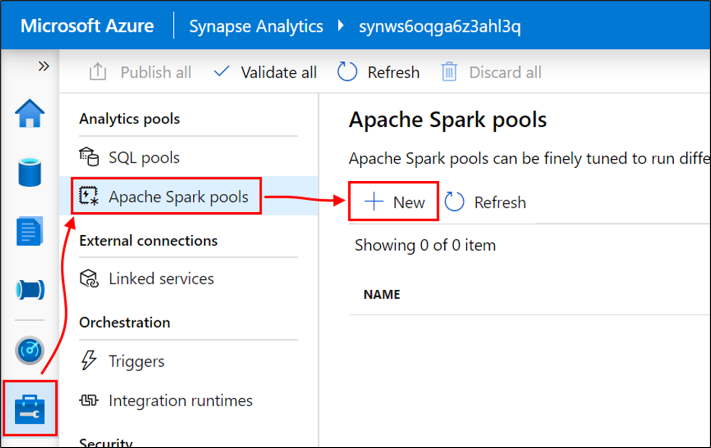

   On **Basics**, provide an Apache Spark pool name (this may only contain letters and numbers) and set pool scale and size settings. For this lab, setting `Node size` to **Small (4 vCPU / 32 GB)** and `Number of nodes` to scale from 3 to 4 will be sufficient.

   Then select **Next: Additional settings >**.

   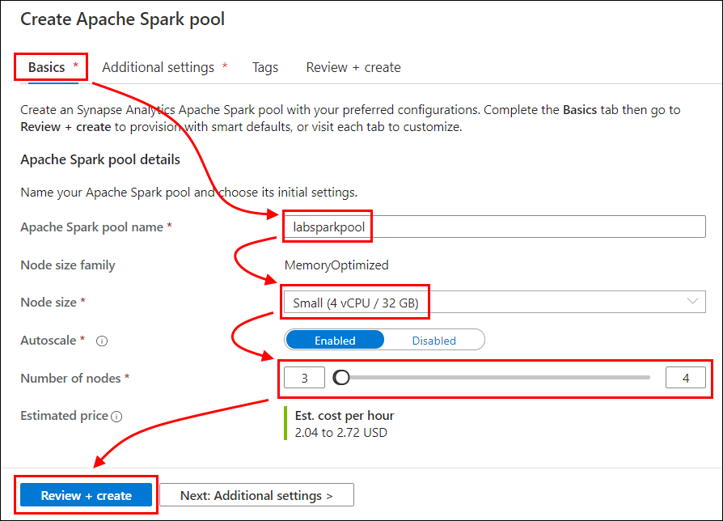

   On **Additional Settings**, scroll down to **Packages**. Next to **File Upload**, select the *Select a file* field to show a file upload dialog.

   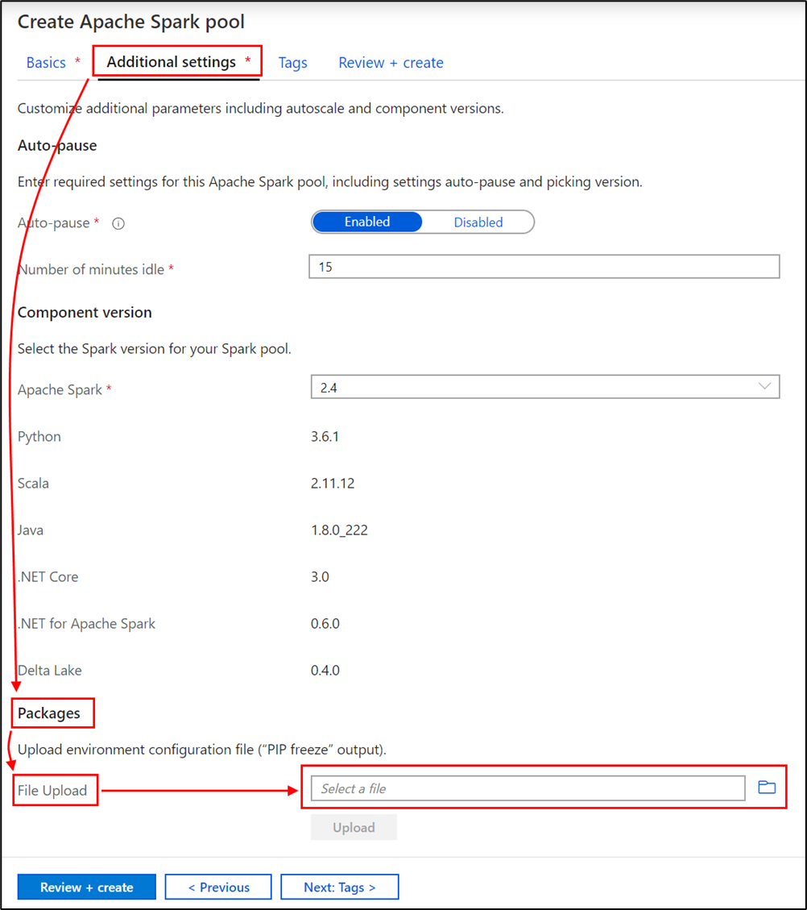

   In the lab files you downloaded initially, find and select `assets/synapse-spark-pool-requirements.txt`. Then select **Upload**.

   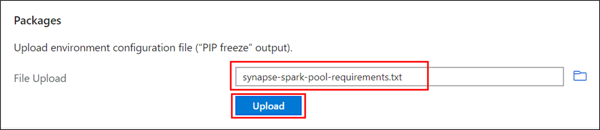

   Verify that the file uploaded, then select **Review + create**.

   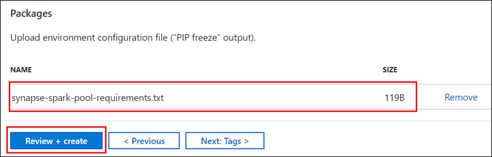

   On **Review + create** verify that validation succeeded and confirm all settings, then select **Create**.

   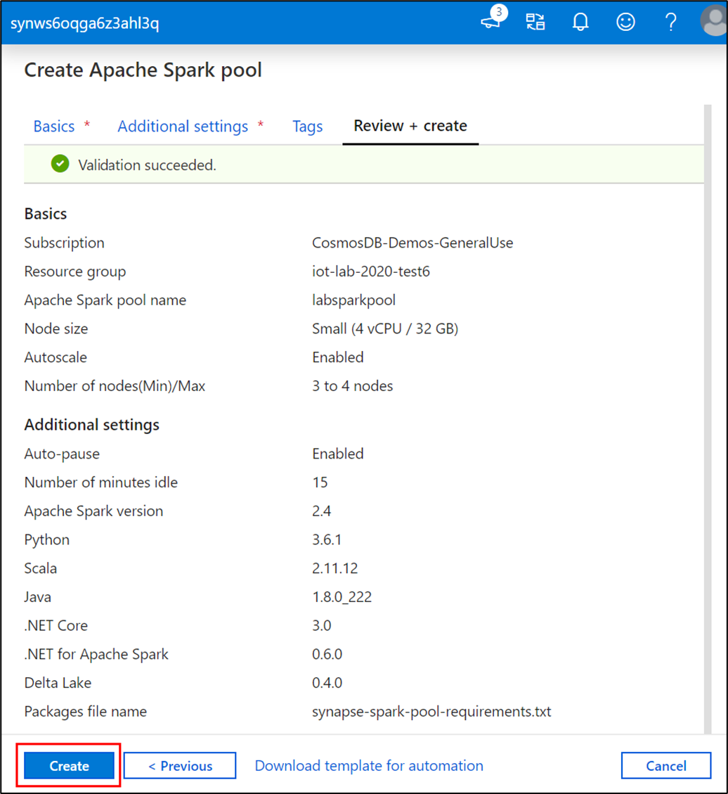

   There will be notifications during Spark pool deployment, and once it is complete.

   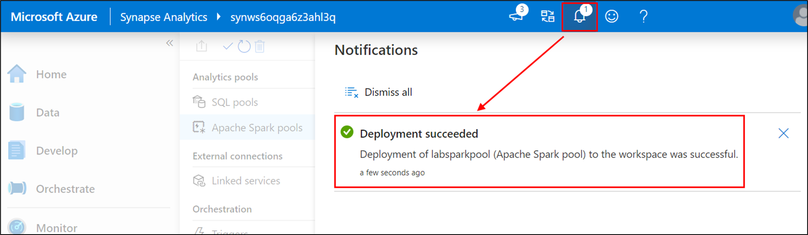

   You can now return to Azure Synapse Studio Home.

**This completes the lab environment configuration tasks. Please continue to the next Exercise.**

[Return to Table of Contents to continue Lab](./README.md)
