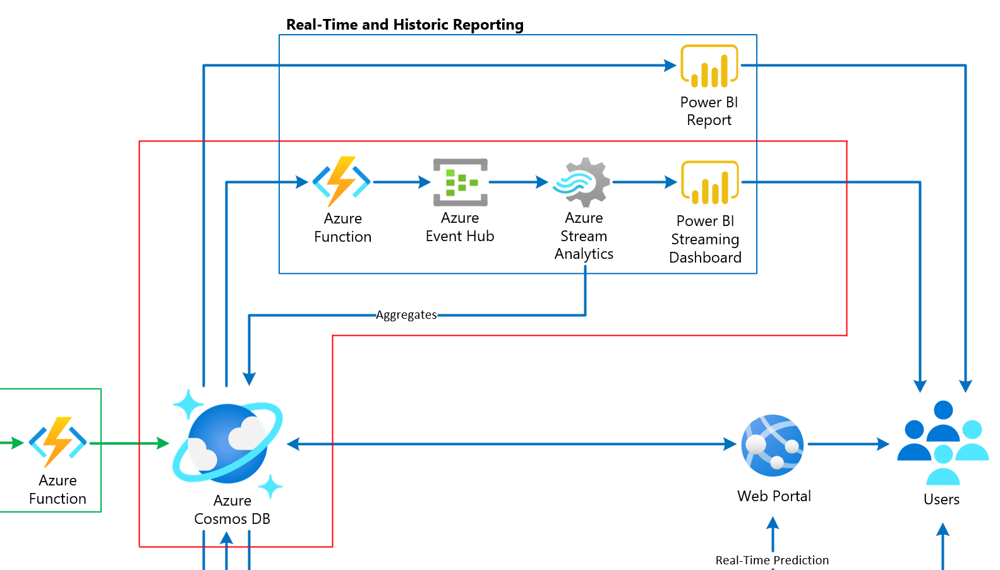

# Cosmos DB scenario-based labs - IoT

## 3. Configure Stream Analytics

**Duration**: 15 minutes

<!-- TOC -->
- [Task 1: Add Stream Analytics Event Hubs input](#task-1-add-stream-analytics-event-hubs-input)
- [Task 2: Add Stream Analytics outputs](#task-2-add-stream-analytics-outputs)
- [Task 3: Create Stream Analytics query](#task-3-create-stream-analytics-query)
- [Task 4: Run Stream Analytics job](#task-4-run-stream-analytics-job)
<!-- /TOC -->

If you examine the right-hand side of the solution architecture diagram, you will see a flow of event data that feeds into Event Hubs from a Cosmos DB change feed-triggered function. Stream Analytics uses the event hub as an input source for a set of time window queries that create aggregates for individual vehicle telemetry, and overall vehicle telemetry that flows through the architecture from the vehicle IoT devices. Stream Analytics has two output data sinks:

1. Cosmos DB: Individual vehicle telemetry (grouped by VIN) is aggregated over a 30-second `TumblingWindow` and saved to the `metadata` container. This information is used in a Power BI report you will create in Power BI Desktop in a later task to display individual vehicle and multiple vehicle statistics.
2. Power BI: All vehicle telemetry is aggregated over a 10-second `TumblingWindow` and output to a Power BI data set. This near real-time data is displayed in a live Power BI dashboard to show in 10 second snapshots how many events were processed, whether there are engine temperature, oil, or refrigeration unit warnings, whether aggressive driving was detected during the period, and the average speed, engine temperature, and refrigeration unit readings.



In this exercise, you will configure Stream Analytics for stream processing as described above.

### Task 1: Add Stream Analytics Event Hubs input

1. In the [Azure portal](https://portal.azure.com), open your lab resource group, then open your **Stream Analytics job**.

   

2. Select **Inputs** in the left-hand menu. In the Inputs blade, select **+ Add stream input**, then select **Event Hub** from the list.

   

3. In the **New input** form, specify the following configuration options:

   1. **Input alias**: Enter **events**.
   2. Select the **Select Event Hub from your subscriptions** option beneath.
   3. **Subscription**: Choose your Azure subscription for this lab.
   4. **Event Hub namespace**: Find and select your Event Hub namespace (eg. `iot-namespace`).
   5. **Event Hub name**: Select **Use existing**, then **reporting**.
   6. **Event Hub policy name**: Choose the default `RootManageSharedAccessKey` policy.

   

4. Select **Save**.

You should now see your Event Hubs input listed.


### Task 2: Add Stream Analytics outputs

1. Select **Outputs** in the left-hand menu. In the Outputs blade, select **+ Add**, then select **Cosmos DB** from the list.

   

2. In the **New output** form, specify the following configuration options:

   1. **Output alias**: Enter **cosmosdb**.
   2. Select the **Select Cosmos DB from your subscriptions** option beneath.
   3. **Subscription**: Choose your Azure subscription for this lab.
   4. **Account id**: Find and select your Cosmos DB account (eg. `cosmos-db-iot`).
   5. **Database**: Select **Use existing**, then **ContosoAuto**.
   6. **Container name**: Enter **metadata**.

   

3. Select **Save**.

4. **If you have never signed in to Power BI with this account**, open a new browser tab and navigate to <https://powerbi.com> and sign in. Confirm any messages that appear and continue to the next step after the home page appears. This will help the connection authorization step from Stream Analytics succeed and find the group workspace.

5. While remaining in the Outputs blade, select **+ Add** once again, then select **Power BI** from the list.

   

6. In the **New output** form, look toward the bottom to find the **Authorize connection** section, then select **Authorize** to sign in to your Power BI account. If you do not have a Power BI account, select the _Sign up_ option first.

   

7. After authorizing the connection to Power BI, specify the following configuration options in the form:

   1. **Output alias**: Enter **powerbi**.
   2. **Group workspace**: Select **My workspace**.
   3. **Dataset name**: Enter **Contoso Auto IoT Events**.
   4. **Table name**: Enter **FleetEvents**.

   

8. Select **Save**.

You should now have two outputs listed.


### Task 3: Create Stream Analytics query

The Query is Stream Analytics' work horse. This is where we process streaming inputs and write data to our outputs. The Stream Analytics query language is SQL-like, allowing you to use familiar syntax to explore and transform the streaming data, create aggregates, and create materialized views that can be used to help shape your data structure before writing to the output sinks. Stream Analytics jobs can only have one Query, but you can write to multiple outputs in a single Query, as you will do in the steps that follow.

Please take a moment to analyze the query below. Notice how we are using the `events` input name for the Event Hubs input you created, and the `powerbi` and `cosmosDB` outputs, respectively. Also see where we use the `TumblingWindow` in durations of 30 seconds for `VehicleData`, and 10 seconds for `VehicleDataAll`. The `TumblingWindow` helps us evaluate events that occurred during the past X seconds and, in our case, create averages over those time periods for reporting.

1. Select **Query** in the left-hand menu. Replace the contents of the query window with the script below:

    ```sql
    WITH
    VehicleData AS (
        select
            vin,
            AVG(engineTemperature) AS engineTemperature,
            AVG(speed) AS speed,
            AVG(refrigerationUnitKw) AS refrigerationUnitKw,
            AVG(refrigerationUnitTemp) AS refrigerationUnitTemp,
            (case when AVG(engineTemperature) >= 400 OR AVG(engineTemperature) <= 15 then 1 else 0 end) as engineTempAnomaly,
            (case when AVG(engineoil) <= 18 then 1 else 0 end) as oilAnomaly,
            (case when AVG(transmission_gear_position) <= 3.5 AND
                AVG(accelerator_pedal_position) >= 50 AND
                AVG(speed) >= 55 then 1 else 0 end) as aggressiveDriving,
            (case when AVG(refrigerationUnitTemp) >= 30 then 1 else 0 end) as refrigerationTempAnomaly,
            System.TimeStamp() as snapshot
        from events TIMESTAMP BY [timestamp]
        GROUP BY
            vin,
            TumblingWindow(Duration(second, 30))
    ),
    VehicleDataAll AS (
        select
            AVG(engineTemperature) AS engineTemperature,
            AVG(speed) AS speed,
            AVG(refrigerationUnitKw) AS refrigerationUnitKw,
            AVG(refrigerationUnitTemp) AS refrigerationUnitTemp,
            COUNT(*) AS eventCount,
            (case when AVG(engineTemperature) >= 318 OR AVG(engineTemperature) <= 15 then 1 else 0 end) as engineTempAnomaly,
            (case when AVG(engineoil) <= 20 then 1 else 0 end) as oilAnomaly,
            (case when AVG(transmission_gear_position) <= 4 AND
                AVG(accelerator_pedal_position) >= 50 AND
                AVG(speed) >= 55 then 1 else 0 end) as aggressiveDriving,
            (case when AVG(refrigerationUnitTemp) >= 22.5 then 1 else 0 end) as refrigerationTempAnomaly,
            System.TimeStamp() as snapshot
        from events t TIMESTAMP BY [timestamp]
        GROUP BY
            TumblingWindow(Duration(second, 10))
    )
    -- INSERT INTO POWER BI
    SELECT
        *
    INTO
        powerbi
    FROM
        VehicleDataAll
    -- INSERT INTO COSMOS DB
    SELECT
        *,
        entityType = 'VehicleAverage',
        partitionKey = vin
    INTO
        cosmosdb
    FROM
        VehicleData
    ```

    

2. Select **Save query**.

### Task 4: Run Stream Analytics job

Next, we will start the Stream Analytics job so we can begin processing event data once it starts to flow through the services.

1. Select **Overview**.

2. In the Overview blade, select **Start** and select **Now** for the job output start time.

3. Select **Start** to beginning running the Stream Analytics job.

   

[Return to Table of Contents to continue](./README.md)
