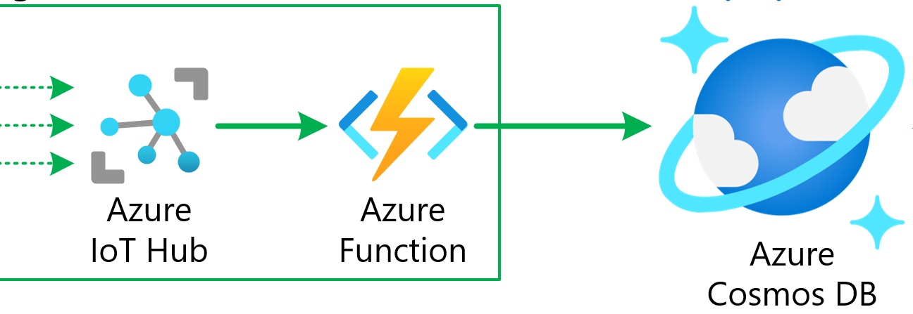
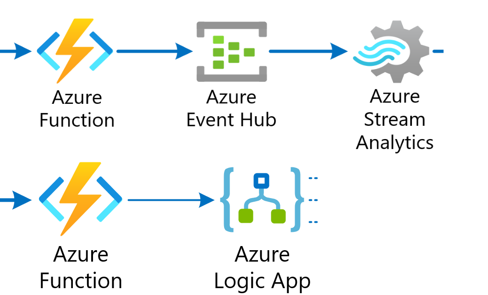
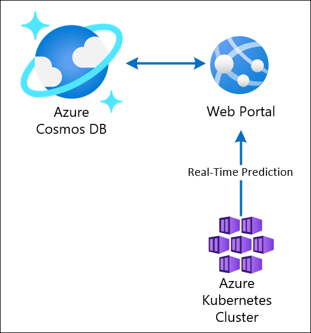
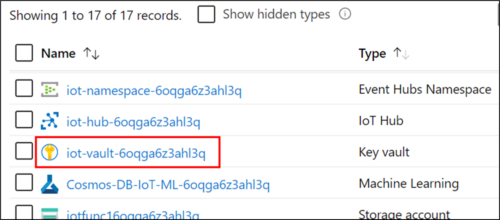
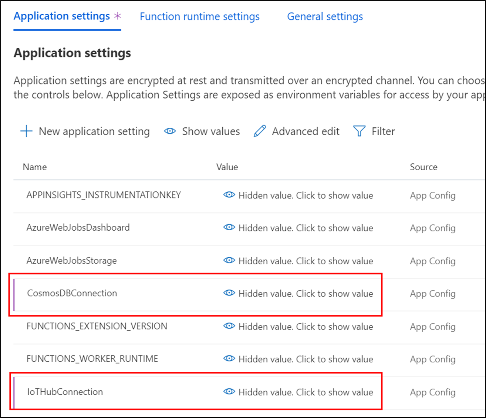
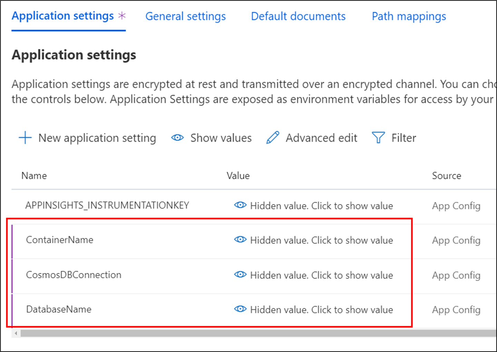

## Exercise 3: Deploy Azure Functions and Web App

**Duration**: 30 minutes

<summary><strong><em>Table of Contents</em></strong></summary>
<!-- TOC -->
- [Task 1: Retrieve the URI for each Key Vault secret](#task-1-retrieve-the-uri-for-each-key-vault-secret)
- [Task 2: Configure application settings in Azure](#task-2-configure-application-settings-in-azure)
- [Task 3: Open solution](#task-3-open-solution)
- [Task 4: Code completion and walk-through](#task-4-code-completion-and-walk-through)
- [Task 5: Deploy Cosmos DB Processing Function App](#task-5-deploy-cosmos-db-processing-function-app)
- [Task 6: Deploy Stream Processing Function App](#task-6-deploy-stream-processing-function-app)
- [Task 7: Deploy Web App](#task-7-deploy-web-app)
- [Task 8: View Cosmos DB processing Function App in the portal and copy the Health Check URL](#task-8-view-cosmos-db-processing-function-app-in-the-portal-and-copy-the-health-check-url)
- [Task 9: View stream processing Function App in the portal and copy the Health Check URL](#task-9-view-stream-processing-function-app-in-the-portal-and-copy-the-health-check-url)
<!-- /TOC -->

In the architecture for this scenario, Azure functions play a major role in event processing. These functions execute within an Azure Function App, Microsoft's serverless solution for easily running small pieces of code, or "functions," in the cloud. You can write just the code you need for the problem at hand, without worrying about a whole application or the infrastructure to run it. Functions can make development even more productive, and you can use your development language of choice, such as C#, F#, Node.js, Java, or PHP.

Before we dive into this exercise, let's go over how the functions and Web App fit into our architecture.

There are two Function Apps and one Web App in the solution. The Function Apps handle event processing within two stages of the data pipeline, and the Web App is used to perform CRUD operations against data stored in Cosmos DB.


You may wonder, if a Function App contains several functions within, _why do we need two Function Apps instead of one_? The primary reason for using two Function Apps is due to how functions scale to meet demand. When you use the Azure Functions consumption plan, you only pay for the time your code runs. More importantly, Azure automatically handles scaling your functions to meet demand. It scales using an internal scale controller that evaluates the type of trigger the functions are using, and applies heuristics to determine when to scale out to multiple instances. The important thing to know is that functions scale at the Function App level. Meaning, if you have one very busy function and the rest are mostly idle, that one busy function causes the entire Function App to scale. Think about this when designing your solution. It is a good idea to **divide extremely high-load functions into separate Function Apps**.

Now let's introduce the Function Apps and Web App and how they contribute to the architecture.

- **IoT-StreamProcessing Function App**: This is the Stream Processing Function App, and it contains a two functions:

  - **IoTHubTrigger**: This function is automatically triggered by the IoT Hub's Event Hub endpoint as vehicle telemetry is sent by the data generator. The function performs some light processing to the data by defining the partition key value, the document's TTL, adds a timestamp value, then saves the information to Cosmos DB.
  - **HealthCheck**: This function has an Http trigger that enables users to verify that the Function App is up and running, and that each configuration setting exists and has a value. More thorough checks would validate each value against an expected format or by connecting to each service as required. The function will return an HTTP status of `200` (OK) if all values contain non-zero strings. If any are null or empty, the function will return an error (`400`), indicating which values are missing. The data generator calls this function before running.

  

- **IoT-CosmosDBProcessing Function App**: This is the Trip Processing Function App. It contains two functions that are triggered by the Cosmos DB Change Feed on the `telemetry` container. Because the Cosmos DB Change Feed supports multiple consumers, these functions can run in parallel, processing the same information simultaneously without conflicting with each other. When we define the `CosmosDBTrigger` for each of these functions, we configure the trigger settings to connect to a Cosmos DB collection named `leases` to keep track of which change feed events they have processed. We also set the `LeaseCollectionPrefix` value for each function with a unique prefix so one function does not attempt to retrieve or update the lease information for another. The following functions are in this Function App:

  - **TripProcessor**: This function groups vehicle telemetry data by VIN, retrieves the associated Trip record from the `metadata` container, updates the Trip record with a trip start timestamp, an end timestamp if completed, and a status showing whether the trip has started, is delayed, or has completed. It also updates the associated Consignment record with the status, and triggers the Logic App with the trip information if an alert needs to be emailed to the recipient defined in the Function App's app settings (`RecipientEmail`).
  - **SendToEventHubsForReporting**: This function simply sends the vehicle telemetry data straight to Event Hubs, allowing Stream Analytics to apply windowed aggregates and save those aggregates in batches to Power BI and to the Cosmos DB `metadata` container.
  - **HealthCheck**: As with the function of the same name within the Stream Processing Function App, this function has an Http trigger that enables users to verify that the Function App is up and running, and that each configuration setting exists and has a value. The data generator calls this function before running.

  

- **IoTWebApp**: The Web App provides a Fleet Management portal, allowing users to perform CRUD operations on vehicle data, make real-time battery failure predictions for a vehicle against the deployed machine learning model, and view consignments, packages, and trips. It connects to the Cosmos DB `metadata` container, using the [.NET SDK for Cosmos DB v3](https://github.com/Azure/azure-cosmos-dotnet-v3/).

  

### Task 1: Retrieve the URI for each Key Vault secret

When you set the App Settings for the Function Apps and Web App in the next task, you will need to reference the URI of a secret in Key Vault, including the version number. To do this, perform the following steps for each secret and **copy the values** to Notepad or similar text application.

1. Open your Key Vault instance in the portal.

2. Select **Secrets** under Settings in the left-hand menu.

3. Select the secret whose URI value you wish to obtain.

4. Select the **Current Version** of the secret.

   

5. Copy the **Secret Identifier**.

   

   When you add the Key Vault reference to this secret within a Function App's App Settings, you will use the following format: `@Microsoft.KeyVault(SecretUri={referenceString})`, where `{referenceString}` is replaced by the Secret Identifier (URI) value above. **Make sure you remove the curly braces (`{}`)**.

   For example, a complete reference would look like the following:

   `@Microsoft.KeyVault(SecretUri=https://iot-vault-501993860.vault.azure.net/secrets/CosmosDBConnection/794f93084861483d823d37233569561d)`

### Task 2: Configure application settings in Azure

> We recommend that you open two browser tabs for these steps. One to copy secrets from each Azure service, and the other to add the secrets to Key Vault.

1. Using a new tab or instance of your browser, navigate to the Azure portal, <https://portal.azure.com>.

2. Select **Resource groups** from the left-hand menu, then search for your resource group by typing in `cosmos-db-iot`. Select your resource group that you are using for this lab.

3. Open the your **Key Vault**. The name should begin with `iot-vault`.

   

4. In another browser tab, open the Azure Function App whose name begins with **IoT-CosmosDBProcessing**.

5. Select **Configuration** on the Overview pane.

    

6. Scroll to the **Application settings** section. Use the **+ New application setting** link to create the following additional Key/Value pairs (the key names must exactly match those found in the table below):

    | **Application Key**      |                                                                          **Value**                                                                          |
    | ------------------------ | :---------------------------------------------------------------------------------------------------------------------------------------------------------: |
    | CosmosDBConnection     | Enter `@Microsoft.KeyVault(SecretUri={referenceString})`, where `{referenceString}` is the URI for the **CosmosDBConnection** Key Vault secret |
    | EventHubsConnection   | Enter `@Microsoft.KeyVault(SecretUri={referenceString})`, where `{referenceString}` is the URI for the **EventHubsConnection** Key Vault secret |
    | LogicAppUrl        | Enter `@Microsoft.KeyVault(SecretUri={referenceString})`, where `{referenceString}` is the URI for the **LogicAppUrl** Key Vault secret |
    | RecipientEmail      | Enter a **valid email address** you want to receive notification emails from the Logic App. |

    

7. Select **Save** to apply your changes. Select **Continue** when prompted.

8. Open the Azure Function App whose name begins with **IoT-StreamProcessing**.

9. Select **Configuration** on the Overview pane.

10. Scroll to the **Application settings** section. Use the **+ New application setting** link to create the following additional Key/Value pairs (the key names must exactly match those found in the table below):

    | **Application Key**      |                                                                          **Value**                                                                          |
    | ------------------------ | :---------------------------------------------------------------------------------------------------------------------------------------------------------: |
    | CosmosDBConnection     | Enter `@Microsoft.KeyVault(SecretUri={referenceString})`, where `{referenceString}` is the URI for the **CosmosDBConnection** Key Vault secret |
    | IoTHubConnection     | Enter `@Microsoft.KeyVault(SecretUri={referenceString})`, where `{referenceString}` is the URI for the **IoTHubConnection** Key Vault secret |

    

11. Select **Save** to apply your changes. Select **Continue** when prompted.

12. Open the Web App (App Service) whose name begins with **IoTWebApp**.

13. Select **Configuration** in the left-hand menu.

14. Scroll to the **Application settings** section. Use the **+ New application setting** link to create the following additional Key/Value pairs (the key names must exactly match those found in the table below):

    | **Application Key**      |                                                                          **Value**                                                                          |
    | ------------------------ | :---------------------------------------------------------------------------------------------------------------------------------------------------------: |
    | CosmosDBConnection     | Enter `@Microsoft.KeyVault(SecretUri={referenceString})`, where `{referenceString}` is the URI for the **CosmosDBConnection** Key Vault secret |
    | DatabaseName     | Enter `ContosoAuto` |
    | ContainerName     | Enter `metadata` |

    

15. Select **Save** to apply your changes. Select **Continue** when prompted.

> Verify that the system-managed identities for both Function Apps and Web App are working properly and able to access Key Vault. To do this, within each Function App and the Web App, open the **CosmosDBConnection** setting and look at the **Key Vault Reference Details** underneath the setting. You should see an output similar to the following, which displays the secret details and indicates that it is using the _System assigned managed identity_:


> If you see an error in the Key Vault Reference Details, go to Key Vault and delete the access policy for the related system identity. Then go back to the Function App or web app, turn off the System Identity, turn it back on (which creates a new one), then re-add it to Key Vault's access policies.

### Task 3: Open solution

In this task, you will open the Visual Studio solution for this lab. It contains projects for both Function Apps, the Web App, and the data generator.

1. Open File Explorer and navigate to the location where you saved the code earlier in the "Before the hands-on lab" exercise. Navigate into the **Starter** folder. Open the Visual Studio solution file: **CosmosDbIoTScenario.sln**.

    > If Visual Studio prompts you to sign in when it first launches, use the account provided to you for this lab (if applicable), or an existing Microsoft account.

2. After opening the solution, observe the included projects in the **Solution Explorer**:

    1. **Functions.CosmosDB**: Project for the **IoT-CosmosDBProcessing** Function App.
    2. **Functions.StreamProcessing**: Project for the **IoT-StreamProcessing** Function App.
    3. **CosmosDbIoTScenario.Common**: Contains entity models, extensions, and helpers used by the other projects.
    4. **FleetDataGenerator**: The data generator seeds the Cosmos DB `metadata` container with data and simulates vehicles, connects them to IoT Hub, then sends generated telemetry data.
    5. **FleetManagementWebApp**: Project for the **IoTWebApp** Web App.

    

3. Right-click on the `CosmosDbIoTScenario` solution in Solution Explorer, then select **Restore NuGet Packages**. The packages may have already been restored upon opening the solution.

### Task 4: Code completion and walk-through

The Function App and Web App projects contain blocks of code that need to be completed before you can deploy them. The reason for this is to help guide you through the solution, and to better understand the code by completing small fragments.

1. In Visual Studio, select **View**, then select **Task List**. This will display the list of **TODO** items, helping you navigate to each one.

    

    The Task List appears at the bottom of the window:

    

2. Open **Startup.cs** within the **Functions.CosmosDB** project and complete the code beneath **TODO 1** by pasting the following:

    ```csharp
    builder.Services.AddSingleton((s) => {
        var connectionString = configuration["CosmosDBConnection"];
        var cosmosDbConnectionString = new CosmosDbConnectionString(connectionString);

        if (string.IsNullOrEmpty(connectionString))
        {
            throw new ArgumentNullException("Please specify a value for CosmosDBConnection in the local.settings.json file or your Azure Functions Settings.");
        }

        CosmosClientBuilder configurationBuilder = new CosmosClientBuilder(cosmosDbConnectionString.ServiceEndpoint.OriginalString, cosmosDbConnectionString.AuthKey);
        return configurationBuilder
            .Build();
    });
    ```

    Your completed code should look as follows:

    

    Since we are using the [.NET SDK for Cosmos DB v3](https://github.com/Azure/azure-cosmos-dotnet-v3/), and dependency injection is supported starting with Function Apps v2, we are using a [singleton Azure Cosmos DB client for the lifetime of the application](https://docs.microsoft.com/azure/cosmos-db/performance-tips#sdk-usage). This is injected into the `Functions` class through its constructor, as you will see in the next TODO block.

3. **Save** the **Startup.cs** file.

4. Open **Functions.cs** within the **Functions.CosmosDB** project and complete the code beneath **TODO 2** by pasting the following:

    ```csharp
    public Functions(IHttpClientFactory httpClientFactory, CosmosClient cosmosClient)
    {
        _httpClientFactory = httpClientFactory;
        _cosmosClient = cosmosClient;
    }
    ```

    Adding the code above allows the `HttpClientFactory` and the `CosmosClient` to be injected into the function code, which allows these services to manage their own connections and lifecycle to improve performance and prevent thread starvation and other issues caused by incorrectly creating too many instances of expensive objects. The `HttpClientFactory` was already configured in `Startup.cs` where you made your previous code change. It is used to send alerts to the Logic App endpoint, and uses [Polly](https://github.com/App-vNext/Polly) to employ a gradual back-off wait and retry policy in case the Logic App is overloaded or has other issues causing calls to the HTTP endpoint to fail.

5. Look at the first function code below the constructor code you just completed:

    ```csharp
    [FunctionName("TripProcessor")]
    public async Task TripProcessor([CosmosDBTrigger(
        databaseName: "ContosoAuto",
        collectionName: "telemetry",
        ConnectionStringSetting = "CosmosDBConnection",
        LeaseCollectionName = "leases",
        LeaseCollectionPrefix = "trips",
        CreateLeaseCollectionIfNotExists = true,
        StartFromBeginning = true)]IReadOnlyList<Document> vehicleEvents,
        ILogger log)
    {
    ```

    The `FunctionName` attribute defines how the function name appears within the Function App, and can be different from the C# method name. This `TripProcessor` function uses the `CosmosDBTrigger` to fire on every Cosmos DB change feed event. The events arrive in batches, whose size depends on factors such as how many Insert, Update, or Delete events there are for the container. The `databaseName` and `collectionName` properties define which container's change feed triggers the function. The `ConnectionStringSetting` indicates the name of the Function App's application setting from which to pull the Cosmos DB connection string. In our case, the connection string value will draw from the Key Vault secret you created. The `LeaseCollection` properties define the name of the lease container and the prefix applied to lease data for this function, and whether to create the lease container if it does not exist. `StartFromBeginning` is set to `true`, ensuring that all events since the function last run are processed. The function outputs the change feed documents into an `IReadOnlyList` collection.

6. Scroll down a little further in the function and complete the code beneath **TODO 3** by pasting the following:

    ```csharp
    var vin = group.Key;
    var odometerHigh = group.Max(item => item.GetPropertyValue<double>("odometer"));
    var averageRefrigerationUnitTemp =
        group.Average(item => item.GetPropertyValue<double>("refrigerationUnitTemp"));
    ```

    We have grouped the events by vehicle VIN, so we assign a local `vin` variable to hold the group key (VIN). Next, we use the `group.Max` aggregate function to calculate the max odometer value, and use the `group.Average` function to calculate the average refrigeration unit temperature. We will use the `odometerHigh` value to calculate the trip distance and determine whether the trip is completed, based on the planned trip distance from the `Trip` record in the Cosmos DB `metadata` container. The `averageRefrigerationUnitTemp` is added in the alert that gets sent to the Logic App, if needed.

7. Review the code that is just below the new code you added:

    ```csharp
    // First, retrieve the metadata Cosmos DB container reference:
    var container = _cosmosClient.GetContainer(database, metadataContainer);

    // Create a query, defining the partition key so we don't execute a fan-out query (saving RUs), where the entity type is a Trip and the status is not Completed, Canceled, or Inactive.
    var query = container.GetItemLinqQueryable<Trip>(requestOptions: new QueryRequestOptions { PartitionKey = new Microsoft.Azure.Cosmos.PartitionKey(vin) })
        .Where(p => p.status != WellKnown.Status.Completed
                    && p.status != WellKnown.Status.Canceled
                    && p.status != WellKnown.Status.Inactive
                    && p.entityType == WellKnown.EntityTypes.Trip)
        .ToFeedIterator();

    if (query.HasMoreResults)
    {
        // Only retrieve the first result.
        var trip = (await query.ReadNextAsync()).FirstOrDefault();

        if (trip != null)
        {
            // Retrieve the Consignment record.
            var document = await container.ReadItemAsync<Consignment>(trip.consignmentId,
                new Microsoft.Azure.Cosmos.PartitionKey(trip.consignmentId));
            var consignment = document.Resource;
    ```

    Here we are using the [.NET SDK for Cosmos DB v3](https://github.com/Azure/azure-cosmos-dotnet-v3/) by retrieving a Cosmos DB container reference with the CosmosClient (`_cosmosClient`) that was injected into the class. We use the container's `GetItemLinqQueryable` with the `Trip` class type to query the container using LINQ syntax and binding the results to a new collection of type `Trip`. Note how we are passing the **partition key**, in this case the VIN, to prevent executing a cross-partion, fan-out query, saving RU/s. We also define the type of document we want to retrieve by setting the `entityType` document property in the query to Trip, since other entity types can also have the same partition key, such as the Vehicle type.

    Since we have the Consignment ID, we can use the `ReadItemAsync` method to retrieve a single Consignment record. Here we also pass the partition key to minimize fan-out. Within a Cosmos DB container, a document's unique ID is a combination of the `id` field and the partition key value.

8. Scroll down a little further in the function and complete the code beneath **TODO 4** by pasting the following:

    ```csharp
    if (updateTrip)
    {
        await container.ReplaceItemAsync(trip, trip.id, new Microsoft.Azure.Cosmos.PartitionKey(trip.partitionKey));
    }

    if (updateConsignment)
    {
        await container.ReplaceItemAsync(consignment, consignment.id, new Microsoft.Azure.Cosmos.PartitionKey(consignment.partitionKey));
    }
    ```

    The `ReplaceItemAsync` method updates the Cosmos DB document with the passed in object with the associated `id` and partition key value.

9. Scroll down and complete the code beneath **TODO 5** by pasting the following:

    ```csharp
    await httpClient.PostAsync(Environment.GetEnvironmentVariable("LogicAppUrl"), new StringContent(postBody, Encoding.UTF8, "application/json"));
    ```

    Here we are using the `HttpClient` created by the injected `HttpClientFactory` to post the serialized `LogicAppAlert` object to the Logic App. The `Environment.GetEnvironmentVariable("LogicAppUrl")` method extracts the Logic App URL from the Function App's application settings and, using the special Key Vault access string you added to the app setting, extracts the encrypted value from the Key Vault secret.

10. Scroll to the bottom of the file to find and complete **TODO 6** with the following code:

    ```csharp
    // Convert to a VehicleEvent class.
    var vehicleEventOut = await vehicleEvent.ReadAsAsync<VehicleEvent>();
    // Add to the Event Hub output collection.
    await vehicleEventsOut.AddAsync(new EventData(
        Encoding.UTF8.GetBytes(JsonConvert.SerializeObject(vehicleEventOut))));
    ```

    The `ReadAsAsync` method is an extension method located in `CosmosDbIoTScenario.Common.ExtensionMethods` that converts a Cosmos DB Document to a class; in this case, a `VehicleEvent` class. Currently, the `CosmosDBTrigger` on a function only supports returning an `IReadOnlyList` of `Documents`, requiring a conversion to another class if you want to work with your customer classes instead of a Document for now. This extension method automates the process.

    The `AddAsync` method asynchronously adds to the `IAsyncCollector<EventData>` collection defined in the function attributes, which takes care of sending the collection items to the defined Event Hub endpoint.

11. **Save** the **Functions.cs** file.

12. Open **Functions.cs** within the **Functions.StreamProcessing** project. Let us first review the function parameters:

    ```csharp
    [FunctionName("IoTHubTrigger")]
    public static async Task IoTHubTrigger([IoTHubTrigger("messages/events", Connection = "IoTHubConnection")] EventData[] vehicleEventData,
        [CosmosDB(
            databaseName: "ContosoAuto",
            collectionName: "telemetry",
            ConnectionStringSetting = "CosmosDBConnection")]
        IAsyncCollector<VehicleEvent> vehicleTelemetryOut,
        ILogger log)
    {
    ```

    This function is defined with the `IoTHubTrigger`. Each time the IoT devices send data to IoT Hub, this function gets triggered and sent the event data in batches (`EventData[] vehicleEventData`). The `CosmosDB` attribute is an output attribute, simplifying writing Cosmos DB documents to the defined database and container; in our case, the `ContosoAuto` database and `telemetry` container, respectively.

13. Scroll down in the function code to find and complete **TODO 7** with the following code:

    ```csharp
    vehicleEvent.partitionKey = $"{vehicleEvent.vin}-{DateTime.UtcNow:yyyy-MM}";
    // Set the TTL to expire the document after 60 days.
    vehicleEvent.ttl = 60 * 60 * 24 * 60;
    vehicleEvent.timestamp = DateTime.UtcNow;

    await vehicleTelemetryOut.AddAsync(vehicleEvent);
    ```

    The `partitionKey` property represents a synthetic composite partition key for the Cosmos DB container, consisting of the VIN + current year/month. Using a composite key instead of simply the VIN provides us with the following benefits:

    1. Distributing the write workload at any given point in time over a high cardinality of partition keys.
    2. Ensuring efficient routing on queries on a given VIN - you can spread these across time, e.g. `SELECT * FROM c WHERE c.partitionKey IN ("VIN123-2019-01", "VIN123-2019-02", …)`
    3. Scale beyond the 10GB quota for a single partition key value.

    The `ttl` property sets the time-to-live for the document to 60 days, after which Cosmos DB will delete the document, since the `telemetry` container is our hot path storage.

    When we asynchronously add the class to the `vehicleTelemetryOut` collection, the Cosmos DB output binding on the function automatically handles writing the data to the defined Cosmos DB database and container, managing the implementation details for us.

14. **Save** the **Functions.cs** file.

15. Open **Startup.cs** within the **FleetManagementWebApp** project. Scroll down to the bottom of the file to find and complete **TODO 8** with the following code:

    ```csharp
    CosmosClientBuilder clientBuilder = new CosmosClientBuilder(cosmosDbConnectionString.ServiceEndpoint.OriginalString, cosmosDbConnectionString.AuthKey);
    CosmosClient client = clientBuilder
        .WithConnectionModeDirect()
        .Build();
    CosmosDbService cosmosDbService = new CosmosDbService(client, databaseName, containerName);
    ```

    This code uses the [.NET SDK for Cosmos DB v3](https://github.com/Azure/azure-cosmos-dotnet-v3/) to initialize the `CosmosClient` instance that is added to the `IServiceCollection` as a singleton for dependency injection and object lifetime management.

16. **Save** the **Startup.cs** file.

17. Open **CosmosDBService.cs** under the **Services** folder of the **FleetManagementWebApp** project to find and complete **TODO 9** with the following code:

    ```csharp
    var setIterator = query.Where(predicate).Skip(itemIndex).Take(pageSize).ToFeedIterator();
    ```

    Here we are using the newly added `Skip` and `Take` methods on the `IOrderedQueryable` object (`query`) to retrieve just the records for the requested page. The `predicate` represents the LINQ expression passed in to the `GetItemsWithPagingAsync` method to apply filtering.

18. Scroll down a little further to find and complete **TODO 10** with the following code:

    ```csharp
    var count = this._container.GetItemLinqQueryable<T>(allowSynchronousQueryExecution: true, requestOptions: !string.IsNullOrWhiteSpace(partitionKey) ? new QueryRequestOptions { PartitionKey = new PartitionKey(partitionKey) } : null)
        .Where(predicate).Count();
    ```

    In order to know how many pages we need to navigate, we must know the total item count with the current filter applied. To do this, we retrieve a new `IOrderedQueryable` results from the `Container`, pass the filter predicate to the `Where` method, and return the `Count` to the `count` variable. For this to work, you must set `allowSynchronousQueryExecution` to true, which we do with our first parameter to the `GetItemLinqQueryable` method.

19. **Save** the **CosmosDBService.cs** file.

20. Open **VehiclesController.cs** under the **Controllers** folder of the **FleetManagementWebApp** project to review the following code:

    ```csharp
    private readonly ICosmosDbService _cosmosDbService;
    private readonly IHttpClientFactory _clientFactory;
    private readonly IConfiguration _configuration;
    private readonly Random _random = new Random();

    public VehiclesController(ICosmosDbService cosmosDbService, IHttpClientFactory clientFactory, IConfiguration configuration)
    {
        _cosmosDbService = cosmosDbService;
        _clientFactory = clientFactory;
        _configuration = configuration;
    }

    public async Task<IActionResult> Index(int page = 1, string search = "")
    {
        if (search == null) search = "";
        //var query = new QueryDefinition("SELECT TOP @limit * FROM c WHERE c.entityType = @entityType")
        //    .WithParameter("@limit", 100)
        //    .WithParameter("@entityType", WellKnown.EntityTypes.Vehicle);
        // await _cosmosDbService.GetItemsAsync<Vehicle>(query);

        var vm = new VehicleIndexViewModel
        {
            Search = search,
            Vehicles = await _cosmosDbService.GetItemsWithPagingAsync<Vehicle>(
                x => x.entityType == WellKnown.EntityTypes.Vehicle &&
                      (string.IsNullOrWhiteSpace(search) ||
                      (x.vin.ToLower().Contains(search.ToLower()) || x.stateVehicleRegistered.ToLower() == search.ToLower())), page, 10)
        };

        return View(vm);
    }
    ```

    We are using dependency injection with this controller, just as we did with one of our Function Apps earlier. The `ICosmosDbService`, `IHttpClientFactory`, and `IConfiguration` services are injected into the controller through the controller's constructor. The `CosmosDbService` is the class whose code you updated in the previous step. The `CosmosClient` is injected into it through its constructor.

    The `Index` controller action method uses paging, which it implements by calling the `ICosmosDbService.GetItemsWithPagingAsync` method you updated in the previous step. Using this service in the controller helps abstract the Cosmos DB query implementation details and business rules from the code in the action methods, keeping the controller lightweight and the code in the service reusable across all the controllers.

    Notice that the paging query does not include a partition key, making the Cosmos DB query cross-partition, which is needed to be able to query across all the documents. If this query ends up being used a lot with the passed in `search` value, causing a higher than desired RU usage on the container per execution, then you might want to consider alternate strategies for the partition key, such as a combination of `vin` and `stateVehicleRegistered`. However, since most of our access patterns for vehicles in this container use the VIN, we are using it as the partition key right now. You will see code further down in the method that explicitly pass the partition key value.

21. Scroll down in the `VehiclesController.cs` file to find and complete **TODO 11** with the following code:

    ```csharp
    await _cosmosDbService.DeleteItemAsync<Vehicle>(item.id, item.partitionKey);
    ```

    Here we are doing a hard delete by completely removing the item. In a real-world scenario, we would most likely perform a soft delete, which means updating the document with a `deleted` property and ensuring all filters exclude items with this property. Plus, we'd soft delete related records, such as trips. Soft deletions make it much easier to recover a deleted item if needed in the future.

22. **Save** the **VehiclesController.cs** file.

### Task 5: Deploy Cosmos DB Processing Function App

1. In the Visual Studio Solution Explorer, right-click on the **Functions.CosmosDB** project, then select **Publish...**.

    

2. In the publish dialog, select the **Azure Functions Consumption Plan** publish target. Next, select the **Select Existing** radio and make sure **Run from package file (recommended)** is checked. Select **Publish** on the bottom of the form.

    

3. In the App Service pane, select your Azure Subscription you are using for this lab, and make sure View is set to **Resource group**. Find and expand your Resource Group in the results below. The name should start with **cosmos-db-iot**. Select the Function App whose name starts with **IoT-CosmosDBProcessing**, then select **OK**.

    

4. Click **Publish** to begin.

    After the publish completes, you should see the following in the Output window: `========== Publish: 1 succeeded, 0 failed, 0 skipped ==========` to indicate a successful publish.

    > If you do not see the Output window, select **View** in Visual Studio, then **Output**.

### Task 6: Deploy Stream Processing Function App

1. In the Visual Studio Solution Explorer, right-click on the **Functions.StreamProcessing** project, then select **Publish...**.

    

2. In the publish dialog, select the **Azure Functions Consumption Plan** publish target. Next, select the **Select Existing** radio and make sure **Run from package file (recommended)** is checked. Select **Publish** on the bottom of the form.

    

3. In the App Service pane, select your Azure Subscription you are using for this lab, and make sure View is set to **Resource group**. Find and expand your Resource Group in the results below. The name should start with **cosmos-db-iot**. Select the Function App whose name starts with **IoT-StreamProcessing**, then select **OK**.

    

4. Click **Publish** to begin.

    After the publish completes, you should see the following in the Output window: `========== Publish: 1 succeeded, 0 failed, 0 skipped ==========` to indicate a successful publish.

### Task 7: Deploy Web App

1. In the Visual Studio Solution Explorer, right-click on the **FleetManagementWebApp** project, then select **Publish...**.

    

2. In the publish dialog, select the **App Service** publish target. Next, select the **Select Existing** radio, then select **Publish** on the bottom of the form.

    

3. In the App Service pane, select your Azure Subscription you are using for this lab, and make sure View is set to **Resource group**. Find and expand your Resource Group in the results below. The name should start with **cosmos-db-iot**. Select the Web App whose name starts with **IoTWebApp**, then select **OK**.

    

4. Click **Publish** to begin.

    After the publish completes, you should see the following in the Output window: `========== Publish: 1 succeeded, 0 failed, 0 skipped ==========` to indicate a successful publish. Also, the web app should open in a new browser window. If you try to navigate through the site, you will notice there is no data. We will seed the Cosmos DB `metadata` container with data in the next exercise.

    

    If the web app does not automatically open, you can copy its URL on the publish dialog:

    

> **NOTE:** If the web application displays an error, then go into the Azure Portal for the **IoTWebApp** and click **Restart**. When the Azure Web App is created from the ARM Template and configured for .NET Core, it may need to be restarted for the .NET Core configuration to be fully installed and ready for the application to run. Once restarted, the web application will run as expected.

> 

> **Further troubleshooting:** If, after restarting the web application more than once, you still encounter a _500_ error, there may be a problem with the system identity for the web app. To check if this is the issue, open the web application's Configuration and view its Application Settings. Open the **CosmosDBConnection** setting and look at the **Key Vault Reference Details** underneath the setting. You should see an output similar to the following, which displays the secret details and indicates that it is using the _System assigned managed identity_:


> If you see an error in the Key Vault Reference Details, go to Key Vault and delete the access policy for the web app's system identity. Then go back to the web app, turn off the System Identity, turn it back on (which creates a new one), then re-add it to Key Vault's access policies.

### Task 8: View Cosmos DB processing Function App in the portal and copy the Health Check URL

1. In the Azure portal (<https://portal.azure.com>), open the Azure Function App whose name begins with **IoT-CosmosDBProcessing**.

2. Expand the **Functions** list in the left-hand menu, then select **TripProcessor**.

    

3. View the **function.json** file to the right. This file was generated when you published the Function App in Visual Studio. The bindings are the same as you saw in the project code for the function. When new instances of the Function App are created, the generated `function.json` file and a ZIP file containing the compiled application are copied to these instances, and these instances run in parallel to share the load as data flows through the architecture. The `function.json` file instructs each instance how to bind attributes to the functions, where to find application settings, and information about the compiled application (`scriptFile` and `entryPoint`).

4. Select the **HealthCheck** function. This function has an Http trigger that enables users to verify that the Function App is up and running, and that each configuration setting exists and has a value. The data generator calls this function before running.

5. Select **Get function URL**.

    

6. **Copy the URL** and save it to Notepad or similar text editor for the exercise that follows.

    

### Task 9: View stream processing Function App in the portal and copy the Health Check URL

1. In the Azure portal (<https://portal.azure.com>), open the Azure Function App whose name begins with **IoT-StreamProcessing**.

2. Expand the **Functions** list in the left-hand menu, then select the **HealthCheck** function. Next, select **Get function URL**.

    

3. **Copy the URL** and save it to Notepad or similar text editor for the exercise that follows.

    

> **Hint**: You can paste the Health Check URLs into a web browser to check the status at any time. The data generator programmatically accesses these URLs each time it runs, then reports whether the Function Apps are in a failed state or missing important application settings.

[Return to Table of Contents to continue](./README.md)
