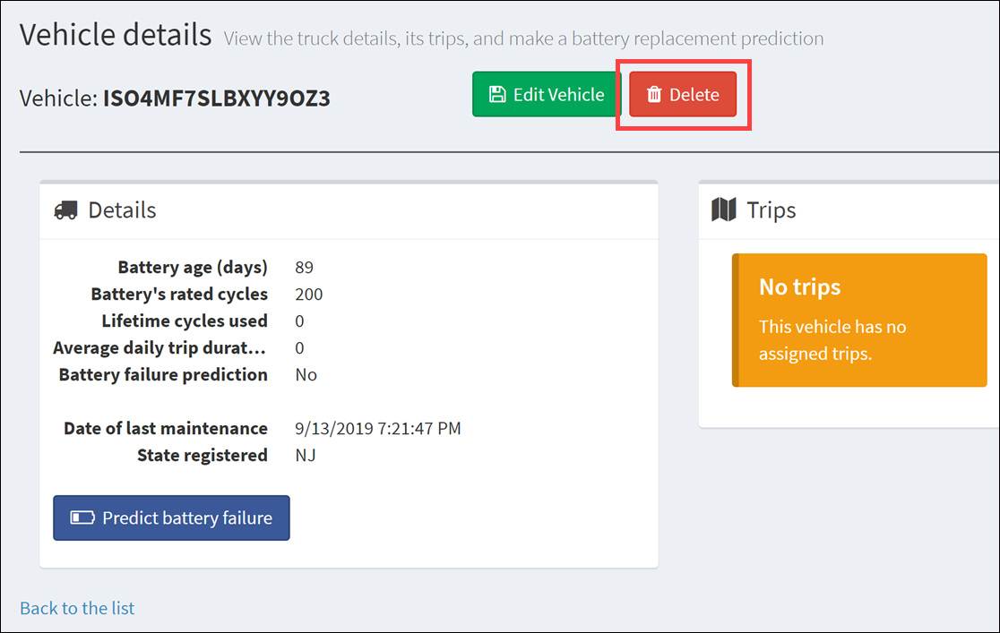

# Cosmos DB scenario-based labs - IoT

## 8. Perform CRUD operations using the Web App

**Duration**: 10 minutes

<!-- TOC -->
- [Task 1: Create a new vehicle](#task-1-create-a-new-vehicle)
- [Task 2: View and edit the vehicle](#task-2-view-and-edit-the-vehicle)
- [Task 3: Delete the vehicle](#task-3-delete-the-vehicle)
<!-- /TOC -->

In this exercise, you will insert, update, and delete a vehicle record.

### Task 1: Create a new vehicle

1. In the web app, navigate to the **Vehicles** page, then select **Create New Vehicle**.

    

2. Complete the Create Vehicle form with the following VIN: **ISO4MF7SLBXYY9OZ3**. When finished filling out the form, select **Create**.

    

### Task 2: View and edit the vehicle

1. Search for your new vehicle in the Vehicles page by pasting the VIN in the search box: **ISO4MF7SLBXYY9OZ3**.

    

2. Select the vehicle in the search results. Select **Edit Vehicle** in the vehicle details page.

    

3. Update the record by changing the state registered and any other field, then select **Update**.

    

### Task 3: Delete the vehicle

1. Search for your new vehicle in the Vehicles page by pasting the VIN in the search box: **ISO4MF7SLBXYY9OZ3**. You should see the registered state any any other fields you updated have changed.

    

2. Select the vehicle in the search results. Select **Delete** in the vehicle details page.

    

3. In the Delete Vehicle confirmation page, select **Delete** to confirm.

    

4. Search for your new vehicle in the Vehicles page by pasting the VIN in the search box: **ISO4MF7SLBXYY9OZ3**. You should see that no vehicles are found.

    

[Return to Table of Contents to continue](./README.md)
