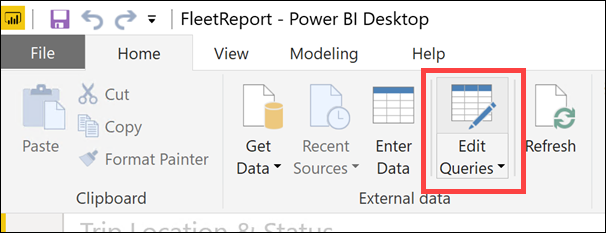
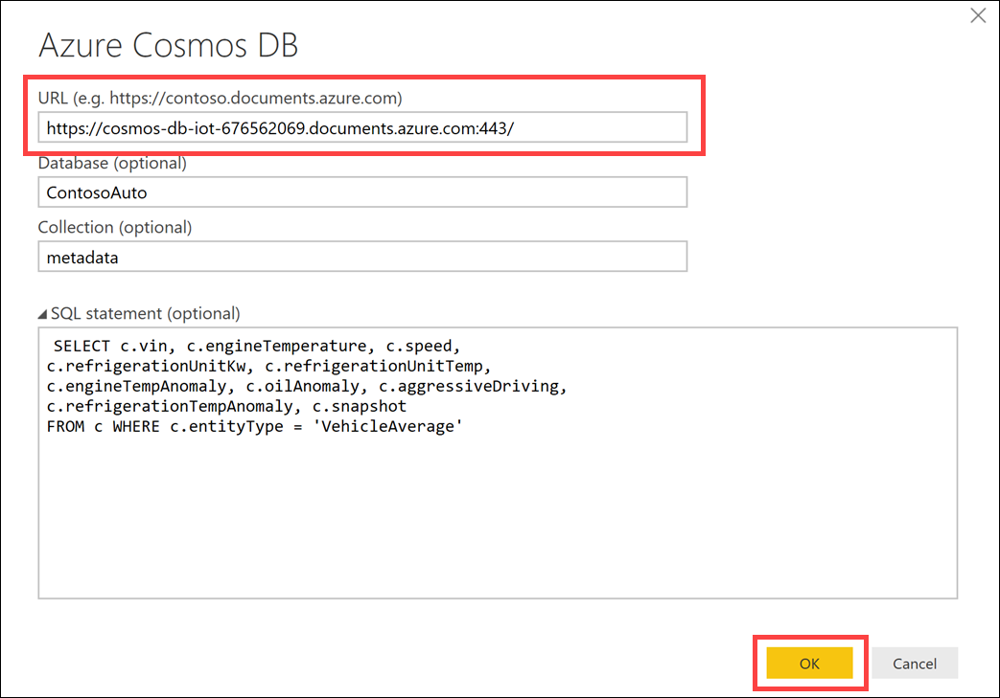
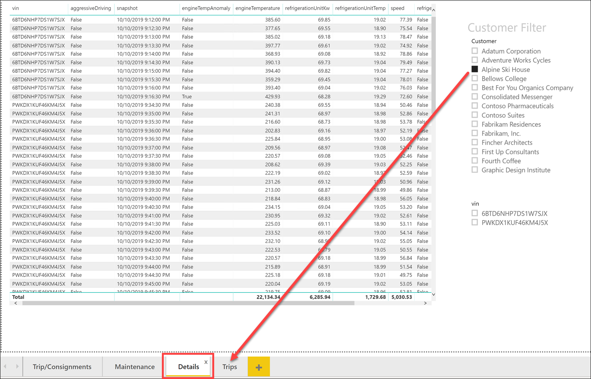
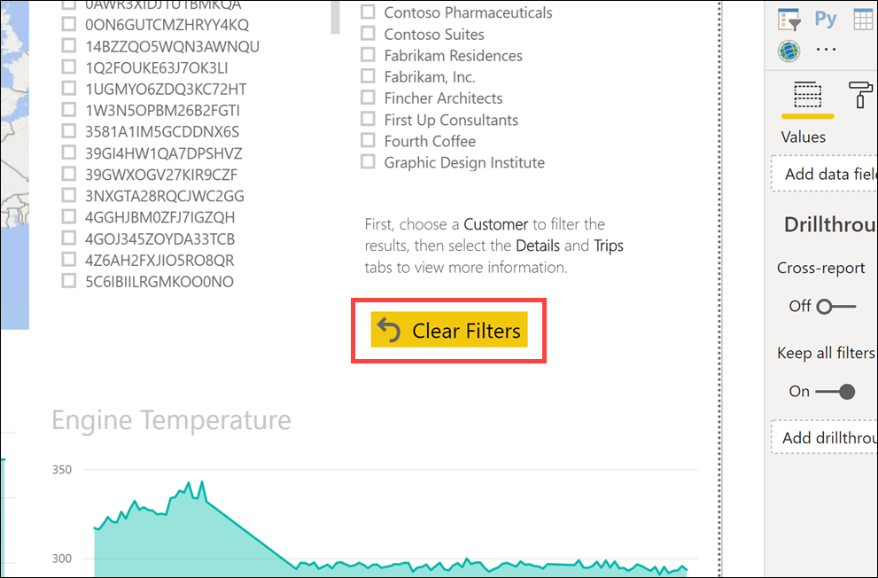

# Cosmos DB scenario-based labs - IoT

## 9. Create the Trip/Consignment status report in Power BI

**Duration**: 15 minutes

<!-- TOC -->
- [Task 1: Import report in Power BI Desktop](#task-1-import-report-in-power-bi-desktop)
- [Task 2: Update report data sources](#task-2-update-report-data-sources)
- [Task 3: Explore report](#task-3-explore-report)
<!-- /TOC -->

In this exercise, you will import a Power BI report that has been created for you. After opening it, you will update the data source to point to your Power BI instance.

### Task 1: Import report in Power BI Desktop

1. Open **Power BI Desktop**, then select **Open other reports**.

    

2. In the Open report dialog, browse to the location where you downloaded the code, then into the **Reports** folder, then select **FleetReport.pbix**. Click **Open**.

    

### Task 2: Update report data sources

1. After the report opens, click on **Edit Queries** in the ribbon bar within the Home tab.

    

2. Select **Trips** in the Queries list on the left, then select **Source** under Applied Steps. Click the gear icon next to Source.

    

3. In the source dialog, update the Cosmos DB **URL** value with your Cosmos DB URI you copied earlier in the lab, then click **OK**. If you need to find this value, navigate to your Cosmos DB account in the portal, select Keys in the left-hand menu, then copy the URI value.

    

    The Trips data source has a SQL statement defined that returns only the fields we need, and applies some aggregates:

    ```sql
    SELECT c.id, c.vin, c.consignmentId, c.plannedTripDistance,
    c.location, c.odometerBegin, c.odometerEnd, c.temperatureSetting,
    c.tripStarted, c.tripEnded, c.status,
    (
        SELECT VALUE Count(1) 
        FROM n IN c.packages
    ) AS numPackages,
    (
        SELECT VALUE MIN(n.storageTemperature) 
        FROM n IN c.packages
    ) AS packagesStorageTemp,
    (
        SELECT VALUE Count(1)
        FROM n IN c.packages
        WHERE n.highValue = true
    ) AS highValuePackages,
    c.consignment.customer,
    c.consignment.deliveryDueDate
    FROM c where c.entityType = 'Trip'
    and c.status in ('Active', 'Delayed', 'Completed')
    ```

4. When prompted, enter the Cosmos DB **Account key** value, then click **Connect**. If you need to find this value, navigate to your Cosmos DB account in the portal, select Keys in the left-hand menu, then copy the Primary Key value.

    

5. In a moment, you will see a table named **Document** that has several rows whose value is Record. This is because Power BI doesn't know how to display the JSON document. The document has to be expanded. After expanding the document, you want to change the data type of the numeric and date fields from the default string types, so you can perform aggregate functions in the report. These steps have already been applied for you. Select the **Changed Type** step under Applied Steps to see the columns and changed data types.

    

    The screenshot below shows the Trips document columns with the data types applied:

    

6. Select **VehicleAverages** in the Queries list on the left, then select **Source** under Applied Steps. Click the gear icon next to Source.

    

7. In the source dialog, update the Cosmos DB **URL** value with your Cosmos DB URI, then click **OK**.

    

    The VehicleAverages data source has the following SQL statement defined:

    ```sql
    SELECT c.vin, c.engineTemperature, c.speed,
    c.refrigerationUnitKw, c.refrigerationUnitTemp,
    c.engineTempAnomaly, c.oilAnomaly, c.aggressiveDriving,
    c.refrigerationTempAnomaly, c.snapshot
    FROM c WHERE c.entityType = 'VehicleAverage'
    ```

8. If prompted, enter the Cosmos DB **Account key** value, then click **Connect**. You may not be prompted since you entered the key in an earlier step.

    

9. Select **VehicleMaintenance** in the Queries list on the left, then select **Source** under Applied Steps. Click the gear icon next to Source.

    

10. In the source dialog, update the Cosmos DB **URL** value with your Cosmos DB URI, then click **OK**.

    

    The VehicleMaintenance data source has the following SQL statement defined, which is simpler than the other two since there are no other entity types in the `maintenance` container, and no aggregates are needed:

    ```sql
    SELECT c.vin, c.serviceRequired FROM c
    ```

11. If prompted, enter the Cosmos DB **Account key** value, then click **Connect**. You may not be prompted since you entered the key in an earlier step.

    

12. If you are prompted, click **Close & Apply**.

    

### Task 3: Explore report

1. The report will apply changes to the data sources and the cached data set will be updated in a few moments. Explore the report, using the slicers (status filter, customer filter, and VIN list) to filter the data for the visualizations. Also be sure to select the different tabs at the bottom of the report, such as Maintenance for more report pages.

    

2. Select a customer from the Customer Filter, which acts as a slicer. This means when you select an item, it applies a filter to the other items on the page and linked pages. After selecting a customer, you should see the map and graphs change. You will also see a filtered list of VINs and Status. Select the **Details** tab.

    

3. The Details page shows related records, filtered on the selected customer and/or VIN. Now select the **Trips** tab.

    

4. The Trips page shows related trip information. Select **Maintenance**.

    

5. The Maintenance page should contain no data at this time. This page shows information from a batch scoring Machine Learning notebook that you can optionally execute in Databricks in the next exercise.

6. If at any time you have a number of filters set and you cannot see records, **Ctrl+Click** the **Clear Filters** button on the main report page (Trip/Consignments).

    

7. If your data generator is running while viewing the report, you can update the report with new data by clicking the **Refresh** button at any time.

    

[Return to Table of Contents to continue](./README.md)
