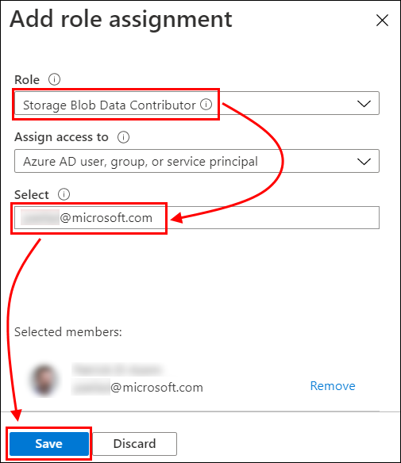

# Cosmos DB scenario-based labs - IoT

## 11. Prepare data for Machine Learning training and scoring

**Duration**: 30 minutes

<!-- TOC -->
- [Task 1: Enable Data Lake Storage Access for your account](#task-1-enable-data-lake-storage-access-for-your-account)
- [Task 2: Access the Synapse Workspace](#task-2-access-the-synapse-workspace)
- [Task 3: Connect Azure Synapse to Azure Cosmos DB](#task-3-connect-azure-synapse-to-azure-cosmos-db)
- [Task 4: Import lab notebooks into Azure Synapse Workspace](#task-4-import-lab-notebooks-into-azure-synapse-workspace)
- [Task 5: Run the first notebook](#task-5-run-the-first-notebook)
<!-- /TOC -->

### Task 1: Enable Data Lake Storage Access for your account

We need to grant your account access to the Storage Account used by Synapse Workspace so that you can interactively run Synapse Spark notebooks.

Start in your Resource Group. Select the Storage Account that was deployed for the Synapse Workspace. Its name will begin with "synsa". Be careful to select the correct Storage Account!

In the Storage Account, navigate to the **Access control (IAM)** blade. Then select **Role Assignments**. Then click **+ Add**.

On the **+ Add** dropdown, select **Add role assignment**.

On the **Add role assignment** blade, set **Role** to **Storage Blob Data Contributor**. Then enter the username with which you logged Azure into the **Select** field. Select it from the results area, then select **Save**.

After the Role Assignment is successfully saved, return to your Resource Group.

### Task 2: Access the Synapse Workspace

In your Resource Group, select the Azure Synapse Workspace.

In the Azure Synapse Workspace Overview blade, select **Launch Synapse Studio**.

### Task 3: Connect Azure Synapse to Azure Cosmos DB

In this task, you will create a linked service connection from Azure Synapse to Azure Cosmos DB.

1. In Synapse Studio, select **Data**, then select the **Linked** tab. Select **+**, then select **Connect to external data**.

   

2. Select **Azure Cosmos DB (SQL API)**,then select **Continue**.

   

3. Provide connection information.
   1. Enter **CosmosDbIoTLab** for the linked service name (IMPORTANT - enter this exactly, it is used elsewhere).
   2. For **Account selection method**, select **From Azure subscription**.
   3. For **Azure subscription**, select the Azure subscription in which you deployed the lab/demo resources.
   4. For **Cosmos DB account name**, select the Azure Cosmos DB account you deployed for this lab/demo.
   5. For **Database name**, select **ContosoAuto**.
   6. Next, select **Test connection**. Ensure that **Connection successful** is shown. If an error is shown, correct the previous settings.
   7. Select **Create**.

   

4. Observe the notification that the linked service connection was saved successfully.

   

5. Verify the Cosmos DB connection.

**Note:** you may need to reload the Synapse Studio for this step.

In Synapse Studio, verify that the Cosmos DB database and containers now appear in Linked Data.

(Note that the "telemetry" and "metadata" container glyphs indicate that these containers are configured for Cosmos DB Analytical Store.)

   

### Task 4: Import lab notebooks into Azure Synapse Workspace

In this task, you will import the Synapse notebooks into your workspace.

1. Select **Develop**, select **+**, then select Import.

   

2. Navigate to your **deploy** folder and select the file called **1-PrepareRawDataForScoring.ipynb**, then select **Open**.

   

    Repeat the process for the file called **2-PersistScoredData.ipynb**.

3. After importing, you will see the two new notebooks under the **Notebooks** section.

    Note the warning to connect the notebook to a Spark pool before running it. Select **Attach to** and select the Spark pool in the list.

    **Repeat this Spark pool selection for both notebooks.**

   

### Task 5: Run the first notebook

1. In each notebook, the first cell defines some variables.

   You must provide the name of the storage account associated with the Synapse Workspace; in your Resource Group, find the Storage Account whose name begins with "synsa" and insert it in the first cell of **both** notebooks.

   

2. Publish the notebooks

   Now select **Publish all** to persist the updated notebooks to the Synapse Workspace.

   

   Verify and select **Publish**.

   

   After a few seconds, you should receive a notification that the notebooks were successfully published.

   

3. Run the first notebook.

   You will now run the first notebook, **1-PrepareRawDataForScoring**. This notebook brings data from the Cosmos DB metadata container into Azure Data Lake Store, where it will be used by the Machine Learning model you will deploy in the next exercise.

   You can select **Run all** to run the entire notebook, or you can select each cell's **Run cell** in turn to step through the cells and examine what each cell does, in detail, as data query and preparation occurs in this notebook.

   

   Select either **Run all** or the first cell's **Run cell**. Note that the Spark cluster will now start. This may take up to a few minutes.

   

   Continue until all cells in the notebook have completed successfully.

   

   The data required to prepare the Azure Machine Learning model in the next exercise has now been written to Azure Data Lake Store.

This exercise is now completed and you can continue with the next exercise.

[Return to Table of Contents to continue](./README.md)
