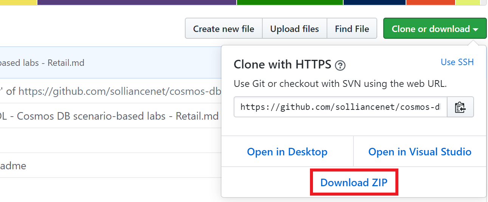
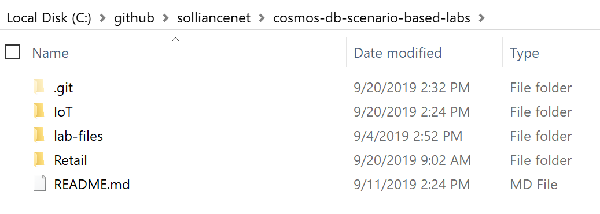

Cosmos DB scenario-based labs - Retail

Before the hands-on lab setup guide

September 2019

Information in this document, including URL and other Internet Web site references, is subject to change without notice. Unless otherwise noted, the example companies, organizations, products, domain names, e-mail addresses, logos, people, places, and events depicted herein are fictitious, and no association with any real company, organization, product, domain name, e-mail address, logo, person, place or event is intended or should be inferred. Complying with all applicable copyright laws is the responsibility of the user. Without limiting the rights under copyright, no part of this document may be reproduced, stored in or introduced into a retrieval system, or transmitted in any form or by any means (electronic, mechanical, photocopying, recording, or otherwise), or for any purpose, without the express written permission of Microsoft Corporation.

Microsoft may have patents, patent applications, trademarks, copyrights, or other intellectual property rights covering subject matter in this document. Except as expressly provided in any written license agreement from Microsoft, the furnishing of this document does not give you any license to these patents, trademarks, copyrights, or other intellectual property.

The names of manufacturers, products, or URLs are provided for informational purposes only and Microsoft makes no representations and warranties, either expressed, implied, or statutory, regarding these manufacturers or the use of the products with any Microsoft technologies. The inclusion of a manufacturer or product does not imply endorsement of Microsoft of the manufacturer or product. Links may be provided to third party sites. Such sites are not under the control of Microsoft and Microsoft is not responsible for the contents of any linked site or any link contained in a linked site, or any changes or updates to such sites. Microsoft is not responsible for webcasting or any other form of transmission received from any linked site. Microsoft is providing these links to you only as a convenience, and the inclusion of any link does not imply endorsement of Microsoft of the site or the products contained therein.

© 2019 Microsoft Corporation. All rights reserved.

Microsoft and the trademarks listed at <https://www.microsoft.com/en-us/legal/intellectualproperty/Trademarks/Usage/General.aspx> are trademarks of the Microsoft group of companies. All other trademarks are property of their respective owners.

**Contents**

<!-- TOC -->

- [Cosmos DB scenario-based labs - Retail before the hands-on lab setup guide](#cosmos-db-scenario-based-labs---iot-before-the-hands-on-lab-setup-guide)
  - [Requirements](#requirements)
  - [Before the hands-on lab](#before-the-hands-on-lab)
    - [Task 1: Download GitHub resources](#task-1-download-github-resources)
    - [Task 2: Deploy resources to Azure](#task-2-deploy-resources-to-azure)

<!-- /TOC -->

# Cosmos DB scenario-based labs - Retail before the hands-on lab setup guide

## Requirements

1.  Microsoft Azure subscription must be pay-as-you-go or MSDN.

    - Trial subscriptions will not work.

1.  [Visual Stuido 2019](https://visualstudio.microsoft.com/downloads/)

1.  [Azure CLI](https://docs.microsoft.com/en-us/cli/azure/install-azure-cli?view=azure-cli-latest)

## Before the hands-on lab

Duration: 10 minutes

Synopsis: In this exercise, you will set up your environment for use in the rest of the hands-on lab. You should follow all the steps provided in the Before the Hands-on Lab section to prepare your environment *before* attempting the labs.

### Task 1: Download GitHub resources

1.  Open a browser window to the cloud workshop GitHub repository (<https://github.com/solliancenet/cosmos-db-scenario-based-labs>).

1.  Select **Clone or download**, then select **Download Zip**.

    

1.  Extract the zip file to your local machine, be sure to keep note of where you have extracted the files. You should now see a set of folders:

    

### Task 2: Get a Movie Api Key

1.  Open a Chrome browser window to **https://api.themoviedb.org**

1.  Create an account and copy your API Key for use in the next task

    -   Click **SIGN UP**
    -   Fill in your account details, click **Sign up**
    -   Click your profile icon in the menu, select **Settings**
    -   Click **API**, copy the `API Key (v3 auth)` key for later use

### Task 3: Deploy resources to Azure

1.  Open the **deploy.ps1** PowerShell script in an PowerShell ISE window

1.  Set the following variables:

>NOTE:  If you are performing a demo of this solution, select the "demo" setting, otherwise leave as "lab"

-   $mode = "lab"  #can be 'lab' or 'demo'
-   $subscriptionId = "YOUR SUBSCRIPTION ID"
-   $subName = "YOUR SUBSCRIPTION NAME"
-   $prefix = "YOUR INIT"
-   $rgName = $prefix + "_s2_retail"
-   $databaseId = "movies";
-   $movieApiKey = "YOUR MOVIE API KEY";

1.  Run the script, this will do the following:

-   Deploy the starter ARM template(s)
-   Deploy the initial web and function apps
-   Setup the web and function app configuration variables
-   Create starter objects in the 'object' collection of the Comos DB database
-   Update your project application configuration files with the target azure keys and settings

1. The deployment will take 15-25 minutes to complete. As part of the deployment, you will see the following items created:

- Function App
- Web App
- App Service Plans
- Event Hub
- Stream Analytics Job
- Databricks Service
- Cosmos DB
- Key Vault
- Storage Accounts
- Application Insights

1.  Record the values that were output from the script for use in the lab

You should follow all steps provided *before* attending the hands-on lab.