<div class="MCWHeader1">
Cosmos DB scenario-based labs - Retail
</div>

<div class="MCWHeader2">
Hands-on lab step-by-step
</div>

<div class="MCWHeader3">
September 2019
</div>


Information in this document, including URL and other Internet Web site references, is subject to change without notice. Unless otherwise noted, the example companies, organizations, products, domain names, e-mail addresses, logos, people, places, and events depicted herein are fictitious, and no association with any real company, organization, product, domain name, e-mail address, logo, person, place or event is intended or should be inferred. Complying with all applicable copyright laws is the responsibility of the user. Without limiting the rights under copyright, no part of this document may be reproduced, stored in or introduced into a retrieval system, or transmitted in any form or by any means (electronic, mechanical, photocopying, recording, or otherwise), or for any purpose, without the express written permission of Microsoft Corporation.

Microsoft may have patents, patent applications, trademarks, copyrights, or other intellectual property rights covering subject matter in this document. Except as expressly provided in any written license agreement from Microsoft, the furnishing of this document does not give you any license to these patents, trademarks, copyrights, or other intellectual property.

The names of manufacturers, products, or URLs are provided for informational purposes only and Microsoft makes no representations and warranties, either expressed, implied, or statutory, regarding these manufacturers or the use of the products with any Microsoft technologies. The inclusion of a manufacturer or product does not imply endorsement of Microsoft of the manufacturer or product. Links may be provided to third party sites. Such sites are not under the control of Microsoft and Microsoft is not responsible for the contents of any linked site or any link contained in a linked site, or any changes or updates to such sites. Microsoft is not responsible for webcasting or any other form of transmission received from any linked site. Microsoft is providing these links to you only as a convenience, and the inclusion of any link does not imply endorsement of Microsoft of the site or the products contained therein.

© 2019 Microsoft Corporation. All rights reserved.

Microsoft and the trademarks listed at <https://www.microsoft.com/en-us/legal/intellectualproperty/Trademarks/Usage/General.aspx> are trademarks of the Microsoft group of companies. All other trademarks are property of their respective owners.

**Contents** 

<!-- TOC -->

- [Cosmos DB scenario-based labs - IoT hands-on lab step-by-step](#cosmos-db-scenario-based-labs---iot-hands-on-lab-step-by-step)
  - [Abstract and learning objectives](#abstract-and-learning-objectives)
  - [Overview](#overview)
  - [Solution architecture (High-level)](#solution-architecture-high-level)
  - [Requirements](#requirements)
  - [Before the hands-on lab](#before-the-hands-on-lab)
  - [Exercise 1: Configure Databricks and generate event data](#exercise-1-configure-databricks-and-generate-event-data)
    - [Task 1: Configure Azure Databricks](#task-1-configure-azure-databricks)
    - [Task 2: Populate event data](#task-2-populate-event-data)
    - [Task 3: Review the data generated](#task-3-review-the-data-generated)
    - [Task 4: Review the aggregations and import utility](#task-4-Review the aggregations and import utility)
  - [Exercise 2: Complete and deploy Web and Function Apps](#exercise-2-complete-and-deploy-web-and-function-apps)
    - [Task 1: Implement the Top Items recommendation](#task-1-implement-the-top-items-recommendation)
    - [Task 2: Deploy the applications](#task-2-deploy-the-applications)
    - [Task 3: Test the applications](#task-3-test-the-applications)
  - [Exercise 3: Perform and deploy association rules calculation for offline algorithms](#exercise-3-perform-and-deploy-association-rules-calculation-for-offline-algorithms)
    - [Task 1: Generate the Associations](#task-1-generate-the-associations)
    - [Task 2: Review the data generated](#task-2-review-the-data-generated)
  - [Exercise 4: Complete and deploy Web and Function Apps (Association Rules)](#exercise-4-simulate-data-and-events)
    - [Task 1: Implement the Associations recommendation rules](#task-1-implement-the-associations-recommendation-rules)
    - [Task 2: Deploy the applications](#task-2-deploy-the-applications)
    - [Task 3: Test the applications](#task-3-test-the-applications)
  - [Exercise 5: Perform and deploy collaborative filtering rules calculation](#exercise-5-perform-and-deploy-collaborative-filtering-rules-calculation)
    - [Task 1: Compute the user implict ratings](#task-1-compute-the-user-implict-ratings)
    - [Task 2: Generate the Collaborative Rules](#task-2-generate-the-collaborative-rules)
    - [Task 3: Review the data generated](#task-3-review-the-data-generated)
    - [Task 4: Implement the Collaborative recommendation rules](#task-4-implement-the-collaborative-recommendation-rules)
    - [Task 5: Deploy the applications](#task-5-deploy-the-application)
    - [Task 6: Test the applications](#task-6-test the applications)
  - [Exercise 6: Reporting with Stream Analytics and Power BI](#exercise-4-reporting-with-stream-analytics-and-power-bi)
    - [Task 1: Setup Stream Analytics](#task-1-setup-stream-analytics)
    - [Task 2: Configure the ChangeFeed Function](#task-2-configure-the-changefeed-function)
    - [Task 3: Deploy the ChangeFeed Function](#task-3-deploy-the-changefeed-function)
    - [Task 4: Generate user events for Power BI](#task-4-generate-user-events-for-power-bi)
    - [Task 5: Setup Power BI Dashboard](#task-5-setup-power-bi-dashboard)
    - [Task 6: Generate user events for real time analysis](#task-6-generate-user-events-for-real-time-analysis)
  - [Exercise 7: Email alerts using Logic Apps](#exercise-5-email-alerts-using-logic-apps)
    - [Task 1: Setup Logic App](#task-1-setup-logic-app)
    - [Task 2: Configure the function app settings](#task-2-configure-the-function-app-settings)
    - [Task 3: Update and deploy function app](#task-3-update-and-deploy-function-app)
    - [Task 4: Test order email delivery](#task-4-test-order-email-delivery)
  - [After the hands-on lab](#after-the-hands-on-lab)
    - [Task 1: Delete resource group](#task-1-delete-resource-group)

<!-- /TOC -->

# Cosmos DB scenario-based labs - IoT hands-on lab step-by-step

## Abstract and learning objectives

In this hands-on-lab, you will complete various tasks to implment a recommendation engine using several Microsoft Azure PaaS services.

At the end of this lab you will understand how to design offline recommendation systems that store data in Cosmos DB using Data Bricks.  You will also see how to implement a ecommerce store front utilizing Cosmos DB.  Additionally, you will see how to utilize the Cosmos DB change feed to execute functions for reporting and monitoring activities with Power BI and Logic Apps.

## Overview

Contoso Movies, Ltd. has express their desire to move to a more modern and cloud-based approach to their online ecommerce presence.  The have decided to utilize Cosmos DB and Azure Databricks to implement their next generate recommendation system.

## Solution architecture (High-level)


## Requirements

1. Microsoft Azure subscription must be pay-as-you-go or MSDN.

    - Trial subscriptions will not work.
    
## Before the hands-on lab

Refer to the Before the hands-on lab setup guide manual before continuing to the lab exercises.

## Exercise 1: Configure Databricks and generate event data

Duration: 30 minutes

Synopsis: We have pre-generated a set of events that include **buy** and **details** events.  Based on this data, a **Top Items** recommendation will be made to users that are new to the site (aka a cold start recommendation).  You will implement this top items code in the web application and function applications, then deploy the applications to test the functionality.

### Task 1: Configure Azure Databricks

1.  Open the Azure Portal, navigate to your Azure DataBricks instance

1.  Click **Launch Workspace**, if prompted, login as the account you used to create your environment

1.  In the side navigation, click **Clusters**

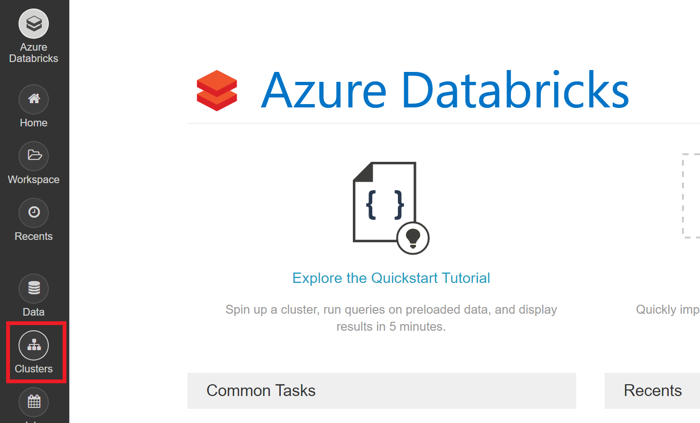

1.  Click **Create Cluster**

1.  On the create cluster form, provide the following:

   - **Cluster Name**: small

   - **Cluster Type**: Standard

   - **Databricks Runtime Version**: Runtime: 5.5 (Scala 2.11, Spark 2.4.3) (**Note**: the runtime version may have **LTS** after the version. This is also a valid selection.)

   - **Python Version**: 3

   - **Enable Autoscaling**: Uncheck this option.

   - **Auto Termination**: Check the box and enter 120

   - **Worker Type**: Standard_DS3_v2

   - **Driver Type**: Same as worker

   - **Workers**: 1

1.  Select **Create Cluster**.


1.  Before continuing to the next step, verify that your new cluster is running.  Wait for the state to change from **Pending** to **Running**

1.  Click the **small** cluster, then click **Libraries**

1. Select **Install New**.

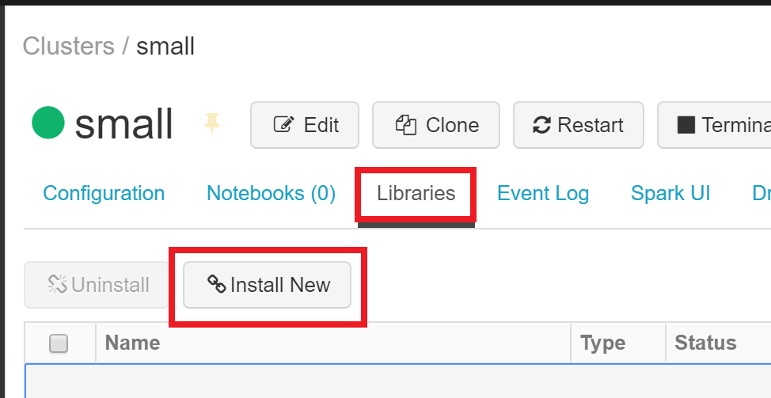

1. In the Install Library dialog, select **Maven** for the Library Source

1.  In the Coordinates field type:

```text
com.microsoft.azure:azure-cosmosdb-spark_2.4.0_2.11:1.4.1
```

1. Select **Install**

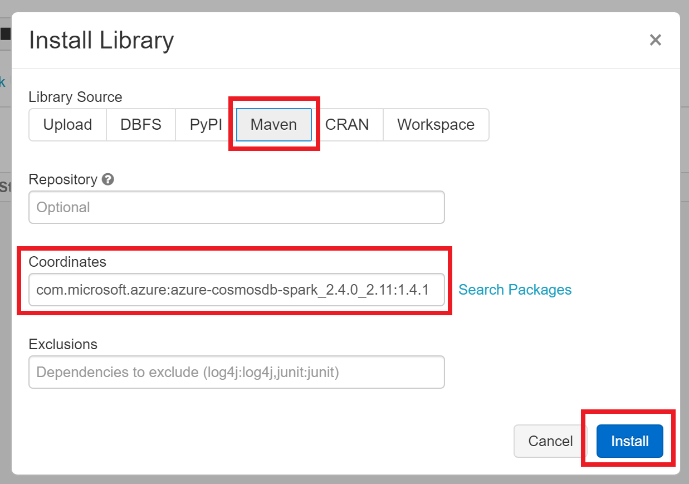

1. **Wait** until the library's status shows as **Installed** before continuing.

### Task 2: Populate event data

1. Within Azure Databricks, select **Workspace** on the menu, then **Users**, select your user, then select the down arrow on the top of your user workspace. Select **Import**.

1. Within the Import Notebooks dialog, select Import from: file, then drag-and-drop the file or browse to upload it ($githubdirectory/lab-files/Retail/Notebooks/02 Retail.dbc)

1.  Click **Import**

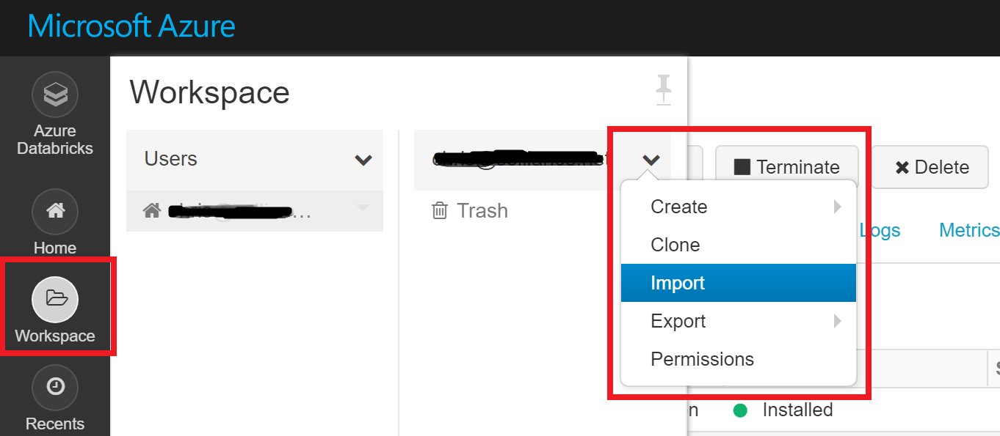

1. After importing, select the new **02 Retail** folder.

1.  Select **Event Generator**

1. Before you begin, make sure you attach your cluster to the notebooks using the dropdown. You will need to do this for each notebook you open. 

1.  Update the configuration settings for both the **readConfig** and the **writeConfig**, set the following using the values from your lab setup script:

- Endpoint = Cosmos DB endpoint
- Masterkey = Cosmos DB master key
- Database = Database id of the cosmos db ('movies')


1.  Click **Run All**

>NOTE:  This total process will take up to 30 minutes to generate the event data.

### Task 3: Review the data generated

1.  Open your Cosmos DB instance

1.  Open the **events** collection, review the items in the collection


>NOTE:  These items are created from the data bricks solution and include a random set of generated events for each user personality type.  You should see events generated for 'details', 'buy' and 'addToCart' as well as the item associated (via the contentId field) with the event.

### Task 4: Review the aggregation and import utility

1.  Browse to the **$githubdirectory/lab-files/Retail/Starter/Contoso Movies** folder and open the **Contoso.Apps.Movies.sln** solution

1.  In the **/Utilities/MovieDataImport** project, open the **program.cs** file, browse code and various methods.  Notice that it:

- Aggregates all the event data generated from the Databricks notebook
- Creates the user personalities
- Creates the movie categories/genres
- Creates the movies

1.  Right-click the project, select **Set as startup project**

1.  Press **F5** to run the project

>NOTE:  You must have waited for the Event Generator DataBricks notebook to complete for this to run and have the late steps in the lab match.

## Exercise 2: Complete and deploy Web and Function Apps

Duration: 30 minutes

Synopsis: We have pre-generated a set of events that include **buy** events.  Based on this information, a **Top Items** recommendation will be made to users that are new to the site.  You will implement this code in the web application and function applications, then deploy the applications to test the functionality.

### Task 1: Implement the Top Items recommendation

1.  In the **Contoso.Apps.Movies.Web** project, open the **/Controllers/HomeController.cs** file

1.  Find the todo task #1 and complete it with the following:

```csharp
vm.RecommendProductsBought = RecommendationHelper.GetViaFunction("top", 0, 0);
```

1.  In the **Contoso.Apps.FunctionApp** project, open the **RecommendationHelper.cs** file

1.  In the **TopRecommendation** method, find the todo task #2 and complete it with the following:

```csharp
var container = client.GetContainer(databaseId, "object");

var query = container.GetItemLinqQueryable<Item>(true)
    .Where(c => c.EntityType == "ItemAggregation")
    .OrderByDescending(c => c.BuyCount)
    .Take(take);

items = query.ToList();

foreach(Item i in items)
{
    itemIds.Add(i.ItemId.ToString());
}

topItems = GetItemsByImdbIds(itemIds);
```

1.  Review the code, notice the following:

- We are querying an "object" collection for an entity type called 'ItemAggregation' and sorting it by the 'BuyCount'.  Essentially these are the top purchased items.
- We are then querying the object collection for all the top movie items to get their metadata for display on the web front end

1.  Compile the solution, fix any errors

### Task 2: Deploy the applications

1.  Right-click the **Consoto.Apps.FunctionApp** function app project, select **Publish**

1.  Click **New**, then ensure that **Azure Functions Premium Plan** is selected

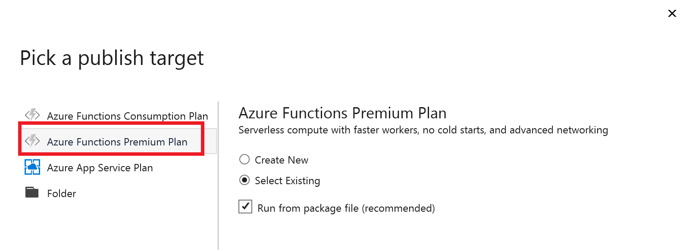

1.  Click **Select Existing**, then click **Publish**

1.  Select your Azure Subscription, resource group and Function App to deploy too, it should be something like **s2func...***

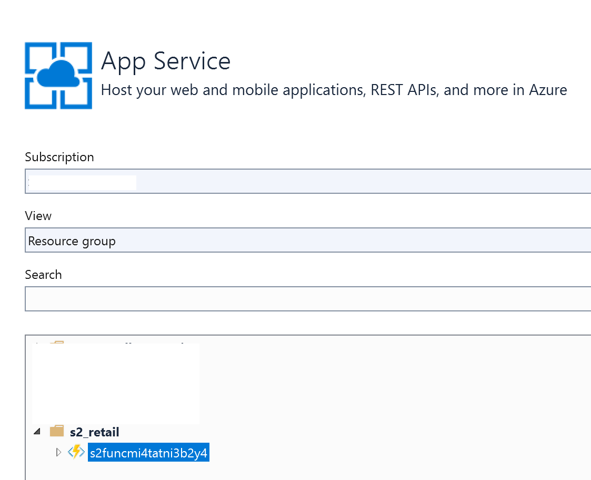

1.  Click **OK**

1.  Right-click the **Contoso.Apps.Movies.Web** web app project, select **Publish**

1.  Click **New**, then ensure that **App Service** is selected

1.  Click **Select Existing**, then click **Publish**

1.  Select your Azure Subscription, resource group and Function App to deploy too, it should be something like **s2web...***

1.  Click **OK**, the application will publish and the site should be displayed:

### Task 3: Test the applications

1.  In the browser window that opened from your web application deployment above, check to see that you received recommendations as a non-logged in user.  You should see something similar to the following:

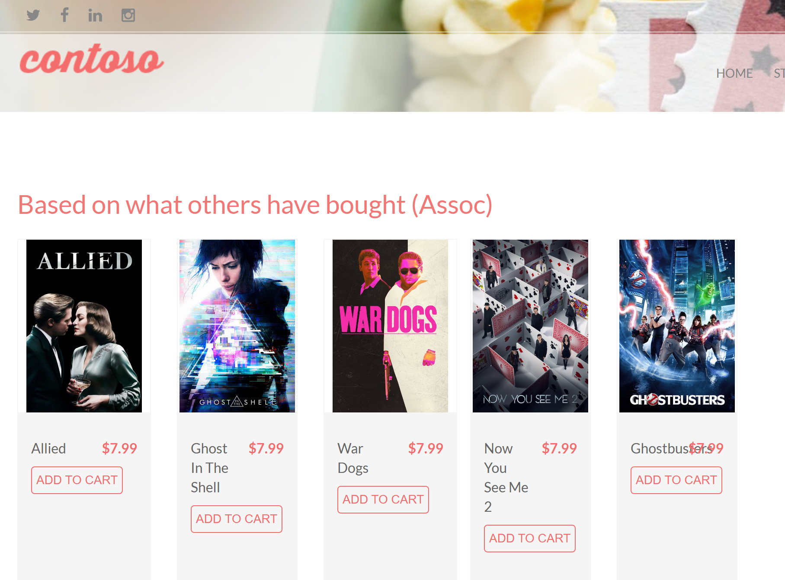

>NOTE:  These are simply suggestions based on the top purchased items from the pre-generated events.

## Exercise 3: Perform and deploy association rules calculation for offline algorithms

Duration: 30 minutes

Synopsis: Based on the pre-calculated events in the Cosmos DB for our pre-defined personality types (Comedy fan, Drama fan, etc), you will implement and deploy an algorithm that will generate these associations and put them in Cosmos DB for offline processing by the web and function applications.

### Task 1: Generate the Associations 

1.  Switch back to your Databricks workspace, select the **Association Rules** workbook

1.  Before you begin, make sure you attach your cluster to the notebooks, using the dropdown. You will need to do this for each notebook you open. 

1.  Update the configuration settings for both the **readEventsConfig** AND the **writeAssociationConfig**, set the following:

- Endpoint = Cosmos DB endpoint
- Masterkey = Cosmos DB master key
- Database = Database id of the cosmos db

1. Run each cell of the **Association Rules** notebook by selecting within the cell, then entering **Ctrl+Enter** on your keyboard. Pay close attention to the instructions within the notebook so you understand each step of the data preparation process.

### Task 2: Review the data generated

1.  Switch back to your Cosmos DB instance

1.  Open the **associations** collection, review the items in the collection

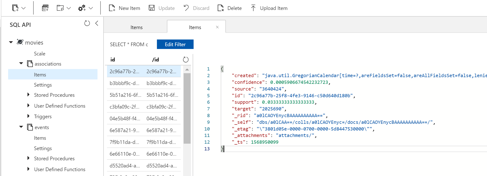

>NOTE:  These items are created from the data bricks solution and include the association confidence level as compared from one movie to another movie.

## Exercise 4: Complete and deploy Web App and Function Apps (Association Rules)

Duration: 30 minutes

Synopsis: Now that we have data for our association calculations, we will add code to the web app and function app to support this new recommendation engine.

### Task 1: Implement the Associations recommendation rules

1.  In the **Contoso.Apps.FunctionApp** project, open the **RecommendationHelper.cs** file

1.  In the **AssociationRecommendationByUser** method, find the todo task #3 and complete it with the following:

```csharp
//get 20 log events for the user.
List<CollectorLog> logs = GetUserLogs(userId, 20);

if (logs.Count == 0)
    return items;

List<Rule> rules = GetSeededRules(logs);

//get the pre-seeded objects based on confidence
List<Recommendation> recs = new List<Recommendation>();

//for each rule returned, evaluate the confidence
foreach (Rule r in rules)
{
    Recommendation rec = new Recommendation();
    rec.id = int.Parse(r.target);
    rec.confidence = r.confidence;
    recs.Add(rec);

    itemIds.Add(rec.id.ToString());
}

items = GetItemsByImdbIds(itemIds);
```

1.  In the **Contoso.Apps.Movies.Web** project, open the **HomeController.cs** file

1.  Replace the **Index** method with the following:

```csharp
var vm = new HomeModel();

Contoso.Apps.Movies.Data.Models.User user = (Contoso.Apps.Movies.Data.Models.User)Session["User"];

if (user != null)
{
    vm.RecommendProductsBought = RecommendationHelper.GetViaFunction("assoc", user.UserId, 0);
    vm.RecommendProductsLiked = RecommendationHelper.GetViaFunction("collab", user.UserId, 0);
}
else
{
    vm.RecommendProductsBought = RecommendationHelper.GetViaFunction("top", 0, 0);
}

return View(vm);
```

### Task 2: Deploy the applications

1.  Right-click the **Consoto.Apps.FunctionApp** function app project, select **Publish**

1.  Click **Publish**

1.  Right-click the **Contoso.Apps.Movies.Web** web app project, select **Publish**

1.  Click **Publish**, the site should load.

### Task 3: Test the applications

1.  In the browser window that opened from your web application deployment above, check to see that you received recommendations as a non-logged in user.  You should see the same results as you received previously.

2.  Click **login**, select the **comedy@contosomovies.com** account

3.  Notice the main page now has different recommendations than what you received earlier, but we are still missing the similar 'liked' items:

**TODO IMAGE**

## Exercise 5: Perform and deploy collaborative filtering rules calculation

Duration: 30 minutes

In this exercise you will defined

### Task 1: Compute the user implict ratings

1.  Switch back to your Databricks workspace, select **Ratings**

1.  Before you begin, make sure you attach your cluster to the notebooks, using the dropdown. You will need to do this for each notebook you open. 

1.  Update the configuration settings for both the **readEventsConfig** AND the **writeAssociationConfig**, set the following:

- Endpoint = Cosmos DB endpoint
- Masterkey = Cosmos DB master key
- Database = Database id of the cosmos db

1. Run each cell of the **Ratings** notebook by selecting within the cell, then entering **Ctrl+Enter** on your keyboard. Pay close attention to the instructions within the notebook so you understand each step of the data preparation process.


>NOTE:  These ratings are generated as part of this notebook as an 'offline' operation.  If you collect a significant amount of user data, you would need to reevaluate the events using this notebook and populate the ratings collection again for the online calculations to utilize.

### Task 2: Generate the Collaborative Rules

1.  Open the **Similarity** notebook

1.  Set the cluster

1. Run each cell of the **Similarity** notebook by selecting within the cell, then entering **Ctrl+Enter** on your keyboard. Pay close attention to the instructions within the notebook so you understand each step of the data preparation process.

### Task 3: Review the data generated

1.  Open your Cosmos DB instance

1.  Open the **similarity** collection, review the items in the collection

>NOTE:  These items are created from the data bricks solution and include the similarity of one movie, the source, to another, the target.


### Task 4: Implement the Collaborative recommendation rules

1.  In the **Contoso.Apps.FunctionApp** project, open the **RecommendationHelper.cs** file

1.  In the **CollaborativeBasedRecommendation** method, find the todo task #4 and complete it with the following:

```csharp
int neighborhoodSize = 15;
double minSim = 0.0;
int maxCandidates = 100;

//inside this we do the implict rating of events for the user...
Hashtable userRatedItems = GetRatedItems(userId, 100);

if (userRatedItems.Count == 0)
    return new List<string>();

//this is the mean rating a user gave
double ratingSum = 0;

foreach(double r in userRatedItems.Values)
{
    ratingSum += r;
}

double userMean = ratingSum / userRatedItems.Count;

//get similar items
List<SimilarItem> candidateItems = GetCandidateItems(userRatedItems.Keys, minSim);

//sort by similarity desc, take only max candidates
candidateItems = candidateItems.OrderByDescending(c=>c.similarity).Take(maxCandidates).ToList();

Hashtable recs = new Hashtable();

List<PredictionModel> precRecs = new List<PredictionModel>();

foreach(SimilarItem candidate in candidateItems)
{
    int target = candidate.Target;
    double pre = 0;
    double simSum = 0;

    List<SimilarItem> ratedItems = candidateItems.Where(c=>c.Target == target).Take(neighborhoodSize).ToList();

    if (ratedItems.Count > 1)
    {
        foreach (SimilarItem simItem in ratedItems)
        {
            try
            {
                string source = userRatedItems[simItem.sourceItemId].ToString();

                //rating of the movie - userMean;
                double r = double.Parse(source) - userMean;

                pre += simItem.similarity * r;
                simSum += simItem.similarity;

                if (simSum > 0)
                {
                    PredictionModel p = new PredictionModel();
                    p.Prediction = userMean + pre / simSum;
                    p.Items = ratedItems;
                    precRecs.Add(p);
                }
            }
            catch (Exception ex)
            {
                Console.WriteLine(ex.Message);
            }
        }
    }
}

//sort based on the prediction, only take x of them
List<PredictionModel> sortedItems = precRecs.OrderByDescending(c => c.Prediction).Take(take).ToList();

//get first model's items...
foreach(PredictionModel pm in sortedItems)
{
    foreach(SimilarItem ri in pm.Items)
    {
        if (ri.targetItemId != null)
        {
            itemIds.Add(ri.targetItemId.ToString());
            break;
        }
    }
}
```

### Task 5: Deploy the applications

1.  Right-click the **Consoto.Apps.FunctionApp** function app project, select **Publish**

1.  Click **Publish**

1.  Right-click the **Contoso.Apps.Movies.Web** web app project, select **Publish**

1.  Click **Publish**, the site should load.

### Task 6: Test the applications

1.  In the browser window that opened from your web application deployment above, check to see that you received recommendations as a non-logged in user.  You should see the same results as you received previously.

2.  Click **login**, select the **comedy@contosomovies.com** account


3.  Notice the main page now has both the associative and collborative results displayed::

**TODO IMAGE**

## Exercise 6: Reporting with Stream Analytics and Power BI

Duration: 30 minutes

In this exercise you will setup stream analytics to process the change feed events fired from Cosmos DB into an Azure Function which then forwards to an event hub for real time Power BI analytics.

### Task 1: Setup Stream Analytics 

1.  Open the Azure Portal, navigate to your Stream Analytics job that was created for you in the setup script

1.  Click **Inputs**

1.  Click **+Add stream input**, then select **Event Hub**

1.  For the alias, type **s2events**

1.  Select your subscription

1.  Select the **s2ns..** event hub

1.  For the event hub, select **store**

1.  For the policy name, select **RootManageSharedAccessKey**

1.  Click **Save**

1.  Click **Outputs**

1.  Click **+Add**, then select **Power BI**

1.  For the output alias, type **eventCount**

1.  For the dataset, type **eventCount**

1.  For the table name, type **eventCount**

1.  Click **Authorize**, login to your Power BI instance

1.  Click **Save**

1.  Click **+Add**, then select **Power BI**

1.  For the output alias, type **eventOrdersLastHour**

1.  For the dataset, type **eventOrdersLastHour**

1.  For the table name, type **eventOrdersLastHour**

1.  Click **Authorize**, login to your Power BI instance

1.  Click **+Add**, then select **Power BI**

1.  For the output alias, type **eventSummary**

1.  For the dataset, type **eventSummary**

1.  For the table name, type **eventSummary**

1.  Click **Authorize**, login to your Power BI instance

1.  Click **+Add**, then select **Power BI**

1.  For the output alias, type **failureCount**

1.  For the dataset, type **failureCount**

1.  For the table name, type **failureCount**

1.  Click **Authorize**, login to your Power BI instance

1.  Click **+Add**, then select **Power BI**

1.  For the output alias, type **eventData**

1.  For the dataset, type **eventData**

1.  For the table name, type **eventData**

1.  Click **Authorize**, login to your Power BI instance

1.  Click **Save**

1.  Click **Query**

1.  Update the query to the following:

```sql
SELECT Count(*) as FailureCount
 INTO failureCount
 FROM s2events
 WHERE Event = 'paymentFailure'
 GROUP BY TumblingWindow(second,10) 

SELECT Count(distinct UserId) as UserCount, System.TimeStamp AS Time, Count(*) as EventCount
 INTO eventData
 FROM s2events 
 GROUP BY TumblingWindow(second,10) 

 SELECT System.TimeStamp AS Time, Event, Count(*)
 INTO eventSummary
 FROM s2events 
 GROUP BY Event, TumblingWindow(second,10) 

 select DateAdd(second,-10,System.Timestamp()) AS WinStartTime, System.Timestamp() AS WinEndTime,0 as Min, Count(*) as Count, 10 as Target
 into eventOrdersLastHour
 from s2events
 where event = 'buy'
 GROUP BY SlidingWindow(second,10) 
```

1.  The Query windows should look similar to this:

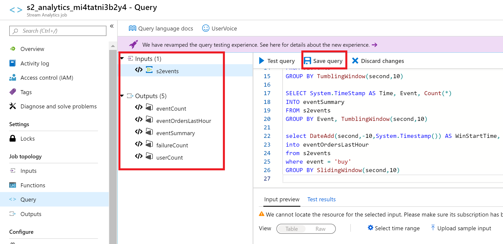

1.  Click **Save query**

1.  Click **Overview**, in the menu, click **Start** to start your stream analytics job


1.  In the dialog, ensure that **Now** is selected, then click **Start**

>NOTE:  If your job fails for any reason, you can use the **Activity Log** to see what the error(s) were.

### Task 2: Configure the ChangeFeed Function

1.  In the **Contoso.Apps.FunctionApp** project, open the **FuncChangeFeed.cs** file

1.  Take a moment to review the function signature.  Notice how it is trigger based on a Cosmos DB collection

1.  Find the todo task #5 and complete it with the following:

```csharp
AddEventToEventHub(events);
```

1.  Add the following method to the function class:

```csharp
public void AddEventToEventHub(IReadOnlyList<Document> events)
{
    try
    {
        //event hub connection
        EventHubClient eventHubClient;
        string EventHubConnectionString = config["eventHubConnection"];
        string EventHubName = "store";

        var connectionStringBuilder = new EventHubsConnectionStringBuilder(EventHubConnectionString)
        {
            EntityPath = EventHubName
        };

        eventHubClient = EventHubClient.CreateFromConnectionString(connectionStringBuilder.ToString());

        foreach (var e in events)
        {
            string data = JsonConvert.SerializeObject(e);
            var result = eventHubClient.SendAsync(new EventData(Encoding.UTF8.GetBytes(data)));
        }
    }
    catch (Exception ex)
    {
        log.LogError(ex.Message);
    }
}
```

>NOTE:  This method will forward the change feed events to the event hub where stream analytics will be monitoring and then forwarding data to the Power BI dashboard

### Task 3: Deploy the ChangeFeed Function

1.  Right-click the **Consoto.Apps.FunctionApp** function app project, select **Publish**

1.  Click **Publish**

### Task 4: Generate user events for PowerBI

1.  Right-click the **DataGenerator** project, select **Set as startup project**

1.  Press **F5** to run the project

1.  Notice events will be generated based on a set of users and their preferred movie type

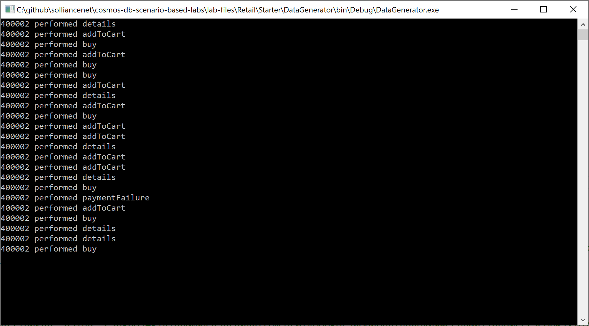

1.  Buy events will be generated for the first 30 seconds with random payment failures also generated. After 30 seconds, you will notice the orders per hour will fall below the target of 10.  This would signify that something is wrong with the front end web site or order processing.

1.  After about 1 minute, close the DataGenerator console program

### Task 5: Setup Power BI Dashabord 

1.  Open a new window to [Power BI](https://www.powerbi.com)

1.  Click on **My workspace**

1.  Click **+Create**, then select **Dashboard**

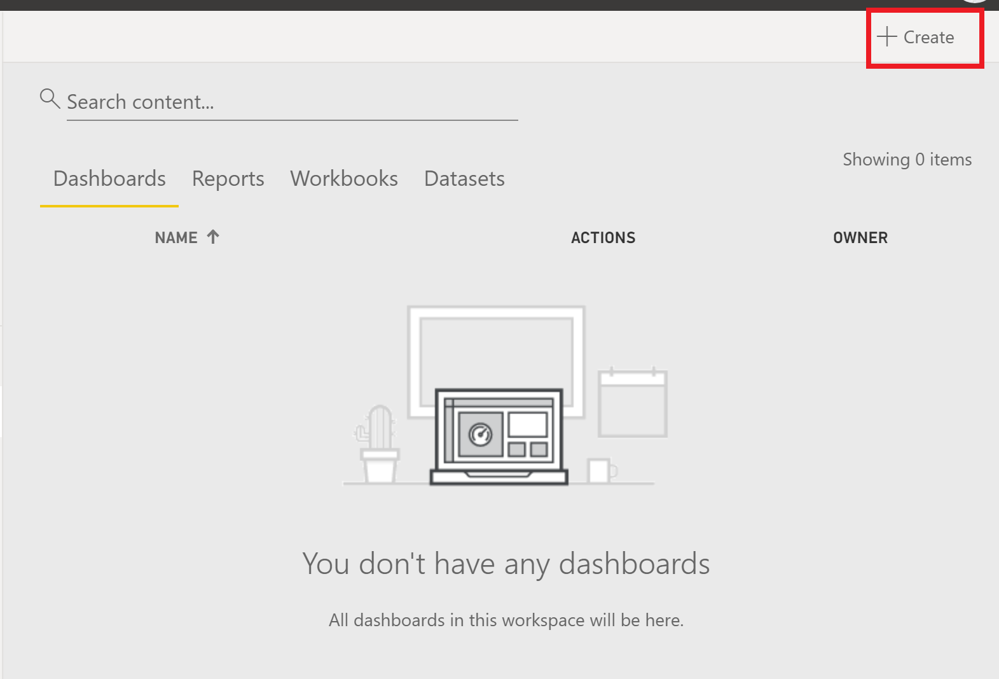

1.  For the name, type **Contoso Movies**, click **Create**

1.  Click the **...** ellipses, then select **+Add tile**

1.  Select **Custom Streaming Data**, click **Next**

1.  Select the **eventData** data set, then click **Next**

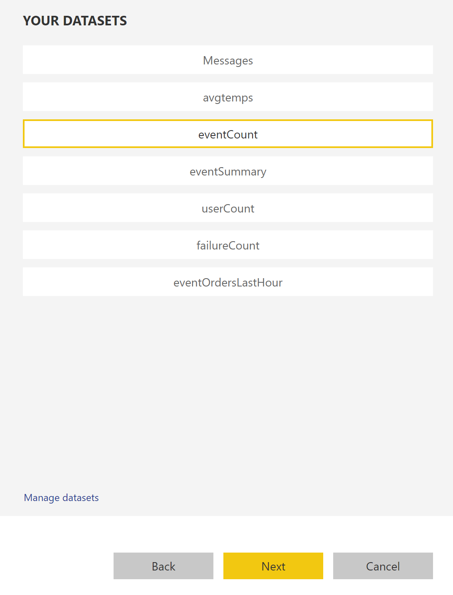

1.  For the visualization type, select **Card**

1.  For the Fields, select **count**

1.  Click **Next**

1.  For the title, type **Event Count**, then click **Apply**

1.  Click the **...** ellipses, then select **+Add tile**

1.  Select **Custom Streaming Data**, click **Next**

1.  Select the **eventData** data set, then click **Next**

1.  For the visualization type, select **Card**

1.  For the Fields, select **UserCount**, click **Next**

1.  For the title, type **User Count**, then click **Apply**

1.  Click the **...** ellipses, then select **+Add tile**

1.  Select **Custom Streaming Data**, click **Next**

1.  Select the **failureCount** data set, then click **Next**

1.  For the visualization type, select **Card**

1.  For the Fields, select **FailureCount**

1.  Click **Next**

1.  For the title, type **Payment Failures**, then click **Apply**

1.  Click the **...** ellipses, then select **+Add tile**

1.  Select **Custom Streaming Data**, click **Next**

1.  Select the **eventSummary** data set, then click **Next**

1.  For the visualization type, select **Line chart**

1.  For the axis, select **Time**

1.  For the legend, select **Event**

1.  For the values, select **Count**

1.  Click **Next**

1.  For the title, type **Count By Event**, then click **Apply**

1.  Click the **...** ellipses, then select **+Add tile**

1.  Select **Custom Streaming Data**, click **Next**

1.  Select the **evetOrdersLastHour** data set, then click **Next**

1.  For the visualization type, select **Gauge**

1.  For the value, select **Count**

1.  For minimum value, select **Min**

1.  For target value, select **Target**

1.  For the legend, select **Event**

1.  Click **Next**

1.  For the title, type **Orders Per Hour**, then click **Apply**

1.  Your dashboard should look similar to the following:

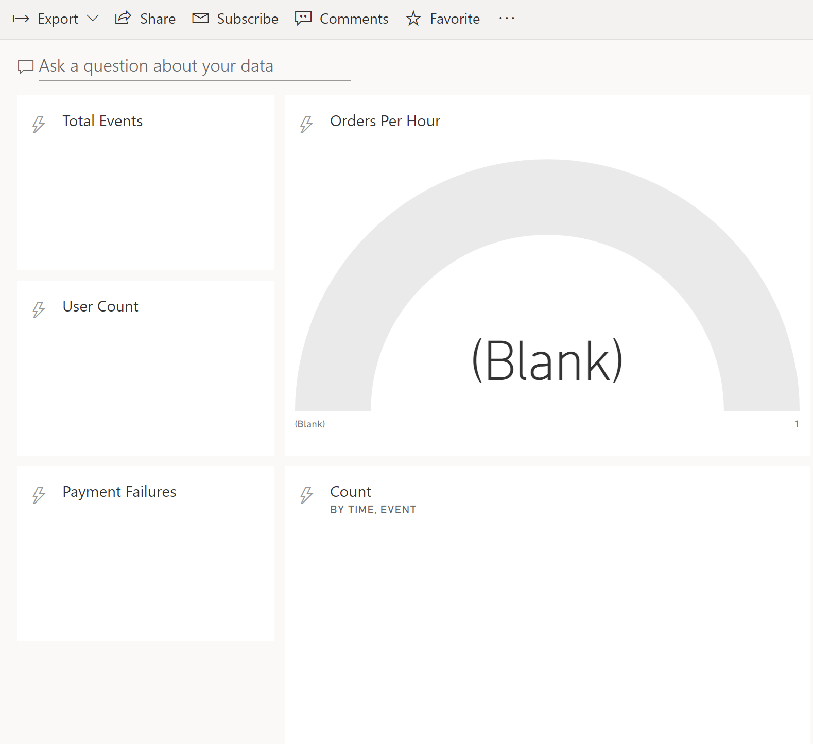

### Task 6: Generate user events for real time

1.  Switch back to Visual Studio, press **F5** to run the data generator project

1.  Switch to your Power BI dashboard, after a few minutes, you should see it update with the event data:

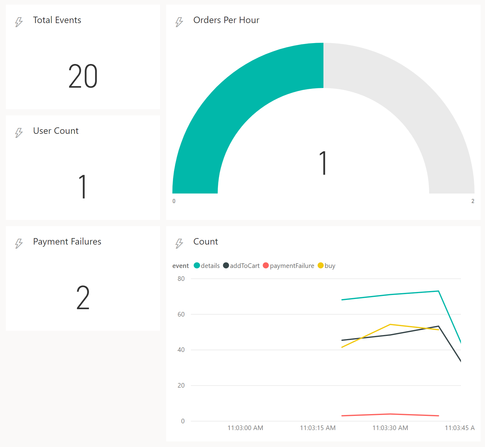

## Exercise 7: Email alerts using Logic Apps

Duration: 30 minutes

In this exercise you will configure your change feed function to call an HTTP login app endpoint that will then send an email when an order event occurs.  The function will be using Polly to handle retries in the case the function app is not available.

### Task 1: Setup Logic App

1.  Open the Azure Portal to your resource group and select the Logic App in your resource group, it should be named **s2_logicapp_...**

1.  Click **Edit**

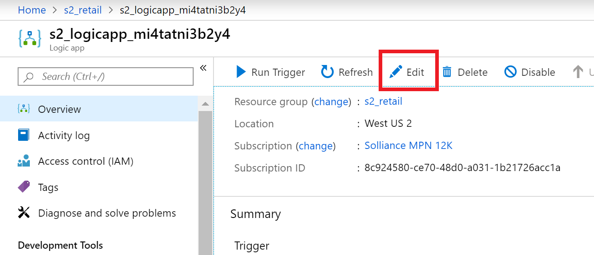

1.  Click **+New step**


1.  Search for **send an email**, then select the Office 365 outlook connector


1.  Click **Sign in**, login using your Azure AD credentials

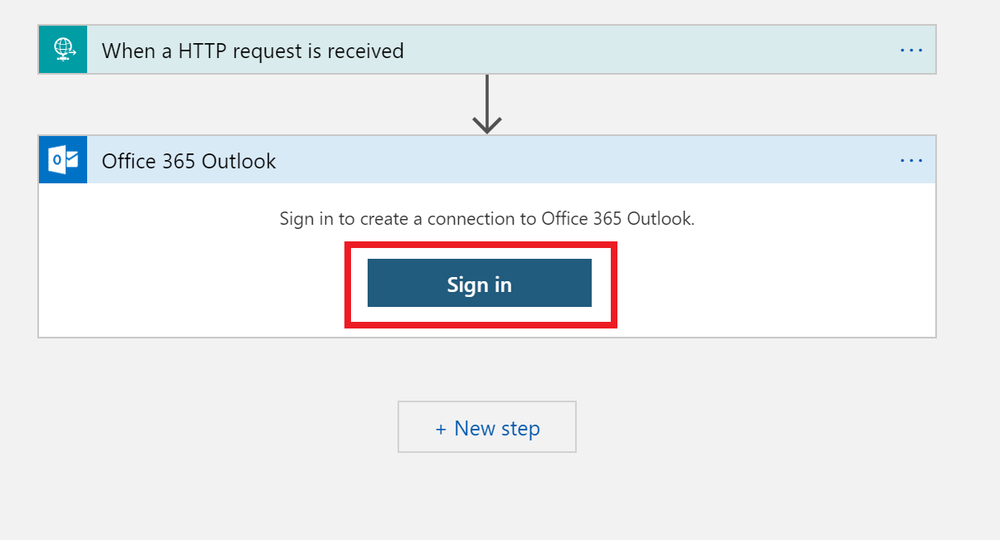

1.  Set the **To** as your email

1.  Set the **Subject** as **Thank you for your order**

1.  Set the **Body** as **Your order is being processed**

1.  Click **Save**

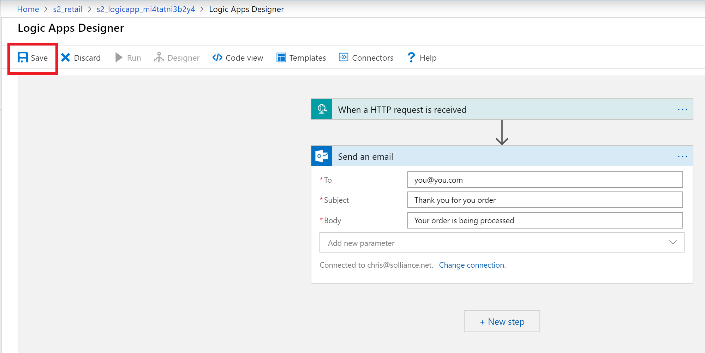

1.  Click on the **When a HTTP request is received** action, copy the **HTTP POST URL** for the logic app and save it for the next task


### Task 2: Configure the function app settings

1.  Open the Azure Portal to your resource group and select the Function App in your resource group, it should be named **s2func...**

1.  Click **Configuration**

1.  Update the **LogicAppUrl** configuration variable to the Logic App http endpoint your recorded above

1.  Click **Save**

### Task 3: Update and deploy function app

1.  In the **Contoso.Apps.FunctionApp.ChangeFeed** project, open the **FuncChangeFeed.cs** file

1.  Take a moment to review the function signature.  Notice how it is trigger based on a Cosmos DB collection

1.  Find the todo task #6 and complete it with the following:

```csharp
CallLogicApp(events);
```

1.  Add the following method to the function class:

```csharp
public async void CallLogicApp(IReadOnlyList<Document> events)
{
    try
    {
        // Have the HttpClient factory create a new client instance.
        var httpClient = _httpClientFactory.CreateClient("LogicAppClient");

        // Create the payload to send to the Logic App.
        foreach (var e in events)
        {
            var payload = new LogicAppAlert
            {
                data = JsonConvert.SerializeObject(e),
                recipientEmail = Environment.GetEnvironmentVariable("RecipientEmail")
            };

            var postBody = JsonConvert.SerializeObject(payload);

            var httpResult = await httpClient.PostAsync(Environment.GetEnvironmentVariable("LogicAppUrl"), new StringContent(postBody, Encoding.UTF8, "application/json"));
        }
    }
    catch (Exception ex)
    {
        log.LogError(ex.Message);
    }
}
```

1.  Right-click the **Consoto.Apps.FunctionApp** function app project, select **Publish**

1.  Click **Publish**

### Task 4: Test order email delivery

1.  Switch to Visual Studio, right-click the **DataGenerator** project, select **Set as startup project**

1.  Press **F5** to run the project

1.  For each `buy` event, you will receive an email

>NOTE:  You could receive quite a `few` emails.

## After the hands-on lab 

Duration: 10 minutes

In this exercise, attendees will deprovision any Azure resources that were created in support of the lab.

### Task 1: Delete resource group

1.  Using the Azure portal, navigate to the Resource group you used throughout this hands-on lab by selecting **Resource groups** in the menu.

2.  Search for the name of your research group, and select it from the list.

3.  Select **Delete** in the command bar, and confirm the deletion by re-typing the Resource group name and selecting **Delete**.

You should follow all steps provided *after* attending the Hands-on lab.