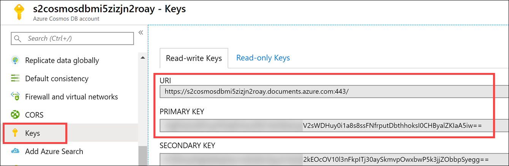
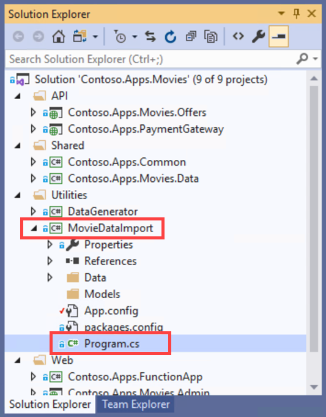
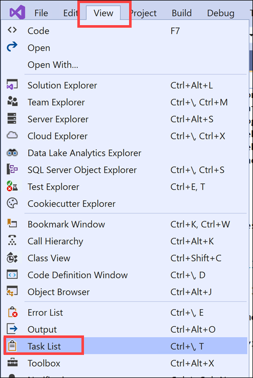
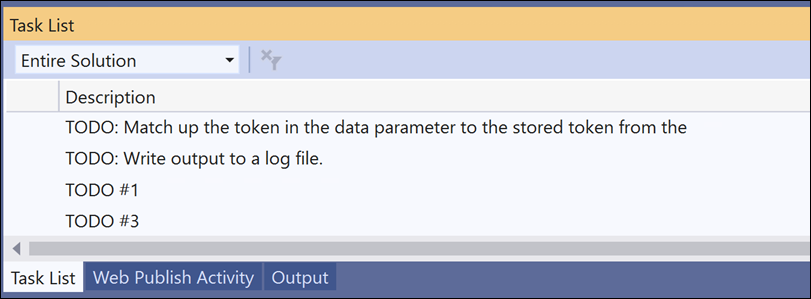
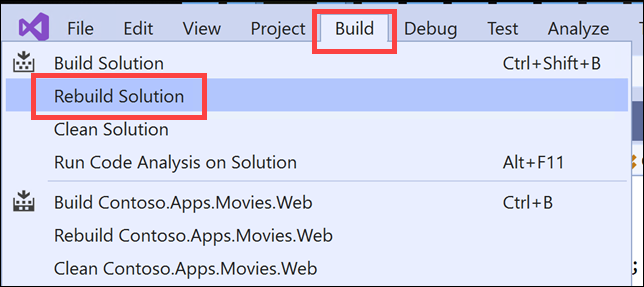
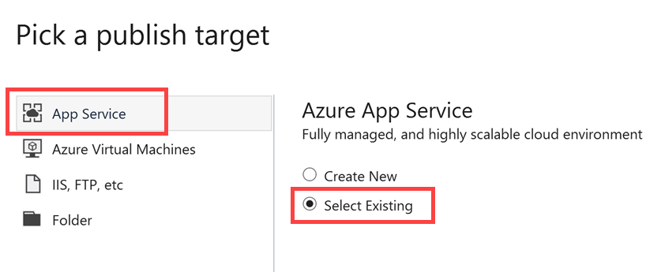
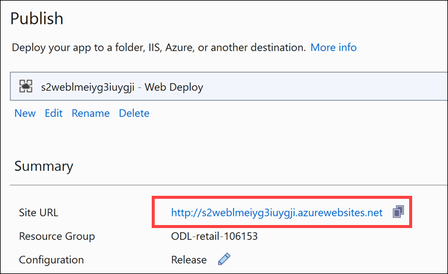
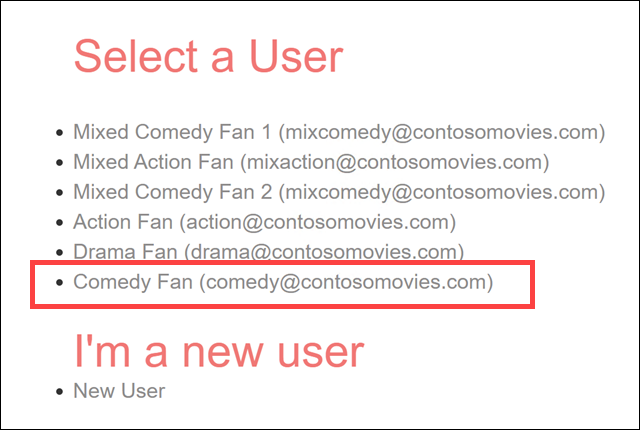

# Cosmos DB scenario-based labs - Retail hands-on lab step-by-step

<details>
<summary><strong><em>Table of Contents</em></strong></summary>
<!-- TOC -->

- [Cosmos DB scenario-based labs - Retail hands-on lab step-by-step](#cosmos-db-scenario-based-labs---retail-hands-on-lab-step-by-step)
  - [Abstract and learning objectives](#abstract-and-learning-objectives)
  - [Overview](#overview)
  - [Solution architecture (High-level)](#solution-architecture-high-level)
  - [Requirements](#requirements)
  - [Before the hands-on lab](#before-the-hands-on-lab)
  - [Exercise 1: Configure Databricks and generate event data](#exercise-1-configure-databricks-and-generate-event-data)
    - [Task 1: Configure Azure Databricks](#task-1-configure-azure-databricks)
    - [Task 2: Populate event data](#task-2-populate-event-data)
    - [Task 3: Review the data generated](#task-3-review-the-data-generated)
    - [Task 4: Review the aggregation and import utility](#task-4-review-the-aggregation-and-import-utility)
  - [Exercise 2: Complete and deploy Web and Function App](#exercise-2-complete-and-deploy-web-and-function-app)
    - [Task 1: Implement the Top Items recommendation](#task-1-implement-the-top-items-recommendation)
      - [About Cosmos DB throughput](#about-cosmos-db-throughput)
    - [Task 2: Deploy the applications](#task-2-deploy-the-applications)
    - [Task 3: Test the applications](#task-3-test-the-applications)
  - [Exercise 3: Perform and deploy association rules calculation for offline algorithms](#exercise-3-perform-and-deploy-association-rules-calculation-for-offline-algorithms)
    - [Task 1: Generate the Associations](#task-1-generate-the-associations)
    - [Task 2: Review the data generated](#task-2-review-the-data-generated)
  - [Exercise 4: Complete and deploy Web App and Function App (Association Rules)](#exercise-4-complete-and-deploy-web-app-and-function-app-association-rules)
    - [Task 1: Implement the Associations recommendation rules](#task-1-implement-the-associations-recommendation-rules)
    - [Task 2: Deploy the applications](#task-2-deploy-the-applications-1)
    - [Task 3: Test the applications](#task-3-test-the-applications-1)
  - [Exercise 5: Perform and deploy collaborative filtering rules calculation](#exercise-5-perform-and-deploy-collaborative-filtering-rules-calculation)
    - [Task 1: Compute the user implicit ratings](#task-1-compute-the-user-implicit-ratings)
    - [Task 2: Generate the Collaborative Rules](#task-2-generate-the-collaborative-rules)
    - [Task 3: Review the data generated](#task-3-review-the-data-generated-1)
    - [Task 4: Implement the Collaborative recommendation rules](#task-4-implement-the-collaborative-recommendation-rules)
    - [Task 5: Deploy the applications](#task-5-deploy-the-applications)
    - [Task 6: Test the applications](#task-6-test-the-applications)
  - [Exercise 6: Reporting with Stream Analytics and Power BI](#exercise-6-reporting-with-stream-analytics-and-power-bi)
    - [Task 1: Setup Stream Analytics](#task-1-setup-stream-analytics)
    - [Task 2: Configure the ChangeFeed Function](#task-2-configure-the-changefeed-function)
    - [Task 3: Deploy the ChangeFeed Function](#task-3-deploy-the-changefeed-function)
    - [Task 4: Generate user events for PowerBI](#task-4-generate-user-events-for-powerbi)
    - [Task 5: Setup Power BI Dashboard](#task-5-setup-power-bi-dashboard)
    - [Task 6: Generate user events for real time analytics](#task-6-generate-user-events-for-real-time-analytics)
  - [Exercise 7: Email alerts using Logic Apps](#exercise-7-email-alerts-using-logic-apps)
    - [Task 1: Setup Logic App](#task-1-setup-logic-app)
    - [Task 2: Configure the function app settings](#task-2-configure-the-function-app-settings)
    - [Task 3: Update and deploy function app](#task-3-update-and-deploy-function-app)
    - [Task 4: Test order email delivery](#task-4-test-order-email-delivery)
  - [After the hands-on lab](#after-the-hands-on-lab)
    - [Task 1: Delete resource group](#task-1-delete-resource-group)

<!-- /TOC -->
</details>

## Abstract and learning objectives

In this hands-on-lab, you will complete various tasks to complete the implementation of an e-commerce site that utilizes an AI driven recommendation engine using several Microsoft Azure PaaS services.

At the end of this lab you will understand how to design recommendation systems that store data in Cosmos DB using Databricks. You will also see how to implement an e-commerce store front with Cosmos DB as its data store. Additionally, you will see how to leverage the Cosmos DB change feed to execute functions for reporting and monitoring activities with Stream Analytics, Power BI and Logic Apps.

## Overview

Contoso Movies, Ltd. has expressed their desire to move to a more modern and cloud-based approach to their online e-commerce presence. The have decided to utilize Cosmos DB and Azure Databricks to implement their next generation recommendation system using various popular AI driven recommendation algorithms.

They would also like to have real-time reporting on user site actions such as viewing item details, adding items to carts and purchase events. Based on this data, they would like to know immediately if there are potential issues with the order processing pipeline.

## Solution architecture (High-level)

Below is a diagram of the solution architecture you will build in this lab. Please study this carefully, so you understand the whole of the solution as you are working on the various components.


- Data ingest, event processing, and storage:

  The solution for the Retail scenario centers around **Cosmos DB**, which acts as the globally-available, highly scalable data storage for streaming event data for reporting and external integrations. User telemetry data flows in from the data generator where an **Azure function** processes the event data and inserts it into a container in Cosmos DB.

  - Event processing with Azure Functions:

  The Cosmos DB change feed triggers a single Azure function (although the functionality could be broken into many different functions). The single function provides three pieces of functionality.

  - **Aggregate Calculations** - This code updates the item aggregations for the `buy` events to keep track of the top items purchased. This will continually update and drive the `top` suggestions. You will see this when you execute the Data Generator tool.

  - **Forward events to EventHub** - This code will forward the changefeed item to the event hub where Stream Analytics will then process the data.

  - **Call a Logic App** - This code will forward the changefeed item to the logic app's http endpoint that will generate an email

- Stream processing, dashboards, and reports:

  Stream Analytics queries the forwarded event data and aggregates to **Power BI** to display a real-time dashboard of user activity.

- Advanced analytics and ML model training:

  **Azure Databricks** is used to generate a set of offline calculations based on user events to create implicit ratings and associations used to drive new and current user recommendations.

- eCommerce web app:

  A **Web App** allows Contoso customers to browse and purchase movies. **Azure Key Vault** is used to securely store centralized application secrets, such as connection strings and access keys, and is used by the Function App, Web App, and Azure Databricks. Finally, **Application Insights** provides real-time monitoring, metrics, and logging information for the Function App and Web App.

## Requirements

1. Microsoft Azure subscription must be pay-as-you-go or MSDN.

    - Trial subscriptions will not work.

1. [Visual Studio 2019](https://visualstudio.microsoft.com/downloads/)

1. [Azure CLI](https://docs.microsoft.com/en-us/cli/azure/install-azure-cli?view=azure-cli-latest) - version 2.0.68 or later

1. [.Net Framework 4.7.2](https://dotnet.microsoft.com/download/visual-studio-sdks)

1. [.Net Core 2.2](https://dotnet.microsoft.com/download/visual-studio-sdks)

## Before the hands-on lab

Refer to the Before the hands-on lab setup guide manual before continuing to the lab exercises.

## Exercise 1: Configure Databricks and generate event data

**Duration**: 30 minutes

**Synopsis**: We have pre-generated a set of events that include **buy** and **details** events. Based on this data, a **Top Items** recommendation will be made to users that are new to the site (aka a cold start recommendation). You will implement this top items code in the web application and function applications, then deploy the applications to test the functionality.

The algorithms for creating the offline calculations are written in Python and are executed via Azure Databricks.

### Task 1: Configure Azure Databricks

1. Open the Azure portal (<https://portal.azure.com>), search for your assigned lab resource group. If you were not assigned a resource group, your generated resource group will be named after the following pattern: **YOURINIT-s2-retail**.

2. Select your resource group, and then select your Azure Databricks instance, it should be named **s2_databricks...**.

3. Select **Launch Workspace**, if prompted, login as the account you used to create your environment.

4. In the side navigation, Select **Clusters**.

    

5. Select **Create Cluster**.

6. On the create cluster form, provide the following:

   - **Cluster Name**: small

   - **Cluster Type**: Standard

   - **Databricks Runtime Version**: Runtime: 5.5 (Scala 2.11, Spark 2.4.3) (**Note**: the runtime version may have **LTS** after the version. This is also a valid selection.)

   - **Python Version**: 3

   - **Enable Autoscaling**: Uncheck this option.

   - **Auto Termination**: Check the box and enter 120

   - **Worker Type**: Standard_DS3_v2

   - **Driver Type**: Same as worker

   - **Workers**: 1

7. Select **Create Cluster**.

    

8. Before continuing to the next step, verify that your new cluster is running. Wait for the state to change from **Pending** to **Running**.

9. Select the **small** cluster, then select **Libraries**.

10. Select **Install New**.

    

11. In the Install Library dialog, select **Maven** for the Library Source.

12. In the Coordinates field type:

    ```text
    com.microsoft.azure:azure-cosmosdb-spark_2.4.0_2.11:1.4.1
    ```

13. Select **Install**.

    

14. **Wait** until the library's status shows as **Installed** before continuing.

### Task 2: Populate event data

1. Within Azure Databricks, select **Workspace** on the menu, then **Users**, select your user, then select the down arrow on the top of your user workspace. Select **Import**.

2. Within the Import Notebooks dialog, select Import from: file, then drag-and-drop the file or browse to upload it (`{un-zipped repo folder}/Retail/Notebooks/02 Retail.dbc`)

3. Select **Import**

    

4. After importing, select the new **02 Retail** folder, then navigation to the **Includes** folder

5. Select the **Shared-Configuration** notebook

    

6. Update the configuration settings and set the following using the values from your lab setup script output:

   - Endpoint = Cosmos DB endpoint url
   - Masterkey = Cosmos DB master key
   - Database = Database id of the cosmos db ('movies')

   > If you do not have your setup script output values available for reference, you may find the `Endpoint` and `Masterkey` values by navigating to your Cosmos DB account in the Azure portal, then selecting **Keys** in the left-hand menu. Copy the **URI** value for `Endpoint`, and **Primary Key** for the `Masterkey` value.

   

7. Attach your cluster to the notebook using the dropdown. You will need to do this for each notebook you open. In the drop down, select the **small** cluster.

    

8. Next, navigate back up to **02 Retail** and select the **01 Event Generator** notebook

    > This notebook will simulate the browsing and purchasing activity for six users with different personality based preferences and save the result to the `events` container in Cosmos DB.

    > The movies have been pre-selected and sorted into the genres of comedy, drama and action. While the actual movie selection and activity taken is random, it is weighted to respect the user's preferences in each genre to hit a distribution that would mirror that user's taste.

    > For example, user 400001 has the preference of 20 for comedy, 30 for drama, 50 for action. This will result in the user logging more activity with action movies.

    > NOTE: Your results (aka the `events` generated) may be different from your fellow lab participants

9. Attach your cluster to the notebook using the dropdown. In the drop down, select the **small** cluster.

    

10. Select **Run All**.

### Task 3: Review the data generated

1. Return to the Azure portal.

2. In your resource group, navigate to your Cosmos DB instance, it should start with **s2cosmosdb...**.

3. Select **Data Explorer** in the left-hand menu.

4. Select the **events** container, then select **items**.

5. Select one or more of the items and review them.

    

    > NOTE: These items are created from the Databricks solution and include a random set of generated events for each user personality type. You should see events generated for 'details', 'buy' and 'addToCart' as well as the item associated with the event (via the contentId field).

### Task 4: Review the aggregation and import utility

1. Browse to the **{un-zipped repo folder}/Retail/Starter/Contoso Movies** folder and open the **Contoso.Apps.Movies.sln** solution.

    > If Visual Studio prompts you to sign in when it first launches, use the account provided to you for this lab (if applicable), or an existing Microsoft account.

2. Within the Solution Explorer, expand the **/Utilities/MovieDataImport** project and open the **Program.cs** file. Take a few moments to browse code. You will see that it:

   - Aggregates all the event data generated from the Databricks notebook
   - Creates the user personalities
   - Creates the movie categories/genres
   - Creates the movies

    

3. Right-click the project, select **Set as startup project**.

4. Press **F5** to run the project.

    You may see several of the following lines output to the console window after saving the genres and before adding the movies: `Input string was not in a correct format.`. You can safely ignore these due to some movies the API retrieved are poorly formatted.

> NOTE: You must wait for the Event Generator Databricks notebook to be completed first before running this step. This is to ensure that later steps in the lab to match.

## Exercise 2: Complete and deploy Web and Function App

**Duration**: 30 minutes

**Synopsis**: We have pre-generated a set of events that include **buy** events. Based on this information, a **Top Items** recommendation will be made to users that are new to the site. You will implement this code in the web application and function applications, then deploy the applications to test the functionality.

### Task 1: Implement the Top Items recommendation

1. In the **Contoso.Apps.Movies.Web** project, open the **/Controllers/HomeController.cs** file.

2. In Visual Studio, select **View**, then select **Task List**. This will display the list of **TODO** items, helping you navigate to each one.

    

    The Task List appears at the bottom of the window:

    

3. Find TODO #1 and complete it by adding the following line underneath:

    ```csharp
    vm.RecommendProductsTop = RecommendationHelper.GetViaFunction("top", 0, 0);
    ```

    > The `RecommendationHelper` class is responsible for making the call to the Azure Function to get the recommendations based on the information submitted that includes the algorithm, user and content being used to compute the recommendations.

4. In the **Contoso.Apps.FunctionApp** project, open the **RecommendationHelper.cs** file.

5. In the **TopRecommendation** method, find the TODO #2 and complete it with the following:

    ```csharp
    var container = client.GetContainer(databaseId, "object");

    var query = container.GetItemLinqQueryable<Item>(true)
        .Where(c => c.EntityType == "ItemAggregate")
        .OrderByDescending(c => c.BuyCount)
        .Take(take);

    items = query.ToList();

    foreach(Item i in items)
    {
        itemIds.Add(i.ItemId.ToString());
    }

    topItems = GetItemsByImdbIds(itemIds);
    ```

6. Review the code, notice the following:

   - We are querying an "object" container for an entity type called `ItemAggregation` and sorting it by the `BuyCount`. Essentially these are the top purchased items.
   - We are then querying the object container for all the top movie items to get their metadata for display on the web front-end.

   > This code is responsible for querying the Cosmos DB `object` container to find the item aggregation information, for example all the `buy` events for a movie.

   > It is important that you use aggregations to do this as each operation in Cosmos DB consumes a certain amount of RUs. For queries, the RU charge is based on the number of documents returned, the complexity of the query, and the number of partitions queried. To continue to have efficient queries as the user count and activity increases, we create an aggregated view.

   > Over time, the `events` container is expected to get incredibly large as your user count and activity increases. With respect to RUs, you can imagine the costs for making this query can become costly.

7. In the Visual Studio menu, select **Build**, then **Rebuild Solution**. This ensure all NuGet packages are restored, the solutions are cleaned, then build all the projects within the solution.

    

    You should see an output stating that build successfully compiled all 9 projects:
    
    `========== Rebuild All: 9 succeeded, 0 failed, 0 skipped ==========`.

#### About Cosmos DB throughput

In the ARM templates, you will notice that we have intentionally set the **throughput** in RU/s for each container, based on our anticipated event processing and reporting workloads. In Azure Cosmos DB, provisioned throughput is represented as request units/second (RUs). RUs measure the cost of both read and write operations against your Cosmos DB container. Because Cosmos DB is designed with transparent horizontal scaling (e.g., scale out) and multi-master replication, you can very quickly and easily increase or decrease the number of RUs to handle thousands to hundreds of millions of requests per second around the globe with a single API call.

Cosmos DB allows you to increment/decrement the RUs in small increments of 100 at the database level, or at the container level. It is recommended that you configure throughput at the container granularity for guaranteed performance for the container all the time, backed by SLAs. Other guarantees that Cosmos DB delivers are 99.999% read and write availability all around the world, with those reads and writes being served in less than 10 milliseconds at the 99th percentile.

When you set a number of RUs for a container, Cosmos DB ensures that those RUs are available in all regions associated with your Cosmos DB account. When you scale out the number of regions by adding a new one, Cosmos will automatically provision the same quantity of RUs in the newly added region. You cannot selectively assign different RUs to a specific region. These RUs are provisioned for a container (or database) for all associated regions.

### Task 2: Deploy the applications

1. Right-click the **Contoso.Apps.FunctionApp** function app project, then select **Publish**.

2. Select **Start**, then ensure that **Azure Functions Premium Plan** is selected.

    

3. Select **Select Existing**, be sure to **_uncheck_ Run from package file**, then select **Create Profile**.

4. Select your Azure Subscription, resource group and Function App to deploy to. The name should start with **s2func...\***.

    

5. Select **OK**, then click the **Publish** button to start the process.

6. Right-click the **Contoso.Apps.Movies.Web** web app project, then select **Publish**.

7. Select **Start**, then ensure that **App Service** is selected.

8. Select **Select Existing**, then select **Create Profile**.

    

9. Select your Azure Subscription, resource group and Function App to deploy to. The name should start with **s2web...\***.

10. Select **OK**, then click the **Publish** button to start the process. The application will publish and the site should be displayed. If the site does not automatically launch in a browser, you can copy the Site URL on the publish dialog and open the site in a new browser window.

    

### Task 3: Test the applications

1. In the browser window that opened from your web application deployment above, check to see that you received recommendations as a non-logged in user. You should see something similar to the following:


> NOTE: These are simply suggestions based on the top purchased items from the pre-generated events.

## Exercise 3: Perform and deploy association rules calculation for offline algorithms

**Duration**: 30 minutes

**Synopsis**: Based on the pre-calculated events in the Cosmos DB for our pre-defined personality types (Comedy fan, Drama fan, etc.), you will implement and deploy an algorithm that will generate these associations and put them in Cosmos DB for offline processing by the web and function applications.

### Task 1: Generate the Associations

1. Switch back to your Databricks workspace and open the **02 Association Rules** notebook.

1. Attach your cluster to the notebook using the dropdown. In the drop down, select the **small** cluster.

1. Run each cell of the **02 Association Rules** notebook by selecting within the cell, then entering **Ctrl+Enter** on your keyboard. Pay close attention to the instructions within the notebook so you understand each step of the data preparation process.

> The goal of this algorithm is to compute two metrics that indicate the strength of a relationship between a source item and a target item based on event history, and then save that matrix to the associations container in Cosmos DB.

> The algorithm begins with grouping events with a buy action into a transaction, grouping by the sessionId. This provides the set of items bough together.

> For example, a transaction with two items would look like: `'404973': ['5512872', '4172430']` where 404973 is the sessionId that is used as the transactionId, and the the array contains the id's of the items bought ('5512872' and '4172430').

### Task 2: Review the data generated

The notebook examined the `events` data to find items that tend to be purchased together, and created a matrix that reflects the strength of the relationship. It then stored the matrix in the associations container. You will now look at the data in Cosmos DB, using the Data Explorer.

1. Switch back to the Azure Portal.

1. In your resource group, navigate to your Cosmos DB instance.

1. Open the **associations** container, review the items in the container.

    

    > NOTE: These items are created from the Databricks solution and include the association confidence level as compared from one movie to another movie.

    > NOTE: You will only see about 8 items generated here.

## Exercise 4: Complete and deploy Web App and Function App (Association Rules)

**Duration**: 30 minutes

**Synopsis**: Now that we have data for our association calculations, we will add code to the web app and function app to support this new recommendation engine.

### Task 1: Implement the Associations recommendation rules

1. In the **Contoso.Apps.FunctionApp** project, open the **RecommendationHelper.cs** file.

1. In the **AssociationRecommendationByUser** method, find the TODO #3 and complete it with the following:

    ```csharp
    //get 20 log events for the user.
    List<CollectorLog> logs = GetUserLogs(userId, 20);

    if (logs.Count == 0)
        return items;

    List<Rule> rules = GetSeededRules(logs);

    //get the pre-seeded objects based on confidence
    List<Recommendation> recs = new List<Recommendation>();

    //for each rule returned, evaluate the confidence
    foreach (Rule r in rules)
    {
        Recommendation rec = new Recommendation();
        rec.id = int.Parse(r.target);
        rec.confidence = r.confidence;
        recs.Add(rec);

        itemIds.Add(rec.id.ToString());
    }

    items = GetItemsByImdbIds(itemIds);
    ```

    The user logs are user clickstream events that are generated by a user's activity on the website, such as viewing an item, adding it to the shopping cart, etc. When a user adds an item to their shopping cart, for instance, the item's unique ID is captured as the `ContentId` in the `CollectorLog` document. The `GetSeededRules` method returns data from the **associations** Cosmos DB container where the `source` matches the `ContentId` values retrieved from the user logs (`logs`) that are passed to the method. This data applies this filter as well as excludes records where the `ContentId` is listed as the target. We are just trying to find associations based on the source matching the items captured in the user logs. The results are then ordered by the confidence rating in descending order.

    Ultimately, what is returned is a list of recommendations based on the relationship matrix between source movies and target movies with a high confidence level. This matrix was generated by the **Association Rules** Databricks notebook and saved to the **associations** container. Each time you run this notebook, it updates the matrices based on the latest user logs, or event history.

1. In the **Contoso.Apps.Movies.Web** project, open the **HomeController.cs** file.

1. Replace the **Index** method with the following:

    ```csharp
    var vm = new HomeModel();

    Contoso.Apps.Movies.Data.Models.User user = (Contoso.Apps.Movies.Data.Models.User)Session["User"];

    vm.RecommendProductsTop = RecommendationHelper.GetViaFunction("top", 0, 0);

    if (user != null)
    {
        vm.RecommendProductsBought = RecommendationHelper.GetViaFunction("assoc", user.UserId, 0);
        vm.RecommendProductsLiked = RecommendationHelper.GetViaFunction("collab", user.UserId, 0);
    }

    return View(vm);
    ```

### Task 2: Deploy the applications

1. Right-click the **Contoso.Apps.FunctionApp** function app project, select **Publish**.

1. Select **Publish**.

1. Right-click the **Contoso.Apps.Movies.Web** web app project, select **Publish**.

1. Select **Publish**, the site should load.

### Task 3: Test the applications

1. In the browser window that opened from your web application deployment above, check to see that you received recommendations as a non-logged in user. You should see the same results as you received previously.

2. In the top navigation, select **LOGIN**, then select the **Comedy Fan (comedy@contosomovies.com)** account.

    

3. Notice the main page now has different recommendations than what you received earlier, but we are still missing the similar 'liked' items

## Exercise 5: Perform and deploy collaborative filtering rules calculation

**Duration**: 30 minutes

**Synopsis**: In this exercise you will execute the implict ratings notebook in Azure Databricks to generate the implict rating for each user that has event data. You will only execute this once during this lab, however this notebook would need to be run on a set schedule to ensure that the users rating data is up to date.

### Task 1: Compute the user implicit ratings

1. Switch back to your Databricks workspace, select **03 Ratings**.

1. Attach your cluster to the notebook using the dropdown. In the drop down, select the **small** cluster.

1. Run each cell of the **03 Ratings** notebook by selecting within the cell, then entering **Ctrl+Enter** on your keyboard. Pay close attention to the instructions within the notebook so you understand each step of the data preparation process.

    > This notebook will use the implict events captured in the events container in Cosmos DB to calculate what a user would rate a given item, based on their actions. In other words it converts a users buy, addToCart and details actions into a numeric score for the item. The resulting user to item ratings matrix will be saved to the ratings container in Cosmos DB.

1. Switch back to the Azure portal.

1. In your resource group, navigate to your Cosmos DB instance.

1. Open the **ratings** container, review the items in the container.

    

    > NOTE: These ratings are generated as part of this notebook as an 'offline' operation. If you collect a significant amount of user data, you would need to re-evaluate the events using this notebook and populate the ratings container again for the online calculations to utilize.

### Task 2: Generate the Collaborative Rules

1. Switch back to your Databricks workspace, select **04 Similarity**.

1. Attach your cluster to the notebook using the dropdown. In the drop down, select the **small** cluster.

1. Run each cell of the **04 Similarity** notebook by selecting within the cell, then entering **Ctrl+Enter** on your keyboard. Pay close attention to the instructions within the notebook so you understand each step of the data preparation process.

    The similarity calculation logic in the notebook uses the user-to-item ratings previously created to calculate a score indicating the similarity between a source item and a target item.

    The process begins by loading the ratings matrix and for each user to item rating, calculating a new normalized rating (to adjust for the user's bias).

    An overlap matrix is calculated that identifies, for any pair of items, how many users rated both items. First, the normalized ratings matrix is converted to a boolean matrix. That is, if an item for a user has a rating (regardless of the value of the rating), it has a value of 1, otherwise it is zero. Then dot product of the normalized ratings matrix against its transpose is calculated. This yields a simpler matrix where the value each cell now contains the count of the number users who rated both items. Cells that don't have any overlap, have a value of zero.

    Separately, the cosine similarity of the normalized ratings matrix is computed. It's easiest to understand the cosine similarity calculation as being done between an item `i` and another item `j`. The cosine similarity is a ratio:

    - The numerator is computed as the sum of the product of the normalized rating of item `i` multiplied with the rating of `j`, for all users who have provided ratings.
    - The denominator is computed as the square root of the sum of the squares of the normalized rating of item `i` multiplied by the square root of the sum of the squares of the normalized rating of item `j`.

    In Python, the logic uses the `cosine_similarity` method from scikit-learn to compute the similarity between items by providing it our normalized user-to-items ratings matrix.

    The result is then filtered to remove entries with a similarity score lower than configured, and having an overlap in the overlap matrix of less than a configured overlap in quantity of ratings for the pair of items.

    Just before saving, any resulting similarities with scores less than the configured minimum similarity are removed, so that weaker similarities are not recommended.

### Task 3: Review the data generated

1. Switch back to the Azure portal.

1. In your resource group, navigate to your Cosmos DB instance, it should start with **s2cosmosdb...**.

1. Select **Data Explorer**.

1. Select the **similarity** container, then select **items**.

1. Select one or more of the items and review them.

    > NOTE: These items are created from the Databricks solution and include the similarity of one movie, the source, to another, the target.

    

### Task 4: Implement the Collaborative recommendation rules

1. In the **Contoso.Apps.FunctionApp** project, open the **RecommendationHelper.cs** file.

1. In the **CollaborativeBasedRecommendation** method, find the TODO task #4 and complete it with the following:

    ```csharp
    int neighborhoodSize = 15;
    double minSim = 0.0;
    int maxCandidates = 100;

    //inside this we do the implict rating of events for the user...
    Hashtable userRatedItems = GetRatedItems(userId, 100);

    if (userRatedItems.Count == 0)
        return new List<string>();

    //this is the mean rating a user gave
    double ratingSum = 0;

    foreach(double r in userRatedItems.Values)
    {
        ratingSum += r;
    }

    double userMean = ratingSum / userRatedItems.Count;

    //get similar items
    List<SimilarItem> candidateItems = GetCandidateItems(userRatedItems.Keys, minSim);

    //sort by similarity desc, take only max candidates
    candidateItems = candidateItems.OrderByDescending(c=>c.similarity).Take(maxCandidates).ToList();

    Hashtable recs = new Hashtable();

    List<PredictionModel> precRecs = new List<PredictionModel>();

    foreach(SimilarItem candidate in candidateItems)
    {
        int target = candidate.Target;
        double pre = 0;
        double simSum = 0;

        List<SimilarItem> ratedItems = candidateItems.Where(c=>c.Target == target).Take(neighborhoodSize).ToList();

        if (ratedItems.Count > 1)
        {
            foreach (SimilarItem simItem in ratedItems)
            {
                try
                {
                    string source = userRatedItems[simItem.sourceItemId].ToString();

                    //rating of the movie - userMean;
                    double r = double.Parse(source) - userMean;

                    pre += simItem.similarity * r;
                    simSum += simItem.similarity;

                    if (simSum > 0)
                    {
                        PredictionModel p = new PredictionModel();
                        p.Prediction = userMean + pre / simSum;
                        p.Items = ratedItems;
                        precRecs.Add(p);
                    }
                }
                catch (Exception ex)
                {
                    Console.WriteLine(ex.Message);
                }
            }
        }
    }

    //sort based on the prediction, only take x of them
    List<PredictionModel> sortedItems = precRecs.OrderByDescending(c => c.Prediction).Take(take).ToList();

    //get first model's items...
    foreach(PredictionModel pm in sortedItems)
    {
        foreach(SimilarItem ri in pm.Items)
        {
            if (ri.targetItemId != null)
            {
                itemIds.Add(ri.targetItemId.ToString());
                break;
            }
        }
    }
    ```

    To summarize, this code grabs 100 ratings for a specific user, then query for any associated items that were generated in the association notebook within a preset `neighborhood` size (in this case 15). With a set of similar items, filters out any items that fall outside the user's mean `ratings`. Then, it sorts the remaining items by the similarity and present those as the recommendations.

    The following is a more detailed walk-through of the code:

    The implicit ratings that are stored in the `userRatedItems` hashtable for the currently logged in user, come from the `ratings` Cosmos DB container, which is populated by the `Ratings` Databricks notebook. If no implicit ratings are found, the method returns an empty result. Otherwise, we add all the ratings and store them in the `ratingSum` variable, then calculate the mean rating (`ratingSum` / the count of ratings for the user), storing this value in the `userMean` variable..

    Next, we retrieve the similar items from the `similarity` Cosmos DB container, which is populated by the `Similarity` Databricks notebook. We sort these items in descending order by the similarity between a source item and a target item, adjusted for the user's bias (do they prefer comedies, action movies, etc.). We proceed to loop through the collection of similar items, retrieving associated items within the same collection, taking the preset `neighborhood` size.

    We continue by looping through the associated (or similar) items, matching up the user's implicit rating for each similar item, from the `userRatedItems` hashtable. Since the `Similarity` notebook calculated the cosine similarity between items, we need to perform a calculation to filter out any items that fall outside the user's mean ratings. As you may recall, the notebook performs the cosine similarity calculation with the following ratio:

    - The numerator is computed as the sum of the product of the normalized rating of item `i` multiplied with the rating of `j`, for all users who have provided ratings.
    - The denominator is computed as the square root of the sum of the squares of the normalized rating of item `i` multiplied by the square root of the sum of the squares of the normalized rating of item `j`.

    To account for this, we take the movie's implicit rating, minus the user's mean rating (`userMean`), then multiply the similarity by this value in a loop. We also keep a running sum of the item similarity (`simSum`). If this value is greater than zero, we add a new `PredictionModel` to the collection. Before returning this collection, we sort it in decending order by the prediction, taking only the number of items requested in the method parameters (`take`).

### Task 5: Deploy the applications

1. Right-click the **Consoto.Apps.FunctionApp** function app project, select **Publish**.

1. Select **Publish**.

1. Right-click the **Contoso.Apps.Movies.Web** web app project, select **Publish**.

1. Select **Publish**, the site should load.

### Task 6: Test the applications

1. In the browser window that opened from your web application deployment above, check to see that you received recommendations as a non-logged in user. You should see the same results as you received previously.

2. If you are not already logged in, select **LOGIN**, then select the **comedy@contosomovies.com** account.

    

3. Notice the main page now has both the associative and collaborative results displayed:

    

    

## Exercise 6: Reporting with Stream Analytics and Power BI

**Duration**: 30 minutes

**Synopsis**: In this exercise you will setup stream analytics to process the change feed events fired from Cosmos DB into an Azure Function which then forwards to an event hub for real time Power BI analytics.

### Task 1: Setup Stream Analytics

1. Open the Azure Portal, navigate to your Stream Analytics job that was created for you in the setup script.

1. Select **Inputs**.

1. Select **+Add stream input**, then select **Event Hub**.

1. For the alias, type **s2events**.

1. Select your subscription.

1. Select the **s2ns..** event hub.

1. For the event hub, select **store**.

1. For the policy name, select **RootManageSharedAccessKey**.

1. Select **Save**.

1. Select **Outputs**.

1. Select **+Add**, then select **Power BI**.

1. For the output alias, type **eventOrdersLastHour**.

1. For the dataset, type **eventOrdersLastHour**.

1. For the table name, type **eventOrdersLastHour**.

1. Select **Authorize**, login to your Power BI instance.

1. Select **Save**.

1. Repeat for steps 11-16, but replace **eventOrdersLastHour** with:

    - eventSummary
    - failureCount
    - eventData

1. Select **Query**.

1. Update the query to the following:

    ```sql
    SELECT Count(*) as FailureCount
    INTO failureCount
    FROM s2events
    WHERE Event = 'paymentFailure'
    GROUP BY TumblingWindow(second,10)

    SELECT Count(distinct UserId) as UserCount, System.TimeStamp AS Time, Count(*) as EventCount
    INTO eventData
    FROM s2events
    GROUP BY TumblingWindow(second,10)

    SELECT System.TimeStamp AS Time, Event, Count(*)
    INTO eventSummary
    FROM s2events
    GROUP BY Event, TumblingWindow(second,10)

    select DateAdd(second,-10,System.Timestamp()) AS WinStartTime, System.Timestamp() AS WinEndTime,0 as Min, Count(*) as Count, 10 as Target
    into eventOrdersLastHour
    from s2events
    where event = 'buy'
    GROUP BY SlidingWindow(second,10)
    ```

1. The Query window should look similar to this:

    

1. Select **Save query**.

1. Select **Overview**, in the menu, select **Start** to start your stream analytics job.

    

1. In the dialog, ensure that **Now** is selected, then select **Start**.

    > NOTE: If your job fails for any reason, you can use the **Activity Log** to view the error(s).

### Task 2: Configure the ChangeFeed Function

1. In the **Contoso.Apps.FunctionApp** project, open the **FuncChangeFeed.cs** file.

1. Take a moment to review the function signature. Notice how it is trigger based on a Cosmos DB container.

1. Find the TODO task #5 and complete it with the following:

    ```csharp
    AddEventToEventHub(events);
    ```

1. Add the following method to the function class:

    ```csharp
    public void AddEventToEventHub(IReadOnlyList<Document> events)
    {
        try
        {
            //event hub connection
            EventHubClient eventHubClient;
            string EventHubConnectionString = config["eventHubConnection"];
            string EventHubName = "store";

            var connectionStringBuilder = new EventHubsConnectionStringBuilder(EventHubConnectionString)
            {
                EntityPath = EventHubName
            };

            eventHubClient = EventHubClient.CreateFromConnectionString(connectionStringBuilder.ToString());

            foreach (var e in events)
            {
                string data = JsonConvert.SerializeObject(e);
                var result = eventHubClient.SendAsync(new EventData(Encoding.UTF8.GetBytes(data)));
            }
        }
        catch (Exception ex)
        {
            log.LogError(ex.Message);
        }
    }
    ```

    > NOTE: This method will forward the change feed events to the event hub where stream analytics will be monitoring and then forwarding data to the Power BI dashboard

### Task 3: Deploy the ChangeFeed Function

1. Right-Select the **Consoto.Apps.FunctionApp** function app project, select **Publish**.

1. Select **Publish**.

### Task 4: Generate user events for PowerBI

1. Right-click the **DataGenerator** project, select **Set as startup project**.

1. Press **F5** to run the project.

1. Notice events will be generated based on a set of users and their preferred movie type.

    

1. Buy events will be generated for the first 30 seconds with random payment failures also generated. After 30 seconds, you will notice the orders per hour will fall below the target of 10. This would signify that something is wrong with the front end web site or order processing.

1. After about 1 minute, close the DataGenerator console program.

### Task 5: Setup Power BI Dashboard

1. Open a new browser window to [Power BI](https://www.powerbi.com).

1. Click **Sign In**, sign in using the same credentials you used to authorize your outputs for Stream Analytics above.

1. Select **My workspace**.

1. Select **+Create**, then select **Dashboard**.

    

1. For the name, type **Contoso Movies**, select **Create**.

1. Select the **...** ellipses, then select **+Add tile**.

1. Select **Custom Streaming Data**, select **Next**.

1. Select the **eventData** data set, then select **Next**.

    

    > **Important**: If the **eventData** data set does not appear, it is because there is a lag time of several minutes between when you first configure the Stream Analytics Power BI output and when data first appears in the streaming data set. Please ensure the data generator is running and that you have started the Stream Analytics query. Also, you may try restarting the Function App as well.

1. For the visualization type, select **Card**.

1. For the Fields, select **EventCount**.

1. Select **Next**.

1. For the title, type **Event Count**, then select **Apply**.

1. Select **+Add tile**, you may need to select the **...** ellipses first.

1. Select **Custom Streaming Data**, select **Next**. Use the following table to create the needed tiles:

|                     |           |                                                  |                  |
| ------------------- | --------- | ------------------------------------------------ | :--------------: |
| **Dataset**         | **Type**  | **Fields**                                       |    **Title**     |
| eventData           | Card      | UserCount                                        |    User Count    |
| failureCount        | Card      | FailureCount                                     | Payment Failures |
| eventSummary        | Line cart | Axis = UserCount, Legend = Event, Values = Count |  Count By Event  |
| eventOrdersLastHour | Gauge     | Value = Count, Minimum = Min, Target = Target    | Orders Per Hour  |

1. Your dashboard should look similar to the following:

    

### Task 6: Generate user events for real time analytics

1. Switch back to Visual Studio, press **F5** to run the data generator project.

1. Switch to your Power BI dashboard, after a few minutes, you should see it update with the event data:

    

## Exercise 7: Email alerts using Logic Apps

**Duration**: 30 minutes

In this exercise you will configure your Cosmos DB change feed function to call an HTTP Logic App endpoint that will then send an email when an order event occurs. The function will be using Polly to handle retries in the case the Function App is not available.

### Task 1: Setup Logic App

1. Open the Azure Portal to your resource group and select the Logic App in your resource group, it should be named **s2*logicapp*...**.

2. Select **Edit**.

    

3. Select **+New step**.

    

4. Search for **send an email**, then select the Office 365 outlook connector.

    

5. Select **Sign in**, login using your Azure AD credentials.

    

6. Set the **To** as your email address.

7. Set the **Subject** as **Thank you for your order**.

8. Set the **Body** as **Your order is being processed**.

9. Select **Save**.

    

10. Select on the **When a HTTP request is received** action, copy the **HTTP POST URL** for the logic app and save it for the next task.

    

### Task 2: Configure the function app settings

1. Open the Azure Portal to your resource group and select the Function App in your resource group, it should be named **s2func...**.

1. Select **Configuration**.

1. Update the **LogicAppUrl** configuration variable to the Logic App http endpoint your recorded above.

1. Select **Save**.

### Task 3: Update and deploy function app

1. In the **Contoso.Apps.FunctionApp.ChangeFeed** project, open the **FuncChangeFeed.cs** file.

1. Take a moment to review the function signature. Notice how it is triggered based on a Cosmos DB container.

1. Find the TODO task #6 and complete it with the following:.

    ```csharp
    CallLogicApp(events);
    ```

1. Add the following method to the function class:

    ```csharp
    public async void CallLogicApp(IReadOnlyList<Document> events)
    {
        try
        {
            // Have the HttpClient factory create a new client instance.
            var httpClient = _httpClientFactory.CreateClient("LogicAppClient");

            // Create the payload to send to the Logic App.
            foreach (var e in events)
            {
                var payload = new LogicAppAlert
                {
                    data = JsonConvert.SerializeObject(e),
                    recipientEmail = Environment.GetEnvironmentVariable("RecipientEmail")
                };

                var postBody = JsonConvert.SerializeObject(payload);

                var httpResult = await httpClient.PostAsync(Environment.GetEnvironmentVariable("LogicAppUrl"), new StringContent(postBody, Encoding.UTF8, "application/json"));
            }
        }
        catch (Exception ex)
        {
            log.LogError(ex.Message);
        }
    }
    ```

1. Right-Select the **Consoto.Apps.FunctionApp** function app project, select **Publish**.

1. Select **Publish**.

### Task 4: Test order email delivery

1. Switch to Visual Studio, right-click the **DataGenerator** project, select **Set as startup project**.

1. Press **F5** to run the project.

1. For each `buy` event, you will receive an email.

    > NOTE: It can take up to 5 minutes to receive emails, when you do you could receive quite a `few` emails.

## After the hands-on lab

**Duration**: 5 minutes

In this exercise, attendees will de-provision any Azure resources that were created in support of the lab.

### Task 1: Delete resource group

1. Using the Azure portal, navigate to the Resource group you used throughout this hands-on lab by selecting **Resource groups** in the menu.

2. Search for the name of your research group, and select it from the list.

3. Select **Delete** in the command bar, and confirm the deletion by re-typing the Resource group name and selecting **Delete**.

You should follow all steps provided _after_ attending the Hands-on lab.
